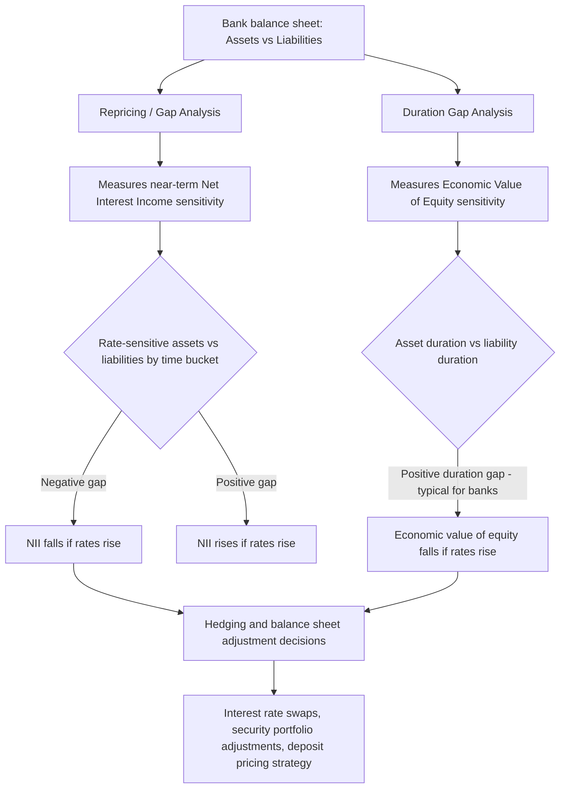

## Bank Balance Sheet Management

### Overview

Bank balance sheet management is the applied discipline through which banks operationalize the transformation functions established in the theory of financial intermediation — size, maturity, risk, and information transformation — into a managed set of assets, liabilities, and capital that jointly deliver profitability while remaining solvent and liquid enough to withstand normal and stressed operating conditions. Where the theory of financial intermediation explains *why* banks perform maturity and risk transformation, balance sheet management addresses *how* banks quantify, monitor, and actively manage the resulting exposures — principally interest rate risk, liquidity risk, and credit risk — using an interconnected set of analytical frameworks and management techniques that form the operational core of modern bank treasury and asset-liability management (ALM) functions.

---

### The Bank Balance Sheet: Structure

#### Simplified Bank Balance Sheet

$$\text{Assets} = \text{Liabilities} + \text{Equity Capital}$$

**Typical Asset Categories** (ordered roughly by liquidity, most to least):

- Cash and reserves (including central bank reserve balances)
- Securities holdings (government bonds, other liquid tradable securities — often subdivided into held-for-trading, available-for-sale, and held-to-maturity portfolios under accounting standards)
- Loans (commercial, consumer, mortgage — the largest and least liquid major asset category for most traditional banks)
- Fixed assets and other assets

**Typical Liability Categories**:

- Demand deposits and transaction accounts (highly liquid/callable, typically low-cost funding)
- Time deposits and savings accounts (less liquid than demand deposits, typically somewhat higher-cost)
- Wholesale funding (interbank borrowing, repo financing, commercial paper, wholesale certificates of deposit — generally shorter-term and more rate-sensitive than retail deposits)
- Long-term debt (subordinated debt, bonds)

**Equity Capital**: Common equity, retained earnings, and other regulatory capital instruments — the residual claim absorbing losses before any liability holder, and the central focus of the capital adequacy regulation covered later in this chapter.

**Key Points**

- The defining structural feature flowing directly from the Diamond-Dybvig liquidity-insurance rationale is the asset-liability maturity mismatch: assets (loans, long-duration securities) are typically longer-duration and less liquid than liabilities (deposits, short-term wholesale funding), which is the economically efficient outcome of the bank's liquidity-transformation function but simultaneously the source of the interest rate and liquidity risks this discipline exists to manage.

---

### Interest Rate Risk Management

#### Repricing (Gap) Analysis

The simplest and most widely taught interest rate risk management framework, repricing (or "gap") analysis, buckets assets and liabilities by the time until their interest rate next reprices (either through contractual maturity or rate reset), and measures the net exposure in each time bucket.

$$\text{Repricing Gap}_t = \text{Rate-Sensitive Assets}_t - \text{Rate-Sensitive Liabilities}_t$$

- A **positive gap** (more rate-sensitive assets than liabilities repricing in a given bucket) means net interest income *rises* if rates rise in that bucket, and falls if rates fall.
- A **negative gap** means net interest income *falls* if rates rise, and rises if rates fall — the classic traditional-bank exposure, since deposits (liabilities) often reprice or can be withdrawn faster than the long-duration loan and securities book (assets).

$$\Delta \text{NII} \approx \text{Gap}_t \times \Delta r$$

**Key Points**

- Gap analysis is intuitive and widely used for near-term earnings-at-risk management, but has well-recognized limitations: it does not capture within-bucket timing differences, non-parallel yield curve shifts, or the risk to the *economic value* of longer-duration positions beyond the near-term earnings horizon — motivating the complementary duration-based framework below.

#### Duration Gap Analysis

Duration-based analysis addresses gap analysis's limitations by measuring interest rate sensitivity in terms of the *economic value* (present value) impact across the full balance sheet, using the duration (weighted-average time to cash flow, in present-value terms) of assets and liabilities.

$$\text{Duration Gap} = D_A - \left(\frac{L}{A}\right) D_L$$

where $D_A$ is the (asset-value-weighted) average duration of assets, $D_L$ is the average duration of liabilities, $L$ is total liabilities, and $A$ is total assets.

$$\Delta E \approx -\left[D_A - \left(\frac{L}{A}\right)D_L\right] \times A \times \frac{\Delta r}{1+r}$$

where $\Delta E$ is the approximate change in the economic value of equity for a given change in interest rates $\Delta r$.

**Key Points**

- Because bank loan and securities portfolios typically have materially longer duration than the largely short-duration or immediately-callable deposit base, most traditional banks exhibit a **positive duration gap** — meaning a *rise* in interest rates *reduces* the economic value of equity (asset values fall more than liability values, in present-value terms), even though a rate rise may initially *increase* near-term net interest income under simple gap analysis (since new loans reprice at higher rates faster than long-duration existing asset values adjust).
- This apparent tension between the near-term earnings view (repricing gap) and the longer-term economic value view (duration gap) is a central, recurring theme in bank ALM practice, and is precisely the dynamic implicated in the Silicon Valley Bank failure discussed below.

#### Immunization

A duration-matching strategy (setting the duration gap to approximately zero) is termed **immunization**, since it theoretically insulates the economic value of equity from parallel shifts in interest rates. In practice, full immunization is difficult and costly to maintain continuously (given the bank's ongoing core business of maturity transformation, which inherently requires *some* mismatch to be economically meaningful), so most banks manage duration gap within defined risk limits rather than targeting exact immunization.

Diagram of the interest rate risk measurement and management framework (svg_diagram):

---

### Liquidity Risk Management

#### Funding Liquidity vs. Market Liquidity in a Bank Context

Applying the funding-liquidity/market-liquidity distinction from the Limits to Arbitrage chapter's Funding Constraints topic directly to bank balance sheet management: a bank must manage both its ability to meet deposit withdrawals and funding obligations as they come due (funding liquidity) and its ability to convert securities holdings into cash without excessive price impact if needed (market liquidity of its liquid-asset buffer).

#### Liquidity Coverage Ratio (LCR) and Net Stable Funding Ratio (NSFR)

Post-2008 Basel III reforms introduced two complementary regulatory liquidity metrics directly targeting bank-level liquidity risk management:

$$\text{LCR} = \frac{\text{High-Quality Liquid Assets (HQLA)}}{\text{Total Net Cash Outflows over 30 days (stressed)}} \geq 100\%$$

The LCR requires banks to hold sufficient high-quality liquid assets to survive a 30-day acute stress scenario without external support — a direct regulatory response to the funding-liquidity-spiral vulnerabilities documented in the 2008 crisis (see Liquidity Spirals and Fire Sales).

$$\text{NSFR} = \frac{\text{Available Stable Funding}}{\text{Required Stable Funding}} \geq 100\%$$

The NSFR is a longer-horizon (one-year) structural funding metric, requiring banks to fund illiquid assets with sufficiently stable funding sources, directly targeting the maturity-mismatch dimension of bank balance sheet management at a structural, rather than crisis-scenario, level.

**Key Points**

- These two ratios operationalize, in regulatory form, the core Diamond-Dybvig insight that maturity transformation is economically valuable but creates run/liquidity vulnerability — the LCR addresses the short-run stress scenario, while the NSFR addresses the underlying structural mismatch that creates that vulnerability in the first place.

#### Contingency Funding Plans and Liquid Asset Buffers

Beyond regulatory minimums, sound bank balance sheet management practice includes maintaining a diversified, actively managed liquid-asset buffer (cash and unencumbered high-quality securities) and a documented contingency funding plan specifying alternative funding sources and triggers for stress-response actions, given that regulatory ratios represent floors rather than fully sufficient risk management in themselves.

---

### Credit Risk and the Loan Portfolio

While detailed credit risk modeling is developed more fully elsewhere in bank risk management curricula, balance sheet management incorporates credit risk primarily through:

- **Loan loss provisioning**: Setting aside reserves against expected credit losses, governed by evolving accounting standards (e.g., the shift from an "incurred loss" model to expected-credit-loss frameworks such as CECL in the U.S. and IFRS 9 internationally), directly affecting reported balance sheet asset values and earnings.
- **Concentration risk management**: Monitoring and limiting credit exposure concentration by borrower, sector, or geography, given that undiversified loan portfolios undermine the diversification-dependent delegated-monitoring rationale for bank intermediation established in the theory chapter.
- **Securitization and loan sales**: Using securitization (see Securitization later in this chapter) as an active balance sheet management tool to transfer credit and/or interest rate risk off-balance-sheet, manage regulatory capital consumption, and access diversified funding sources.

---

### Integrated Asset-Liability Management (ALM)

**Key Points**

- Modern bank treasury/ALM functions manage interest rate risk, liquidity risk, and (in coordination with credit risk functions) capital allocation as an integrated system rather than in isolation, since actions taken to manage one risk dimension (e.g., extending liability duration to reduce interest rate risk) can have direct trade-off implications for another (e.g., funding cost or liquidity flexibility).
- **Funds transfer pricing (FTP)**: A key internal management tool allocating the bank's overall cost of funds and interest rate risk to individual business lines and products, enabling business-unit-level profitability measurement that properly accounts for the balance sheet risk each product line contributes or hedges.
- **Hedging instruments**: Interest rate swaps, caps/floors, and other derivatives are commonly used to adjust the effective duration and rate-sensitivity profile of the balance sheet without requiring wholesale changes to the underlying asset or liability composition.

---

### Case Study: Silicon Valley Bank (2023)

**[Inference]** The Silicon Valley Bank failure is widely analyzed in the post-event literature and financial press as a real-world illustration connecting several concepts developed in this topic and the preceding Financial Intermediation and Banking material, though as with other single-episode case studies, attributing the failure precisely to any one mechanism in isolation involves some degree of interpretive synthesis rather than a single, uncontested causal account:

- SVB held a large portfolio of long-duration fixed-rate securities (funded substantially by short-duration, largely uninsured, and highly concentrated deposits from technology-sector clients), producing a significant positive duration gap.
- As interest rates rose sharply during 2022–2023, the economic (mark-to-market) value of this securities portfolio declined substantially, consistent with the duration gap mechanism described above, even though this was initially reflected primarily in unrealized losses on available-for-sale/held-to-maturity securities rather than in reported net interest income.
- A concentrated, largely uninsured depositor base (connecting to the Diamond-Dybvig run-vulnerability logic) reacted rapidly to news of the unrealized losses and a capital-raise announcement, triggering deposit withdrawals at a pace that forced the bank to realize securities losses and ultimately exceeded its liquidity buffer, leading to failure and subsequent resolution by regulators.
- The episode directly illustrates the interaction between duration-gap-driven economic-value risk, liquidity risk management (including deposit concentration risk not fully captured by standard LCR/NSFR calculations at the time), and the classic run dynamics formalized in the Diamond-Dybvig framework — connecting theory and applied balance sheet management practice in a single, widely studied contemporary episode.

---

### Practical Implications

**Key Points**

- **For bank treasury/ALM practitioners**: Both repricing gap and duration gap analyses should be used complementarily rather than in isolation, since they capture different (near-term earnings versus longer-term economic value) dimensions of interest rate risk exposure — over-reliance on either framework alone can leave material blind spots, as illustrated by the SVB case.
- **For bank regulators and supervisors**: The SVB episode has directly informed supervisory discussion around strengthening interest rate risk supervision (including for banks below the largest systemic thresholds) and around whether deposit concentration and uninsured-deposit risk require more explicit incorporation into liquidity regulation.
- **For risk managers generally**: Balance sheet management decisions should explicitly account for the correlation between interest rate risk and liquidity/run risk — a rate-driven decline in asset economic value can itself trigger the liquidity stress event that then forces realization of that economic loss, a reinforcing dynamic paralleling the liquidity-spiral mechanisms studied under Liquidity Spirals and Fire Sales.

---

### Related Topics

- The Theory of Financial Intermediation
- Bank Runs and the Diamond-Dybvig Model
- Deposit Insurance and Moral Hazard
- Capital Adequacy and Bank Regulation (Basel Framework)
- Liquidity Spirals and Fire Sales
- Funding Constraints and Margin Requirements
- Securitization and Risk Retention
- Silicon Valley Bank Failure (2023): Case Study
- Interest Rate Derivatives and Hedging