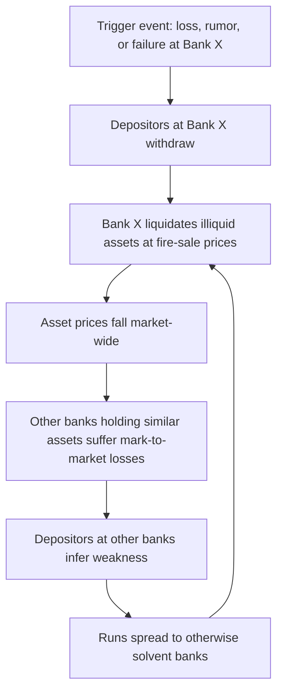

## Maturity Transformation and Bank Runs

### Overview

Maturity transformation is the process by which financial intermediaries fund long-term, illiquid assets with short-term, liquid liabilities. Banks accept demand deposits (withdrawable on demand) and use the proceeds to make loans and investments with much longer maturities (mortgages, business loans, term securities). This mismatch is central to the economic function of banking but simultaneously creates structural fragility that can manifest as a bank run — a self-reinforcing wave of withdrawals driven by depositors' fear that the bank cannot honor all claims.

### Economic Rationale for Maturity Transformation

**Liquidity Provision**

Depositors value the option to consume or spend at uncertain future dates. Banks pool many depositors' funds and exploit the law of large numbers: while any individual depositor's withdrawal timing is uncertain, aggregate withdrawal demand is relatively predictable. This allows banks to invest most funds in illiquid, higher-return long-term assets while holding a smaller liquid reserve to meet ordinary withdrawal demand.

**Diamond-Dybvig Framework**

The canonical model (Diamond and Dybvig, 1983) formalizes this insight. Consider:

- A continuum of depositors, each endowed with 1 unit at $t=0$.
- Depositors are ex-ante identical but face idiosyncratic liquidity risk: at $t=1$ each depositor learns privately whether they are an "early type" (needs to consume at $t=1$) or a "late type" (can wait until $t=2$).
- A long-term investment technology returns $R>1$ if held to $t=2$, but only $1$ (or less) if liquidated early at $t=1$.
- Without a bank, an individual holding the illiquid asset who turns out to be an early type suffers a bad outcome (forced early liquidation at a loss).

A bank deposit contract pools these risks and offers a fixed withdrawal payment $r_1$ at $t=1$ and $r_2$ at $t=2$, chosen to provide insurance: early types get more than autarky's early-liquidation value, late types accept somewhat less than $R$ in exchange for insurance against being an early type. This risk-sharing arrangement is welfare-improving relative to no intermediation.

**Key Points**

- Maturity transformation exists because it solves a real economic problem: idiosyncratic liquidity risk that individual agents cannot insure against on their own.
- The insurance-like deposit contract is only sustainable if depositors do not all attempt to withdraw simultaneously.
- The same contract that makes households better off in the "good" equilibrium is precisely what creates vulnerability to a "bad" equilibrium.

### The Bank Run as a Coordination Failure

**Multiple Equilibria**

The Diamond-Dybvig model's central result is that the deposit contract admits (at least) two Nash equilibria:

1. **Good equilibrium**: Only true early types withdraw at $t=1$; late types wait until $t=2$. The bank remains solvent and liquid; the efficient risk-sharing allocation is realized.
2. **Bank run equilibrium**: All depositors, including late types, rush to withdraw at $t=1$ because each individually believes others will withdraw, and the bank operates on a **sequential service constraint** — it pays withdrawals in the order received, first-come-first-served, until funds are exhausted. If a late-type depositor believes the bank will run out of funds before they get their turn, their dominant strategy is to withdraw immediately, even though waiting would have been better absent the run.

This is a self-fulfilling prophecy: the belief that a run will happen is sufficient to cause the run, independent of the bank's actual solvency. This distinguishes a **panic-based run** from a **fundamentals-based run**.

**Sequential Service Constraint**

$$r_1 \cdot f = \text{funds available at } t=1$$

where $f$ is the fraction of depositors served before funds are exhausted. Once withdrawals exceed the bank's liquid + liquidated-asset capacity, remaining depositors receive $0$ or a heavily discounted residual, making early withdrawal a dominant strategy regardless of type.

**Panic-Based vs. Fundamental Runs**

| Type | Trigger | Bank Solvency | Example Signal |
| --- | --- | --- | --- |
| Panic-based (sunspot) | Self-fulfilling belief, coordination failure | Solvent under normal circumstances | Rumor, contagion from another bank's failure |
| Fundamental-based | Genuine deterioration in asset quality or capital | Insolvent or near-insolvent | Loan losses, asset price declines, leverage revealed |

[Inference] In practice, many historical runs contain elements of both — a fundamental shock (e.g., regional loan losses, a failed correspondent bank) provides the trigger, after which panic dynamics amplify withdrawals beyond what fundamentals alone would justify.

### Mechanics of Contagion

**Interbank Linkages**

Banks are interconnected through interbank lending, payment systems, correlated asset holdings, and correspondent relationships. A run or failure at one institution can propagate via:

- **Direct exposure**: Bank B holds claims on Bank A; A's failure impairs B's balance sheet.
- **Information contagion**: Depositors update beliefs about the health of banks similar to a failing bank (same region, asset class, or business model), triggering runs at otherwise healthy institutions.
- **Fire-sale externalities**: A distressed bank liquidating illiquid assets depresses market prices; other banks holding similar assets face mark-to-market losses, weakening their own balance sheets and inviting further runs.

**Wholesale Funding Runs**

Modern runs frequently occur not through retail depositors physically queuing, but through:

- **Uninsured deposit flight**: Large depositors above deposit insurance limits withdraw electronically within hours.
- **Repo market runs**: Short-term secured wholesale lenders refuse to roll over repurchase agreements or demand higher haircuts, as seen extensively in 2007–2008 with non-bank and shadow-banking intermediaries.
- **Money market fund redemptions**: Institutional investors redeem shares in prime money market funds holding bank commercial paper, transmitting stress into short-term bank funding markets.

[Unverified] The exact speed of modern digital bank runs — e.g., the Silicon Valley Bank episode in March 2023, where a large share of deposits reportedly left within a single day via mobile banking and wire transfer — represents a documented acceleration relative to classical queue-based runs, though precise comparative velocity figures across historical episodes vary by source and methodology.

### Policy Responses and Institutional Safeguards

**Deposit Insurance**

Government-backed deposit insurance (e.g., FDIC in the United States) removes the incentive for insured depositors to run, because their claims are paid regardless of the bank's liquidation order or solvency. This directly eliminates the panic-based equilibrium for insured deposits by making $r_1$ effectively guaranteed up to the coverage limit.

$$\text{Insured deposit payoff} = \min(\text{claim}, \text{coverage limit})$$

Deposit insurance does not eliminate runs by uninsured depositors, who retain an incentive to withdraw early if they doubt ultimate recovery value.

**Lender of Last Resort**

Central banks can act as lender of last resort, lending against illiquid but solvent collateral at a penalty rate (the classical Bagehot's Dictum: lend freely, against good collateral, at a high rate). This supplies liquidity to solvent banks facing a temporary funding shortfall without requiring fire-sale asset liquidation, addressing the panic equilibrium without absorbing genuine insolvency losses onto the central bank.

**Suspension of Convertibility**

An alternative mechanism to deposit insurance is a pre-committed suspension of convertibility: the bank announces it will pay out only up to a threshold $f^*$ of depositors at $t=1$ (the expected fraction of true early types) and suspend further withdrawals. If $f^*$ is set correctly, ex-post it removes the incentive for late types to withdraw early, since they know funds will be available at $t=2$ regardless of what others do. Historically used before deposit insurance existed (e.g., U.S. bank holidays), but suffers from the practical difficulty of setting $f^*$ correctly and from the fact that legitimate early-type depositors may still be harmed if $f^*$ is underestimated.

**Capital Requirements and Liquidity Regulation**

Modern prudential regulation targets fundamental-based run risk directly:

- **Capital requirements** (e.g., Basel III risk-based capital ratios) ensure a buffer of loss-absorbing equity so that asset-side shocks do not immediately threaten depositor claims, reducing the likelihood a run is fundamentally justified.
- **Liquidity Coverage Ratio (LCR)** requires banks to hold sufficient high-quality liquid assets (HQLA) to cover projected net cash outflows over a 30-day stress period:

$$\text{LCR} = \frac{\text{HQLA}}{\text{Total net cash outflows over 30 days}} \geq 100\%$$

- **Net Stable Funding Ratio (NSFR)** requires available stable funding to exceed required stable funding, directly discouraging excessive reliance on short-term wholesale funding to finance illiquid long-term assets:

$$\text{NSFR} = \frac{\text{Available Stable Funding}}{\text{Required Stable Funding}} \geq 100\%$$

[Inference] These post-2008 liquidity regulations (LCR, NSFR under Basel III) were explicitly motivated by the recognition that capital adequacy alone does not prevent runs; a well-capitalized bank can still fail from a pure liquidity mismatch if funding evaporates faster than assets can be converted to cash.

### Illustrative Numerical Example

Suppose a bank raises 100 in deposits, invests 100 in a project returning $R = 1.2$ at $t=2$ but only $0.8$ if liquidated at $t=1$. Suppose the fraction of true early types is $t = 0.25$ and the bank sets $r_1 = 1$ (full principal on early withdrawal).

- **Good equilibrium**: 25 depositors withdraw at $t=1$, receiving $25 \times 1 = 25$ from liquidating $25/0.8 = 31.25$ of the investment early. Remaining $68.75$ invested continues to $t=2$, yielding $68.75 \times 1.2 = 82.5$, split among the 75 late-type depositors at $r_2 = 82.5/75 = 1.10$ each — better than the $1.0$ they'd get from early liquidation, confirming the insurance value of the contract.
- **Run equilibrium**: All 100 depositors attempt to withdraw at $t=1$. The bank can liquidate the full investment for at most $100 \times 0.8 = 80$, meaning it cannot pay $r_1 = 1$ to everyone; the sequential service constraint means the last depositors in line receive $0$. Anticipating this, every depositor — including late types — has an incentive to withdraw immediately, since waiting risks getting nothing.

**Conclusion**

Maturity transformation is the productive core of banking, converting illiquid long-term assets into liquid, insured-like claims that improve household welfare under normal conditions. But this same transformation is inherently fragile: it relies on depositors not coordinating on a "bad" equilibrium. Bank runs are best understood as a coordination failure amplified by a first-come-first-served payout structure, and the entire architecture of modern bank regulation — deposit insurance, lender-of-last-resort facilities, capital buffers, and liquidity ratios — exists to manage this specific fragility rather than to eliminate maturity transformation itself, since eliminating the mismatch would eliminate the liquidity-provision function banks exist to perform.

**Related Topics**

- Diamond-Dybvig model: full derivation and optimal contract design
- Deposit insurance moral hazard and risk-shifting incentives
- Shadow banking and non-deposit funding runs (repo, asset-backed commercial paper)
- Basel III liquidity framework (LCR, NSFR) in depth
- Lender of last resort: Bagehot's Dictum and stigma effects
- Systemic risk and too-big-to-fail contagion channels
- Case study: Silicon Valley Bank collapse (2023) and digital-era run dynamics
- Narrow banking and 100% reserve banking proposals as structural alternatives