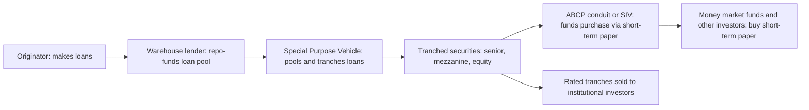

## Shadow Banking

### Definition and Scope

Shadow banking refers to credit intermediation activities that involve entities and activities operating fully or partially outside the traditional regulated banking system, performing bank-like functions — maturity transformation, liquidity transformation, leverage, and credit risk transfer — without access to central bank liquidity facilities or explicit public backstops such as deposit insurance. The term was popularized by Paul McCulley (PIMCO) in 2007, and the Financial Stability Board (FSB) has since adopted the more neutral term "non-bank financial intermediation" (NBFI) to describe the same phenomenon.

**Key Points**

- Shadow banking is defined by economic function, not legal form: any entity performing bank-like credit/maturity/liquidity transformation without banking regulation and backstops qualifies.
- The shadow banking system is not inherently illicit or hidden; it operates through visible, often heavily traded markets (repo, commercial paper, securitization).
- Its core vulnerability mirrors traditional banking's maturity mismatch problem, but without deposit insurance or guaranteed lender-of-last-resort access, making it structurally more run-prone.

### Core Components of the Shadow Banking System

**Money Market Mutual Funds (MMMFs)**

MMMFs sell redeemable shares to investors (historically often priced at a stable Net Asset Value, or NAV, of $1.00) and invest in short-term instruments: commercial paper, repo, short-term Treasuries, and certificates of deposit. Investors treat MMMF shares as near-cash, demandable claims, replicating the deposit-like liability side of a bank, while the fund holds a portfolio with credit and liquidity risk on the asset side.

**Repurchase Agreements (Repo) and the Repo Market**

A repo is economically a collateralized short-term loan: Party A sells a security to Party B with an agreement to repurchase it at a specified price on a specified (often overnight) date. The difference between the sale price and repurchase price implies an interest rate; the discount applied to collateral value is the **haircut**:

$$\text{Haircut} = 1 - \frac{\text{Loan Amount}}{\text{Market Value of Collateral}}$$

Broker-dealers and other shadow banking entities use repo extensively to fund inventories of securities (including mortgage-backed securities) on a rolling overnight basis — a severe maturity mismatch when the underlying collateral is illiquid or long-duration.

**Asset-Backed Commercial Paper (ABCP) Conduits and Structured Investment Vehicles (SIVs)**

These vehicles purchase longer-term assets (mortgages, receivables, structured credit tranches) and fund themselves by issuing short-term commercial paper to investors. Many were sponsored by banks but held off-balance-sheet, allowing sponsoring banks to avoid capital charges while retaining implicit reputational or contractual exposure (liquidity puts, credit enhancements) that reappeared on their books during the 2007–2008 crisis.

**Securitization and the "Originate-to-Distribute" Chain**

Securitization converts pools of illiquid loans (mortgages, auto loans, credit card receivables) into tradable securities through a multi-step chain:

Each link in this chain performs a form of maturity or credit transformation, and each is funded short-term relative to the underlying assets' maturity, compounding the aggregate mismatch across the system rather than concentrating it within a single regulated balance sheet.

**Securities Lending and Rehypothecation**

Broker-dealers and prime brokers re-use (rehypothecate) client collateral to fund their own positions or to lend to other market participants, creating collateral "chains" where a single underlying security supports multiple layered claims. This increases system-wide leverage and creates fire-sale risk if any link in the chain is forced to unwind.

**Non-Bank Lenders and Private Credit**

Broader shadow banking activity includes finance companies, business development companies (BDCs), and private credit funds that originate loans directly to corporations or consumers without taking insured deposits, funding themselves instead through wholesale debt, securitization, or closed-end fund structures. [Inference] The private credit segment has grown substantially since the 2007–2008 crisis, partly as bank balance-sheet lending contracted under stricter post-crisis capital rules, though precise current market size estimates vary across data providers and should be checked against the most recent FSB or IMF Global Financial Stability Report figures.

### Why Shadow Banking Performs Maturity Transformation Without a Bank Charter

Traditional banks perform maturity transformation under a regulatory compact: deposit insurance backstops the liability side, and central bank lender-of-last-resort facilities backstop liquidity, in exchange for capital requirements, reserve requirements, and supervisory oversight. Shadow banking entities replicate the *economics* of this transformation — short-term liabilities (repo, commercial paper, redeemable fund shares) funding longer-term or illiquid assets — but without the backstops or the equivalent prudential constraints. This regulatory gap is often referred to as **regulatory arbitrage**: activity migrates to wherever capital and liquidity requirements are lowest for a given economic risk.

**Key Points**

- The shadow banking system exists partly because bank capital regulation created incentives to move credit intermediation off regulated balance sheets.
- The same run dynamics as in Diamond-Dybvig-style bank runs apply, but the sequential-service/first-mover-advantage mechanism operates through redemption gates, margin calls, and repo haircut increases rather than a physical teller line.
- Absent deposit insurance, "runs" in shadow banking manifest as fund redemptions, non-renewal of commercial paper, or a spike in repo haircuts rather than depositor queues.

### Run Dynamics in Shadow Banking

**Repo Runs**

During a repo run, lenders raise haircuts or refuse to roll over repo against a class of collateral perceived as risky, forcing the borrower (often a broker-dealer or SIV) to sell assets into a falling market to raise cash, which further depresses collateral values and invites additional haircut increases — a self-reinforcing deleveraging spiral.

$$\text{Funding Gap} = \text{Asset Value} \times (1 - \text{New Haircut}) - \text{Existing Loan}$$

If the funding gap is negative, the borrower must post additional collateral or unwind the position.

**Money Market Fund Runs**

If a MMMF's NAV falls below $1.00 ("breaking the buck") — as occurred with the Reserve Primary Fund in September 2008 following Lehman Brothers' default — investors race to redeem shares before losses are realized, forcing the fund to sell assets and potentially triggering losses at other funds holding similar paper, propagating stress into the broader commercial paper market that many non-financial corporations rely on for short-term funding.

**Asset Fire Sales and Cross-Market Contagion**

Because shadow banking entities often hold overlapping asset classes (mortgage-backed securities, corporate bonds, structured credit), forced liquidation by one entity depresses mark-to-market values for all holders, transmitting stress across institutions that have no direct contractual relationship — a channel largely absent in traditional deposit-funded banking, where assets are typically held to maturity rather than mark-to-market.

### The 2007–2008 Financial Crisis as a Shadow Banking Run

[Inference] A substantial body of post-crisis research (including work associated with Gary Gorton) characterizes the 2007–2008 crisis primarily as a run on the shadow banking system's repo and securitization infrastructure, rather than a classical run on insured retail deposits. Key elements commonly cited:

- Rising subprime mortgage delinquencies reduced confidence in the value of mortgage-backed securities used as repo collateral.
- Repo haircuts on private-label mortgage-backed collateral rose sharply, in some documented cases effectively toward levels that made continued funding of certain asset classes largely infeasible.
- ABCP conduits and SIVs could not roll over maturing commercial paper, forcing sponsoring banks to draw on or honor liquidity backstops, pulling the "shadow" exposure back onto regulated bank balance sheets at the worst possible moment.
- The failure of Lehman Brothers, itself heavily reliant on short-term wholesale and repo funding, triggered the Reserve Primary Fund's break of the buck, which in turn froze the broader commercial paper market.

This sequence illustrates how the absence of deposit insurance and routine lender-of-last-resort access in shadow banking allowed a fundamentals-based shock (subprime losses) to escalate into a system-wide panic-based liquidity freeze.

### Regulatory Responses Since 2008

**Money Market Fund Reform**

Post-crisis reforms (e.g., U.S. SEC 2014 and subsequent 2023 rule amendments) introduced floating NAV requirements for institutional prime funds, liquidity fee and redemption gate mechanisms (later revised), and enhanced liquidity requirements, intended to reduce the first-mover advantage that drives redemption runs.

**Repo Market Reforms**

Introduction of central clearing for portions of the repo market, minimum haircut standards proposed by international bodies, and enhanced disclosure requirements aim to reduce procyclical haircut spirals.

**Systemic Risk Designation and FSB Monitoring**

The Financial Stability Board publishes an annual **Global Monitoring Report on Non-Bank Financial Intermediation**, tracking the size and interconnectedness of shadow banking activities worldwide and classifying entities by economic function (e.g., MMMFs as "Economic Function 1," entities dependent on short-term funding as "Economic Function 2," etc.) to enable consistent cross-jurisdictional monitoring.

**Bank-Shadow Bank Linkage Regulation**

Regulators tightened rules on banks' contractual and reputational exposure to the vehicles they sponsor (e.g., consolidation requirements for certain off-balance-sheet entities under accounting and capital rules), reducing the ability of banks to shift maturity transformation off-balance-sheet without a corresponding capital charge.

**Conclusion**

Shadow banking performs the same core economic function as traditional banking — maturity and liquidity transformation that channels short-term funding into longer-term credit — but does so through a distributed chain of non-bank entities and markets that lack deposit insurance and routine central bank backstops. This makes the system's stability heavily dependent on continuous confidence in short-term funding markets (repo, commercial paper, fund redemptions), and history has shown that a shock to that confidence can propagate through fire sales and cross-market contagion just as severely as — and in 2008, arguably more severely than — a classical retail bank run.

**Related Topics**

- Gorton's "run on repo" thesis and securitized banking theory in depth
- Money market fund reform: floating NAV, liquidity fees, and redemption gates
- Rehypothecation, collateral chains, and re-use ratios in securities financing
- Central clearing counterparties (CCPs) and repo market infrastructure reform
- Private credit and non-bank lending: growth, risks, and regulatory gaps
- FSB Global Monitoring Report methodology and economic function classifications
- Comparing Diamond-Dybvig bank runs to wholesale funding runs
- Basel III treatment of off-balance-sheet exposures and implicit support