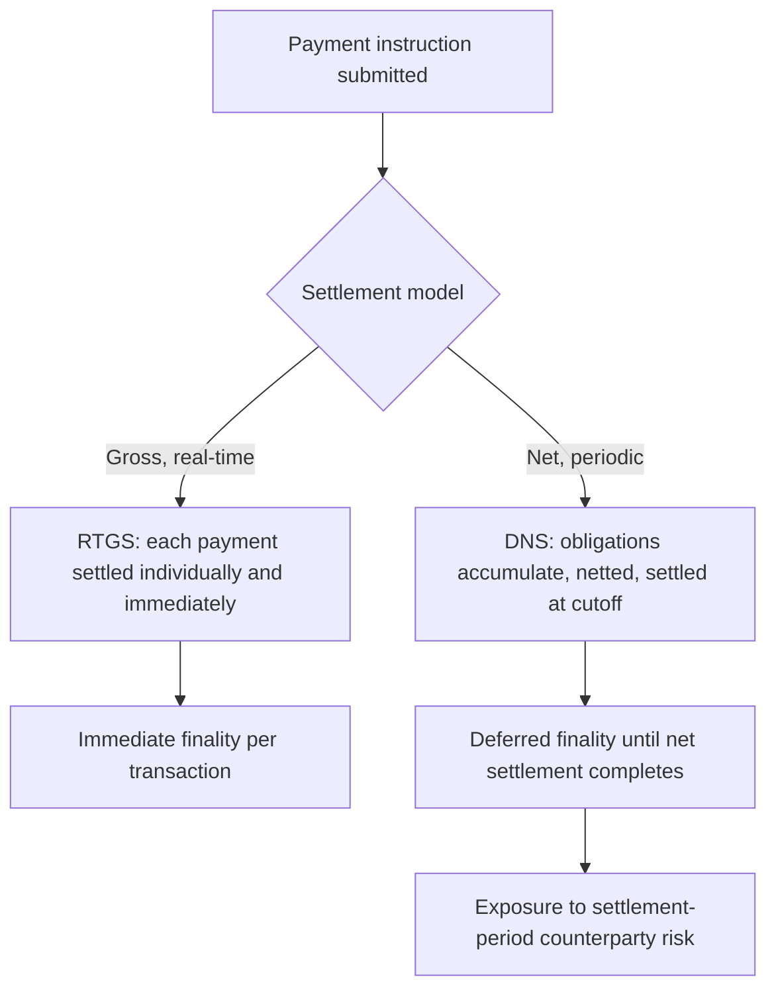

## Payment Systems and Clearing

### Overview

Payment systems are the infrastructure through which economic agents transfer monetary value to settle obligations, while clearing is the process of reconciling and confirming payment or trade instructions between parties prior to final settlement. Together they form the operational backbone of financial intermediation: every deposit transfer, securities trade, and interbank obligation ultimately depends on a payment and clearing infrastructure to move from a promise to pay into a final, irrevocable transfer of value.

**Key Points**

- Payments and clearing are conceptually distinct stages: clearing establishes what is owed to whom (netting, matching, confirmation); settlement is the actual, final transfer of funds or securities that discharges the obligation.
- Settlement finality — the point at which a payment becomes legally irrevocable and unconditional — is a core legal and economic concept underpinning financial stability.
- Payment system design directly affects systemic risk, since disruptions can propagate rapidly across interconnected institutions.

### The Payment Chain: Clearing vs. Settlement

**Clearing**

Clearing encompasses the transmission, reconciliation, and confirmation of payment orders or trade instructions, and often the establishment of final settlement positions, including netting. A clearinghouse or central counterparty (CCP) may interpose itself between the original parties, becoming the buyer to every seller and the seller to every buyer (**novation**), thereby assuming counterparty risk and simplifying the web of bilateral exposures into a hub-and-spoke structure.

**Settlement**

Settlement is the actual discharge of obligations through the transfer of funds or securities. Settlement can occur:

- **Gross**: each transaction settled individually and immediately.
- **Net**: obligations aggregated over a period (e.g., end of day) and only the net amount transferred.

$$\text{Net Position}_i = \sum_j \text{Receivables}_{i,j} - \sum_j \text{Payables}_{i,j}$$

**Settlement Finality**

Once a payment achieves finality, it cannot be reversed or unwound, even if the paying party subsequently becomes insolvent. This is a critical legal protection: without finality rules, a bank's failure could force sequential unwinding of thousands of prior "settled" transactions, transmitting distress backward through the payment chain (**Herstatt risk**, named after the 1974 failure of Bankhaus Herstatt, which failed after receiving deutschmarks but before making corresponding dollar payments to counterparties in a different time zone).

### RTGS vs. Net Settlement Systems

**Real-Time Gross Settlement (RTGS)**

RTGS systems settle each payment individually, continuously, and immediately in central bank money as it is submitted, provided the sending institution has sufficient balance or eligible collateral for intraday credit. Examples include Fedwire (United States), TARGET2 (Eurozone), and CHAPS (United Kingdom).

- **Advantage**: eliminates settlement risk between the time of submission and finality, since each payment settles immediately and irrevocably.
- **Cost**: requires participants to hold or access substantial intraday liquidity, since payments cannot be netted against offsetting incoming payments before settling.

**Deferred Net Settlement (DNS)**

DNS systems accumulate payment instructions throughout the day (or a shorter cycle) and settle only the net multilateral position of each participant at designated settlement times. Examples historically include ACH (Automated Clearing House) networks and CHIPS (Clearing House Interbank Payments System, which now also incorporates real-time elements).

- **Advantage**: economizes on liquidity, since only net obligations require funding.
- **Cost**: participants are exposed to counterparty and systemic risk during the interval between transaction execution and final net settlement — if a participant fails before the settlement cycle completes, its net position must be recalculated and losses allocated (**settlement risk** or **Herstatt risk**).

**Hybrid Systems**

Many modern systems combine elements of both, using continuous or frequent intraday netting cycles with liquidity-saving mechanisms (e.g., queuing and offsetting algorithms) to reduce gross liquidity needs while retaining more frequent finality than end-of-day-only netting. [Unverified] The specific liquidity-saving algorithms and cycle frequencies vary considerably by jurisdiction and system, so any comparison of liquidity efficiency across specific systems should be checked against current central bank documentation.

### Central Counterparties (CCPs) and Novation

For securities and derivatives markets, a CCP interposes itself between the original trading counterparties through **novation**, replacing a single bilateral contract with two contracts: CCP-to-buyer and CCP-to-seller.

**Risk Management Functions**

- **Margining**: CCPs require participants to post initial margin (collateral covering potential future exposure) and variation margin (covering daily mark-to-market changes), recalculated frequently.

$$\text{Variation Margin Call} = \text{Mark-to-Market Value}_t - \text{Mark-to-Market Value}_{t-1}$$

- **Multilateral netting**: a CCP nets each participant's exposure across all its counterparties into a single net position, dramatically reducing the number and gross value of exposures relative to a bilateral web.
- **Default fund / mutualized loss absorption**: participants contribute to a default fund used to cover losses if a defaulting member's margin is insufficient, mutualizing extreme tail risk across surviving members (the "default waterfall").

**Systemic Risk Considerations**

CCPs concentrate counterparty risk that was previously distributed bilaterally, making the CCP itself a systemically critical node. [Inference] This concentration is generally viewed by regulators as a net risk reduction relative to an unmanaged bilateral web, provided the CCP is adequately capitalized, margined, and supervised, but it does create a "too big to fail" concern specific to market infrastructure, motivating post-2008 regulatory frameworks (e.g., mandatory central clearing for standardized derivatives under Dodd-Frank and EMIR) alongside enhanced CCP resilience and recovery/resolution planning requirements.

### Interbank and Wholesale Payment Infrastructure

**Correspondent Banking**

Cross-border and cross-currency payments frequently route through correspondent banks that maintain accounts (nostro/vostro accounts) with each other, since no single settlement system spans all currencies and jurisdictions. This creates longer settlement chains, more intermediaries, and more points of potential delay or failure compared to domestic RTGS.

**SWIFT**

SWIFT (Society for Worldwide Interbank Financial Telecommunication) is a messaging network, not a settlement system: it transmits standardized payment instructions between banks but does not itself move funds. Actual settlement still occurs through correspondent accounts or domestic RTGS systems in the relevant currency.

**Continuous Linked Settlement (CLS)**

CLS is a specialized settlement system for foreign exchange transactions that uses a payment-versus-payment (PvP) mechanism: both legs of an FX trade settle simultaneously and unconditionally, or neither does, directly eliminating the Herstatt risk that arises when the two currency legs of an FX trade would otherwise settle in different time zones with a time gap between them.

### Central Bank Digital Currency (CBDC) and Emerging Payment Infrastructure

Central banks in numerous jurisdictions have researched or piloted CBDC as a potential new form of central bank money for retail or wholesale payments. [Speculation] The eventual scale of CBDC adoption, its precise design (account-based vs. token-based, retail vs. wholesale-only), and its implications for bank deposit funding and disintermediation remain unsettled policy questions as of this writing, and readers should consult current central bank publications (e.g., BIS, Federal Reserve, ECB) for the latest status in any specific jurisdiction, since this is an actively evolving area.

**Faster/Instant Payment Systems**

Many jurisdictions have deployed retail instant payment rails (e.g., FedNow and RTP in the United States, UPI in India, PIX in Brazil) that provide RTGS-like immediate finality for retail-value transactions, narrowing the historical gap between wholesale interbank settlement speed and retail payment settlement speed.

### Systemic Risk in Payment Systems

**Key Points**

- **Liquidity risk**: a participant's inability to make a payment when due, even if solvent, due to timing mismatches — can cascade if that participant's outgoing payment was needed to fund another participant's obligations ("gridlock").
- **Credit/settlement risk**: exposure that arises when a counterparty fails between trade execution and final settlement, most acute in DNS systems and cross-currency settlement without PvP mechanisms.
- **Operational risk**: cyberattacks, technical failures, or natural disasters affecting critical payment infrastructure can halt settlement system-wide, given the concentrated, systemically critical nature of core payment rails.
- **Principle of "too interconnected to fail"**: because virtually all financial institutions depend on shared payment and clearing infrastructure, disruptions at a systemically important payment system, CCP, or correspondent bank can transmit stress across the entire financial system regardless of individual institutions' balance sheet health.

**Conclusion**

Payment and clearing systems translate financial claims into final, irrevocable transfers of value, and their design choices — gross versus net settlement, bilateral versus centrally cleared, domestic versus correspondent-routed — directly shape how liquidity risk, credit risk, and systemic risk are distributed across the financial system. Because nearly every other financial intermediation activity ultimately depends on this infrastructure to settle, payment and clearing system resilience is treated by regulators as foundational financial stability infrastructure rather than as an incidental back-office function.

**Related Topics**

- Herstatt risk and the history of payment-versus-payment (PvP) settlement
- CCP default waterfalls and margin methodology (SPAN, VaR-based margining)
- Dodd-Frank and EMIR mandatory clearing requirements for derivatives
- Cross-border payment friction and the G20 cross-border payments roadmap
- Central Bank Digital Currency (CBDC) design tradeoffs
- Intraday liquidity management and central bank collateral frameworks
- Real-time retail payment rails: FedNow, RTP, UPI, PIX comparative architecture
- Operational resilience and cyber risk in critical financial market infrastructure