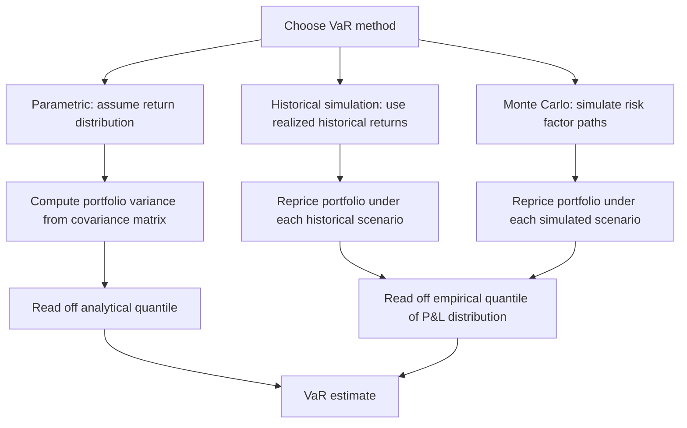

## Value at Risk and Expected Shortfall

### Overview

Value at Risk (VaR) and Expected Shortfall (ES, also called Conditional VaR or CVaR) are the two dominant quantitative measures used to summarize the tail risk of a portfolio's loss distribution. VaR answers "how bad can losses get at a given confidence level?" while ES answers "if losses do exceed that threshold, how bad are they on average?" Both are central to regulatory capital calculation, internal risk limits, and portfolio risk management.

### Value at Risk (VaR)

**Formal Definition**

VaR at confidence level $\alpha$ over horizon $h$ is the loss threshold that will not be exceeded with probability $\alpha$:

$$\text{VaR}_\alpha = \inf\{l : P(L > l) \leq 1-\alpha\}$$

Equivalently, if $L$ denotes the portfolio loss (a positive number for a loss) over horizon $h$, $\text{VaR}_\alpha$ is the $\alpha$-quantile of the loss distribution. For example, a one-day 99% VaR of $1 million means there is a 1% probability that the portfolio loses more than $1 million over one day, under the model's assumptions.

**Key Points**

- VaR is a quantile of the loss distribution, not an expectation — it says nothing about the magnitude of losses beyond the threshold.
- VaR requires specifying both a confidence level $\alpha$ (commonly 95%, 99%, or 99.9%) and a time horizon $h$ (commonly 1 day or 10 days for market risk).
- VaR can be computed for a single position or an entire portfolio, and portfolio VaR is generally less than the sum of individual position VaRs due to diversification, except in special cases.

### Methods for Computing VaR

**Parametric (Variance-Covariance) Method**

Assumes portfolio returns are normally distributed (or another parametric family). For a portfolio with mean return $\mu$ and standard deviation $\sigma$ over the horizon:

$$\text{VaR}_\alpha = -(\mu + z_\alpha \sigma) \times V$$

where $z_\alpha$ is the relevant quantile of the standard normal distribution (e.g., $z_{0.99} \approx -2.33$) and $V$ is portfolio value. For a multi-asset portfolio with weight vector $w$ and covariance matrix $\Sigma$:

$$\sigma_p = \sqrt{w^T \Sigma w}$$

- **Advantage**: computationally fast, closed-form, easy to decompose into risk contributions by asset.
- **Limitation**: assumes normality, which understates tail risk for assets with fat tails, skewness, or nonlinear payoffs (e.g., options).

**Historical Simulation**

Applies the actual historical distribution of returns (typically the most recent 1–5 years of daily returns) to the current portfolio, generating a distribution of hypothetical P&L outcomes, then reads off the empirical quantile directly.

- **Advantage**: makes no distributional assumption, naturally captures fat tails, skewness, and correlations as they actually occurred historically.
- **Limitation**: entirely backward-looking — cannot capture risks that have never occurred in the sample window and is slow to adapt if market conditions shift.

**Monte Carlo Simulation**

Specifies a stochastic model for underlying risk factors (e.g., correlated geometric Brownian motion, or more complex models with jumps or stochastic volatility), simulates thousands of paths, prices the portfolio (including nonlinear instruments) under each simulated scenario, and reads off the empirical quantile of the resulting loss distribution.

- **Advantage**: flexible enough to handle nonlinear instruments (options, structured products) and arbitrary distributional assumptions.
- **Limitation**: computationally intensive; results are only as good as the underlying model specification (model risk).

### Limitations of VaR

**Not a Coherent Risk Measure**

VaR fails **subadditivity**, one of the four axioms of a coherent risk measure (Artzner, Delbaen, Eber, and Heath, 1999). Subadditivity requires:

$$\rho(X + Y) \leq \rho(X) + \rho(Y)$$

i.e., diversification should never increase risk. VaR can violate this in the presence of fat-tailed or asymmetric distributions — combining two positions can produce a portfolio VaR that exceeds the sum of the individual VaRs, which is economically counterintuitive since diversification should not be penalized by a well-behaved risk measure.

**Key Points**

- VaR provides no information about the shape or severity of the loss distribution beyond the threshold — two portfolios with identical VaR can have very different tail severity.
- VaR can create perverse incentives: a portfolio manager can restructure a portfolio to reduce reported VaR while increasing the severity of losses in the (unreported) tail beyond the VaR threshold — sometimes called "VaR gaming" or tail risk concentration.
- VaR is silent on liquidity risk and the feasibility of actually realizing the assumed loss over the stated horizon (e.g., whether a position can actually be liquidated within one day without moving the market).

### Expected Shortfall (ES)

**Formal Definition**

Expected Shortfall at confidence level $\alpha$ is the expected loss conditional on the loss exceeding $\text{VaR}_\alpha$:

$$\text{ES}_\alpha = E[L \mid L > \text{VaR}_\alpha]$$

For a continuous loss distribution, this can also be expressed as the average of VaR over all confidence levels above $\alpha$:

$$\text{ES}_\alpha = \frac{1}{1-\alpha} \int_\alpha^1 \text{VaR}_u \, du$$

**Key Points**

- ES directly answers "if things go badly (beyond the VaR threshold), how bad on average?" — capturing tail severity that VaR ignores.
- ES is always greater than or equal to VaR at the same confidence level, since it averages losses that are at least as large as VaR.
- ES satisfies subadditivity and the other coherent risk measure axioms (monotonicity, translation invariance, positive homogeneity), making it a coherent risk measure, unlike VaR.

### Coherent Risk Measures: The Four Axioms

A risk measure $\rho$ is coherent if it satisfies:

1. **Monotonicity**: if $X \leq Y$ almost surely, then $\rho(X) \geq \rho(Y)$ (a portfolio with uniformly worse outcomes has higher risk).
2. **Subadditivity**: $\rho(X+Y) \leq \rho(X) + \rho(Y)$ (diversification does not increase risk).
3. **Positive homogeneity**: $\rho(\lambda X) = \lambda \rho(X)$ for $\lambda > 0$ (scaling a position scales its risk proportionally).
4. **Translation invariance**: $\rho(X + c) = \rho(X) - c$ for a constant cash amount $c$ (adding a certain amount of cash reduces risk by exactly that amount).

Expected Shortfall satisfies all four; VaR generally satisfies 1, 3, and 4 but fails subadditivity in general (though it is subadditive under the special case of elliptical return distributions, including the normal distribution).

### Regulatory Evolution: Basel II/III VaR to Basel IV (FRTB) Expected Shortfall

**Basel II/III Market Risk Framework**

Under Basel II and the initial Basel 2.5/III framework, regulatory market risk capital for trading books was based on 99% VaR over a 10-day horizon (often computed as 1-day VaR scaled by $\sqrt{10}$ under the **square-root-of-time rule**, an approximation that assumes i.i.d. returns):

$$\text{VaR}_{10\text{-day}} \approx \text{VaR}_{1\text{-day}} \times \sqrt{10}$$

[Inference] This square-root-of-time scaling is a standard approximation rather than an exact result; it holds precisely only under specific assumptions (i.i.d. normally distributed returns with no autocorrelation), and its accuracy degrades for portfolios with significant nonlinearity or fat-tailed risk factors.

**Fundamental Review of the Trading Book (FRTB)**

The Basel Committee's FRTB framework, developed after recognizing VaR's shortcomings during the 2007–2008 crisis (particularly its failure to capture tail risk severity during stressed periods), replaced VaR with **Expected Shortfall at the 97.5% confidence level** as the standard for regulatory market risk capital under the internal models approach. Key features include:

- **Liquidity horizons**: FRTB requires different liquidity horizons (10, 20, 40, 60, or 120 days) for different risk factor categories, reflecting that not all positions can be liquidated or hedged within the same timeframe — directly addressing one of VaR's liquidity blind spots.
- **Stressed calibration**: capital must reflect a period of significant financial stress relevant to the bank's portfolio, not solely recent historical data, to avoid procyclical understatement of risk during calm periods.
- **Non-Modellable Risk Factors (NMRFs)**: risk factors with insufficient observable market data receive a more punitive, stress-scenario-based capital charge rather than being incorporated into the standard ES model.

[Unverified] Specific FRTB implementation timelines and calibration parameters have been subject to repeated delays and jurisdiction-specific adjustments across the US, EU, UK, and other Basel-implementing jurisdictions; current implementation status should be verified against the latest Basel Committee and national regulator publications.

### Backtesting

Both VaR and ES models require backtesting — comparing realized P&L against model-predicted risk thresholds to validate model accuracy.

**VaR Backtesting**

The simplest test counts **exceptions** — days where actual losses exceeded the predicted VaR. Under a correctly specified 99% VaR model, exceptions should occur approximately 1% of the time. The Basel "traffic light" approach classifies backtesting performance:

| Zone | Exceptions (250 days, 99% VaR) | Implication |
| --- | --- | --- |
| Green | 0–4 | Model considered accurate |
| Yellow | 5–9 | Increased scrutiny, possible capital multiplier increase |
| Red | 10+ | Model considered inaccurate, higher capital multiplier applied |

**ES Backtesting Challenges**

[Inference] Expected Shortfall is generally understood to be harder to backtest directly than VaR because it is not "elicitable" in the statistical sense (there is no scoring function for which the true ES is the unique minimizer, unlike VaR which is elicitable). In practice, this is commonly addressed by backtesting ES indirectly — for example, by jointly backtesting the associated VaR quantile alongside the tail expectation, or by using specialized joint elicitability results for the VaR/ES pair — an active area of both academic research and regulatory guidance rather than a single universally standardized method.

### Worked Numerical Example

Suppose a portfolio has daily returns that are approximately normally distributed with $\mu = 0$ and $\sigma = \$100{,}000$, and portfolio value $V = \$10{,}000{,}000$.

**Parametric 99% 1-day VaR:**

$$\text{VaR}_{0.99} = -z_{0.99} \times \sigma = 2.33 \times \$100{,}000 = \$233{,}000$$

**Parametric 99% Expected Shortfall** (for a normal distribution, ES has a closed form):

$$\text{ES}_\alpha = \sigma \times \frac{\phi(z_\alpha)}{1-\alpha}$$

where $\phi$ is the standard normal density. For $\alpha = 0.99$, $z_{0.99} \approx 2.33$, $\phi(2.33) \approx 0.0267$:

$$\text{ES}_{0.99} = \$100{,}000 \times \frac{0.0267}{0.01} \approx \$267{,}000$$

This confirms $\text{ES}_{0.99} (\$267{,}000) > \text{VaR}_{0.99} (\$233{,}000)$, as expected, since ES captures the average severity of losses beyond the VaR threshold rather than just the threshold itself.

**Conclusion**

VaR and Expected Shortfall address the same underlying question — how much can a portfolio lose? — but VaR reports only a threshold quantile while ES reports the average severity beyond that threshold, making ES both more informative about tail risk and mathematically coherent in a way VaR is not. This distinction was not merely academic: the 2007–2008 financial crisis exposed how VaR-based capital frameworks could understate true tail risk, directly motivating the Basel Committee's shift to Expected Shortfall under the FRTB framework as the modern regulatory standard for market risk capital.

**Related Topics**

- Coherent risk measures: full axiomatic treatment and alternative measures (spectral risk measures, entropic risk measures)
- Elicitability and joint backtesting of VaR/ES pairs
- Extreme Value Theory (EVT) for tail risk estimation beyond historical sample limits
- FRTB Non-Modellable Risk Factors and standardized approach capital charges
- Copula-based dependence modeling for multivariate tail risk
- Stress testing and scenario analysis as a complement to VaR/ES
- Credit VaR and Expected Shortfall for credit portfolios (vs. market risk)
- Liquidity-adjusted VaR (L-VaR) and liquidation cost modeling