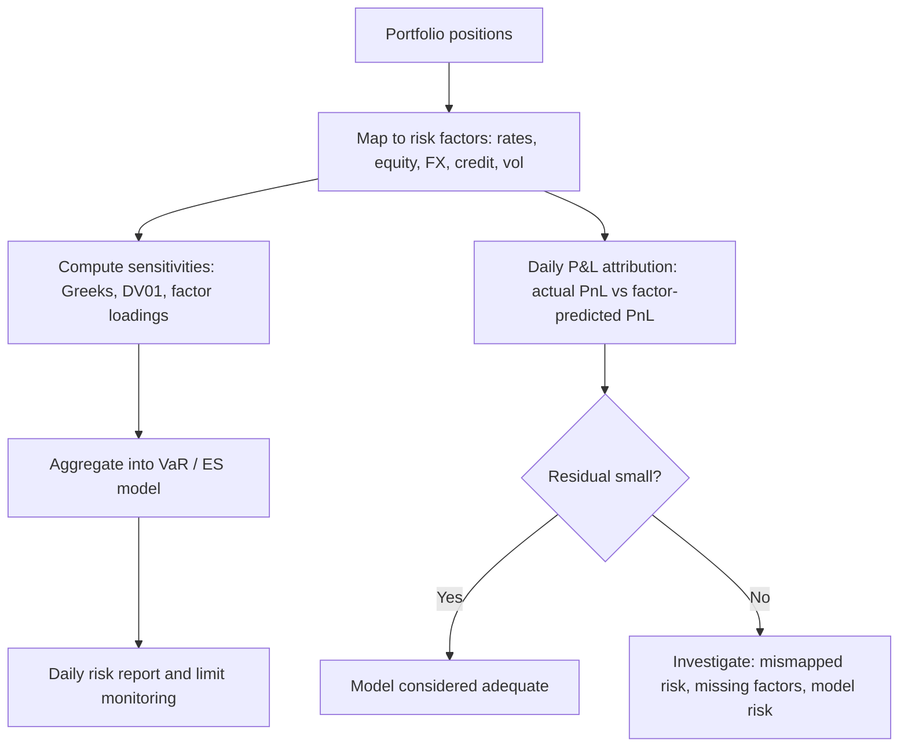

## Market Risk Measurement

### Overview

Market risk is the risk of losses arising from movements in market prices — interest rates, equity prices, foreign exchange rates, commodity prices, and credit spreads — affecting the value of trading positions and, more broadly, the balance sheet. Market risk measurement encompasses the full toolkit used to quantify, decompose, and monitor this exposure: sensitivity measures, VaR/ES-based approaches, stress testing, and factor-based decomposition.

### Sensitivity-Based ("Greeks") Measures

**Duration and Convexity (Interest Rate Risk)**

For fixed income instruments, **modified duration** measures the approximate percentage price change for a small change in yield:

$$\text{Modified Duration} = -\frac{1}{P} \frac{dP}{dy}$$

$$\Delta P \approx -D_{mod} \times P \times \Delta y$$

**Convexity** captures the second-order curvature that duration alone misses:

$$\Delta P \approx -D_{mod} \times P \times \Delta y + \frac{1}{2} \times C \times P \times (\Delta y)^2$$

Duration and convexity together provide a local, parametric approximation of interest rate sensitivity, accurate for small yield changes but degrading for large moves or instruments with embedded optionality (e.g., callable bonds, mortgage-backed securities with prepayment risk).

**DV01 / PV01**

DV01 (dollar value of a basis point) measures the dollar price change for a 1 basis point (0.01%) change in yield:

$$\text{DV01} = D_{mod} \times P \times 0.0001$$

DV01 is widely used for hedging and aggregating interest rate risk across a portfolio of fixed income instruments with different maturities, since it expresses sensitivity in a common dollar-per-basis-point unit.

**The Greeks (Options and Derivatives)**

| Greek | Definition | Measures |
| --- | --- | --- |
| Delta ($\Delta$) | $\partial V / \partial S$ | Sensitivity to underlying price |
| Gamma ($\Gamma$) | $\partial^2 V / \partial S^2$ | Rate of change of delta (convexity in underlying) |
| Vega ($\nu$) | $\partial V / \partial \sigma$ | Sensitivity to implied volatility |
| Theta ($\Theta$) | $\partial V / \partial t$ | Time decay |
| Rho ($\rho$) | $\partial V / \partial r$ | Sensitivity to interest rates |

**Key Points**

- Greeks provide instantaneous, local sensitivity measures — useful for hedging and intraday risk monitoring but not directly a measure of potential loss over a horizon.
- Gamma risk means delta-hedged positions can still accumulate losses from large underlying moves, since delta itself changes as the underlying moves (this is the core rationale for gamma hedging in addition to delta hedging).
- Cross-Greeks (e.g., Vanna: sensitivity of delta to volatility; Volga: sensitivity of vega to volatility) become important for complex derivatives portfolios and are a common source of unexpected P&L when ignored.

### Factor Sensitivity and PnL Decomposition

**Risk Factor Mapping**

Complex portfolios are typically decomposed into exposures to a smaller set of common risk factors (yield curve points, equity indices, FX rates, credit spread curves, volatility surfaces) to make aggregation and VaR computation tractable:

$$\Delta V \approx \sum_{i=1}^{n} \frac{\partial V}{\partial F_i} \Delta F_i$$

where $F_i$ represents individual risk factors.

**PnL Attribution / Explain**

A daily reconciliation process ("P&L explain" or "P&L attribution") decomposes actual realized P&L into components attributable to each risk factor's movement, plus a residual "unexplained" P&L. A large or persistent unexplained component signals model risk, mismapped positions, or missing risk factors, and is closely monitored by risk management and regulators (notably as part of FRTB's P&L Attribution Test, discussed below).

### Stress Testing and Scenario Analysis

**Historical Scenario Analysis**

Applies the actual risk factor moves observed during a specific historical crisis (e.g., 2008 global financial crisis, 2020 COVID market shock, 1998 LTCM/Russia crisis) to the current portfolio, answering "what would happen to today's portfolio if that historical event repeated?"

**Hypothetical Scenario Analysis**

Constructs forward-looking, plausible-but-not-yet-observed scenarios (e.g., a sudden 200 basis point rate shock combined with a 30% equity decline and credit spread widening) to test vulnerabilities that historical data may not capture, particularly important for tail risks with no close historical precedent.

**Reverse Stress Testing**

Instead of starting from a scenario and computing the resulting loss, reverse stress testing starts from a specified loss magnitude (e.g., "what scenario would cause the firm to become insolvent or breach a critical threshold?") and works backward to identify the combination of risk factor moves that would produce it — a technique regulators increasingly require to surface risk concentrations that standard VaR/scenario approaches might miss.

**Key Points**

- Stress testing complements VaR/ES by explicitly incorporating scenarios that may fall outside the statistical distribution used for VaR calibration, particularly correlations that break down or shift dramatically during crises ("correlation breakdown").
- Regulatory stress testing regimes (e.g., CCAR/DFAST in the US, EBA stress tests in the EU) combine market risk stress with broader firm-wide capital adequacy assessment.
- A key limitation of any stress test is that it can only test scenarios someone thought to construct — genuinely novel risks by definition are not represented in either historical or hypothetical scenario libraries.

### Regulatory Framework: From Basel II Standardized/Internal Models to FRTB

**Standardized Approach**

Regulators specify fixed risk weights and aggregation rules applied to standardized risk factor sensitivities, providing a floor and a fallback for banks without approved internal models, and increasing comparability across institutions.

**Internal Models Approach (IMA)**

Banks with regulatory approval can use their own VaR/ES models (subject to backtesting and validation requirements) to compute regulatory capital, generally producing more risk-sensitive (and often lower) capital requirements than the standardized approach, provided model performance is validated.

**FRTB Boundary and Desk-Level Approval**

The Fundamental Review of the Trading Book requires banks to seek IMA approval at the trading desk level rather than firm-wide, meaning a bank can use internal models for some desks while others default to the standardized approach if they fail backtesting or P&L attribution tests.

**P&L Attribution Test**

Under FRTB, each desk seeking IMA approval must pass a P&L Attribution Test comparing the desk's risk-management P&L (based on the full pricing model) against its risk-theoretical P&L (based on the risk factors included in the regulatory model). Persistent, significant divergence between the two results in the desk losing IMA eligibility and reverting to the standardized approach, creating a strong incentive for banks to ensure their regulatory risk factor models are complete and accurate.

[Unverified] Specific P&L Attribution Test statistical thresholds and their calibration have been revised across FRTB consultation rounds; current thresholds should be checked against the latest Basel Committee and national implementing regulation.

### Model Risk in Market Risk Measurement

**Key Points**

- **Model risk** arises from incorrect model specification (e.g., assuming normal returns when true returns are fat-tailed), miscalibrated parameters, or incorrect implementation, and is itself now often subject to dedicated model risk management frameworks (e.g., SR 11-7 guidance in the US).
- **Procyclicality**: VaR-based risk measures calibrated on recent historical volatility tend to understate risk during calm periods and overstate it during stressed periods, potentially amplifying market moves as institutions simultaneously de-risk when volatility spikes (a phenomenon studied extensively after 2008).
- **Correlation and diversification assumptions**: risk models often assume stable correlations between risk factors; during crises, correlations frequently shift toward 1 (assets that were previously uncorrelated move together), meaning realized portfolio risk can substantially exceed model-implied risk exactly when it matters most.

### Liquidity Considerations in Market Risk

Market risk measurement increasingly incorporates **liquidity horizons** — the time realistically required to liquidate or hedge a position without materially moving the market — recognizing that standard VaR/ES horizons (often 1 or 10 days) may substantially understate the risk of less liquid instruments. FRTB's liquidity horizon framework assigns different horizons (10 to 120 days) by risk factor category specifically to address this, replacing the single uniform horizon historically used across most Basel II/III VaR frameworks.

$$\text{Liquidity-Adjusted VaR} \approx \text{VaR} \times \sqrt{\frac{\text{Liquidity Horizon}}{\text{Base Horizon}}}$$

[Inference] This square-root scaling for liquidity horizons is an approximation analogous to the square-root-of-time rule used for standard VaR horizon scaling, and inherits the same limitations regarding the i.i.d. and normality assumptions underlying its derivation.

**Conclusion**

Market risk measurement combines complementary tools operating at different levels of granularity and different risk horizons: instantaneous sensitivity measures (Greeks, duration, DV01) for hedging and intraday monitoring; VaR and Expected Shortfall for statistical summarization of potential losses; and stress testing for scenarios that fall outside what historical statistical models can capture. The post-2008 regulatory evolution toward FRTB reflects a broader recognition that no single measure is sufficient on its own — sensitivity measures miss aggregate tail risk, VaR alone misses tail severity, and even ES can understate risk if liquidity horizons and non-modellable risk factors are not explicitly incorporated.

**Related Topics**

- Value at Risk and Expected Shortfall: full methodological treatment
- FRTB Non-Modellable Risk Factors and standardized capital charges
- Yield curve risk factor construction and key rate durations
- Volatility surface modeling and vega risk for options portfolios
- Stress testing regimes: CCAR/DFAST and EBA methodology comparison
- Model risk management frameworks (e.g., SR 11-7) and independent model validation
- Procyclicality of risk-based capital requirements
- Liquidity risk measurement and liquidity-adjusted risk metrics