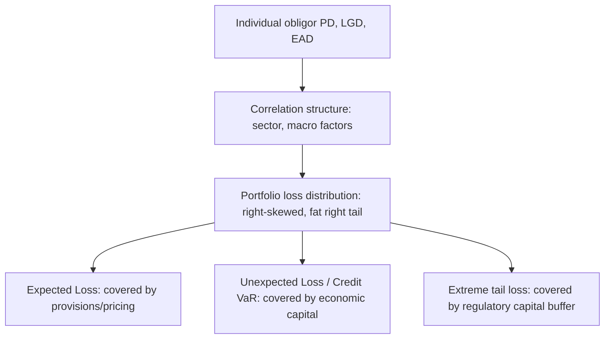

## Credit Risk Management

### Overview

Credit risk is the risk of loss arising from a borrower or counterparty's failure to meet contractual obligations, whether through outright default, downgrade, or a deterioration in creditworthiness that reduces the value of a claim. Credit risk management encompasses the measurement, pricing, mitigation, and portfolio-level control of this risk across lending books, trading counterparty exposures, and securities holdings.

### Core Components of Credit Risk

**Probability of Default (PD)**

The likelihood that an obligor will fail to meet its obligations over a given horizon (commonly one year for regulatory purposes). PD can be estimated through:

- **Structural models** (e.g., Merton model): treat a firm's equity as a call option on its assets, with default occurring when asset value falls below a debt threshold at maturity. Under Merton's framework, the probability of default is derived from the distance between current asset value and the default point, scaled by asset volatility:

$$\text{Distance to Default} = \frac{\ln(V_A/D) + (\mu - \sigma_A^2/2)T}{\sigma_A \sqrt{T}}$$

where $V_A$ is asset value, $D$ is the default threshold (debt face value), $\mu$ is the expected asset return, and $\sigma_A$ is asset volatility.

- **Reduced-form (intensity) models**: model default as a Poisson-type jump process with a hazard rate $\lambda(t)$, without explicitly modeling the firm's capital structure, often calibrated to observed credit spreads in bond or CDS markets.
- **Statistical/scoring models**: logistic regression, machine learning classifiers, or credit scorecards trained on historical default data and financial/behavioral covariates, widely used for retail and middle-market lending.

**Loss Given Default (LGD)**

The proportion of exposure expected to be lost if default occurs, after accounting for recoveries (collateral liquidation, restructuring proceeds, seniority in bankruptcy):

$$\text{LGD} = 1 - \text{Recovery Rate}$$

LGD varies substantially by seniority, collateral type, and jurisdiction-specific insolvency regimes; secured senior debt typically has materially lower LGD than unsecured subordinated debt.

**Exposure at Default (EAD)**

The expected outstanding exposure at the time of default, which for revolving facilities (credit lines, credit cards) must account for the possibility that undrawn commitments will be drawn down as the borrower approaches distress:

$$\text{EAD} = \text{Drawn Amount} + \text{CCF} \times \text{Undrawn Commitment}$$

where CCF (credit conversion factor) estimates the fraction of undrawn commitment likely to be drawn prior to default.

**Expected Loss**

$$\text{EL} = \text{PD} \times \text{LGD} \times \text{EAD}$$

Expected loss represents the anticipated average cost of credit risk and is typically priced into loan spreads and covered by loan loss provisions/reserves, distinct from **unexpected loss** — the variability around this expectation — which is covered by economic and regulatory capital.

**Key Points**

- PD, LGD, and EAD are the three core building blocks of virtually all credit risk quantification frameworks, from internal ratings-based (IRB) regulatory capital to loan pricing.
- Expected loss is a cost of doing business, priced into spreads and covered by provisions; unexpected loss is a tail risk covered by capital.
- LGD and PD are often correlated (not independent) during systemic downturns — recovery rates tend to fall precisely when default rates rise, since both are driven by the same deteriorating economic conditions, a phenomenon sometimes incorporated via "downturn LGD" assumptions in regulatory frameworks.

### Credit Portfolio Risk and Concentration

**Portfolio-Level Credit Risk**

Unlike market risk, credit risk exhibits strong asymmetry (loss distributions are right-skewed, with a large probability of small/no loss and a small probability of severe loss) and significant correlation across obligors driven by shared macroeconomic and sector-specific factors.

**Concentration Risk**

Losses can be amplified when exposure is concentrated in a single obligor, sector, or geography. Concentration risk is managed through:

- **Single-name limits**: maximum exposure to any one obligor as a percentage of capital.
- **Sector/industry limits**: caps on aggregate exposure to correlated sectors (e.g., commercial real estate, oil and gas).
- **Herfindahl-Hirschman Index (HHI)** or similar concentration metrics applied to portfolio composition:

$$HHI = \sum_{i=1}^{n} s_i^2$$

where $s_i$ is obligor $i$'s share of total portfolio exposure.

**Credit VaR and Portfolio Credit Models**

Analogous to market risk VaR, Credit VaR estimates the loss threshold not exceeded at a given confidence level over a horizon (commonly one year, given credit risk's slower-moving nature relative to market risk). Industry models include:

- **CreditMetrics** (J.P. Morgan): a ratings-migration-based approach simulating correlated changes in credit rating/quality across the portfolio and revaluing exposures under each simulated state.
- **CreditRisk+** (Credit Suisse): an actuarial approach treating default as a Poisson process, avoiding the need to model full ratings transition matrices.
- **KMV/Moody's Analytics models**: structural, Merton-based approaches using equity market data to infer implied default probabilities (Expected Default Frequency, EDF).

[Inference] These models differ meaningfully in their treatment of correlation and default dependence, and results can diverge materially for the same portfolio depending on model choice and calibration, which is why regulatory frameworks generally require model validation and benchmarking against multiple approaches rather than reliance on a single model.

### Credit Risk Mitigation Techniques

**Collateralization**

Secured lending reduces LGD by giving the lender a claim on specific assets in the event of default. Effectiveness depends on collateral liquidity, valuation stability, and legal enforceability of the security interest across jurisdictions.

**Netting Agreements**

Master netting agreements (e.g., ISDA Master Agreement for derivatives) allow offsetting positive and negative exposures with the same counterparty to be netted into a single net exposure in the event of default, substantially reducing gross counterparty credit exposure relative to a purely bilateral, non-netted arrangement.

**Credit Derivatives**

- **Credit Default Swaps (CDS)**: the protection buyer pays a periodic premium (spread) to the protection seller, who compensates the buyer if a specified credit event (default, restructuring) occurs on the reference entity, effectively transferring credit risk without transferring the underlying asset.
- **Total Return Swaps**: transfer both credit risk and market risk (total economic return) of a reference asset.
- **Collateralized Debt Obligations (CDOs)**: securitize a pool of credit exposures into tranches with different seniority, transferring risk to investors willing to bear different layers of the loss distribution.

**Guarantees and Credit Insurance**

Third-party guarantees (e.g., government export credit guarantees, parent company guarantees, monoline insurance) substitute the guarantor's credit quality for the original obligor's, provided the guarantor itself is sufficiently creditworthy and not highly correlated with the underlying obligor's default risk (a lesson highlighted by the failure of several monoline bond insurers during 2007–2008, whose own creditworthiness deteriorated in tandem with the mortgage-related exposures they had guaranteed).

**Covenants**

Financial and non-financial covenants embedded in loan agreements (e.g., maximum leverage ratios, minimum interest coverage ratios, restrictions on additional debt issuance) provide early warning triggers and negotiating leverage for lenders before outright default occurs.

### Regulatory Capital Frameworks for Credit Risk

**Standardized Approach**

Regulators assign fixed risk weights to exposures based on external credit ratings (where available) or exposure category (e.g., sovereign, bank, corporate, retail), with capital requirement:

$$\text{RWA} = \text{Exposure} \times \text{Risk Weight}$$

$$\text{Capital Requirement} = \text{RWA} \times 8\%\text{ (minimum, under Basel)}$$

**Internal Ratings-Based (IRB) Approach**

Banks with supervisory approval use their own estimates of PD (Foundation IRB) or PD, LGD, and EAD (Advanced IRB) as inputs to a regulator-specified risk weight formula derived from the Asymptotic Single Risk Factor (ASRF) model, generally producing more risk-sensitive capital requirements than the standardized approach.

**Basel III/IV Reforms and the Output Floor**

Post-crisis Basel reforms introduced an **output floor**, requiring that a bank's IRB-based risk-weighted assets not fall below a specified percentage (phased in toward 72.5%) of what the standardized approach would produce, directly addressing regulatory concern that internal models could be calibrated to systematically understate risk relative to a more conservative external benchmark.

[Unverified] Exact output floor calibration percentages, phase-in schedules, and jurisdiction-specific implementation timing (e.g., under the EU's CRR3 or the US Basel III Endgame proposals) have been subject to ongoing revision; current figures should be confirmed against the latest national implementing regulation.

### Counterparty Credit Risk (Trading Book)

Distinct from traditional lending credit risk, counterparty credit risk arises in derivatives and securities financing transactions, where exposure fluctuates with the mark-to-market value of the underlying contract over its life, unlike a loan's largely fixed notional exposure.

**Credit Valuation Adjustment (CVA)**

CVA is the market value adjustment reflecting the expected loss due to counterparty default risk on a derivatives portfolio:

$$\text{CVA} \approx (1 - R) \int_0^T EE(t) \times dPD(t)$$

where $R$ is the recovery rate and $EE(t)$ is expected positive exposure at time $t$. Basel III introduced a dedicated CVA capital charge to address the substantial mark-to-market losses on derivatives counterparty exposures observed during 2007–2008, which occurred even without actual counterparty defaults, simply from the market pricing in increased default risk.

**Wrong-Way Risk**

Occurs when exposure to a counterparty is adversely correlated with that counterparty's probability of default — for example, a derivative that increases in value to the bank precisely when the counterparty's creditworthiness deteriorates, compounding losses beyond what independent PD and exposure estimates would suggest.

**Conclusion**

Credit risk management integrates obligor-level risk quantification (PD, LGD, EAD) with portfolio-level correlation and concentration analysis, mitigated through collateral, netting, derivatives, and covenants, and constrained by a regulatory capital framework that has evolved substantially since 2008 to address both counterparty exposure volatility (CVA) and concerns about excessive reliance on potentially under-calibrated internal models (the output floor). Because credit losses are inherently right-skewed and correlated across the economic cycle, effective credit risk management requires looking beyond expected loss and single-obligor metrics toward the full portfolio loss distribution and its sensitivity to systemic downturns.

**Related Topics**

- Merton structural model and distance-to-default derivation in depth
- CreditMetrics vs. CreditRisk+ vs. KMV: comparative model architecture
- Credit Valuation Adjustment (CVA) desk operations and hedging
- Basel III/IV output floor and Basel III Endgame implementation
- Securitization and tranching: waterfall structures and subordination
- Wrong-way risk identification and modeling approaches
- Loan covenant design and early warning indicator systems
- IFRS 9 / CECL expected credit loss provisioning frameworks