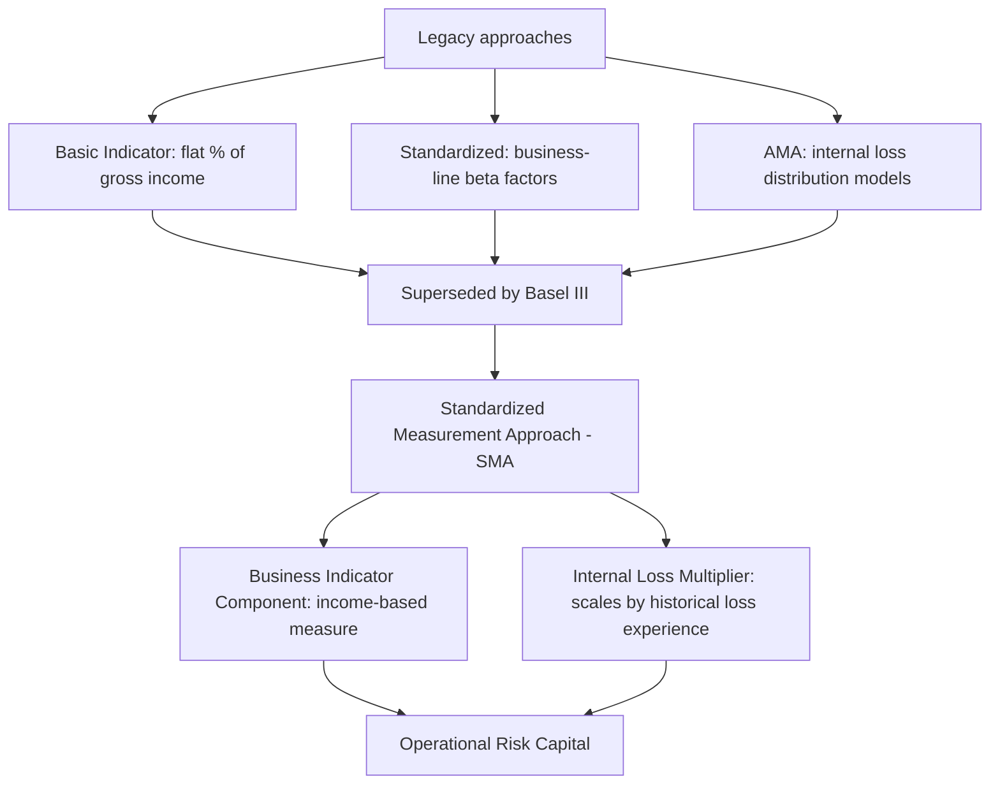

## Operational Risk

### Overview

Operational risk is the risk of loss resulting from inadequate or failed internal processes, people, and systems, or from external events. This definition, established by the Basel Committee, explicitly excludes strategic risk and reputational risk from regulatory operational risk capital purposes, while including legal risk. Unlike market and credit risk, operational risk losses are driven by failures in execution and control rather than deliberate risk-taking, making the risk harder to price, hedge, or diversify away.

### Taxonomy of Operational Risk

**Basel Event Type Categories**

The Basel Committee's standard classification divides operational risk losses into seven event types:

| Event Type | Description | Example |
| --- | --- | --- |
| Internal Fraud | Losses from acts intended to defraud, misappropriate property, or circumvent regulations involving at least one internal party | Rogue trading, unauthorized trading positions |
| External Fraud | Losses from acts by a third party intended to defraud or circumvent the law | Payment card fraud, cyberattack-driven theft |
| Employment Practices and Workplace Safety | Losses from acts inconsistent with employment, health, or safety laws | Discrimination claims, workplace injury claims |
| Clients, Products, and Business Practices | Losses from unintentional or negligent failure to meet professional obligations to clients | Mis-selling, fiduciary breaches, regulatory fines |
| Damage to Physical Assets | Losses from damage to physical assets from disaster or other events | Natural disaster, terrorism, fire |
| Business Disruption and System Failures | Losses from disruption of business or system failures | IT outages, telecom failures |
| Execution, Delivery, and Process Management | Losses from failed transaction processing or process management | Data entry errors, failed trade settlement, model errors |

**Key Points**

- These categories are used consistently across regulatory reporting, internal loss data collection, and industry loss consortia, enabling benchmarking across institutions.
- A single loss event can sometimes span multiple categories in practice (e.g., a cyberattack causing both external fraud and business disruption losses), requiring clear internal categorization rules to avoid double-counting or ambiguity.
- Operational risk is unique among major risk categories in that it is largely non-diversifiable in the traditional portfolio sense — pooling more operational activities does not necessarily reduce operational risk the way pooling independent credit exposures reduces credit risk, because many operational failures (systemic IT outages, widespread fraud schemes, pandemic disruption) affect many business lines simultaneously.

### Measuring Operational Risk

**Loss Data Collection**

Institutions maintain internal loss event databases recording the date, amount, business line, event type, and root cause of operational losses, supplemented by external loss data (from industry consortia or public loss databases) to capture tail events that may not yet have occurred internally but have occurred at peer institutions.

**Basic Indicator Approach (Legacy)**

Under earlier Basel II rules, operational risk capital could be calculated as a fixed percentage (15%) of average gross income over the prior three years — a simple but risk-insensitive approach that has since been superseded.

**Standardized Approach (Legacy)**

Applied different fixed percentages ("beta factors," ranging from 12% to 18%) to gross income by business line (e.g., retail banking, trading and sales, asset management), providing somewhat more granularity than the Basic Indicator Approach but still not directly incorporating an institution's actual loss experience.

**Advanced Measurement Approach (AMA) (Legacy)**

Permitted banks to use internal models combining internal loss data, external loss data, scenario analysis, and business environment/internal control factors to derive a statistically-based capital estimate, often using a Loss Distribution Approach (LDA) analogous to actuarial modeling:

$$\text{Aggregate Loss} = \sum_{i=1}^{N} L_i$$

where $N$ (frequency) and $L_i$ (individual loss severity) are modeled separately, often as a compound Poisson process with frequency following a Poisson or negative binomial distribution and severity following a heavy-tailed distribution (e.g., lognormal or generalized Pareto for extreme losses).

**Basel III Standardized Measurement Approach (SMA)**

The Basel Committee replaced the Basic Indicator, Standardized, and AMA approaches with a single **Standardized Measurement Approach (SMA)**, combining a **Business Indicator Component (BIC)** — a revised, more comprehensive income-based measure — with an **Internal Loss Multiplier (ILM)** that scales the capital requirement based on the institution's own historical average annual operational losses relative to its Business Indicator:

$$\text{ILM} = \ln\left(e - 1 + \frac{\text{Loss Component}}{\text{Business Indicator Component}}\right)$$

$$\text{Operational Risk Capital} = \text{BIC} \times \text{ILM}$$

[Inference] The SMA was designed to combine the simplicity and comparability of the earlier standardized approaches with some sensitivity to an institution's actual loss history, addressing concerns that AMA internal models had produced excessive variability in capital outcomes across institutions with similar risk profiles. [Unverified] Some national regulators have exercised discretion to set the Internal Loss Multiplier at 1 (effectively removing loss-history sensitivity) rather than the full formula-based value; current jurisdiction-specific SMA implementation should be verified against national regulatory publications.

### Scenario Analysis and Root Cause Analysis

**Scenario Analysis**

Because historical loss data is often sparse for severe, low-frequency operational risk events (e.g., a major cyberattack, a large-scale rogue trading incident), institutions supplement quantitative modeling with structured scenario workshops, where subject matter experts estimate the frequency and severity of plausible extreme events, informed by external industry loss experience and internal control assessments.

**Root Cause Analysis**

Effective operational risk management traces losses back to underlying causes — process design flaws, inadequate controls, insufficient staff training, or system limitations — rather than treating each loss event as isolated, enabling remediation that addresses the systemic driver rather than only the symptom.

**Key Risk Indicators (KRIs)**

Leading indicators monitored to provide early warning of elevated operational risk, such as staff turnover rates, system downtime frequency, number of failed trades, volume of customer complaints, or backlog in transaction processing — designed to flag deteriorating control environments before losses materialize.

### Specific Operational Risk Domains

**Cyber Risk**

Cyberattacks (data breaches, ransomware, distributed denial-of-service attacks) represent a rapidly growing operational risk category, with losses potentially including direct remediation costs, regulatory fines, business disruption, and reputational damage (even though reputational risk itself is excluded from regulatory operational risk capital, the underlying cyber event driving it is captured). [Inference] Given the increasing digitization of financial services and interconnection of financial market infrastructure, cyber risk has become a top supervisory priority at most major regulators, though specific loss magnitude trends and frequency statistics should be verified against current industry reports (e.g., from cyber insurance providers or regulatory cyber risk surveys) given how rapidly this threat landscape evolves.

**Rogue Trading and Internal Fraud**

Historical cases (e.g., Barings Bank 1995, Société Générale 2008, UBS 2011) illustrate how inadequate segregation of duties, weak trade confirmation controls, and insufficient independent risk oversight can allow a single individual to accumulate massive unauthorized positions before detection, underscoring the importance of independent middle-office and back-office functions separate from front-office trading.

**Model Risk**

The risk of loss from errors in the specification, estimation, or implementation of quantitative models used for pricing, risk measurement, or decision-making. Model risk has grown in prominence as institutions increasingly rely on complex models (including machine learning models) for credit decisioning, trading, and risk measurement, prompting dedicated model risk management frameworks (e.g., US Federal Reserve/OCC SR 11-7 guidance) requiring independent model validation, ongoing performance monitoring, and clear model risk governance.

**Third-Party and Outsourcing Risk**

Reliance on external vendors, cloud service providers, and outsourced processing introduces operational risk that the institution does not directly control but remains ultimately accountable for, motivating regulatory frameworks (e.g., EU Digital Operational Resilience Act, DORA) requiring due diligence, contractual risk allocation, and contingency planning for critical third-party dependencies.

**Business Continuity and Operational Resilience**

Beyond loss quantification, operational risk management increasingly emphasizes **operational resilience** — the ability to continue delivering critical business services through disruption, rather than solely measuring and capitalizing against past losses. This shift reflects supervisory recognition (particularly following widespread disruptions such as the COVID-19 pandemic) that some operational risks are better managed through resilience and continuity planning than through capital alone, since capital does not prevent a critical service outage from harming customers or market functioning in real time.

### Governance and the Three Lines of Defense

Operational risk management is typically organized around a **three lines of defense** model:

1. **First line**: business units that own and manage the risks inherent in their day-to-day operations, responsible for embedding controls directly into processes.
2. **Second line**: independent risk management and compliance functions that set policy, provide oversight, and challenge first-line risk-taking and control adequacy.
3. **Third line**: internal audit, providing independent assurance to senior management and the board that the first and second lines are functioning effectively.

**Key Points**

- This structure is designed to prevent the concentration of both risk-taking and risk oversight within the same reporting line, a governance failure implicated in several historical rogue trading and mis-selling scandals.
- Operational risk governance also typically involves a dedicated operational risk committee and regular reporting of KRIs, loss events, and scenario analysis results to senior management and the board.

**Conclusion**

Operational risk differs fundamentally from market and credit risk in that it arises from failures in process, people, and systems rather than from deliberately assumed market exposure, making it inherently harder to price, hedge, or diversify. The regulatory capital framework has evolved from simple income-based proxies toward the Standardized Measurement Approach, which attempts to blend comparability with institution-specific loss sensitivity, while the broader management discipline has expanded beyond capital quantification toward proactive scenario analysis, key risk indicator monitoring, and — increasingly — operational resilience planning that treats the continuity of critical services as a distinct objective from loss capitalization.

**Related Topics**

- Standardized Measurement Approach (SMA): detailed Business Indicator Component construction
- Loss Distribution Approach and compound Poisson severity/frequency modeling
- Cyber risk quantification and cyber insurance market structure
- Model risk management frameworks (SR 11-7) and independent validation practices
- Three lines of defense governance model in depth
- Operational resilience regulation: DORA and equivalent frameworks by jurisdiction
- Historical case studies: Barings, Société Générale, UBS rogue trading incidents
- Business continuity planning and disaster recovery for financial institutions