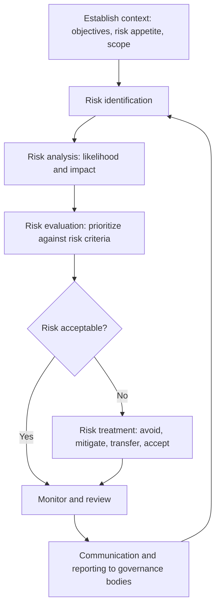

## Enterprise Risk Management Frameworks

### Overview

Enterprise Risk Management (ERM) is an integrated, firm-wide approach to identifying, assessing, managing, and monitoring all categories of risk — market, credit, operational, liquidity, strategic, and reputational — in a coordinated framework aligned with the organization's overall strategy and risk appetite, rather than managing each risk category in isolation within separate organizational silos.

### Rationale for an Integrated Framework

**Limitations of Siloed Risk Management**

Prior to widespread ERM adoption, financial institutions often managed market risk, credit risk, and operational risk through entirely separate teams, models, and reporting lines, with limited visibility into how risks interacted or aggregated at the firm level. This siloed approach can miss:

- **Risk correlations across categories**: a market shock can simultaneously trigger credit losses (counterparty defaults) and operational stress (surge in failed trades, liquidity strain), yet siloed frameworks may model each in isolation.
- **Aggregate risk exposure**: a firm might be within limits in each individual risk silo while facing an aggregate risk level that exceeds its true risk appetite or capital capacity.
- **Emerging and cross-cutting risks**: risks that do not map cleanly onto a single traditional category (e.g., climate risk, cyber risk, geopolitical risk) can fall through gaps between silos.

**Key Points**

- ERM does not replace specialized risk discipline (market risk, credit risk, and operational risk expertise remain essential) but adds an integrating layer that aggregates and contextualizes risk at the enterprise level.
- The 2007–2008 financial crisis significantly accelerated ERM adoption in financial services, as post-mortems widely identified fragmented risk visibility and inadequate aggregation of correlated exposures as contributing factors to underestimated firm-wide risk.
- ERM frameworks are used both by financial institutions and increasingly by non-financial corporations, though the specific risk categories and regulatory drivers differ substantially between sectors.

### Major ERM Framework Standards

**COSO ERM Framework**

The Committee of Sponsoring Organizations of the Treadway Commission (COSO) publishes one of the most widely referenced ERM frameworks, most recently updated in its 2017 edition ("Enterprise Risk Management — Integrating with Strategy and Performance"). The COSO framework organizes ERM around five interrelated components:

1. **Governance and Culture**: establishes the tone at the top, board risk oversight responsibilities, and the organizational risk culture.
2. **Strategy and Objective-Setting**: integrates risk consideration directly into strategic planning and objective-setting, rather than treating risk management as a downstream check on strategy already decided.
3. **Performance**: identifies and assesses risks that may affect achievement of strategy and business objectives, prioritizing them by severity and likelihood.
4. **Review and Revision**: assesses how well the ERM framework is functioning over time and adapts it to changes in the business and risk environment.
5. **Information, Communication, and Reporting**: ensures risk information flows appropriately across the organization to support decision-making at all levels.

[Inference] The 2017 COSO update's explicit emphasis on integrating risk with strategy (rather than treating ERM as a standalone compliance function) reflects a broader industry shift toward viewing risk management as a value-creating strategic discipline rather than solely a loss-prevention or regulatory-compliance exercise.

**ISO 31000**

The International Organization for Standardization's ISO 31000 provides principles and generic guidelines for risk management applicable across any organization type or sector (not sector-specific like COSO's financial/corporate governance orientation). ISO 31000 structures risk management around:

- **Principles**: risk management should be integrated, structured, customized, inclusive, dynamic, and based on the best available information.
- **Framework**: leadership and commitment, integration into organizational structure, design, implementation, evaluation, and continual improvement.
- **Process**: scope/context/criteria definition, risk assessment (identification, analysis, evaluation), risk treatment, monitoring and review, and communication/consultation throughout.

**Basel Committee Guidance (Financial Sector-Specific)**

For banks specifically, the Basel Committee's Pillar 2 (Supervisory Review Process) under Basel II/III requires an Internal Capital Adequacy Assessment Process (ICAAP), under which institutions must identify and assess all material risks (including those not fully captured under Pillar 1 minimum capital requirements, such as concentration risk, interest rate risk in the banking book, and reputational risk) and hold capital commensurate with their overall risk profile — effectively embedding ERM principles directly into prudential regulatory requirements for banks.

### Risk Appetite and Risk Tolerance

**Risk Appetite Statement**

A formal articulation, typically approved by the board, of the amount and type of risk an organization is willing to accept in pursuit of its strategic objectives. Risk appetite statements typically combine qualitative statements (e.g., "the firm will not engage in business activities that could materially damage its reputation with regulators") with quantitative metrics and limits (e.g., maximum VaR as a percentage of capital, maximum concentration to a single sector).

**Risk Tolerance and Limits Cascade**

Risk appetite at the board level is typically cascaded down into more granular risk tolerances and operational limits at business unit, desk, or portfolio level, ensuring that day-to-day risk-taking decisions remain consistent with firm-wide risk appetite:

$$\text{Board Risk Appetite} \rightarrow \text{Business Line Risk Tolerance} \rightarrow \text{Desk/Portfolio Limits} \rightarrow \text{Individual Position Limits}$$

**Key Points**

- Risk appetite frameworks link risk-taking directly to strategic decision-making, rather than treating risk limits as a purely defensive constraint imposed after strategy is set.
- Effective risk appetite frameworks require clear escalation processes for limit breaches, distinguishing between technical/temporary breaches and material breaches requiring senior management or board attention.
- A common ERM implementation challenge is ensuring genuine consistency between high-level qualitative risk appetite statements and the specific quantitative limits actually enforced day-to-day — a gap that has been identified as a recurring weakness in post-crisis supervisory reviews of risk governance.

### Risk Aggregation and Economic Capital

**Aggregating Risk Across Categories**

A core technical challenge of ERM is aggregating heterogeneous risk types (market risk measured over short horizons, credit risk over annual horizons, operational risk from loss distribution models) into a single firm-wide risk metric. Common approaches include:

- **Simple summation**: adds standalone risk measures across categories, implicitly assuming perfect correlation (comovement) between risk types — conservative but potentially significantly overstating true aggregate risk if risks are not perfectly correlated.
- **Variance-covariance aggregation**: incorporates an assumed correlation matrix between risk categories, similar in spirit to portfolio market risk aggregation, but with the added difficulty that cross-risk-category correlations are harder to estimate reliably than correlations within a single risk category.
- **Copula-based aggregation**: uses copula functions to model dependence structure between risk types more flexibly than a single correlation coefficient, particularly to capture tail dependence (the tendency for different risk types to become more correlated during extreme, systemic stress even if only weakly correlated in normal conditions).

**Economic Capital**

Economic capital represents an institution's own internal estimate of capital required to remain solvent at a target confidence level (often calibrated to a target credit rating, e.g., 99.9% confidence level consistent with an AA rating), aggregated across all material risk types, and used internally for risk-adjusted performance measurement, capital allocation, and strategic decision-making — distinct from, though ideally consistent with, regulatory capital requirements.

$$\text{RAROC} = \frac{\text{Risk-Adjusted Return}}{\text{Economic Capital}}$$

Risk-Adjusted Return on Capital (RAROC) and similar metrics allow comparison of risk-adjusted profitability across business lines with very different risk profiles, informing capital allocation decisions toward activities generating the best risk-adjusted returns.

### Governance Structure for ERM

**Chief Risk Officer (CRO) and Risk Committee**

Most large financial institutions designate a Chief Risk Officer with enterprise-wide risk oversight responsibility, typically reporting both to the CEO and with direct access to the board's risk committee, structurally independent from revenue-generating business lines to preserve objectivity in risk assessment and escalation.

**Board Risk Committee**

A dedicated board-level committee (distinct from the audit committee, though often working closely with it) provides oversight of the firm's overall risk profile, approves the risk appetite statement, and receives regular reporting on material risk exposures, limit breaches, and emerging risks.

**Integration with the Three Lines of Defense**

ERM governance typically operates through the same three-lines-of-defense structure used in operational risk management (first line: business unit risk ownership; second line: independent risk and compliance oversight including the CRO function; third line: internal audit assurance), extended to cover all risk categories rather than only operational risk.

### Emerging and Non-Traditional Risk Categories in Modern ERM

**Climate and Environmental Risk**

Increasingly incorporated into ERM frameworks through two distinct channels: **physical risk** (direct damage from climate events affecting collateral, operations, or counterparties) and **transition risk** (financial impact of the shift toward a lower-carbon economy, affecting asset values in carbon-intensive sectors). [Inference] Regulatory expectations for climate risk integration into ERM and stress testing have expanded substantially across major jurisdictions in recent years, though specific supervisory requirements and climate stress test methodologies continue to evolve and vary by jurisdiction, so current requirements should be verified against the relevant national regulator's latest publications.

**Geopolitical and Systemic Risk**

Risks arising from geopolitical events, sanctions regimes, and broader systemic/macro-financial linkages are increasingly treated as distinct risk categories requiring dedicated scenario analysis within ERM frameworks, reflecting growing recognition that such risks can transmit across market, credit, and operational risk simultaneously in ways traditional siloed frameworks may not adequately capture.

**Conclusion**

Enterprise Risk Management frameworks (COSO, ISO 31000, and the Basel Pillar 2/ICAAP process for banks specifically) address a structural weakness of siloed risk management: the failure to see how correlated risks aggregate at the firm level and align with genuine strategic risk appetite. By embedding risk appetite directly into strategic decision-making, establishing clear governance through a Chief Risk Officer and board risk committee, and developing methods to aggregate heterogeneous risk types into unified metrics like economic capital, ERM provides the integrating discipline that connects specialized risk management (market, credit, operational) to the organization's overall strategic and capital adequacy objectives — a connection that proved critically absent at several institutions during the 2007–2008 financial crisis.

**Related Topics**

- COSO 2017 framework: detailed component and principle breakdown
- ICAAP and ILAAP (Internal Liquidity Adequacy Assessment Process) for banks
- Copula-based risk aggregation methodology
- RAROC and risk-adjusted performance measurement in capital allocation
- Climate risk stress testing methodologies by jurisdiction
- Chief Risk Officer role evolution and reporting line independence
- Risk culture assessment and behavioral risk management
- Three lines of defense governance model in depth