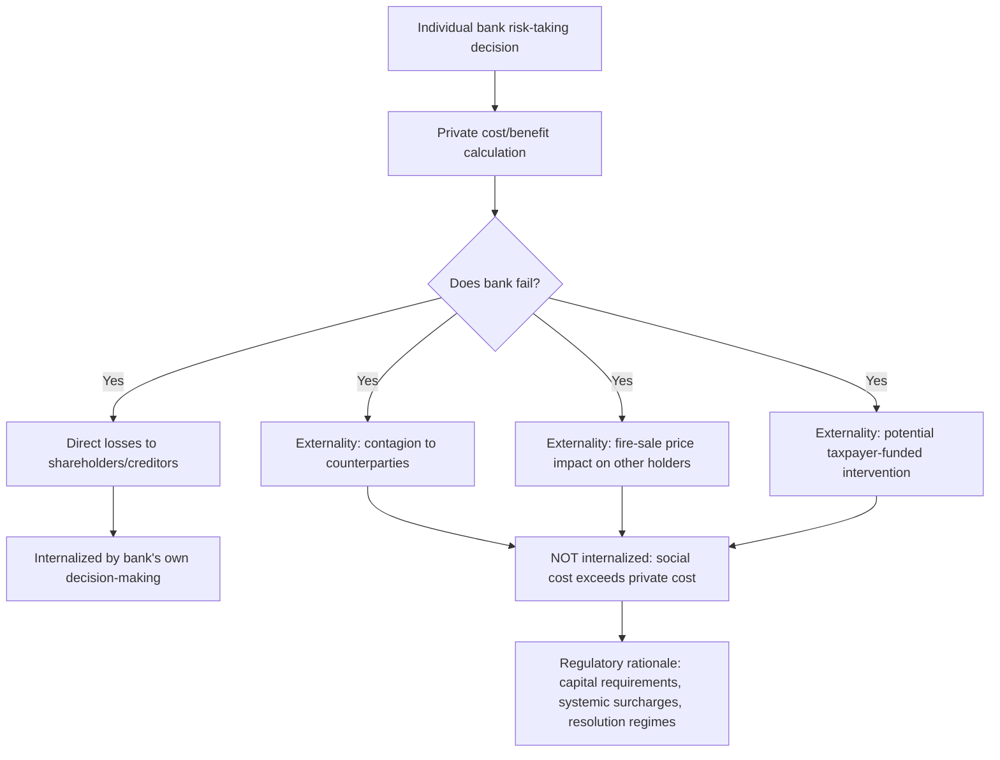

## Rationale for Financial Regulation

### Overview

Financial regulation refers to the body of rules, supervisory oversight, and institutional structures imposed on financial firms and markets by governments and regulatory bodies. Unlike regulation in many other sectors, financial regulation is motivated by a distinctive combination of market failures, systemic externalities, and information asymmetries that make purely private, unregulated financial markets prone to instability and welfare-reducing outcomes for third parties beyond the immediate transacting parties.

### Market Failure Justifications

**Asymmetric Information**

Financial contracts are inherently susceptible to information asymmetries between the parties, which regulation seeks to address through disclosure requirements, licensing, and conduct rules.

- **Adverse selection**: occurs before a transaction, when one party has private information about quality or risk that the other party cannot easily observe. In lending markets, this manifests as riskier borrowers being more likely to seek credit at a given interest rate (since safer borrowers self-select out as rates rise), potentially leading lenders to ration credit rather than raise rates indefinitely — a dynamic formalized in the classic Stiglitz-Weiss (1981) credit rationing model.
- **Moral hazard**: occurs after a transaction, when one party can take hidden actions that affect outcomes at the other party's expense. In banking, deposit insurance itself creates moral hazard by reducing depositors' incentive to monitor bank risk-taking, since their claims are protected regardless of the bank's actual risk profile — a rationale for pairing deposit insurance with capital requirements and supervisory oversight rather than deposit insurance alone.
- **Principal-agent problems**: arise throughout financial intermediation — between shareholders and bank managers, between fund managers and investors, between loan originators and the ultimate holders of securitized loans (the "originate-to-distribute" model, where originators who do not retain the credit risk of loans they make have reduced incentive to screen borrowers carefully).

**Key Points**

- Information asymmetry problems are not unique to finance, but their consequences are amplified by leverage, interconnection, and the sheer scale of financial claims relative to underlying real economic activity.
- Regulatory responses to information asymmetry include mandatory disclosure (securities law), licensing and fit-and-proper requirements (banking supervision), and mandatory retention requirements for securitizers (post-2008 "skin in the game" rules requiring originators to retain a portion of securitized credit risk).
- Even sophisticated institutional investors face information asymmetry relative to originators and issuers, meaning disclosure-based solutions alone are not always sufficient, particularly for complex structured products.

**Externalities and Systemic Risk**

Individual financial institutions' risk-taking and failure decisions impose costs on third parties beyond their own shareholders and creditors — a classic negative externality that private decision-makers do not fully internalize.

- **Contagion externalities**: a bank's failure can trigger losses at counterparty institutions through direct exposures, or trigger runs at unrelated but similarly-perceived institutions through information contagion, as discussed extensively in the context of bank runs and shadow banking.
- **Fire-sale externalities**: a distressed institution's asset liquidation depresses market prices, imposing mark-to-market losses on other institutions holding similar assets, regardless of any direct contractual relationship.
- **Too-big-to-fail and moral hazard from implicit guarantees**: systemically important institutions may take on excessive risk if they (and their creditors) believe government intervention will prevent their disorderly failure, since the downside of failure is partially externalized onto taxpayers or the broader financial system rather than fully borne by the institution's own stakeholders.

$$\text{Private Cost of Failure} < \text{Social Cost of Failure}$$

This wedge between private and social cost is the core economic rationale for regulation aimed specifically at systemically important institutions (higher capital surcharges, resolution planning requirements, enhanced supervision) beyond what would be justified by the institution's own risk profile in isolation.

**Public Good Characteristics of Financial Stability**

Financial system stability itself has public-good-like characteristics: a stable payment system, functioning credit markets, and confidence in financial institutions benefit the broader economy in ways that no single private actor has sufficient incentive to provide or maintain unilaterally, creating a rationale for regulation and supervision as a means of preserving this collective good.

### Consumer and Investor Protection Rationale

**Protecting Retail Participants**

Retail depositors, borrowers, and investors typically lack the sophistication, bargaining power, and information access of institutional counterparties, motivating specific consumer protection regulation:

- **Suitability and fiduciary standards**: requirements that financial advice or product recommendations be appropriate for, or in the best interest of, the retail client, addressing the information and expertise gap between advisor and client.
- **Disclosure requirements**: standardized, comparable disclosure of fees, risks, and terms (e.g., APR disclosure in consumer lending) to enable meaningful comparison shopping despite complex product terms.
- **Deposit insurance**: protects retail depositors who cannot realistically assess a bank's solvency themselves, while also serving the systemic function of preventing panic-based runs (as discussed in the context of bank runs).

**Key Points**

- Consumer protection rationale is conceptually distinct from systemic risk rationale, though the two overlap substantially in practice (e.g., deposit insurance serves both purposes simultaneously).
- Behavioral economics research has increasingly informed consumer financial protection regulation, recognizing that even well-informed consumers may make systematically suboptimal decisions due to cognitive biases, present bias, or product complexity designed to obscure true cost.
- [Inference] The relative emphasis regulators place on disclosure-based versus more paternalistic/restrictive consumer protection approaches (e.g., outright product bans or restrictions versus mandated disclosure alone) reflects differing views on the effectiveness of disclosure in overcoming behavioral biases, and this balance varies across jurisdictions and has shifted over time following experience with specific product failures.

### Market Integrity and Efficiency Rationale

**Preventing Market Manipulation and Fraud**

Regulation of securities markets addresses risks that would otherwise undermine confidence in price formation and capital allocation efficiency: insider trading rules, market manipulation prohibitions, and disclosure requirements for issuers all aim to preserve the informational efficiency that makes capital markets useful for allocating resources to their most productive uses.

**Preventing Excessive Concentration and Preserving Competition**

Antitrust and competition-oriented financial regulation addresses concerns that excessive concentration in banking or financial market infrastructure could reduce competitive pressure, harm consumers through reduced choice or higher prices, and potentially exacerbate too-big-to-fail dynamics by concentrating systemic importance in fewer institutions.

### The Regulatory Rationale in Historical Context

**Key Points**

- Financial regulation has historically evolved reactively, with major regulatory frameworks typically following major crises: the Glass-Steagall Act and the creation of the FDIC followed the Great Depression-era bank failures; the Sarbanes-Oxley Act followed the Enron/WorldCom accounting scandals; Dodd-Frank and Basel III followed the 2007–2008 global financial crisis.
- [Inference] This pattern of crisis-driven regulatory response reflects both the political economy difficulty of enacting preventive regulation absent a visible crisis to galvanize public and legislative support, and genuine learning about previously underappreciated risks and market failure mechanisms revealed by each crisis.
- A recurring tension in financial regulation is balancing stability and consumer/investor protection objectives against concerns that excessive regulation could reduce credit availability, financial innovation, or market liquidity — a genuine empirical and normative debate rather than a settled question, with reasonable disagreement among economists and policymakers about the optimal calibration in any given period.

### Regulatory Approaches Motivated by These Rationales

| Market Failure | Regulatory Response |
| --- | --- |
| Adverse selection / moral hazard in lending | Disclosure requirements, capital requirements, loan retention rules |
| Bank run externalities | Deposit insurance, lender of last resort, liquidity requirements |
| Too-big-to-fail moral hazard | Capital surcharges for systemically important institutions, resolution planning |
| Fire-sale/contagion externalities | Macroprudential capital buffers, central clearing mandates |
| Retail information asymmetry | Suitability standards, standardized disclosure, deposit insurance |
| Market manipulation/fraud | Securities law, insider trading prohibitions, market surveillance |
| Excessive concentration | Antitrust review, merger scrutiny in banking |

**Conclusion**

Financial regulation is not a single unified response to a single problem, but rather a layered set of interventions each addressing a distinct market failure or externality: information asymmetries that private contracting cannot fully resolve, systemic externalities where private risk-taking imposes costs on third parties and the broader economy, and information and power imbalances that leave retail participants vulnerable without protective rules. Understanding this plurality of rationales is essential to evaluating any specific regulation on its merits — a rule justified primarily by systemic risk concerns (e.g., bank capital requirements) serves a different economic function than one justified by consumer protection concerns (e.g., mortgage disclosure rules), even though both fall under the broad umbrella of "financial regulation."

**Related Topics**

- Stiglitz-Weiss credit rationing model in depth
- Too-big-to-fail: identification of systemically important institutions and surcharge calibration
- Macroprudential regulation and its distinction from microprudential regulation
- Behavioral economics applications in consumer financial protection
- Historical crisis-to-regulation case studies: Glass-Steagall, Sarbanes-Oxley, Dodd-Frank
- Regulatory capture and public choice theory in financial regulation
- Cost-benefit analysis frameworks for evaluating financial regulation
- Comparative international approaches to financial regulatory architecture