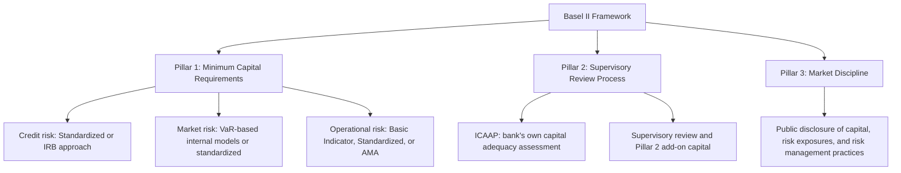

## Capital Adequacy and the Basel Framework

### Overview

Capital adequacy regulation requires banks to fund a minimum proportion of their risk-weighted assets with loss-absorbing capital, primarily equity, ensuring that unexpected losses can be absorbed without triggering insolvency or requiring taxpayer-funded rescue. The Basel framework, developed by the Basel Committee on Banking Supervision (BCBS) under the Bank for International Settlements, provides the internationally coordinated standard for these requirements, evolving through successive iterations — Basel I, Basel II, Basel III, and post-crisis reforms sometimes referred to as "Basel IV" — each addressing weaknesses revealed by experience and crises.

### Why Bank Capital Matters

**Capital as a Loss Absorber**

Bank capital represents the cushion between asset losses and depositor/creditor losses. A simplified balance sheet identity illustrates the mechanism:

$$\text{Assets} = \text{Liabilities} + \text{Equity}$$

If asset losses exceed equity, the bank becomes insolvent and liabilities (including deposits beyond insured limits) are impaired. Higher capital means a larger buffer of losses that can be absorbed before this occurs.

**Capital vs. Liquidity**

Capital addresses solvency risk (can the bank absorb losses and remain solvent?), which is conceptually distinct from liquidity risk (can the bank meet its cash obligations as they come due?), addressed separately through liquidity regulation (LCR, NSFR). A well-capitalized bank can still fail from a pure liquidity shortfall if funding evaporates faster than assets can be converted to cash, which is why Basel III introduced liquidity standards alongside — not instead of — capital requirements.

**Key Points**

- Capital requirements also address moral hazard: because equity holders bear the first losses, requiring more capital forces shareholders to internalize more of the downside risk of the bank's activities, partially counteracting risk-shifting incentives that arise when losses can be pushed onto depositors, creditors, or deposit insurance funds.
- Higher capital requirements generally reduce the probability of failure for a given level of asset risk, but also raise the cost of bank funding relative to debt, creating an ongoing policy debate about the optimal calibration of capital requirements.
- Capital requirements are typically expressed as ratios relative to risk-weighted assets (RWA) rather than total assets, reflecting the principle that riskier assets should require proportionally more capital support.

### Basel I: Risk-Weighted Capital Ratios (1988)

Basel I introduced the first internationally coordinated capital framework, establishing:

$$\text{Capital Ratio} = \frac{\text{Capital}}{\text{Risk-Weighted Assets}} \geq 8\%$$

Assets were assigned to broad risk-weight categories (e.g., 0% for OECD government debt, 20% for OECD bank claims, 50% for residential mortgages, 100% for corporate loans), a substantial simplification that did not differentiate risk within categories (e.g., all corporate loans received the same 100% risk weight regardless of the borrower's actual creditworthiness).

**Key Points**

- Basel I's coarse risk-weight categories created incentives for regulatory arbitrage: banks could reduce required capital by shifting toward assets with favorable risk weights relative to their true economic risk without materially reducing actual risk.
- This limitation was a primary motivation for the more risk-sensitive approach introduced under Basel II.

### Basel II: Three Pillars (2004)

Basel II restructured the framework around three mutually reinforcing pillars:

**Pillar 1: Minimum Capital Requirements**

Introduced more risk-sensitive approaches to credit risk (Standardized Approach using external ratings, or Internal Ratings-Based approach using bank-estimated PD/LGD/EAD), formalized market risk capital based on VaR models, and introduced a dedicated capital charge for operational risk for the first time.

**Pillar 2: Supervisory Review Process**

Requires banks to conduct an Internal Capital Adequacy Assessment Process (ICAAP), identifying and holding capital against material risks not fully captured under Pillar 1 (e.g., concentration risk, interest rate risk in the banking book), with supervisors empowered to require additional capital ("Pillar 2 add-ons") where they judge Pillar 1 alone insufficient for a specific institution's risk profile.

**Pillar 3: Market Discipline**

Mandates public disclosure of capital adequacy, risk exposures, and risk management practices, intended to allow market participants (investors, counterparties, analysts) to assess a bank's risk profile and impose market discipline through pricing and capital allocation decisions.

**Key Points**

- Basel II's reliance on internal models (IRB approach) and external credit ratings was subsequently criticized for allowing excessive variability in risk-weighted asset calculations across banks with genuinely similar risk profiles, and for over-reliance on rating agencies whose ratings on structured products proved unreliable during the 2007–2008 crisis.
- Basel II was still being phased in across jurisdictions when the 2007–2008 crisis began, and the crisis exposed capital and liquidity weaknesses that motivated the more comprehensive Basel III reforms.

### Basel III: Post-Crisis Reforms

Developed in response to the 2007–2008 financial crisis, Basel III substantially strengthened both the quantity and quality of required capital, and introduced entirely new liquidity and leverage standards.

**Higher Quality and Quantity of Capital**

Basel III tightened the definition of eligible capital, emphasizing **Common Equity Tier 1 (CET1)** — common shares and retained earnings, the highest-quality, most loss-absorbing form of capital — as the primary component of regulatory capital:

$$\text{CET1 Ratio} = \frac{\text{Common Equity Tier 1 Capital}}{\text{Risk-Weighted Assets}} \geq 4.5\%\text{ (minimum)}$$

$$\text{Tier 1 Capital Ratio} = \frac{\text{CET1} + \text{Additional Tier 1}}{\text{RWA}} \geq 6\%\text{ (minimum)}$$

$$\text{Total Capital Ratio} = \frac{\text{Tier 1} + \text{Tier 2}}{\text{RWA}} \geq 8\%\text{ (minimum)}$$

**Capital Buffers**

Basel III introduced additional buffers layered on top of minimum requirements:

- **Capital Conservation Buffer**: an additional 2.5% of CET1 above the minimum, which banks must maintain to avoid restrictions on dividends, share buybacks, and discretionary bonus payments — designed to encourage banks to build capital during good times that can be drawn down during stress without breaching the absolute regulatory minimum.
- **Countercyclical Capital Buffer**: an additional buffer (0–2.5% of CET1, set at national discretion) that regulators can activate during periods of excessive credit growth, requiring banks to build additional capital during booms that can subsequently be released during downturns, explicitly addressing the procyclicality concerns associated with risk-sensitive capital requirements.
- **Systemically Important Bank (G-SIB/D-SIB) Surcharges**: additional capital requirements (typically 1–3.5% of CET1, depending on systemic importance scoring) for globally or domestically systemically important banks, directly addressing the too-big-to-fail externality by requiring institutions whose failure would impose the greatest systemic cost to hold proportionally more loss-absorbing capital.

**Leverage Ratio**

A non-risk-weighted backstop measure, calculated as Tier 1 capital divided by total exposure (on- and off-balance-sheet), without risk weighting:

$$\text{Leverage Ratio} = \frac{\text{Tier 1 Capital}}{\text{Total Exposure (unweighted)}} \geq 3\%\text{ (minimum, with higher requirements for G-SIBs)}$$

The leverage ratio serves as a simple, model-independent backstop against the possibility that risk-weighted measures could be gamed or systematically understate true risk, directly addressing a lesson from the crisis where some institutions had appeared well-capitalized on a risk-weighted basis while carrying very high leverage on an unweighted basis.

**Liquidity Standards**

Basel III introduced the Liquidity Coverage Ratio (LCR) and Net Stable Funding Ratio (NSFR), covered in detail under payment systems and liquidity risk topics, addressing the liquidity mismatch risks that capital requirements alone do not directly target.

### "Basel IV" / Basel III Finalization (Basel 3.1)

The final elements of the Basel III reform package (often informally termed "Basel IV," though the Basel Committee itself refers to it as the finalization of Basel III) introduced further changes to constrain variability in risk-weighted asset calculations:

**The Output Floor**

Requires that a bank's risk-weighted assets calculated using internal models (IRB for credit risk, internal models for market risk) not fall below a specified percentage (phased in toward 72.5%) of what the standardized approaches would produce for the same exposures, directly limiting how far internal models can diverge from standardized benchmarks regardless of a bank's own risk estimates.

$$\text{RWA}_{\text{floor}} = 72.5\% \times \text{RWA}_{\text{Standardized}}$$

$$\text{Final RWA} = \max(\text{RWA}_{\text{Internal Models}}, \text{RWA}_{\text{floor}})$$

**Revised Standardized Approaches**

Introduced more granular, risk-sensitive standardized approaches for credit risk, CVA risk, and operational risk (the SMA, discussed under operational risk), reducing the gap in risk sensitivity between standardized and internal-models approaches and thereby reducing the relative advantage of seeking internal model approval purely to minimize capital.

**Constraints on Internal Models for Market Risk**

FRTB (covered under market risk measurement) replaced VaR with Expected Shortfall and introduced desk-level model approval, directly linked to this broader post-crisis theme of constraining internal model flexibility.

[Unverified] Basel III finalization implementation timelines have varied and been delayed across major jurisdictions (including differing approaches in the EU's CRR3, the UK's Basel 3.1 implementation, and the US Basel III Endgame proposal), with some jurisdictions applying different calibrations or timelines than the Basel Committee's original international standard; current implementation status in any specific jurisdiction should be verified against that jurisdiction's latest regulatory publications.

### Key Points and Ongoing Debates

**Key Points**

- Capital requirements have risen substantially since Basel I, both in minimum ratios and, more significantly, in the quality of capital required (heavier emphasis on CET1) and the addition of buffers layered on top of bare minimums.
- The output floor represents a deliberate policy choice to sacrifice some risk sensitivity (allowing internal models to diverge less from standardized benchmarks) in exchange for greater comparability and reduced scope for capital-reducing model optimization across banks.
- [Inference] There remains genuine, ongoing debate among academics, industry participants, and even regulators themselves about the optimal level of bank capital — some research argues for substantially higher capital requirements than even post-Basel III levels on the grounds that the social cost of bank capital is lower than commonly assumed (Modigliani-Miller-style arguments applied to bank capital structure), while industry stakeholders often argue that current or proposed requirements already impose material costs on credit availability and economic growth; this is a substantive area of ongoing empirical and normative disagreement rather than a settled technical question.

**Conclusion**

The Basel capital framework has evolved from a coarse, uniform risk-weighting system under Basel I toward a considerably more complex, multi-layered architecture combining risk-sensitive minimum requirements, capital quality standards, countercyclical and systemic-risk-targeted buffers, a non-risk-weighted leverage ratio backstop, and — since the post-crisis finalization — an output floor constraining internal model divergence from standardized benchmarks. Each major evolution has been substantially shaped by lessons from the preceding crisis: Basel II's risk-sensitivity responded to Basel I's crude categories, while Basel III's buffers, leverage ratio, liquidity standards, and output floor directly responded to specific vulnerabilities — insufficient capital quality, excessive unweighted leverage, liquidity mismatches, and excessive internal model variability — revealed by the 2007–2008 crisis.

**Related Topics**

- Countercyclical capital buffer activation and macroprudential policy coordination
- G-SIB/D-SIB systemic importance scoring methodology
- Output floor calibration debates and Basel III Endgame (US implementation)
- Modigliani-Miller theorem applied to bank capital structure debates
- Liquidity Coverage Ratio and Net Stable Funding Ratio in depth
- FRTB and the shift from VaR to Expected Shortfall for market risk capital
- ICAAP and Pillar 2 supervisory review process in depth
- Comparative jurisdictional Basel implementation: EU CRR3, UK Basel 3.1, US Endgame