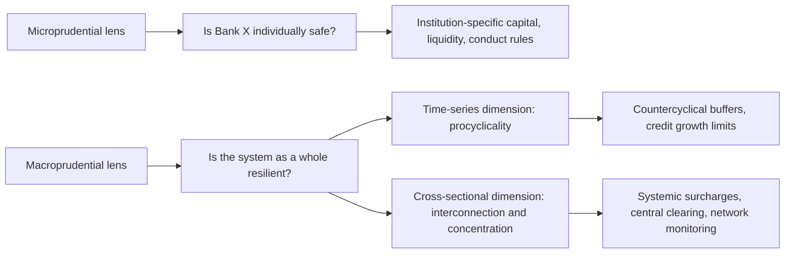

## Macroprudential Regulation

### Overview

Macroprudential regulation is the branch of financial regulation focused on mitigating systemic risk — risk to the financial system as a whole — as distinct from microprudential regulation, which focuses on the safety and soundness of individual institutions. The distinction rests on a fallacy-of-composition insight: a financial system in which every individual institution is safe when considered in isolation can nonetheless be systemically fragile, because individually rational risk management decisions can generate correlated, procyclical, and interconnected exposures that amplify shocks at the system level.

### Microprudential vs. Macroprudential: The Core Distinction

**Key Points**

- **Microprudential regulation** asks: "Is this individual institution safe and sound, holding the rest of the system's condition roughly fixed?" Its tools include institution-specific capital and liquidity requirements, supervisory examination, and conduct regulation.
- **Macroprudential regulation** asks: "Is the system as a whole resilient, accounting for how institutions' actions interact, correlate, and amplify each other?" It treats systemic risk as an externality that individual institutions do not fully internalize in their own risk-taking decisions.
- The same underlying tool (e.g., a capital requirement) can be deployed with either a microprudential or macroprudential objective — the distinguishing feature is whether it is calibrated to an individual institution's own risk profile or to that institution's contribution to system-wide risk and procyclicality.

### The Two Core Dimensions of Systemic Risk

**Time-Series Dimension: Procyclicality**

Financial systems tend to amplify economic cycles: during expansions, rising asset prices and easy credit conditions encourage further leverage and risk-taking, while during downturns, falling asset values and tightening credit conditions force deleveraging that further depresses asset prices and economic activity — a self-reinforcing cycle sometimes described through the **financial accelerator** mechanism.

$$\text{Credit Growth} \uparrow \Rightarrow \text{Asset Prices} \uparrow \Rightarrow \text{Collateral Values} \uparrow \Rightarrow \text{Further Credit Extension} \uparrow$$

Risk-sensitive regulatory measures (e.g., VaR-based capital requirements that fall during calm, low-volatility periods and rise sharply during stressed periods) can themselves be procyclical, if capital requirements decline precisely when systemic risk-taking is building up and rise precisely when the system can least afford additional deleveraging pressure.

**Cross-Sectional Dimension: Interconnection and Common Exposures**

At any point in time, systemic risk also depends on how exposures are distributed and interconnected across institutions:

- **Direct interconnection**: interbank lending, derivatives counterparty exposures, and payment system linkages that transmit distress from one institution to another.
- **Common/correlated exposures**: institutions holding similar assets (e.g., subprime mortgage-backed securities prior to 2008) may appear individually diversified while collectively representing a concentrated systemic exposure to the same underlying risk factor.
- **Systemically important institutions**: some institutions are sufficiently large, interconnected, or difficult to substitute that their failure would impose disproportionate costs on the broader system relative to a similarly-sized but less central institution.

### Macroprudential Policy Tools

**Countercyclical Capital Buffer (CCyB)**

Requires banks to build additional capital (0–2.5% of CET1, or higher in some jurisdictions) during periods of excessive aggregate credit growth, which can subsequently be released during downturns to support continued lending without breaching minimum capital requirements — directly targeting the time-series/procyclicality dimension of systemic risk.

$$\text{Credit-to-GDP Gap} = \text{Credit-to-GDP Ratio} - \text{Long-Run Trend}$$

A large positive credit-to-GDP gap (actual credit growth substantially exceeding its long-run trend) is a commonly referenced indicator, associated with the Basel Committee's guidance, for triggering CCyB activation, though [Inference] individual national authorities typically exercise judgment rather than applying this indicator mechanically, since credit-to-GDP gap measures have known limitations (e.g., sensitivity to the trend estimation methodology and structural breaks in credit-to-GDP relationships across countries).

**Systemically Important Financial Institution (SIFI) Surcharges**

Additional capital requirements for globally systemically important banks (G-SIBs) and domestically systemically important banks (D-SIBs), calibrated based on a systemic importance score incorporating size, interconnectedness, complexity, cross-jurisdictional activity, and substitutability — directly targeting the cross-sectional dimension by requiring the most systemically consequential institutions to hold proportionally more loss-absorbing capital.

**Loan-to-Value (LTV) and Debt-to-Income (DTI) Limits**

Borrower-based macroprudential tools that directly constrain household leverage in mortgage and consumer lending markets, aiming to limit the buildup of household sector leverage during credit booms without relying solely on lender-side capital requirements:

$$\text{LTV} = \frac{\text{Loan Amount}}{\text{Property Value}}$$

$$\text{DTI} = \frac{\text{Total Debt Service}}{\text{Household Income}}$$

[Inference] Borrower-based tools like LTV and DTI limits are generally understood to act more directly and immediately on the specific sector experiencing excessive credit growth (typically real estate) than broad-based bank capital tools, though their effectiveness can be reduced if credit migrates to less-regulated non-bank lenders not subject to the same limits (a form of regulatory leakage).

**Sectoral Capital Requirements and Risk Weight Add-Ons**

Regulators can impose higher capital requirements or risk weights specifically on exposures to sectors exhibiting signs of excessive credit growth or asset price appreciation (e.g., commercial real estate, residential mortgages in overheated markets), allowing more targeted intervention than broad-based, economy-wide capital buffers.

**Central Clearing Mandates**

Requiring standardized derivatives to be cleared through central counterparties (CCPs) rather than settled bilaterally directly addresses the cross-sectional/interconnection dimension, replacing a complex bilateral web of counterparty exposures with a simpler hub-and-spoke structure and multilateral netting, as discussed under payment systems and clearing.

**Liquidity-Based Macroprudential Tools**

Time-varying liquidity requirements, limits on wholesale funding reliance, or margin/haircut requirements on secured financing transactions (repo) can be calibrated countercyclically, addressing concerns that fire-sale and deleveraging dynamics (discussed under shadow banking) are most severe when liquidity buffers have been allowed to erode during calm periods.

### Systemic Risk Monitoring and Identification

**Macroprudential Authorities**

Following the 2007–2008 crisis, many jurisdictions established or strengthened dedicated macroprudential authorities or committees tasked with systemic risk monitoring and macroprudential tool activation, such as the Financial Stability Oversight Council (FSOC) in the United States, the Financial Policy Committee (FPC) at the Bank of England, and the European Systemic Risk Board (ESRB) at the EU level.

**Systemic Risk Indicators**

Macroprudential authorities monitor a range of indicators to assess building systemic risk, including credit-to-GDP gaps, asset price growth relative to fundamentals, leverage ratios across the financial sector, wholesale funding reliance, and measures of interconnectedness derived from network analysis of interbank and derivatives exposures.

**Stress Testing as a Macroprudential Tool**

System-wide stress tests (e.g., CCAR/DFAST in the US, EBA stress tests in the EU) serve a macroprudential function distinct from institution-specific risk management: by applying a common adverse scenario across many institutions simultaneously, supervisors can assess not only individual institution resilience but also system-wide vulnerabilities and correlated exposures that might not be apparent from any single institution's stress test results in isolation.

**Key Points**

- Macroprudential authorities generally face the challenge that systemic risk indicators are imperfect and subject to real-time measurement uncertainty, making the timing of policy activation (e.g., when exactly to raise the countercyclical capital buffer) a matter of judgment rather than a mechanical rule, even where quantitative indicators inform the decision.
- A recurring implementation challenge is "leakage" — credit or risk-taking activity migrating to less-regulated parts of the financial system (e.g., shadow banking) in response to macroprudential tightening on regulated banks, potentially undermining the intended system-wide risk reduction if the migrated activity retains similar systemic risk characteristics.
- Effective macroprudential policy generally requires coordination across multiple regulatory agencies (banking supervisors, securities regulators, insurance regulators, central banks), since systemic risk does not respect the traditional institutional boundaries around which regulatory agencies are often organized.

### Interaction with Monetary Policy

Macroprudential policy and monetary policy interact, since both can influence credit growth and asset prices, though through different channels (macroprudential tools act more directly and selectively on specific exposures or sectors, while monetary policy acts broadly through interest rates and financial conditions across the entire economy). [Inference] There is ongoing academic and policy debate about the appropriate division of labor between monetary policy and macroprudential policy in managing financial stability risks — some argue monetary policy should "lean against the wind" of financial imbalances even at some cost to near-term inflation/output objectives, while others argue macroprudential tools should bear primary responsibility for financial stability, leaving monetary policy focused on its traditional price stability and employment mandates; this remains an actively debated area rather than a settled consensus.

**Conclusion**

Macroprudential regulation addresses a distinct failure mode from microprudential regulation: the possibility that a financial system composed of individually sound institutions can nonetheless be collectively fragile due to procyclical risk-taking and correlated, interconnected exposures that no single institution's risk management fully internalizes. By deploying tools calibrated to the system level — countercyclical buffers, systemic surcharges, borrower-based limits, central clearing mandates, and system-wide stress testing — rather than solely to individual institutions, macroprudential policy attempts to close the gap between individually rational risk-taking and collectively sustainable financial system resilience, a gap that the 2007–2008 crisis demonstrated could otherwise remain invisible until a systemic shock exposed it.

**Related Topics**

- Financial accelerator and credit cycle amplification mechanisms
- Credit-to-GDP gap methodology and countercyclical buffer activation triggers
- G-SIB/D-SIB systemic importance scoring in depth
- Borrower-based macroprudential tools: LTV/DTI limits cross-country comparison
- Macroprudential authority design: FSOC, FPC, ESRB comparative structures
- System-wide stress testing methodology (CCAR/DFAST, EBA)
- Regulatory leakage and shadow banking migration in response to macroprudential tightening
- Monetary policy and financial stability: the "leaning against the wind" debate