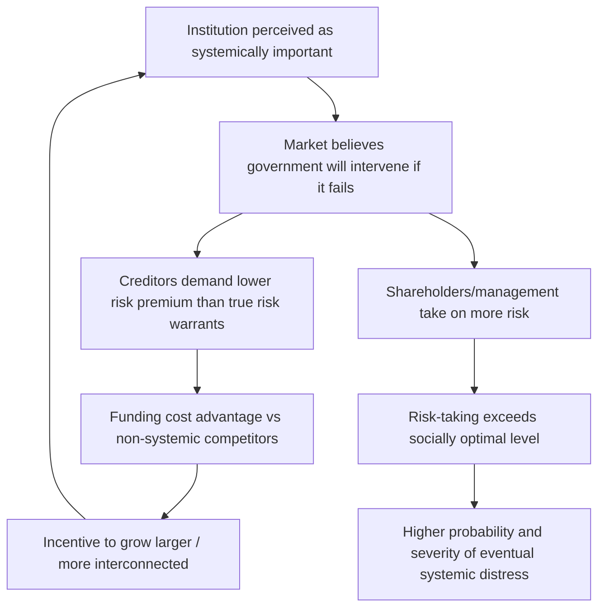

## Too-Big-to-Fail and Moral Hazard

### Overview

"Too big to fail" (TBTF) describes the condition in which a financial institution is so large, interconnected, or systemically important that its disorderly failure is perceived to threaten the stability of the broader financial system, creating strong pressure for government intervention to prevent that failure or manage it in an orderly way. This perception — whether or not intervention actually occurs in any given case — generates moral hazard: institutions and their creditors may take on more risk than they would if they bore the full consequences of failure themselves.

### The Moral Hazard Mechanism

**How Implicit Guarantees Distort Incentives**

If market participants believe a systemically important institution will be rescued rather than allowed to fail disorderly, this belief functions as an implicit subsidy, even absent any explicit government guarantee:

- **Creditors and uninsured depositors** may charge a lower risk premium than the institution's true underlying risk would otherwise warrant, since they expect to be made whole (or largely so) in a rescue scenario rather than bearing losses in an ordinary bankruptcy.
- **Shareholders and management** may pursue higher-risk, higher-return strategies, since the downside tail risk of failure is partially borne by the implicit government backstop rather than fully internalized by the institution's own capital structure.
- **Competitive distortion**: TBTF institutions may enjoy a funding cost advantage over smaller, non-systemic competitors precisely because of this implicit subsidy, potentially encouraging further growth and concentration specifically to obtain or preserve systemic-importance status — a self-reinforcing dynamic sometimes described as an incentive to become "too big to fail" rather than merely happening to become so.

$$\text{Funding Cost}_{\text{TBTF}} < \text{Funding Cost}_{\text{Non-TBTF}} \text{ for equivalent underlying risk}$$

[Inference] Empirical estimates of the magnitude of this implicit TBTF funding subsidy vary considerably across studies, time periods, and methodologies, and the subsidy is inherently difficult to measure precisely since it depends on counterfactual creditor beliefs about intervention probability rather than a directly observable price; specific quantitative estimates should be treated with appropriate caution and checked against current academic and official-sector research.

**Key Points**

- Moral hazard from implicit TBTF guarantees is conceptually distinct from, but related to, the moral hazard created by explicit deposit insurance — both reduce market discipline by insulating some class of claimants from the full consequences of institutional risk-taking.
- The TBTF problem is a specific instance of the broader externality rationale for financial regulation: an institution's private cost of failure is lower than the social cost, creating a wedge that distorts risk-taking incentives at the margin.
- TBTF concerns apply not only to individual large banks but potentially to systemically important non-bank financial institutions, financial market infrastructure (major clearinghouses), and — in principle — to interconnected clusters of smaller institutions whose collective failure could be systemically significant even if no single institution is individually "too big."

### Historical Context: 2007–2008 and the TBTF Problem Crystallized

**Key Points**

- The 2007–2008 financial crisis brought the TBTF problem into sharp public and policy focus, as governments in multiple jurisdictions extended emergency support (capital injections, guarantees, extraordinary liquidity facilities) to large financial institutions on the grounds that their disorderly failure would pose unacceptable systemic risk.
- The contrast between the Lehman Brothers bankruptcy (allowed to fail, triggering severe market disruption) and the subsequent, more extensive support extended to other large institutions is frequently cited as illustrating both the perceived necessity of intervention once a crisis is underway and the practical difficulty of credibly committing in advance not to intervene.
- [Inference] Post-crisis policy consensus broadly identified the absence of credible, orderly resolution mechanisms for large, complex, cross-border financial institutions as a key reason why disorderly bankruptcy (the Lehman precedent) was viewed as unacceptably disruptive, motivating the subsequent development of resolution regimes specifically designed to make future large-institution failures more orderly without requiring bailouts.

### Time Inconsistency and the Credibility Problem

**The Core Difficulty**

A government or regulator may wish to credibly commit, ex ante, to never rescuing any institution regardless of size — this would eliminate the moral hazard problem by ensuring institutions and creditors fully internalize failure risk. However, once a large, interconnected institution is actually on the verge of failure, allowing disorderly failure may appear, ex post, to impose unacceptably high systemic costs relative to the cost of intervention, creating a classic **time-inconsistency problem**: the ex-ante optimal policy (credible no-bailout commitment) is not the ex-post optimal policy once a crisis is actually unfolding, and rational market participants anticipate this, undermining the credibility of any no-bailout commitment made in advance.

$$\text{Ex-ante optimal policy} \neq \text{Ex-post optimal policy} \Rightarrow \text{Credibility problem}$$

This dynamic is analogous to time-inconsistency problems studied elsewhere in economics (e.g., in monetary policy credibility), and explains why simply announcing that bailouts will not occur is generally viewed as insufficient on its own — market participants rationally discount such announcements absent structural changes that make non-intervention genuinely credible or that reduce the systemic cost of failure enough that intervention would no longer be necessary even ex post.

### Policy Responses to the TBTF Problem

**Higher Capital Requirements for Systemically Important Institutions**

G-SIB and D-SIB capital surcharges (covered under capital adequacy) directly increase the loss-absorbing buffer specifically for the institutions whose failure would impose the greatest systemic cost, aiming to reduce both the probability of failure and the amount of loss that might otherwise need to be absorbed by creditors or the public sector.

**Total Loss-Absorbing Capacity (TLAC) and Bail-in Debt**

Post-crisis reforms require globally systemically important banks to maintain a minimum amount of Total Loss-Absorbing Capacity — a combination of regulatory capital and specific classes of long-term unsecured debt structured to be contractually or statutorily convertible into equity or written down ("bailed in") in a resolution scenario, ensuring that private creditors (rather than taxpayers) absorb losses beyond what capital alone can cover:

$$\text{TLAC} = \text{Regulatory Capital} + \text{Eligible Bail-in-able Debt} \geq \text{Minimum Requirement (as \% of RWA and leverage exposure)}$$

**Key Points**

- TLAC and bail-in mechanisms are designed to make "bail-in" (imposing losses on private creditors through resolution) a credible and operationally feasible alternative to "bail-out" (using public funds), directly addressing the time-inconsistency credibility problem by making non-intervention less costly and more orderly.
- For bail-in to function as intended, the affected debt must be clearly identified, priced by the market with the bail-in risk incorporated, and structured so that its conversion or write-down does not itself trigger the kind of contagion or panic that intervention was meant to avoid.

**Resolution Planning ("Living Wills")**

Systemically important institutions are required to prepare and regularly update resolution plans ("living wills") demonstrating how they could be wound down in an orderly manner under the relevant legal resolution regime (e.g., Title II of the Dodd-Frank Act in the US, the Bank Recovery and Resolution Directive in the EU) without requiring extraordinary public support and without causing serious systemic disruption, including plans for maintaining critical operations and continuity of access to payment systems and financial market infrastructure during resolution.

**Resolution Authority and Special Resolution Regimes**

Dedicated legal resolution frameworks give authorities powers beyond ordinary corporate bankruptcy law specifically tailored to financial institutions — including the ability to transfer assets and liabilities to a bridge institution, impose temporary stays on the termination of financial contracts (preventing a disorderly rush of counterparties to close out derivatives positions simultaneously), and impose losses on creditors through bail-in — all aimed at achieving a more orderly outcome than either disorderly bankruptcy or a taxpayer-funded bailout.

**Structural Measures**

Some jurisdictions pursued structural reforms intended to reduce the systemic footprint or complexity of large institutions directly:

- **Ring-fencing** (e.g., UK): requiring separation of retail banking activities from investment banking/trading activities within the same banking group, intended to insulate core retail banking functions from losses arising in more volatile trading activities.
- **Volcker Rule** (US): restricts proprietary trading by banking entities, intended to reduce risk-taking in activities not directly related to core banking services to customers.
- **Size and activity restrictions**: some proposals (not universally adopted) have called for outright limits on institution size or scope of permissible activities as a more direct structural response to TBTF concerns, though [Inference] such structural approaches remain more contested and less universally adopted internationally than capital surcharges, TLAC, and resolution planning, reflecting genuine disagreement about whether structural separation meaningfully reduces systemic risk or primarily imposes efficiency costs without proportionate risk reduction benefits.

### Has the TBTF Problem Been Solved?

**Key Points**

- [Inference] There is no clear consensus among economists, regulators, or market participants about whether post-2008 reforms (higher capital, TLAC, resolution planning) have fully resolved the TBTF problem or meaningfully reduced the implicit subsidy, as opposed to having reduced it partially while leaving a residual perception of too-big-to-fail status for the largest, most complex institutions.
- Some evidence and argument suggests the TBTF funding cost advantage has narrowed since the crisis as capital and resolution reforms have been implemented and tested; other perspectives emphasize that market participants may still doubt whether bail-in mechanisms would actually be applied smoothly during a genuine systemic crisis, particularly for the largest and most internationally complex institutions, given that untested legal and operational mechanisms carry inherent implementation risk that is difficult to assess prior to an actual crisis event.
- Events such as the March 2023 regional banking stress in the United States (though generally involving institutions smaller than the largest G-SIBs) renewed public and policy debate about the boundaries of implicit government support and deposit guarantee scope, illustrating that TBTF-adjacent questions remain actively contested rather than definitively settled by post-2008 reforms alone.

**Conclusion**

Too-big-to-fail describes a structural moral hazard problem rooted in the same private-cost-versus-social-cost externality that motivates much of financial regulation generally: institutions whose failure would impose severe systemic costs may not fully internalize that cost in their own risk-taking decisions if they and their creditors believe government intervention will prevent disorderly failure. The core policy challenge is a genuine time-inconsistency problem — a credible ex-ante commitment not to intervene is difficult to sustain once a systemic crisis is actually underway — which post-2008 reforms have attempted to address not by simply declaring bailouts will not occur, but by structurally reducing the cost of allowing failure through higher capital buffers, bail-in-able debt (TLAC), and credible resolution planning, so that non-intervention becomes a genuinely viable ex-post option rather than merely an ex-ante aspiration.

**Related Topics**

- Total Loss-Absorbing Capacity (TLAC) calibration and bail-in debt market structure
- Resolution planning and living wills: content requirements and supervisory assessment
- Bank Recovery and Resolution Directive (EU) and Dodd-Frank Title II (US) compared
- Ring-fencing and structural separation: UK, US Volcker Rule, EU proposals compared
- Time inconsistency in monetary and macroprudential policy
- G-SIB/D-SIB systemic importance scoring methodology
- Empirical estimation of the TBTF funding subsidy
- March 2023 US regional banking stress and deposit insurance scope debates