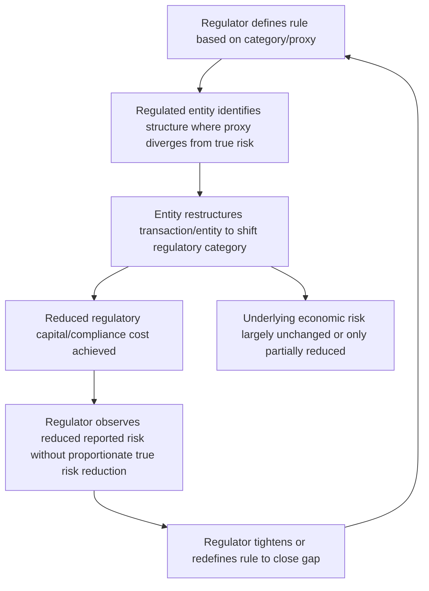

## Regulatory Arbitrage

### Overview

Regulatory arbitrage is the practice of structuring financial activity, transactions, or entities specifically to reduce regulatory burden — capital requirements, taxes, disclosure obligations, or supervisory scrutiny — without a proportionate reduction in the underlying economic risk being regulated. It exploits gaps, inconsistencies, or imprecision between a regulation's stated economic objective and its literal, operational definition, allowing regulated entities to achieve favorable regulatory treatment while retaining risk exposure economically similar to what the regulation was designed to constrain.

### The Core Mechanism

**Divergence Between Economic Substance and Regulatory Form**

Regulatory arbitrage arises whenever a rule is defined by a proxy or category (e.g., "loans to corporations get X risk weight," "assets held on-balance-sheet require capital, off-balance-sheet exposures may not") rather than by the underlying economic risk directly. Wherever such a proxy imperfectly captures the risk it is meant to represent, an incentive exists to restructure activity to fall on the favorable side of the proxy line while preserving the underlying economic exposure.

$$\text{Regulatory Capital Required} = f(\text{Regulatory Category}) \neq g(\text{True Economic Risk})$$

When $f(\cdot)$ and $g(\cdot)$ diverge for a particular structuring choice, an arbitrage opportunity exists: capital or compliance cost can be reduced by choosing the structure that minimizes $f(\cdot)$, largely independent of its effect on $g(\cdot)$.

**Key Points**

- Regulatory arbitrage is not necessarily illegal or fraudulent — much of it operates entirely within the letter of applicable rules, exploiting genuine ambiguity or coarseness in how those rules are drafted.
- The phenomenon is a natural consequence of any rules-based regulatory system: any bright-line rule, however carefully drafted, will create some divergence between the categories it defines and the underlying economic substance it aims to capture, since no finite rule set can perfectly anticipate every possible structuring innovation.
- Regulatory arbitrage differs from tax avoidance and tax evasion primarily in its target (prudential/systemic risk regulation rather than tax liability), though the underlying economic logic — exploiting gaps between legal form and economic substance — is closely analogous.

### Historical Examples

**Basel I Risk-Weight Arbitrage**

Basel I's coarse risk-weight categories (discussed under capital adequacy) created clear arbitrage incentives: since all corporate loans received the same 100% risk weight regardless of the borrower's actual credit quality, banks had an incentive to retain their highest-quality corporate loans (which were "overcharged" capital relative to their true risk) or securitize and sell them off, while any residual, lower-quality exposure that could be structured to fall into a lower risk-weight category (e.g., through credit enhancement structuring) would be retained at a capital cost below its true economic risk.

**Off-Balance-Sheet Vehicles (Pre-2008)**

Structured Investment Vehicles (SIVs) and Asset-Backed Commercial Paper (ABCP) conduits (discussed under shadow banking) were frequently structured to remain off the sponsoring bank's consolidated balance sheet under the applicable accounting and capital consolidation rules of the time, allowing the bank to avoid holding capital against assets it had effectively originated and retained economic exposure to (through liquidity puts, credit enhancements, and reputational commitments), while the same assets would have required capital if held directly on-balance-sheet.

[Inference] This gap between accounting/regulatory consolidation treatment and true economic exposure is widely cited in post-crisis analysis as a significant contributing factor to why capital levels appeared adequate under Basel II shortly before the 2007–2008 crisis, despite substantial hidden exposure that returned to bank balance sheets once these vehicles could no longer fund themselves.

**Credit Rating Arbitrage in Structured Finance**

Structured products (particularly certain mortgage-backed securities and CDOs) were often engineered specifically to achieve a target credit rating (e.g., AAA) that would qualify for favorable regulatory risk weights, using rating agency methodologies as the direct optimization target — a divergence between "achieving a rating" and "achieving the underlying credit quality the rating was originally meant to signal" that contributed to substantial mispricing of risk that regulatory capital requirements failed to capture prior to the crisis.

**Migration to Shadow Banking**

More broadly, the growth of shadow banking (discussed separately) can itself be understood partly as a systemic-level regulatory arbitrage response: credit intermediation migrated toward entities and structures (money market funds, repo markets, securitization vehicles) that performed bank-like economic functions without the capital, liquidity, and supervisory requirements applicable to regulated depository institutions.

### Regulatory Arbitrage Across Jurisdictions

**Cross-Border Regulatory Divergence**

Because financial regulation is set nationally (or regionally, as in the EU) even though financial activity is often global, differences in regulatory stringency across jurisdictions create incentives to locate specific activities, legal entities, or booking structures in jurisdictions with more favorable regulatory treatment for that activity, while still serving clients or accessing markets globally.

**Key Points**

- International coordination bodies (the Basel Committee, the Financial Stability Board, IOSCO for securities regulation) exist partly to reduce cross-border regulatory arbitrage by promoting consistent minimum standards across major financial centers, though full harmonization is difficult given differing national legal systems, market structures, and policy priorities.
- [Inference] Even with broadly harmonized international standards like Basel III, meaningful differences in national implementation timing, calibration, and supervisory interpretation persist, which can create residual cross-border arbitrage opportunities even where the underlying international standard is nominally consistent.
- Regulatory arbitrage across jurisdictions is distinct from, but can interact with, legitimate competitive considerations in setting national regulatory policy (a genuine "race to the bottom" concern in some framings, versus a legitimate calibration to local market conditions and risk profiles in others) — a normative question on which reasonable policymakers disagree.

### Regulatory Responses to Arbitrage

**Substance-Over-Form and Look-Through Principles**

Regulators increasingly draft rules with explicit "look-through" provisions requiring consolidation or capital treatment based on economic exposure and retained risk rather than strict legal or accounting form, directly targeting the gap that enabled pre-crisis off-balance-sheet arbitrage. Post-crisis accounting and capital consolidation rules for securitization vehicles were tightened substantially along these lines.

**Retention and Skin-in-the-Game Requirements**

Requirements that securitizers retain a meaningful portion of the credit risk of assets they securitize (rather than transferring 100% of the risk while retaining fee income) directly address the arbitrage incentive embedded in the "originate-to-distribute" model, aligning the originator's incentives more closely with the ultimate economic performance of the underlying assets.

**Standardized Measurement Approaches Reducing Model Flexibility**

The shift toward the output floor and more granular standardized approaches under Basel III finalization (discussed under capital adequacy) directly reduces the scope for regulatory arbitrage through internal model optimization, by placing a floor on how far internal-model-based capital can diverge from a standardized benchmark regardless of a bank's own risk estimates.

**Extending Regulatory Perimeter**

Extending the regulatory perimeter to capture previously unregulated or lightly regulated activities performing bank-like functions (e.g., enhanced regulation of money market funds, central clearing mandates for standardized derivatives previously traded bilaterally and unregulated) is a direct response to activity migrating toward regulatory gaps.

### The Persistent, Adaptive Nature of Regulatory Arbitrage

**Key Points**

- Regulatory arbitrage is best understood as a continuous, adaptive process rather than a one-time problem to be permanently solved: closing one identified gap tends to shift arbitrage activity toward whatever gap remains least costly to exploit, rather than eliminating the underlying incentive structure.
- [Inference] This dynamic suggests that regulatory frameworks require ongoing monitoring and periodic revision to remain effective, since a rules-based system calibrated to today's market structure and financial innovation will predictably face new arbitrage pressure as market participants respond to the new rules — a recurring theme across essentially every major post-crisis regulatory reform cycle.
- Some economists and regulators argue for greater reliance on principles-based regulation (broader standards focused on economic substance, subject to supervisory judgment) rather than purely rules-based regulation (precise, bright-line rules) specifically to reduce the scope for this kind of gap-exploitation, though principles-based approaches carry their own tradeoffs in terms of predictability, consistency of application, and the discretion required of supervisors — a genuine design tradeoff rather than a straightforwardly superior alternative.

**Conclusion**

Regulatory arbitrage is a structural and largely inevitable feature of any regulatory system that defines requirements through categories, proxies, or bright-line rules rather than through direct, continuous measurement of underlying economic risk. Its historical significance in financial regulation is substantial — from Basel I's crude risk-weight categories to pre-crisis off-balance-sheet vehicles and rating-driven structured finance — precisely because the gap between regulatory form and economic substance, when large enough and left unaddressed, can allow systemic risk to accumulate in ways that reported regulatory metrics fail to capture. Post-crisis reforms have responded with substance-over-form consolidation rules, retention requirements, output floors, and an expanded regulatory perimeter, but because closing any specific gap tends to redirect rather than eliminate the underlying incentive to arbitrage, effective regulation requires treating this as an ongoing adaptive challenge rather than a problem solved once by any single reform package.

**Related Topics**

- Basel I risk-weight categories and their arbitrage incentives in depth
- Off-balance-sheet vehicle consolidation rules: pre- and post-crisis comparison
- Securitization retention requirements ("skin in the game") design and effectiveness
- Rules-based vs. principles-based regulatory design tradeoffs
- Cross-border regulatory harmonization: Basel Committee, FSB, and IOSCO roles
- Output floor and standardized approach convergence under Basel III finalization
- Shadow banking growth as systemic-level regulatory arbitrage
- Credit rating agency methodology and structured finance rating arbitrage