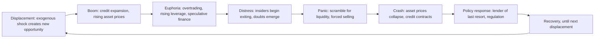

## Historical Financial Crises and Panics

### Overview

Financial crises and panics recur across centuries and financial systems with strikingly consistent underlying patterns despite differing institutional details: credit expansion and asset price appreciation, followed by a triggering event that reverses expectations, followed by a scramble for liquidity that amplifies the initial shock into a broader economic contraction. Studying historical episodes provides the empirical foundation for theories of bank runs, contagion, and systemic risk covered elsewhere in this material.

### Common Structural Pattern Across Crises

**Key Points**

- Charles Kindleberger's influential historical synthesis (*Manias, Panics, and Crashes*) identifies a recurring sequence: displacement (an exogenous shock creating new profit opportunities), boom (credit expansion and speculation), euphoria (overtrading and rising leverage), distress (insiders begin to realize gains), and panic/crash (a scramble for liquidity as the crowd tries to exit simultaneously).
- Hyman Minsky's "financial instability hypothesis" provides a complementary theoretical lens, characterizing the progression from hedge finance (income covers principal and interest) to speculative finance (income covers interest only, requiring refinancing) to Ponzi finance (income covers neither, requiring asset appreciation or continued refinancing to survive) as leverage builds during an expansion — a framework often summarized as "stability breeds instability," since periods of calm and rising asset prices encourage progressively riskier financing structures.
- [Inference] While this general pattern recurs across many historical episodes, the specific trigger, transmission mechanism, and policy response differ substantially case by case, and historians and economists continue to debate the relative importance of specific causal factors even for well-studied crises, so any single-sentence causal summary of a named historical crisis should be understood as a simplification of more contested underlying scholarship.

### Pre-Central-Bank Era Panics (19th Century United States)

**Panic of 1837 and Panic of 1857**

Early American financial panics occurred in a system without a central bank (following the expiration of the Second Bank of the United States' charter in 1836), characterized by state-chartered banks issuing their own banknotes with limited standardized regulation, making the system highly vulnerable to regional shocks and note-redemption runs without any lender-of-last-resort facility to provide emergency liquidity.

**Panic of 1873**

Triggered by the failure of Jay Cooke & Company, a major investment bank heavily exposed to railroad financing following a period of extensive railroad-related speculative investment, the panic led to a prolonged economic contraction sometimes referred to (prior to the 1930s redefinition of the term) as the "Great Depression" of that era.

**Panic of 1907**

A pivotal episode in which the absence of a central bank left the New York Clearing House and, notably, private financier J.P. Morgan personally organizing a coordinated response — pooling resources from solvent banks and trust companies to provide emergency liquidity to institutions facing runs. [Inference] This episode is widely credited in standard historical accounts as a key catalyst for the subsequent creation of the U.S. Federal Reserve System in 1913, on the grounds that reliance on ad hoc private coordination for lender-of-last-resort functions was viewed as an inadequate long-term solution for a modern financial system, though the legislative process and full range of contributing factors leading to the Federal Reserve Act were more complex than this single episode alone.

### The Great Depression (1929–early 1930s)

**Key Points**

- The stock market crash of October 1929 is commonly cited as the visible triggering event, though most economic historians view the subsequent banking crises and monetary contraction of 1930–1933 as more central to the depth and duration of the broader economic depression than the stock crash itself in isolation.
- Successive waves of bank runs occurred across the United States in the absence of federal deposit insurance (which did not yet exist), with thousands of bank failures over the early 1930s contributing to a sharp contraction in the money supply and available credit.
- Milton Friedman and Anna Schwartz's influential monetarist analysis (*A Monetary History of the United States*) argued that the Federal Reserve's failure to act as an effective lender of last resort and its allowance of a substantial contraction in the money supply significantly worsened and prolonged the depression relative to a counterfactual more accommodative monetary policy response — an interpretation that remains influential though not universally accepted among all economic historians, some of whom emphasize additional structural and international factors (e.g., the gold standard's constraints on policy response, debt-deflation dynamics).
- The Great Depression directly motivated the creation of the FDIC (1933) and the Glass-Steagall Act's separation of commercial and investment banking, representing one of the clearest historical examples of crisis-driven regulatory reform discussed under the rationale for financial regulation.

### Post-War and Late 20th Century Crises

**Latin American Debt Crisis (1980s)**

Triggered initially by Mexico's 1982 announcement that it could not service its external debt, the crisis spread across much of Latin America, reflecting a combination of excessive sovereign borrowing (much of it denominated in foreign currency) during the 1970s, sharply rising U.S. interest rates under Federal Reserve Chairman Paul Volcker's disinflationary policy, and falling commodity export revenues — illustrating how sovereign debt crises can be transmitted internationally through a common shock (rising global interest rates) affecting many borrowers simultaneously.

**U.S. Savings and Loan Crisis (1980s–early 1990s)**

A sector-specific crisis involving thousands of U.S. savings and loan institutions that had historically funded long-term fixed-rate mortgages with short-term deposits — a maturity mismatch that became severely unprofitable as interest rates rose sharply in the late 1970s and early 1980s, compounded by subsequent risk-taking in commercial real estate and other higher-risk lending following deregulation, ultimately requiring substantial federal resolution costs.

**Japanese Asset Price Bubble and Its Collapse (Late 1980s–1990s)**

Extraordinary appreciation in Japanese equity and real estate prices during the late 1980s was followed by a prolonged collapse beginning around 1990–1991, followed by an extended period of slow growth, deflation, and impaired bank balance sheets sometimes referred to as Japan's "lost decade(s)" — frequently cited in academic and policy discussions as a cautionary case study on the risks of delayed recognition and resolution of impaired bank assets ("zombie lending" to insolvent or near-insolvent borrowers) following a major asset price collapse.

**Asian Financial Crisis (1997–1998)**

Beginning with the collapse of the Thai baht in July 1997, the crisis spread rapidly across several East Asian economies (South Korea, Indonesia, Malaysia, and others), reflecting a combination of large short-term foreign-currency-denominated borrowing, fixed or managed exchange rate regimes that came under speculative pressure, and — in the standard account — vulnerabilities in domestic banking and corporate sector balance sheets, with IMF-led rescue packages and associated conditionality subsequently generating substantial debate about the appropriateness of the policy responses imposed.

**Russian Financial Crisis and LTCM (1998)**

Russia's August 1998 sovereign debt default and currency devaluation triggered severe stress in global fixed income markets, contributing directly to the near-collapse of Long-Term Capital Management (LTCM), a highly leveraged hedge fund whose positions were premised on historical correlation and convergence patterns that broke down severely during the crisis; LTCM's unwinding was coordinated through a private-sector consortium organized with Federal Reserve involvement (though without direct public funds), illustrating both the interconnectedness of leveraged financial institutions with the broader financial system and an early instance of "too interconnected to fail" concerns predating the more extensive 2007–2008 crisis.

**Dot-Com Bubble (Late 1990s–2000)**

A sharp run-up in technology and internet-related equity valuations during the late 1990s, followed by a substantial market correction beginning in 2000, is frequently studied as an asset price bubble case with less severe direct banking-sector contagion than many other major historical episodes, though it did contribute to a broader economic slowdown in the early 2000s.

### The Global Financial Crisis (2007–2008)

**Key Points**

- Rooted in the U.S. subprime mortgage market, the crisis is extensively analyzed elsewhere in this material through the lenses of shadow banking, securitization, and the "run on repo" thesis — the essential pattern being a shadow banking system run rather than a classical retail deposit run.
- The failure of Lehman Brothers in September 2008 is widely treated as the acute inflection point after which interbank and wholesale funding markets froze substantially, though vulnerabilities had been building and manifesting (e.g., Bear Stearns' rescue in March 2008, rising subprime delinquencies through 2007) for well over a year prior.
- The crisis directly motivated the most extensive wave of post-war financial regulatory reform globally, including Basel III, the Dodd-Frank Act in the United States, and substantially strengthened macroprudential and resolution frameworks discussed throughout this chapter.

### European Sovereign Debt Crisis (2010–2012)

Following the 2007–2008 crisis, several eurozone member states (notably Greece, Ireland, Portugal, Spain, and Cyprus, sometimes referred to collectively and controversially in contemporary media coverage) faced severe sovereign debt sustainability concerns, compounded by the absence of separate national monetary policy within the euro currency union and, in several cases, close linkages between sovereign creditworthiness and domestic bank balance sheets holding substantial sovereign debt (a "doom loop" or "diabolic loop" between sovereign and bank risk). The crisis prompted substantial evolution in eurozone crisis-management institutions, including the European Stability Mechanism and steps toward European banking union.

### Recent Episodes

**COVID-19 Market Disruption (March 2020)**

A sharp, extremely rapid market disruption across multiple asset classes in March 2020, notably including unusual stress even in normally highly liquid U.S. Treasury markets, prompted extensive and rapid central bank intervention globally; [Inference] this episode is frequently cited in subsequent official-sector analysis (including from the Financial Stability Board and various central banks) as revealing specific vulnerabilities in non-bank financial intermediation and Treasury market structure that had not been fully appreciated based on post-2008 reforms alone, prompting further ongoing regulatory review, though the precise policy conclusions and reform proposals continue to be debated and refined.

**U.S. Regional Banking Stress (March 2023)**

The failures of Silicon Valley Bank, Signature Bank, and (shortly after) First Republic Bank in March 2023 illustrated how uninsured deposit concentration, unrealized losses on held-to-maturity securities portfolios amid rising interest rates, and extremely rapid digital deposit withdrawal could combine to produce a classical bank-run dynamic at a pace substantially faster than pre-digital-era historical episodes; this prompted renewed debate about deposit insurance coverage limits, interest rate risk supervision, and the adequacy of existing liquidity regulation for institutions below the largest G-SIB thresholds.

### Why Historical Study Matters for Risk Management and Regulation

**Key Points**

- Historical crises provide the empirical basis for stress testing scenario libraries (discussed under market risk measurement), since many regulatory and internal stress scenarios are explicitly modeled on historical episodes (1987 crash, 1998 LTCM/Russia, 2008 crisis, 2020 COVID disruption).
- Recurring structural themes across seemingly disparate episodes — maturity mismatch, excessive leverage, correlated exposures, and the time-inconsistency difficulty of credible non-intervention commitments — connect directly to the theoretical material on bank runs, shadow banking, and too-big-to-fail moral hazard covered elsewhere in this chapter.
- [Inference] A recurring historiographical caution is that each crisis is often initially analyzed as sui generis or as revealing an entirely new type of risk, while subsequent scholarship frequently identifies substantial continuity with prior episodes once sufficient time and research have passed — suggesting a degree of humility is warranted before treating any single historical crisis as either fully unprecedented or fully explained by any one causal narrative.

**Conclusion**

Across nearly two centuries of financial history — from pre-Federal-Reserve American panics through the Great Depression, Latin American and Asian debt crises, LTCM, the 2007–2008 global financial crisis, and more recent episodes including the 2020 COVID disruption and 2023 U.S. regional banking stress — financial crises exhibit recurring structural features: credit and leverage expansion during calm periods, a triggering shock that reverses expectations, and a liquidity scramble that transforms an initial shock into a broader systemic and economic contraction. This recurrence across vastly different institutional, technological, and regulatory contexts is precisely why historical crisis study remains central to modern risk management and financial regulation — not because history repeats identically, but because the underlying economic mechanisms of leverage, maturity mismatch, and self-reinforcing panic dynamics have proven remarkably persistent even as their specific institutional manifestations evolve.

**Related Topics**

- Kindleberger's manias-panics-crashes framework and Minsky's financial instability hypothesis in depth
- Friedman and Schwartz's monetarist interpretation of the Great Depression
- Gorton's "run on repo" thesis applied to the 2007–2008 crisis
- Sovereign debt crises: Latin America 1980s and European sovereign debt crisis compared
- LTCM case study: leverage, correlation breakdown, and near-systemic contagion
- Silicon Valley Bank collapse: interest rate risk, uninsured deposits, and digital run speed
- Historical stress testing scenario construction from past crises
- Comparative central bank crisis response: 1907, 1929–33, 2008, and 2020