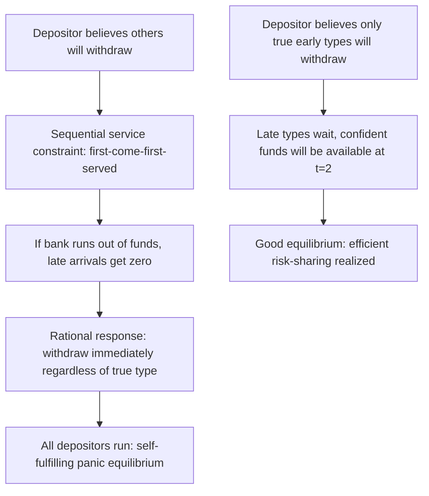

## Bank Run Models

### Overview

Bank run models are the formal theoretical frameworks economists use to explain why depositors might withdraw funds en masse from a bank, and under what conditions such withdrawals reflect a self-fulfilling panic versus a rational response to genuine fundamental weakness. These models provide the analytical foundation underlying deposit insurance design, lender-of-last-resort policy, and modern analysis of wholesale funding runs in shadow banking.

### The Diamond-Dybvig Model: Panic-Based Runs

**Model Setup**

Diamond and Dybvig (1983) formalize a three-period economy ($t=0,1,2$) with a continuum of ex-ante identical depositors who face idiosyncratic uncertainty about when they will need to consume:

- At $t=0$, each depositor deposits an endowment of 1 unit into a bank.
- At $t=1$, each depositor privately learns their type: **early type** (must consume at $t=1$) with probability $t$, or **late type** (can wait until $t=2$) with probability $1-t$.
- A long-term investment technology returns $R > 1$ per unit if held to $t=2$, but only a liquidation value of $1$ (or less) if liquidated early at $t=1$.

Without a bank, an individual facing this uncertainty who turns out to be an early type suffers a welfare loss from forced early liquidation. The bank deposit contract pools this idiosyncratic risk and offers depositors a state-contingent payment: $r_1$ if they withdraw at $t=1$, $r_2$ if they wait until $t=2$, chosen to provide insurance superior to individual autarky.

**Multiple Equilibria**

The model's central result is that the deposit contract, however well-designed, admits at least two Nash equilibria:

1. **Good (efficient) equilibrium**: only true early types withdraw at $t=1$. The bank remains solvent, late types receive $r_2 > r_1$ at $t=2$, and the risk-sharing benefit of the deposit contract is fully realized.
2. **Bank run (panic) equilibrium**: all depositors, including late types, withdraw at $t=1$, because each depositor's optimal individual strategy depends on what they believe others will do, and the bank pays out under a **sequential service constraint** (first-come-first-served) until funds are exhausted.

$$\text{If believed withdrawal fraction} \to 1 \Rightarrow \text{individually optimal response: withdraw immediately}$$

This is a coordination failure with self-fulfilling beliefs: the run occurs not because the bank is fundamentally insolvent, but because each depositor rationally anticipates that others will run, making running individually rational regardless of the bank's true underlying solvency.

**Key Points**

- The Diamond-Dybvig model's central insight is that the very deposit contract that improves welfare in the good equilibrium by providing liquidity insurance is the same contract that creates vulnerability to the panic equilibrium — the fragility is not a design flaw to be eliminated but an inherent feature of maturity transformation itself.
- Sunspot equilibria: which equilibrium is realized can depend on extraneous, payoff-irrelevant signals ("sunspots") that coordinate depositor beliefs — a rumor or unrelated news event can shift beliefs and trigger a run even absent any change in the bank's actual fundamentals.
- The model implies that deposit insurance, by guaranteeing $r_1$ regardless of aggregate withdrawal behavior, can eliminate the panic equilibrium entirely for insured deposits, since a depositor's payoff no longer depends on others' actions.

### Extensions: Suspension of Convertibility

Diamond-Dybvig also analyze a mechanism predating deposit insurance: the bank pre-commits to suspend further withdrawals once a fraction $f^*$ of depositors (equal to the expected true fraction of early types) has withdrawn. If credible and correctly calibrated, this removes the incentive for late types to run, since they know the bank will preserve sufficient assets to pay $r_2$ at $t=2$ regardless of panic-driven early withdrawal attempts by other late types.

**Key Points**

- Suspension of convertibility was used historically (e.g., periodic U.S. bank holidays before federal deposit insurance) but has significant practical limitations: if $f^*$ is set too low, legitimate early-type depositors are harmed by being unable to access funds they genuinely need; if regulators cannot observe the true fraction of early types in advance, correct calibration is difficult.
- Unlike deposit insurance, suspension of convertibility does not require third-party (government or insurance fund) backing — it is a self-enforcing mechanism the bank itself can commit to, though its credibility depends on the pre-commitment being genuinely binding rather than subject to renegotiation once a run begins.

### Fundamentals-Based Run Models

**Distinguishing Panic from Fundamentals**

A separate strand of theoretical work models runs as a rational response to genuine information about deteriorating bank solvency, rather than a pure coordination failure. In these models, depositors receive private or public signals about the bank's asset quality, and runs occur when signals cross a threshold indicating the bank is genuinely insolvent or likely to become so.

**Global Games and Unique Equilibrium**

Morris and Shin's global games framework, applied to bank runs (notably by Goldstein and Pauzner, 2005), resolves the multiplicity problem in Diamond-Dybvig by introducing small idiosyncratic noise into depositors' private signals about the bank's fundamentals. This refinement typically yields a **unique equilibrium** characterized by a threshold: depositors run if and only if the fundamental signal falls below a critical value, eliminating the pure sunspot-driven multiplicity of the original Diamond-Dybvig setup while still preserving a role for strategic complementarity (each depositor's incentive to run increases with their belief that others will run).

$$\text{Run occurs} \iff \theta < \theta^*$$

where $\theta$ represents the bank's fundamental state and $\theta^*$ is an endogenously determined threshold depending on model parameters (deposit contract terms, signal precision, and payoff structure).

**Key Points**

- Global games models are often viewed as providing a more empirically tractable and testable framework than the original Diamond-Dybvig multiplicity, since they generate sharp comparative statics predictions (e.g., how the run threshold changes with deposit contract design or signal precision) that can in principle be examined against data.
- [Inference] The relationship between pure panic-based (sunspot) models and global-games-refined fundamentals-based models is often characterized in the literature as complementary rather than competing: global games can be understood as showing that even a small amount of genuine fundamental uncertainty, combined with the strategic complementarity Diamond-Dybvig identified, is sufficient to generate run dynamics without relying on a pure, unexplained sunspot coordination device.
- In practice, distinguishing a "panic-based" run from a "fundamentals-based" run empirically is often difficult, since a fundamental shock frequently serves as the trigger that shifts beliefs and initiates panic dynamics that then extend well beyond what the fundamental shock alone would justify — the two mechanisms frequently operate together rather than as mutually exclusive alternatives in observed historical episodes.

### Information-Based Contagion Models

**Bank Runs as Information Events**

A related class of models examines how a run or failure at one bank can trigger runs at other, unrelated banks purely through an information channel: depositors at Bank B, observing that Bank A (perceived as similar in some relevant dimension — geography, asset class exposure, business model) has failed or experienced a run, rationally update their beliefs about Bank B's likely fundamental quality and may run on Bank B even absent any direct financial exposure between the two institutions.

**Key Points**

- This contagion channel is distinct from direct interbank exposure contagion (where Bank B suffers losses because it has direct claims on failed Bank A) — information contagion operates purely through inference about correlated but unobserved fundamentals.
- Information contagion models help explain historically observed patterns where bank runs cluster by region, asset class, or business model type even without evidence of direct financial interconnection between the affected institutions, a pattern documented in various historical banking panics.

### Modern Extensions: Wholesale Funding and Shadow Banking Runs

**Adapting the Framework to Non-Deposit Funding**

Contemporary research extends bank run logic to wholesale funding markets — repo, commercial paper, and money market fund redemptions — where the "sequential service constraint" of classical retail deposit runs is replaced by analogous mechanisms: margin calls, rising collateral haircuts, and redemption gates that similarly create a first-mover advantage incentivizing early withdrawal of funding.

$$\text{Repo Run Analogy: Rising Haircut} \Leftrightarrow \text{Sequential Service Constraint}$$

**Key Points**

- Gorton's "run on repo" framework (applied to the 2007–2008 crisis) extends bank run theory to a setting where the relevant "depositors" are wholesale lenders (money market funds, other financial institutions) providing overnight repo funding against mortgage-related collateral, and the "run" manifests as rapidly rising haircuts rather than a physical withdrawal queue.
- These modern extensions retain the core Diamond-Dybvig insight — a maturity/liquidity mismatch combined with a first-mover advantage in withdrawal generates fragility — while adapting the specific institutional mechanism (haircuts and margin calls rather than sequential teller service) to match the actual structure of modern wholesale funding markets.

### Empirical Testing and Limitations of Bank Run Models

**Key Points**

- Directly testing whether a specific historical bank run was panic-based or fundamentals-based is empirically challenging, since researchers rarely have a clean natural experiment isolating a pure sunspot shock from genuine information about fundamentals; much empirical work instead examines cross-sectional patterns (e.g., whether runs were more severe at banks with weaker observable fundamentals, consistent with the global games prediction) rather than definitively classifying any single historical episode.
- [Inference] The relative empirical support for pure panic-based versus fundamentals-driven or global-games-style run models likely varies by historical episode and dataset, and this remains an active area of empirical banking and finance research rather than a settled question with a single universally accepted answer.
- Bank run models generally abstract from the specific institutional and behavioral details (e.g., media coverage effects, social network transmission of withdrawal decisions, the specific mechanics of digital banking that enable extremely rapid modern withdrawal) that some researchers argue materially affect run dynamics in practice, particularly in light of the unusually rapid deposit outflows observed in cases like the March 2023 Silicon Valley Bank failure.

**Conclusion**

Bank run models progress from Diamond-Dybvig's foundational insight — that maturity transformation inherently creates a coordination-failure vulnerability alongside its welfare-improving liquidity insurance function — through global games refinements that resolve equilibrium multiplicity by incorporating genuine fundamental uncertainty, to modern extensions applying the same core logic to information-based contagion and wholesale funding markets like repo. Across this theoretical evolution, the persistent common thread is a first-mover advantage in withdrawal (whether through sequential service, margin calls, or rising haircuts) combined with strategic complementarity in depositors' or funders' withdrawal decisions — the structural feature that transforms an otherwise beneficial liquidity transformation arrangement into one susceptible to self-reinforcing runs, whether triggered by pure panic, genuine fundamental deterioration, or (most commonly in observed historical episodes) some combination of both operating together.

**Related Topics**

- Diamond-Dybvig model: full mathematical derivation of the optimal deposit contract
- Global games methodology (Morris-Shin) and its applications beyond banking
- Goldstein-Pauzner unique equilibrium bank run model in depth
- Gorton's "run on repo" thesis and securitized banking theory
- Information contagion vs. direct exposure contagion: empirical identification challenges
- Suspension of convertibility: historical use and design limitations
- Deposit insurance design and its effect on run equilibrium selection
- Digital-era bank runs: Silicon Valley Bank case study and withdrawal speed