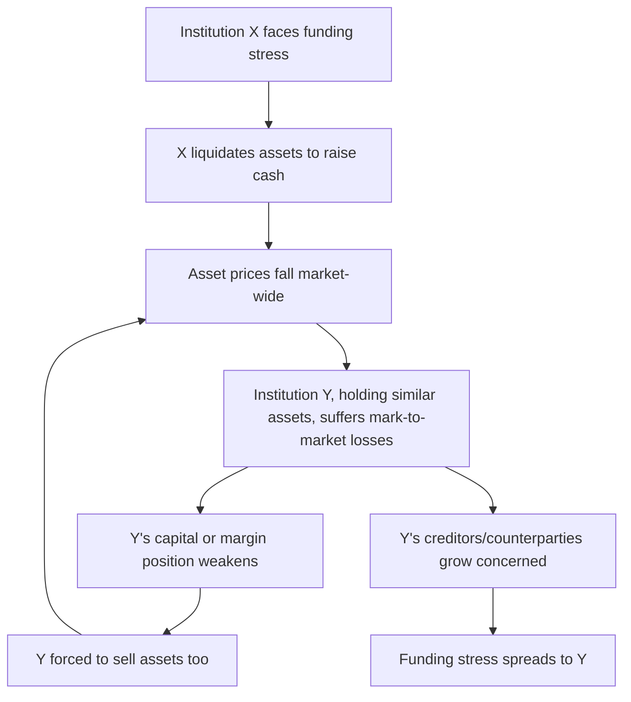

## Contagion and Interconnectedness

### Overview

Contagion refers to the transmission of financial distress from one institution, market, or country to others beyond what would be justified by direct fundamental linkages alone. Interconnectedness describes the network of financial claims, exposures, and dependencies that creates the channels through which such transmission occurs. Together, these concepts explain why localized shocks can escalate into systemic crises, and why the structure of financial networks — not just the size of individual shocks — is a central determinant of systemic risk.

### Channels of Contagion

**Direct Balance Sheet Exposure**

The most straightforward contagion channel: Institution A holds a direct financial claim on Institution B (a loan, bond, derivative, or deposit). If B defaults or suffers losses, A's balance sheet is directly impaired, potentially triggering distress or default at A, which can then propagate to A's own creditors in turn.

$$\text{Loss}_A = \text{Exposure}_{A \to B} \times \text{LGD}_B$$

**Key Points**

- Direct exposure contagion can be modeled explicitly using network analysis of interbank lending, derivatives, and correspondent banking relationships, given sufficient data on bilateral exposures.
- The severity of direct-exposure contagion depends heavily on network structure: a network with a few highly concentrated hub institutions can be more fragile to a hub failure but more resilient to peripheral node failures, compared to a more diffusely connected network.
- Counterparty credit risk mitigants — netting agreements, central clearing, collateralization — directly reduce this channel's severity by limiting net exposure between any two counterparties, as discussed under credit risk management and payment systems.

**Fire-Sale Externalities**

A distressed institution forced to sell illiquid assets quickly to raise cash depresses market prices for those assets. Other institutions holding similar assets, even absent any direct contractual relationship with the distressed institution, suffer mark-to-market losses as prices fall, potentially forcing them into their own asset sales, which further depresses prices — a self-reinforcing deleveraging spiral.

**Key Points**

- Fire-sale contagion requires no direct contractual relationship between affected institutions — the transmission channel is the common asset market itself, meaning even institutions with no knowledge of each other's existence can transmit distress through this mechanism.
- Leveraged institutions marking assets to market (as opposed to holding them at amortized cost) are more directly exposed to fire-sale contagion, since falling market prices immediately affect their reported capital and can trigger margin calls or covenant breaches.
- Fire-sale externalities are a core justification for macroprudential policy (discussed separately), since no individual institution internalizes the price impact its own forced selling imposes on other market participants.

**Information Contagion**

Distress or failure at one institution can cause market participants to update their beliefs about the likely fundamental condition of other institutions perceived as similar — by geography, asset class exposure, business model, or regulatory jurisdiction — triggering withdrawal of funding or deposits even absent direct exposure or genuine deterioration at the "contaged" institution.

**Key Points**

- Information contagion is central to bank run models extended to a multi-bank setting, explaining historically observed patterns of runs clustering by bank type or region even without evidence of direct interbank exposure.
- This channel can be self-correcting if better information subsequently reveals the "contaged" institution to be sound, but can also be self-fulfilling if the resulting withdrawal of funding itself pushes a previously sound institution toward genuine distress — echoing the panic-based run dynamics discussed under bank run models.
- Modern digital and social-media-driven information transmission may accelerate this channel relative to historical episodes, though [Inference] the precise quantitative effect of faster information transmission on contagion speed and severity remains an active area of research rather than a settled, precisely measured relationship.

**Funding Market Contagion**

Distress at one participant in a shared funding market (repo, commercial paper, interbank lending) can cause lenders to become more cautious toward the entire market or asset class, raising funding costs or reducing available funding even for participants not directly connected to the distressed institution — a mechanism central to the shadow banking run dynamics discussed separately (e.g., the freezing of the broader commercial paper market following the Reserve Primary Fund's break of the buck in 2008).

**Payment System and Settlement Contagion**

Because payment and settlement systems are shared infrastructure (discussed under payment systems and clearing), operational or liquidity disruption at one major participant can create gridlock — other participants awaiting incoming payments from the distressed institution cannot make their own outgoing payments, propagating liquidity strain through the payment network even among institutions with no bilateral credit exposure to each other.

### Network Structure and Systemic Fragility

**Key Points**

- Network topology matters independently of aggregate exposure size: research on financial networks (following work by authors such as Allen and Gale on interbank contagion) shows that more densely interconnected networks can be more resilient to small, idiosyncratic shocks (since losses are diffused across many counterparties, each absorbing a small share) but potentially more fragile to large, systemic shocks or to shocks affecting highly connected "hub" nodes, illustrating a "robust yet fragile" property of financial networks.
- Concentration in a small number of highly interconnected institutions (as in central clearing counterparties, discussed under payment systems) trades reduced complexity and easier monitoring for increased consequences if that concentrated node itself fails — motivating the enhanced supervisory and resilience requirements applied to systemically important financial market infrastructure.
- [Inference] Precisely measuring real-world financial network structure is difficult given data limitations (many bilateral exposures, particularly in derivatives and shadow banking, are not comprehensively or consistently reported to a single observer), meaning theoretical network models often necessarily rely on simplified or partially estimated network structures rather than complete, observed real-world networks.

### Cross-Border and International Contagion

**Sovereign-Bank Linkages ("Doom Loop")**

Domestic banks holding substantial domestic sovereign debt create a two-way contagion channel: sovereign credit deterioration directly impairs bank balance sheets (since sovereign debt loses value), while bank sector fragility increases the probability the government will need to provide costly support, worsening the sovereign's own fiscal position — a mutually reinforcing dynamic prominently observed during the European sovereign debt crisis.

**Exchange Rate and Capital Flow Contagion**

Currency crises and sudden capital flow reversals in one emerging market can trigger capital flight from other emerging markets perceived as similarly vulnerable (common vulnerability factors such as current account deficits, foreign-currency-denominated debt, or fixed exchange rate regimes under pressure) — a pattern observed during the 1997–1998 Asian financial crisis, where currency pressure spread across multiple economies with varying degrees of direct trade or financial linkage to the original trigger country (Thailand).

**Common Creditor Channel**

International contagion can also spread through common creditors: if a global bank or investment fund suffers losses in one country and responds by reducing exposure across its entire international portfolio (to manage its own overall risk or meet redemption/margin pressures), countries with no direct economic connection to the original shock can experience capital outflows purely because they share a common lender with the originally affected country.

### Measuring and Modeling Contagion

**Network-Based Systemic Risk Metrics**

Regulators and researchers use various quantitative approaches to assess interconnectedness and potential contagion severity, including direct network analysis of bilateral exposure data (where available), stress-testing simulations that propagate an initial shock through an estimated exposure network, and market-based systemic risk measures (e.g., CoVaR, which estimates the VaR of the financial system conditional on a specific institution being in distress, and SRISK, which estimates expected capital shortfall of an institution conditional on a systemic crisis).

$$\text{CoVaR}_{\text{system} | i} = \text{VaR of system returns conditional on institution } i \text{ being at its own VaR threshold}$$

[Inference] Market-based systemic risk measures like CoVaR and SRISK offer the practical advantage of being computable from publicly available market data (equity returns, market capitalization) without requiring proprietary bilateral exposure data, but this convenience comes with the limitation that they capture correlation and co-movement patterns rather than necessarily identifying the specific structural or contractual contagion channel responsible for that co-movement.

**Key Points**

- No single metric or model fully captures all contagion channels simultaneously — network exposure models best capture direct balance sheet contagion, market-based measures better capture correlated distress and information contagion, and stress-testing simulations can incorporate fire-sale dynamics if explicitly modeled, but combining insights across these different methodologies is generally necessary for a comprehensive systemic risk assessment.
- Systemic risk monitoring bodies (FSOC, ESRB, and others discussed under macroprudential regulation) typically employ multiple complementary approaches rather than relying on any single contagion or interconnectedness metric.

**Conclusion**

Contagion and interconnectedness explain why financial crises frequently extend well beyond the scope that the initial triggering shock or directly exposed institutions alone would suggest: direct balance sheet exposures, fire-sale price externalities, information-driven belief updating, shared funding markets, and common payment infrastructure each provide distinct channels through which distress can propagate across institutions and borders with no need for every affected party to share a direct contractual relationship with the original source of the shock. This is why systemic risk assessment cannot rely solely on evaluating individual institutions' standalone soundness — the structure of interconnections itself, and the specific channels through which distress can transmit across that structure, are independent and essential determinants of how a localized shock translates into (or is contained short of) a full-blown systemic crisis.

**Related Topics**

- Allen-Gale interbank network contagion model and the "robust yet fragile" property
- Fire-sale externalities and their role in macroprudential policy rationale
- CoVaR and SRISK: market-based systemic risk measurement in depth
- Sovereign-bank "doom loop" and the European sovereign debt crisis
- Common creditor channel and international financial contagion
- Central clearing counterparties as concentrated network nodes
- Information contagion models and bank run clustering patterns
- Network topology and systemic risk: density, concentration, and hub vulnerability