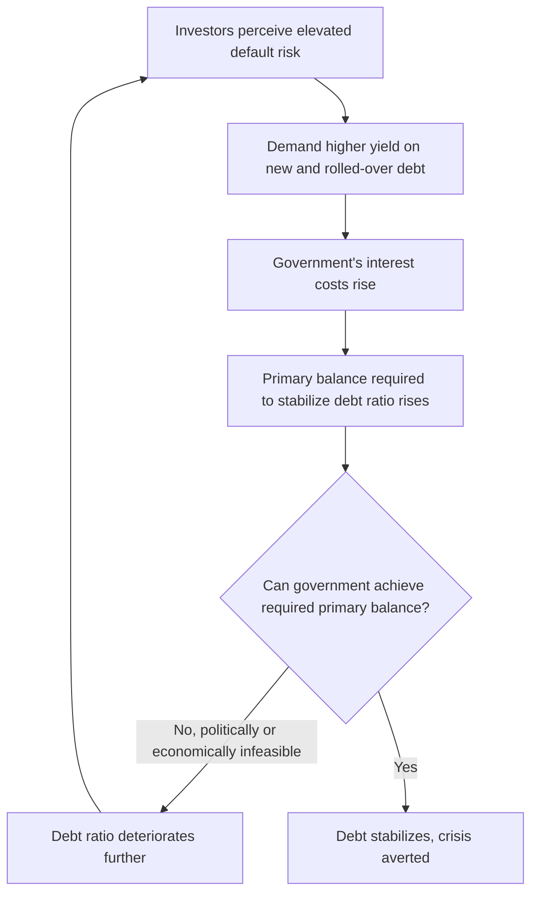

## Sovereign Debt Crises

### Overview

A sovereign debt crisis occurs when a national government is unable or unwilling to meet its debt service obligations in full and on time, leading to default, restructuring, or a sharp loss of market access at sustainable borrowing costs. Sovereign debt crises differ fundamentally from corporate or bank defaults in one crucial respect: there is no supranational bankruptcy court with the power to compel a sovereign to repay, seize its assets, or force it into liquidation, making sovereign debt inherently a matter of willingness to pay as much as ability to pay, and resolution a matter of negotiation rather than legal adjudication.

### Why Sovereign Debt Is Different

**No Bankruptcy Court, No Collateral Seizure**

Unlike corporate debt, sovereign debt is generally not secured by specific collateral that creditors can seize upon default, and there is no international legal framework analogous to domestic bankruptcy law that can compel repayment or oversee an orderly restructuring process. This creates a fundamentally different creditor-debtor dynamic:

$$\text{Sovereign default cost} = \text{Reputational cost} + \text{Market access cost} + \text{Legal/litigation cost} + \text{Domestic political cost}$$

Because a sovereign's decision to default is constrained primarily by these indirect costs rather than direct legal enforcement, sovereign debt sustainability analysis places heavy emphasis on **willingness to pay** alongside **ability to pay** — a government with sufficient fiscal capacity to service its debt may nonetheless choose default if the political or economic cost of continued debt service is judged to exceed the cost of default.

**Key Points**

- The absence of collateral and bankruptcy enforcement is why sovereign lending has historically relied heavily on reputation mechanisms: a government that defaults typically loses market access for a period and may face higher borrowing costs even after regaining access, providing an incentive to service debt even absent legal compulsion.
- Sovereign debt is also distinguished by the sovereign's unique power to change the rules governing its own debt unilaterally (e.g., through legislation affecting debt contracts, capital controls, or currency redenomination) in ways a private corporate debtor generally cannot.
- Debt denominated in foreign currency (which the sovereign cannot create/print) carries fundamentally different risk characteristics than debt denominated in the sovereign's own currency, since a government retains the option (with its own attendant costs, notably inflation) to service local-currency debt through money creation, an option unavailable for foreign-currency debt.

### The Sovereign Debt Sustainability Framework

**Basic Debt Dynamics**

A commonly used framework for assessing debt sustainability tracks the evolution of the debt-to-GDP ratio as a function of the primary fiscal balance, interest rates, and growth:

$$d_t = d_{t-1} \times \frac{1+i}{1+g} - pb_t$$

where $d_t$ is the debt-to-GDP ratio, $i$ is the effective nominal interest rate on debt, $g$ is the nominal GDP growth rate, and $pb_t$ is the primary balance (revenue minus non-interest expenditure) as a share of GDP.

**Key Points**

- When $i > g$ (interest rates exceed growth), the debt ratio tends to rise over time absent a sufficiently large primary surplus, a condition sometimes referred to as an unfavorable "$r$ minus $g$" dynamic; when $g > i$, debt ratios can decline even with modest primary deficits.
- Debt sustainability analysis (as conducted by institutions such as the IMF) generally involves projecting this identity forward under baseline and stress scenarios, assessing whether the required primary balance to stabilize or reduce the debt ratio is judged politically and economically feasible.
- [Inference] Debt sustainability assessments inherently involve significant judgment about future growth, interest rates, and the government's capacity and willingness to sustain a given primary balance over time, meaning reasonable analysts can and do reach differing conclusions about the same country's debt sustainability, particularly in borderline cases.

### Self-Fulfilling Sovereign Debt Crises

**Multiple Equilibria in Sovereign Debt Markets**

Analogous to bank run models, sovereign debt markets can exhibit multiple equilibria: if investors believe a sovereign is at risk of default, they demand higher yields to compensate for that risk, which itself raises the government's debt service costs, potentially pushing debt dynamics toward genuine unsustainability that validates the initial pessimistic belief — a self-fulfilling crisis dynamic conceptually parallel to the panic-based bank run equilibrium in the Diamond-Dybvig framework.

$$\text{Higher perceived default risk} \rightarrow \text{Higher required yield} \rightarrow \text{Higher debt service cost} \rightarrow \text{Worse debt dynamics} \rightarrow \text{Validates higher perceived default risk}$$

**Key Points**

- This self-fulfilling dynamic underlies arguments for a "lender of last resort" function for sovereigns analogous to central bank lender-of-last-resort facilities for banks — an institution able to provide financing at moderate rates during a liquidity-driven (as opposed to genuinely fundamentals-driven) crisis, preventing the self-fulfilling spiral from being triggered by pure market panic rather than underlying insolvency.
- The European Central Bank's "Outright Monetary Transactions" (OMT) program, announced in 2012 during the European sovereign debt crisis (accompanied by then-ECB President Mario Draghi's statement that the ECB would do "whatever it takes" to preserve the euro), is frequently cited as an example of a policy intervention explicitly aimed at addressing this kind of self-fulfilling liquidity crisis dynamic in sovereign bond markets, distinct from addressing genuine underlying fiscal insolvency.
- Distinguishing a liquidity-driven, self-fulfilling sovereign crisis from a genuine fundamentals-driven insolvency crisis is, as with bank runs, often empirically difficult in real time, and the appropriate policy response differs substantially depending on which diagnosis is correct — official lending or backstop facilities can resolve a pure liquidity crisis but may simply delay (and potentially worsen) an eventual restructuring if the underlying problem is genuine insolvency.

### Debt Restructuring Mechanisms

**Voluntary/Negotiated Restructuring**

Most sovereign debt restructurings occur through negotiation between the sovereign and its creditors (or creditor committees), resulting in some combination of maturity extension, interest rate reduction, principal reduction ("haircut"), or debt exchange into new instruments, without a formal legal bankruptcy process.

**Collective Action Clauses (CACs)**

Contractual provisions included in many modern sovereign bond issuances allowing a specified supermajority of bondholders to approve a restructuring that becomes binding on all bondholders of that issuance, including holdouts who did not consent — directly addressing the **collective action problem** in which individual creditors might otherwise prefer to hold out for full repayment (a "rogue creditor" or "holdout" problem) even when a restructuring would be collectively beneficial for creditors as a group relative to a disorderly default.

**Holdout Creditor Litigation**

In the absence of universal CAC coverage (particularly for older bond issuances), holdout creditors have sometimes pursued litigation seeking full repayment rather than accepting restructuring terms accepted by the majority of creditors — the Argentina sovereign debt litigation following its 2001 default (including protracted litigation in U.S. courts against holdout creditors, sometimes characterized in media coverage as "vulture funds") is a widely cited example illustrating both the potential effectiveness and the significant complications such litigation can create for orderly sovereign debt resolution.

**IMF-Supported Programs**

The International Monetary Fund frequently provides emergency financing to sovereigns facing acute balance-of-payments or debt crises, typically conditioned on policy adjustment programs (fiscal consolidation, structural reforms, monetary policy changes) intended to restore debt sustainability and market access. [Inference] The appropriate design and stringency of IMF program conditionality has been a persistent subject of debate among economists and policymakers, with critics in various historical episodes (including the 1997–1998 Asian financial crisis) arguing that program conditions were at times excessively restrictive or poorly calibrated to the specific circumstances of the crisis, while defenders emphasize the need for credible policy commitments to restore market confidence and justify continued official financing; this remains a genuinely contested area rather than a settled methodological consensus.

**The Absence of a Sovereign Bankruptcy Regime**

Unlike corporate bankruptcy, there is no binding international legal framework governing sovereign debt restructuring analogous to domestic corporate bankruptcy codes. Proposals for a formal **Sovereign Debt Restructuring Mechanism (SDRM)**, discussed prominently in the early 2000s and periodically revisited since, have not achieved the broad international agreement required for implementation, leaving sovereign debt restructuring dependent on negotiated, case-by-case processes supplemented by contractual mechanisms like CACs rather than a unified statutory framework.

### Currency Denomination and the "Original Sin" Problem

**Foreign-Currency-Denominated Sovereign Debt**

Emerging market and developing economy governments have historically often been unable to borrow internationally in their own domestic currency, a phenomenon termed **"original sin"** in the academic literature (Eichengreen and Hausmann). This creates a distinct vulnerability: because the government cannot create the foreign currency needed to service this debt, a sharp domestic currency depreciation directly and mechanically increases the domestic-currency burden of foreign-currency debt service, even without any change in the government's underlying fiscal position measured in domestic currency terms.

$$\text{Debt Service Burden (domestic currency)} = \text{Foreign Currency Debt} \times \text{Exchange Rate}$$

**Key Points**

- This dynamic played a central role in several historical crises, including the 1994 Mexican "Tequila Crisis," the 1997–1998 Asian financial crisis, and various Latin American debt crises, where currency depreciation and sovereign (or private-sector, with implications for sovereign contingent liabilities) debt distress reinforced each other.
- [Inference] Local-currency sovereign bond markets in many emerging economies have developed substantially since the "original sin" concept was first articulated, reducing though not eliminating this specific vulnerability channel for at least some emerging market sovereigns; the extent of this development varies considerably by country and should be assessed against current market data rather than assumed uniformly resolved.
- Debt sustainability analysis for sovereigns with substantial foreign-currency debt must explicitly incorporate exchange rate risk as a distinct sustainability dimension beyond the domestic-currency debt dynamics captured in the basic debt sustainability identity.

### Contagion Across Sovereign Debt Crises

Sovereign debt crises frequently exhibit cross-country contagion through channels discussed under contagion and interconnectedness more broadly: common creditor exposure (a global investor reducing overall emerging market exposure following losses in one country), correlated vulnerability perception (investors reassessing risk in countries perceived as sharing similar characteristics — high foreign-currency debt, fixed exchange rates, similar export composition), and direct trade or financial linkages between affected economies.

**Sovereign-Bank Doom Loop**

As discussed under contagion, domestic banks holding substantial sovereign debt create a bidirectional contagion channel between sovereign and banking sector distress — a dynamic particularly prominent during the European sovereign debt crisis, where several eurozone banking systems held large domestic sovereign debt holdings, directly transmitting sovereign credit deterioration into bank balance sheet impairment.

**Conclusion**

Sovereign debt crises occupy a distinct position within the broader study of financial crises because the absence of a supranational bankruptcy enforcement mechanism makes sovereign default fundamentally a matter of negotiated resolution rather than legal adjudication, and because sovereign debt sustainability depends on willingness to pay and political economy constraints in addition to conventional debt-dynamics arithmetic. The self-fulfilling crisis dynamics that can emerge in sovereign bond markets — closely paralleling the panic-based logic of bank run models — combined with structural vulnerabilities like foreign-currency denomination and the sovereign-bank doom loop, mean that sovereign debt crises frequently require distinct policy tools (IMF-supported programs, collective action clauses, and in some cases central bank backstop facilities like the ECB's OMT) rather than a direct transplant of corporate bankruptcy or bank resolution frameworks designed for entities subject to conventional legal enforcement.

**Related Topics**

- Debt sustainability analysis methodology and IMF framework application
- Collective action clauses and holdout creditor litigation: the Argentina case study
- "Original sin" and local-currency sovereign bond market development
- ECB Outright Monetary Transactions and self-fulfilling sovereign crisis prevention
- Sovereign Debt Restructuring Mechanism proposals and international bankruptcy regime debates
- European sovereign debt crisis and the sovereign-bank doom loop
- IMF program conditionality debates: design and historical effectiveness
- Latin American debt crisis (1980s) and Asian financial crisis (1997-1998) compared