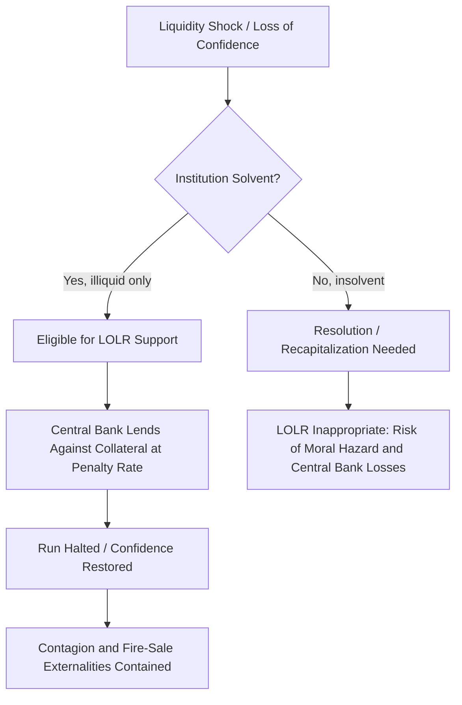

## Lender-of-Last-Resort Policy

### Definition and Core Concept

Lender-of-last-resort (LOLR) policy refers to the function performed by a central bank (or, in some cases, another institution with equivalent authority) of providing emergency liquidity to solvent but illiquid financial institutions during periods of financial distress, when no other source of funding is available on reasonable terms. The purpose is to prevent temporary liquidity shortages from becoming systemic solvency crises through fire sales, contagion, and self-fulfilling bank runs.

The concept rests on a key distinction:

- **Illiquidity**: an institution has adequate assets to cover liabilities but cannot convert them to cash quickly enough to meet withdrawal or payment demands.
- **Insolvency**: an institution's liabilities exceed the true economic value of its assets, regardless of timing.

LOLR support is conceptually intended for the former, not the latter, though in practice this distinction is often difficult to determine in real time [Inference].

### Historical and Theoretical Foundations

**Bagehot's Dictum**

The classical formulation of LOLR policy comes from Walter Bagehot's *Lombard Street* (1873), often summarized as **Bagehot's Rule**:

1. Lend freely
2. Against good collateral (valued at pre-crisis prices)
3. At a penalty rate

Each element serves a distinct purpose:

- **Lend freely**: signals to the market that liquidity constraints will not be the cause of failure, which helps stop panic-driven runs.
- **Good collateral**: protects the central bank (and by extension, the public balance sheet) from taking on credit risk—only illiquid, not insolvent, institutions should qualify.
- **Penalty rate**: discourages routine reliance on the facility, limits moral hazard, and ensures the LOLR is a backstop rather than a subsidized primary funding source.

**Thornton's Earlier Contribution**

Henry Thornton, in *An Enquiry into the Nature and Effects of the Paper Credit of Great Britain* (1802), anticipated several elements of Bagehot's framework, including the idea that the central bank should support the banking system as a whole rather than individual firms, and should distinguish between a general credit crunch and firm-specific insolvency.

### Rationale: Why LOLR Exists

**Bank Runs and Multiple Equilibria**

The theoretical justification is frequently framed using the **Diamond-Dybvig (1983)** model of bank runs. Banks perform maturity transformation—funding long-term illiquid assets with short-term liquid liabilities (deposits). This creates two possible equilibria:

- **Good equilibrium**: depositors withdraw only according to genuine liquidity needs; the bank remains solvent and functioning.
- **Bad equilibrium (run)**: depositors withdraw en masse out of fear that others will withdraw first, forcing the bank to liquidate assets at a loss, which can render an otherwise solvent bank insolvent.

Because withdrawal is sequential (first-come, first-served) and the bank cannot serve all depositors simultaneously if assets are illiquid, a self-fulfilling panic is possible even absent any change in fundamentals. A credible LOLR eliminates the bad equilibrium by guaranteeing liquidity, which in turn reduces the incentive to run in the first place—so in the ideal case, the facility need never actually be used at scale [Inference].

**Externalities and Contagion**

Beyond single-institution runs, LOLR policy addresses systemic externalities:

- **Interbank contagion**: distress at one institution propagates through payment systems, interbank lending markets, and counterparty exposures.
- **Fire-sale externalities**: forced asset sales by one distressed institution depress market prices, impairing the balance sheets of other institutions holding similar assets (mark-to-market losses), even if those other institutions are otherwise unaffected.
- **Information contagion**: a run or failure at one bank can trigger reassessment of risk at similar or correlated institutions, even without direct exposure.

### Mechanisms of LOLR Provision

**Standing Facilities**

Central banks generally maintain permanent facilities through which eligible institutions can borrow against collateral, such as:

- **Discount window** (Federal Reserve terminology)
- **Marginal lending facility** (European Central Bank)
- **Standing lending facilities** (various other central banks)

These are typically available on demand at a rate above the policy rate, consistent with the "penalty rate" principle.

**Emergency and Crisis-Specific Facilities**

During acute crises, central banks often supplement standing facilities with new, broader programs. Examples from the 2007–2009 Global Financial Crisis include:

- **Term Auction Facility (TAF)** — auctioned term funding to depository institutions, addressing stigma associated with discount window borrowing.
- **Primary Dealer Credit Facility (PDCF)** — extended lending to primary dealers (non-depository institutions), an expansion beyond the traditional bank-only LOLR scope.
- **Term Securities Lending Facility (TSLF)** — allowed primary dealers to swap less liquid collateral for Treasury securities.
- **Commercial Paper Funding Facility (CPFF)** — supported the commercial paper market directly, illustrating LOLR functions extending to market-making, not just individual institutions ("market-maker of last resort").

**Emergency Liquidity Assistance (ELA)**

In the Eurosystem, **Emergency Liquidity Assistance** allows national central banks to provide liquidity to individual solvent institutions facing temporary liquidity problems, under an ECB Governing Council non-objection procedure, with the credit risk generally borne by the national central bank rather than mutualized across the Eurosystem.

### Balancing Costs: Moral Hazard vs. Financial Stability

**The Core Trade-off**

| Consideration | Effect of Generous LOLR | Effect of Restrictive LOLR |
| --- | --- | --- |
| Systemic stability | Higher (panics averted) | Lower (runs may proceed) |
| Moral hazard | Higher (excessive risk-taking encouraged) | Lower |
| Market discipline | Weakened | Preserved |
| Fiscal/credit risk to central bank | Higher | Lower |

**Moral Hazard Mechanisms**

- **Ex-ante risk-taking**: if institutions expect rescue, they may take on more liquidity risk, leverage, or maturity mismatch than they otherwise would.
- **Too-big-to-fail (TBTF)**: large or interconnected institutions may receive implicit guarantees, distorting competitive dynamics and encouraging further concentration and risk concentration in systemically important firms.
- **Constructive ambiguity**: some argue that central banks should maintain deliberate uncertainty about whether and how they will intervene, to preserve some market discipline while retaining flexibility to act in genuine emergencies. [Unverified/Speculation — effectiveness of constructive ambiguity as a policy tool is debated, and many argue crises made responses more, not less, predictable in practice.]

### Stigma and Facility Design

A recurring practical problem is **stigma**: institutions may avoid using LOLR facilities (even when eligible and in need) because doing so signals weakness to counterparties and markets, potentially worsening their situation. This was widely observed with discount window borrowing in the U.S. during 2007–2008, motivating the creation of auction-based facilities like the TAF, which were designed to reduce the signaling cost of participation.

### LOLR to Individual Institutions vs. Markets

A significant evolution in LOLR theory and practice is the shift from lending to individual **institutions** toward supporting entire **markets**:

- **Classical (Bagehot) view**: LOLR targets individual banks facing depositor runs.
- **Modern/market-based view**: in market-based finance, liquidity crises can originate in wholesale funding markets (repo, commercial paper, securitization) rather than retail deposit runs. Central banks have increasingly acted as **"market-maker of last resort"**, intervening directly in dysfunctional markets (e.g., through asset purchases or repo facility expansion) rather than only lending against collateral to individual firms.

This shift reflects the changing structure of the financial system, where non-bank financial intermediaries (shadow banking) became major sources of systemic liquidity risk.

### Diagram: LOLR Transmission Mechanism (svg_diagram)

### Worked Example

Consider Bank X, which holds $10 billion in long-term loans (illiquid, but performing and fundamentally sound) funded by $9 billion in short-term deposits and $1 billion in equity. Suppose a rumor causes depositors to demand $3 billion in withdrawals within a day, an amount far exceeding the bank's $500 million in liquid reserves.

Without LOLR support, Bank X must sell loans into a distressed market, potentially at a discount (say 70 cents on the dollar), realizing a loss that could push it toward insolvency—an example of a liquidity-driven bad equilibrium.

With LOLR support: the central bank advances the needed $2.5 billion shortfall, taking the loan portfolio as collateral (valued near its pre-crisis book value, per Bagehot's second principle) and charging a rate above the prevailing market rate for healthy institutions—for instance, policy rate plus 100 basis points, reflecting the penalty-rate principle. Depositor confidence is restored once it becomes clear that Bank X will not be forced to fire-sell assets, and outflows normalize. The central bank is later repaid as the loans mature or funding markets normalize, and (in the ideal case) never actually needed to sell the collateral.

### Related Topics

- Diamond-Dybvig model of bank runs
- Deposit insurance and its interaction with LOLR
- Too-big-to-fail and systemic risk regulation
- Emergency Liquidity Assistance (Eurosystem)
- Federal Reserve crisis facilities (2007–2009, 2020)
- Shadow banking and non-bank liquidity risk
- Constructive ambiguity in central bank policy
- Market-maker of last resort function
- Bank capital regulation and Basel III liquidity standards (LCR, NSFR)