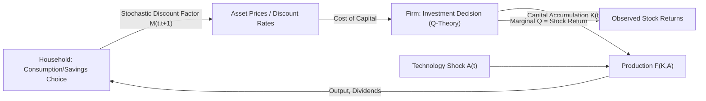

## Asset Pricing in Production Economies

### Definition and Core Concept

Asset pricing in production economies studies how asset prices, expected returns, and risk premia are determined when the supply side of the economy—firms' production, investment, and capital accumulation decisions—is endogenous, rather than treating the consumption/dividend process as an exogenously given endowment. This contrasts with the classic **endowment economy** framework (e.g., Lucas 1978), where output arrives as manna from heaven and asset prices adjust purely to clear markets given a fixed consumption stream.

In a production economy, consumption, investment, capital, and asset prices are jointly determined in general equilibrium: households choose consumption and savings; firms choose investment and production subject to technology and adjustment costs; and equilibrium asset prices must simultaneously satisfy household optimality (the stochastic discount factor) and firm optimality (marginal q, investment Euler equations).

### Motivation: Why Move Beyond Endowment Economies

**Limitations of Endowment Models**

Endowment economies are analytically convenient but suffer from key shortcomings for many asset-pricing questions:

- They take the consumption/output process as exogenous, so they cannot address how investment, technology shocks, or firm characteristics map into risk premia.
- They are silent on cross-sectional asset pricing questions—e.g., why value stocks earn higher average returns than growth stocks, or why firm investment intensity correlates with expected stock returns.
- They cannot speak to the feedback between financial markets and real economic activity (investment, capital allocation), which is central to macro-finance.

**What Production Economies Add**

By modeling the firm's problem explicitly, production-based asset pricing models can:

- Link the equity premium and return volatility to fundamentals of technology and adjustment costs, rather than to an assumed consumption process.
- Generate cross-sectional predictions (value premium, investment-return relations, size effects) from firm heterogeneity in productivity, capital, and growth options.
- Study the two-way interaction between asset prices (cost of capital) and real investment decisions, relevant for questions in corporate finance and macro-finance.

### The Firm's Problem and the Investment Euler Equation

**Basic Setup**

Consider a representative firm with capital stock $K_t$, producing output via a production function $F(K_t, A_t)$ where $A_t$ is a productivity shock. The firm invests $I_t$ each period, subject to capital accumulation:

$$K_{t+1} = (1-\delta)K_t + I_t$$

where $\delta$ is the depreciation rate.

**Adjustment Costs**

A critical modeling ingredient is **capital adjustment costs**, without which Tobin's Q would always equal 1 and investment would be indeterminate/infinitely elastic. A standard specification uses a convex adjustment cost function $\Phi(I_t, K_t)$, often of the form:

$$\Phi(I_t, K_t) = \frac{a}{2}\left(\frac{I_t}{K_t}\right)^2 K_t$$

The firm's dividend in period $t$ is then:

$$D_t = F(K_t, A_t) - I_t - \Phi(I_t, K_t)$$

**Firm Value and the Stochastic Discount Factor**

The firm's value is the present discounted value of future dividends, discounted using the household's stochastic discount factor (SDF) $M_{t,t+1}$, which itself comes from the household's consumption Euler equation:

$$M_{t,t+1} = \beta \frac{U'(C_{t+1})}{U'(C_t)}$$

Firm value satisfies:

$$V_t = \max_{\{I_s, K_{s+1}\}} E_t\left[\sum_{s=t}^{\infty} M_{t,s} D_s\right]$$

**Investment Euler Equation (First-Order Condition)**

Optimizing investment yields a condition frequently written as:

$$1 + \Phi_I(I_t, K_t) = E_t\left[M_{t,t+1}\left(F_K(K_{t+1}, A_{t+1}) + (1-\delta)(1 + \Phi_I(I_{t+1}, K_{t+1})) - \Phi_K(I_{t+1}, K_{t+1})\right)\right]$$

This is the production-economy analogue of the consumption Euler equation: it equates the marginal cost of investing today (left side) to the discounted marginal benefit of installed capital tomorrow (right side), where discounting uses the same SDF that prices all other assets in the economy.

### Tobin's Q and Asset Returns

**Marginal q and the Firm's Stock Return**

A central result in this literature (e.g., Cochrane 1991, "Production-Based Asset Pricing and the Link Between Stock Returns and Economic Fluctuations") is that, under constant returns to scale and standard adjustment cost assumptions, the **return on the firm's capital investment equals the stock return**:

$$R^K_{t+1} = R^S_{t+1}$$

where the investment return is defined using the marginal costs and benefits of capital:

$$R^K_{t+1} = \frac{F_K(K_{t+1}, A_{t+1}) + (1-\delta)q_{t+1} - \Phi_K(I_{t+1}, K_{t+1})}{q_t}$$

with $q_t \equiv 1 + \Phi_I(I_t, K_t)$ being **marginal Q**.

This is a powerful result: it implies stock returns can, in principle, be forecast or explained using data on investment, profitability, and capital alone—without directly modeling consumption—linking the production side of the economy directly to observed asset returns.

**Average Q vs. Marginal Q**

- **Marginal Q**: the ratio of the value of an additional unit of installed capital to its replacement cost—the theoretically correct driver of investment.
- **Average Q**: (market value of the firm) / (replacement cost of total capital)—the empirically observable proxy, typically computed from firm market capitalization and book value of assets.

Under constant returns to scale (linear homogeneity of $F$ and $\Phi$) and perfect competition, **average Q equals marginal Q** (Hayashi 1982), which is what makes empirical "Q-theory of investment" regressions using average Q theoretically justified. Deviations from constant returns to scale, market power, or measurement issues with capital and market value are commonly cited reasons why empirical Q-investment regressions have historically had limited explanatory power [Inference].

### Real Business Cycle (RBC) Connections

Production-based asset pricing models build directly on the **RBC framework**: a representative household maximizes utility over consumption and leisure, a representative firm produces using capital and labor subject to a stochastic technology shock, and the resource constraint links consumption, investment, and output:

$$C_t + I_t = F(K_t, N_t, A_t)$$

The key asset-pricing extension relative to standard RBC is embedding a nontrivial SDF (often requiring more sophisticated preferences than simple CRRA, given the well-documented **equity premium puzzle**) and adjustment costs (to generate meaningful variation in Q and investment).

### Key Empirical Puzzles Addressed

**Equity Premium and Volatility**

Basic RBC-style production models with standard CRRA utility and no adjustment costs tend to generate implausibly low equity premia and excess return volatility relative to the data, mirroring the endowment-economy equity premium puzzle (Mehra-Prescott 1985). Introducing capital adjustment costs generally *raises* the model's implied equity premium and volatility, because it makes capital costly to adjust, so firm value becomes more sensitive to shocks—this is a standard mechanism in this literature [Inference: relative magnitude of the effect is model- and calibration-dependent].

**The Investment-Return and Value Premium Literature**

A substantial body of work (e.g., Zhang 2005, "The Value Premium"; Cochrane 1991, 1996) uses production-based models to explain **cross-sectional** patterns:

- **Value premium**: value firms (high book-to-market) tend to have more unproductive, hard-to-reduce capital ("assets in place"), making them riskier in downturns due to costly capital reversibility, while growth firms have more flexible growth options—generating a risk-based explanation for why value stocks earn higher average returns.
- **Investment-return relation**: firms with high investment tend to have *lower* subsequent average returns, consistent with a q-theory logic: high investment reflects low discount rates/high current Q, and low discount rates imply lower future expected returns.

**Time-to-Build and Asymmetric Adjustment Costs**

Extensions incorporate **time-to-build** (investment takes multiple periods to become productive capital) and **asymmetric adjustment costs** (costly to disinvest/reverse capital relative to increase it), which help models better match the observed asymmetry in firm risk over the business cycle (e.g., value firms being especially risky in recessions, when reducing unproductive capital is hardest).

### Comparison Table: Endowment vs. Production Economy Asset Pricing

| Feature | Endowment Economy | Production Economy |
| --- | --- | --- |
| Consumption/output process | Exogenous | Endogenous (from firm optimization) |
| Investment | Absent or irrelevant | Central margin of adjustment |
| Source of risk premia | Preferences applied to given consumption risk | Preferences + technology + adjustment costs |
| Cross-sectional predictions | Limited (representative claim only) | Rich (value premium, investment-return relation) |
| Key equilibrium object | SDF prices exogenous dividends | SDF and marginal Q jointly determined |
| Canonical reference | Lucas (1978) | Cochrane (1991), Zhang (2005) |

### Diagram: Equilibrium Linkages in a Production Economy (svg_diagram)

### Worked Example: Investment Return Calculation

Suppose a firm has capital $K_t = 100$, and the adjustment cost function is $\Phi(I,K) = 0.5(I/K)^2 K$. Suppose investment $I_t = 10$, so $I_t/K_t = 0.10$.

Marginal Q at time $t$:

$$q_t = 1 + \Phi_I(I_t,K_t) = 1 + \left(\frac{I_t}{K_t}\right) = 1 + 0.10 = 1.10$$

Suppose next period, the marginal product of capital $F_K = 0.15$, depreciation $\delta = 0.10$, and next period's Q is $q_{t+1} = 1.05$, with $\Phi_K \approx 0$ for simplicity. The investment return is:

$$R^K_{t+1} = \frac{F_K + (1-\delta)q_{t+1}}{q_t} = \frac{0.15 + 0.90 \times 1.05}{1.10} = \frac{0.15 + 0.945}{1.10} = \frac{1.095}{1.10} \approx 0.9955$$

This implies a return of approximately $-0.45\%$ for the period, illustrating how declining Q (capital becoming relatively less valuable) can generate a low or negative measured investment/stock return even with positive marginal product of capital, consistent with the theoretical equivalence between investment returns and stock returns under the model's assumptions.

### Related Topics

- Lucas (1978) endowment economy asset pricing
- Tobin's Q theory of investment
- Real Business Cycle (RBC) models
- Equity premium puzzle (Mehra-Prescott)
- Cross-sectional asset pricing: value and momentum
- General equilibrium term structure models
- q-theory empirical investment regressions
- Habit formation and long-run risk models (SDF extensions)
- Costly reversibility and irreversible investment models