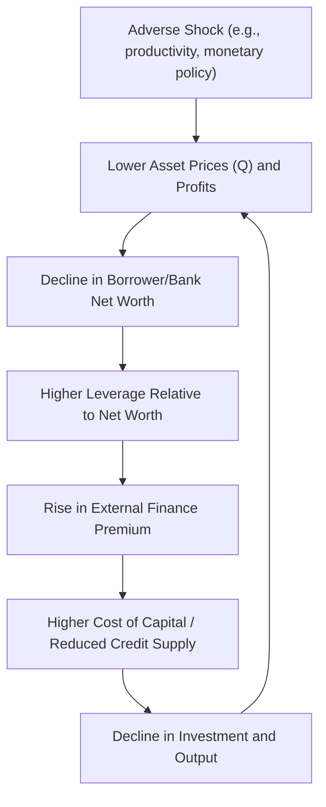

## Financial Accelerator Models

### Definition and Core Concept

Financial accelerator models describe a class of macro-finance frameworks in which frictions in credit markets—arising from information asymmetries between borrowers and lenders—cause small shocks to the economy to be **amplified and propagated** over time, rather than dying out quickly as in frictionless models. The term "financial accelerator" comes from Bernanke, Gertler, and Gilchrist (1999), who formalized how endogenous changes in borrowers' balance sheets create a feedback loop between the real economy and credit conditions.

The core mechanism: adverse shocks reduce borrower net worth → this raises the **external finance premium** (the cost gap between external and internal funds) → higher borrowing costs reduce investment and economic activity → this further depresses net worth (via lower asset prices and profits) → the cycle repeats, amplifying the initial shock. This procyclical feedback loop is the "accelerator."

### Motivation and Theoretical Foundations

**The Agency Cost Problem**

Financial accelerator models are grounded in **costly state verification (CSV)** models of credit, originating with Townsend (1979) and applied to macroeconomics by Bernanke and Gertler (1989) and Bernanke, Gertler, and Gilchrist (1999, hereafter **BGG**). The key friction is asymmetric information: lenders cannot costlessly observe a borrower's true project outcome, so verifying it (e.g., through auditing or bankruptcy proceedings) is costly.

This friction gives rise to an optimal financial contract resembling **standard debt with costly bankruptcy**: the borrower repays a fixed amount if the project succeeds, and the lender seizes the borrower's assets (net of a verification/monitoring cost) if the project fails.

**External Finance Premium**

A central object in these models is the **external finance premium** (EFP)—the wedge between the cost of external funds (borrowing) and the opportunity cost of internal funds (retained earnings/net worth):

$$\text{EFP} = \frac{\text{Cost of External Finance}}{\text{Cost of Internal Finance}}$$

The EFP is a decreasing function of the borrower's **net worth relative to the size of the investment project**. Intuitively, a borrower with more "skin in the game" (higher net worth relative to project size) poses less moral hazard/adverse selection risk to the lender, and therefore faces a lower risk premium.

### The BGG Framework

**Key Agents and Structure**

The canonical BGG model embeds this credit-market friction into an otherwise standard New Keynesian or RBC framework, introducing:

- **Entrepreneurs**: risk-neutral agents who purchase capital and hire labor to produce output, financing capital purchases partly with their own net worth and partly with external borrowing from financial intermediaries.
- **Financial intermediaries**: lend to entrepreneurs, requiring an external finance premium to compensate for expected monitoring costs.
- **Households**: supply labor and save via deposits with financial intermediaries at the risk-free rate.

**Net Worth Dynamics**

Entrepreneurial net worth $N_{t+1}$ evolves according to accumulated profits from capital holdings, net of consumption/dividends and any losses from defaulting entrepreneurs. Formally, net worth is procyclical: it rises with unexpected increases in asset prices (capital gains on existing capital holdings) and with realized returns on capital exceeding the cost of borrowed funds.

**External Finance Premium Function**

The EFP is typically modeled as a function of the entrepreneur's **leverage ratio** (or equivalently, the ratio of net worth to total capital expenditure):

$$s\left(\frac{N_t}{Q_t K_t}\right), \quad s' < 0$$

where $Q_t$ is the price of capital (Tobin's Q) and $K_t$ is the capital stock. As leverage rises (net worth falls relative to capital financed), the premium $s(\cdot)$ rises.

**Amplification Mechanism**

The accelerator mechanism operates through the following chain:

1. A negative shock (e.g., to productivity or monetary policy) reduces asset prices $Q_t$ and current profits.
2. This directly reduces entrepreneurial net worth $N_t$ (since net worth is tied to the value of capital holdings).
3. Lower net worth relative to capital raises leverage, which raises the external finance premium $s(\cdot)$.
4. A higher EFP raises the effective cost of capital for entrepreneurs, reducing investment demand.
5. Lower investment further depresses asset prices $Q_t$ and future capital accumulation, feeding back into net worth in the next period.

This generates **hump-shaped, persistent, and amplified** responses of investment and output to shocks, relative to a frictionless benchmark—one of the primary quantitative successes of the BGG framework relative to standard RBC models [Inference: magnitude of amplification is calibration-dependent].

### Related Frameworks

**Kiyotaki-Moore (1997) Collateral Constraints**

A related but distinct mechanism comes from Kiyotaki and Moore (1997), where borrowing is constrained by the **collateral value** of durable assets (e.g., land) rather than by an endogenous risk premium from costly state verification:

$$B_t \leq \theta \cdot E_t[Q_{t+1} K_t]$$

where $B_t$ is borrowing, $\theta$ is a loan-to-value-type parameter, and $Q_{t+1}K_t$ is the expected future value of collateral. Here, the amplification mechanism runs through asset **prices directly entering the borrowing constraint**: a shock that lowers asset prices tightens the constraint, forcing deleveraging and asset sales, which further depresses prices—a distinct but complementary channel to the BGG net-worth/premium mechanism.

**Bank Capital Channel**

Extensions (e.g., Gertler and Kiyotaki 2010; Gertler and Karadi 2011) apply the same accelerator logic to **financial intermediaries' own balance sheets** rather than (or in addition to) non-financial borrowers. In these models, bank net worth/capital determines banks' ability to intermediate funds, subject to an agency-cost-based leverage constraint (arising from bankers' ability to divert assets). Shocks to bank capital directly restrict credit supply, amplifying and propagating financial shocks through the banking sector—directly relevant to understanding the 2007-2009 crisis, where the initiating shock arguably originated in the financial sector itself rather than in non-financial firm balance sheets.

### Comparison Table: Key Financial Accelerator Frameworks

| Model | Friction Source | Constraint Mechanism | Primary Application |
| --- | --- | --- | --- |
| Bernanke-Gertler-Gilchrist (1999) | Costly state verification | Endogenous external finance premium rising with leverage | Firm/entrepreneur borrowing |
| Kiyotaki-Moore (1997) | Limited contract enforcement | Collateral (loan-to-value) constraint | Land/durable asset-backed borrowing |
| Gertler-Kiyotaki (2010) / Gertler-Karadi (2011) | Banker moral hazard (asset diversion) | Bank leverage constraint tied to bank net worth | Bank intermediation and financial crises |

### Diagram: The Financial Accelerator Feedback Loop (svg_diagram)

### Worked Example: External Finance Premium and Amplification

Suppose the external finance premium is specified as:

$$s\left(\frac{N_t}{Q_tK_t}\right) = \left(\frac{Q_tK_t}{N_t}\right)^{0.05}$$

so the premium rises with leverage $Q_tK_t/N_t$.

**Initial state**: $Q_0 K_0 = 100$, $N_0 = 40$, so leverage $= 2.5$, giving:

s_0 = 2.5^{0.05} \approx 1.047 \Rightarrow \text{4.7% premium over the risk-free rate}

**After a negative shock**: asset prices fall 10%, so $Q_1 K_0 = 90$. Suppose net worth—being a levered claim on capital—falls proportionally more, to $N_1 = 28$ (a 30% decline, reflecting the amplification of asset-price declines into net worth via leverage). New leverage:

\frac{Q_1 K_0}{N_1} = \frac{90}{28} \approx 3.214 \Rightarrow s_1 = 3.214^{0.05} \approx 1.061 \Rightarrow \text{6.1% premium}

The external finance premium rises by about 1.4 percentage points following only a 10% asset price decline, illustrating how a modest shock to fundamentals is amplified into a larger increase in the cost of external finance—raising the cost of capital for new investment and setting the accelerator mechanism in motion for subsequent periods.

### Related Topics

- Bernanke-Gertler-Gilchrist (1999) canonical model
- Kiyotaki-Moore collateral constraint models
- Gertler-Kiyotaki banking sector models
- Costly state verification (Townsend 1979)
- DSGE models with financial frictions
- Bank capital regulation and procyclicality
- Fire sales and asset price feedback loops
- Credit cycles and macroprudential policy
- Quantitative easing and balance sheet policy transmission