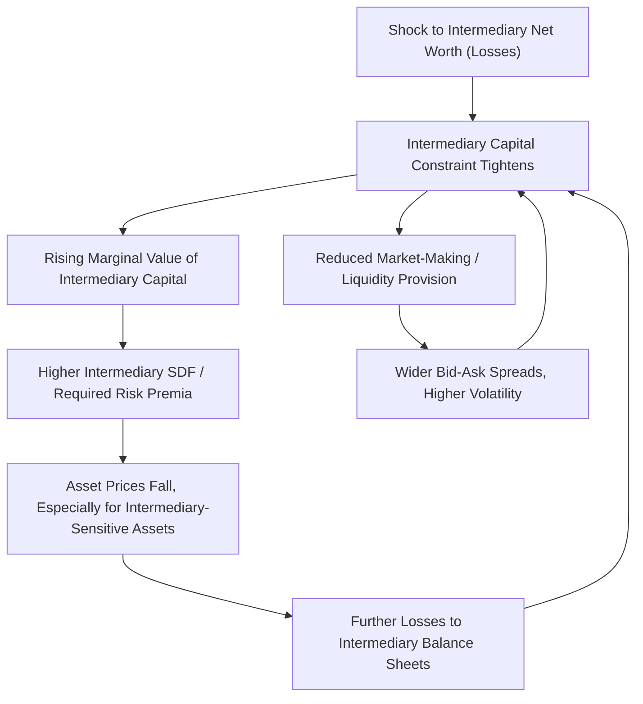

## Intermediary Asset Pricing

### Definition and Core Concept

Intermediary asset pricing is a research paradigm that departs from the standard representative-household asset-pricing framework by positing that **financial intermediaries** (banks, broker-dealers, hedge funds) are the **marginal investors** in many asset markets. Because intermediaries face binding financial constraints (capital requirements, leverage limits, margin/collateral constraints), their balance-sheet health—not aggregate household consumption—becomes the key state variable driving risk premia, asset price volatility, and comovement across asset classes.

The organizing idea: standard consumption-based asset pricing (e.g., CCAPM) assumes households trade directly and frictionlessly in all asset markets, so the household's stochastic discount factor (SDF) prices everything. In reality, most securities trading occurs through specialized intermediaries who face funding and balance-sheet constraints that households do not directly experience. When these constraints bind, intermediary net worth or capital ratios becomes the relevant pricing kernel.

### Motivation: Empirical Failures of Household-Based Models

**The Consumption-CAPM Problem**

Standard consumption-based models struggle to match observed asset pricing facts, including:

- The equity premium puzzle (Mehra-Prescott 1985): observed equity premia are far larger than can be justified by plausible risk aversion applied to consumption growth volatility.
- Weak empirical correlation between measured aggregate consumption growth and asset returns at business-cycle and higher frequencies, given that consumption data is smooth and available only at low (often quarterly) frequency, while asset prices move continuously.
- Difficulty explaining sharp, correlated price declines across seemingly unrelated asset classes during crises (e.g., 2007-2009), which is hard to reconcile with a slow-moving, smooth consumption process.

**The Case for Intermediaries as Marginal Investors**

Intermediary asset pricing models argue that because specialized traders (dealers, banks, hedge funds) are active in essentially every asset market and rebalance far more frequently than households, their financial condition should show up in pricing far more directly than aggregate consumption. Distress at intermediaries—driven by losses, deleveraging, or funding constraints—can explain simultaneous price drops and rising risk premia across otherwise unrelated markets, since the same set of constrained arbitrageurs is marginal in many of these markets.

### Key Theoretical Frameworks

**He and Krishnamurthy (2013)**

He and Krishnamurthy develop a model in which intermediaries (experts) invest household savings in risky assets subject to an equity capital constraint. When intermediary capital is abundant, intermediaries absorb risk efficiently and the SDF resembles a standard household-based one. Following large negative shocks, intermediary capital is depleted, the constraint binds, and intermediaries must be compensated with higher expected returns to hold risky assets—generating time-varying, state-dependent risk premia that spike during crises. The model produces a piecewise SDF: in normal times, standard household-based pricing approximately holds; in crisis states, the intermediary capital constraint drives pricing.

**Brunnermeier and Pedersen (2009): Market and Funding Liquidity**

This framework formalizes the interaction between **market liquidity** (ease of trading an asset) and **funding liquidity** (ease of obtaining funding, e.g., via margin/haircuts). The key mechanism is a **liquidity spiral**:

1. A shock causes intermediary losses or increases the volatility of collateral asset prices.
2. Lenders raise margin requirements/haircuts (tightening funding liquidity) in response to perceived higher risk.
3. Tighter funding forces intermediaries to deleverage, reducing their capacity to provide market liquidity (widening bid-ask spreads, reducing market depth).
4. Reduced market liquidity increases price volatility, further raising margins—amplifying the initial shock (a mechanism closely related to, and complementary with, the financial accelerator literature).

**Adrian and Boyarchenko (2012), and the "Intermediary Leverage" Empirical Literature**

A key insight from Adrian, Etula, and Muir (2014) and related work is that **broker-dealer leverage** (a directly observable proxy for intermediary balance-sheet capacity) is a strong empirical predictor of the cross-section and time series of risk premia. The core empirical claim: shocks to intermediary leverage/capital command a significant risk price across a wide range of asset classes (equities, bonds, currencies, commodities, derivatives)—consistent with intermediaries being marginal investors across these markets, not just in a single specialized niche.

### The Intermediary Stochastic Discount Factor (SDF)

**Core Pricing Equation**

The general intermediary asset pricing approach replaces the household SDF with one derived from intermediary marginal value of wealth. A canonical specification (following He-Krishnamurthy and related work) links the SDF to intermediary capital ratio $\eta_t$ (intermediary net worth relative to total assets/economy size):

$$M_{t,t+1} = f(\eta_t, \eta_{t+1})$$

where the SDF is a decreasing function of intermediary capitalization: low intermediary capital (high leverage, high marginal value of an extra dollar of intermediary net worth) implies a high SDF, meaning assets that pay off when intermediary capital is scarce are especially valuable (high price, low expected return), while assets that do poorly precisely when intermediaries are distressed require higher expected returns as compensation.

**Testable Implication: Intermediary Capital Risk Factor**

This generates a directly testable empirical prediction: an asset's expected excess return should depend on its exposure (beta) to shocks in intermediary capital/leverage, in a manner analogous to standard factor models:

$$E[R^e_{i,t+1}] = \beta_{i,\eta} \cdot \lambda_\eta$$

where $\beta_{i,\eta}$ is the asset's sensitivity to intermediary capital shocks and $\lambda_\eta$ is the price of intermediary capital risk. Empirical work (Adrian, Etula, Muir 2014; He, Kelly, Manela 2017) finds this intermediary capital risk factor helps price a broad cross-section of assets, often comparably to or better than standard consumption-based factors [Inference: relative performance varies by asset class and sample period, and remains an active area of empirical debate].

### Segmented Markets and Limits to Arbitrage

Intermediary asset pricing is closely linked to the broader **limits-to-arbitrage** literature (Shleifer and Vishny 1997), which argues that specialized arbitrageurs, rather than being able to freely correct mispricing, face their own capital constraints (from external investors/creditors who may withdraw capital following losses), which can cause arbitrage capital to flow *out* of markets precisely when mispricing is largest—the opposite of the frictionless-arbitrage prediction, and a mechanism underlying intermediary asset pricing's emphasis on the procyclicality of intermediary risk-bearing capacity.

### Comparison Table: Household-Based vs. Intermediary-Based Asset Pricing

| Feature | Household-Based (CCAPM) | Intermediary-Based |
| --- | --- | --- |
| Marginal investor | Representative household | Specialized financial intermediary |
| Key state variable | Aggregate consumption growth | Intermediary net worth/leverage/capital ratio |
| Data frequency alignment | Poor (consumption is smooth, low-frequency) | Better (intermediary balance sheets move at high frequency) |
| Crisis behavior | Risk premia move slowly with consumption | Risk premia spike sharply as intermediary constraints bind |
| Cross-market comovement | Not naturally explained | Naturally explained (same intermediaries price many markets) |
| Canonical models | Lucas (1978), Mehra-Prescott (1985) | He-Krishnamurthy (2013), Brunnermeier-Pedersen (2009), Adrian-Etula-Muir (2014) |

### Diagram: Intermediary Capital and the Pricing Kernel (svg_diagram)

### Worked Example: Pricing with an Intermediary Capital Factor

Suppose empirical estimation yields a price of intermediary capital risk $\lambda_\eta = 6\%$ per year (the extra expected return per unit of exposure to intermediary capital shocks), consistent in magnitude with estimates in this literature [Unverified: illustrative value for exposition, not a specific published estimate].

Consider two assets:

- **Asset A** (e.g., a AAA-rated tranche often held via repo funding by dealers): estimated $\beta_{A,\eta} = 1.2$ (high sensitivity to intermediary capital, since dealers are heavily involved in funding and market-making for this asset class).
- **Asset B** (e.g., a small-cap equity held predominantly by long-only retail/household investors): estimated $\beta_{B,\eta} = 0.3$ (lower sensitivity to intermediary capital shocks).

Predicted risk premia:

$$E[R^e_A] = 1.2 \times 6\% = 7.2\%$$

$$E[R^e_B] = 0.3 \times 6\% = 1.8\%$$

This illustrates the core empirical logic of the literature: assets whose returns are more exposed to intermediary balance-sheet shocks should command a higher risk premium, even if their exposure to aggregate consumption risk (standard CCAPM beta) is similar or even lower—providing a distinct, testable channel from the traditional consumption-based approach.

### Related Topics

- He and Krishnamurthy (2013) intermediary asset pricing model
- Brunnermeier and Pedersen (2009) liquidity spirals
- Broker-dealer leverage as a pricing factor (Adrian, Etula, Muir)
- Limits to arbitrage (Shleifer and Vishny 1997)
- Margin and haircut dynamics in repo markets
- Basel capital requirements and intermediary risk-bearing capacity
- Financial accelerator models (borrower vs. intermediary balance sheets)
- Cross-asset comovement and contagion during crises
- Shadow banking and non-bank financial intermediation