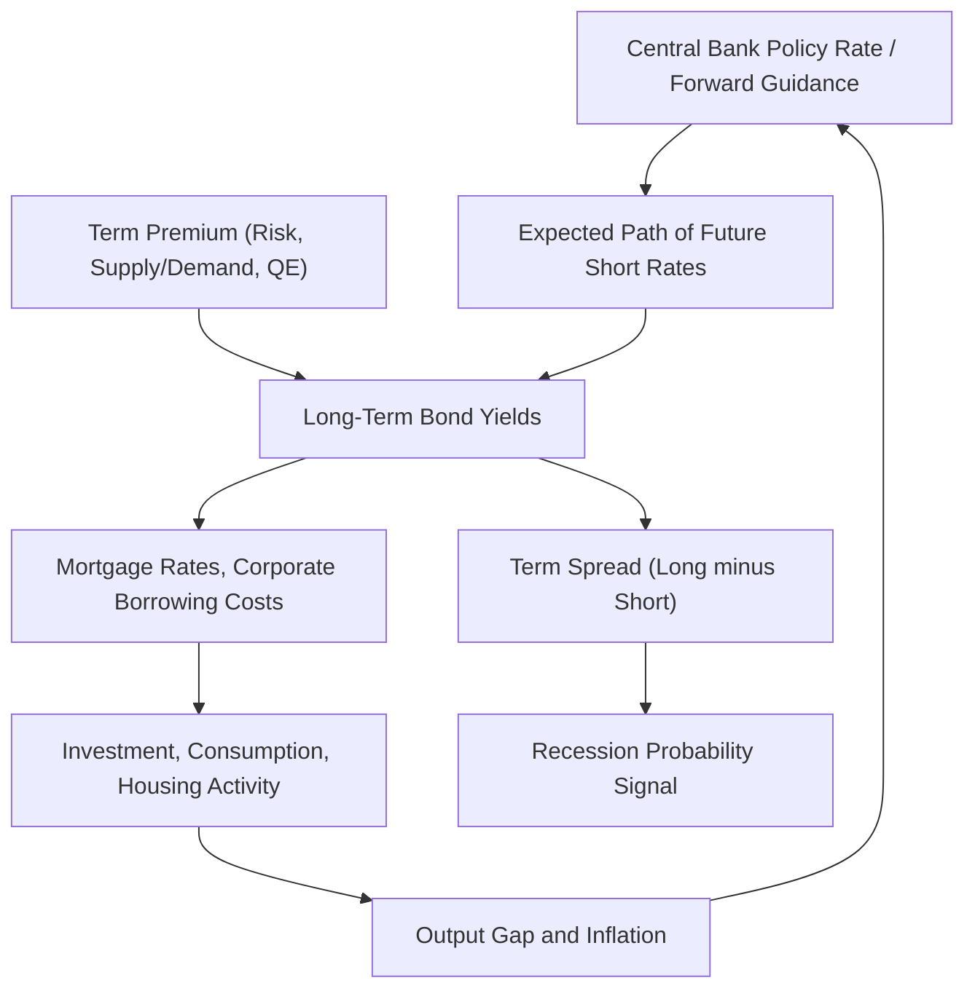

## The Term Structure and the Macroeconomy

### Definition and Core Concept

This topic examines the two-way relationship between the **yield curve** (the term structure of interest rates) and macroeconomic conditions—output, inflation, monetary policy, and the business cycle. On one side, macroeconomic fundamentals and expectations about their future path drive the pricing of bonds of different maturities. On the other, the yield curve itself contains forward-looking information about the macroeconomy and directly influences real economic activity through the cost of borrowing and financial conditions.

The central analytical objects are:

- **Nominal yield curve**: yields on default-free nominal bonds across maturities.
- **Real yield curve**: yields on inflation-protected securities (e.g., TIPS), reflecting the real cost of borrowing.
- **Term premium**: the compensation investors require for holding longer-maturity bonds beyond what is explained by expected future short rates.
- **Breakeven inflation**: the difference between nominal and real yields at a given maturity, a market-based proxy for expected inflation (plus an inflation risk premium).

### Decomposing the Yield Curve

**The Expectations Hypothesis**

The starting point for linking yields to macro fundamentals is the **Expectations Hypothesis (EH)**, which states that the yield on a long-term bond equals the average expected future short-term rates over the life of the bond (plus, in weaker versions, a constant term premium):

$$y_t^{(n)} = \frac{1}{n}\sum_{i=0}^{n-1} E_t[r_{t+i}] + \text{term premium}$$

where $y_t^{(n)}$ is the yield on an $n$-period bond and $r_t$ is the short rate. Under the pure EH (with a zero or constant term premium), long rates are simply a weighted average of expected future short rates, which are themselves determined by the expected path of monetary policy.

**Empirical Rejections of the Pure EH**

Extensive empirical work (notably Fama and Bliss 1987; Campbell and Shiller 1991) finds that the pure EH is strongly rejected: **forward rates and yield spreads predict excess bond returns**, not just future short-rate changes, implying a **time-varying term premium** rather than a constant one. This is analogous to the equity return predictability literature (e.g., dividend-price ratio predicting stock returns), and has motivated a large literature on time-varying bond risk premia.

**Yields-Only Decomposition**

Given time-varying term premia, any observed long yield can be decomposed as:

$$y_t^{(n)} = \underbrace{\frac{1}{n}\sum_{i=0}^{n-1} E_t[r_{t+i}]}_{\text{expectations component}} + \underbrace{TP_t^{(n)}}_{\text{term premium}}$$

Disentangling these two components empirically (e.g., via affine term structure models, discussed below) is central to interpreting whether yield curve movements reflect changing expectations about future policy/growth, or changing risk compensation/market conditions.

### Affine Term Structure Models

**General Framework**

Affine term structure models (ATSMs) are the workhorse class of models linking bond prices to a small set of underlying (often macro-related) state variables $X_t$, under the assumption that bond yields are affine (linear plus a constant) functions of the states:

$$y_t^{(n)} = A_n + B_n' X_t$$

**No-Arbitrage Restrictions**

These models impose the absence of arbitrage by requiring that bond prices satisfy the standard no-arbitrage pricing recursion using a stochastic discount factor:

$$P_t^{(n)} = E_t[M_{t,t+1} P_{t+1}^{(n-1)}]$$

with the SDF typically specified as an exponential-affine function of the states and shocks:

$$M_{t,t+1} = \exp\left(-r_t - \frac{1}{2}\lambda_t'\lambda_t - \lambda_t'\varepsilon_{t+1}\right)$$

where $\lambda_t$ is the (potentially time-varying) market price of risk, which is the key object generating a time-varying term premium. Solving this recursion under Gaussian affine dynamics for $X_t$ yields closed-form (up to matrix Riccati recursions) expressions for the loadings $A_n, B_n$.

**Macro-Finance Affine Models**

A key development (Ang and Piazzesi 2003) was incorporating explicit macroeconomic variables (inflation, output growth/output gap) directly into the state vector $X_t$, alongside latent factors, allowing the model to:

- Directly link the shape of the yield curve to observable macro conditions.
- Decompose yield movements into components attributable to expected inflation, expected real activity, and residual (latent) factors capturing risk premia and unspanned information.
- Improve out-of-sample bond return and yield forecasting relative to purely latent-factor (Nelson-Siegel-type) models, which link yields only to statistical factors ("level," "slope," "curvature") without direct macro interpretation.

### The Yield Curve as a Business Cycle Predictor

**Term Spread and Recession Prediction**

One of the most robust stylized facts in macro-finance is that the **term spread**—the difference between long-term (e.g., 10-year) and short-term (e.g., 3-month) Treasury yields—is a strong predictor of future recessions. An **inverted yield curve** (short rates exceeding long rates) has preceded most U.S. recessions since the 1960s.

**Interpretation Channels**

Two broad (non-mutually-exclusive) interpretations exist for why the term spread predicts recessions:

1. **Expectations channel**: an inverted curve reflects markets expecting the central bank to cut short rates in the future in response to anticipated economic weakness—the curve is simply *forecasting* a recession that monetary policy will need to respond to.
2. **Causal/tightening channel**: an inverted curve directly signals (and may partly cause) tight monetary policy and tight bank lending conditions, since bank profitability from maturity transformation (borrowing short, lending long) falls when the curve is flat or inverted, potentially curtailing credit supply and directly slowing real activity.

[Inference: the relative importance of these two channels remains debated in the literature, and disentangling pure forecasting content from a causal credit-channel effect is empirically challenging.]

### Monetary Policy Transmission Through the Yield Curve

**Policy Rate vs. Long Rates**

Central banks directly control only very short-term rates (e.g., the federal funds rate), yet most economically relevant borrowing (mortgages, corporate bonds, capital investment) is priced off intermediate- and long-term rates. Monetary policy therefore transmits to the real economy substantially through its effect on the **entire yield curve**, not just the short end—operating through both the expectations component (signaling the future path of short rates, i.e., **forward guidance**) and, particularly since the Global Financial Crisis, direct term premium compression via **quantitative easing (QE)**.

**Term Premium Channel of QE**

The preferred-habitat framework (Vayanos and Vila 2009; Modigliani and Sutch 1966, revisited) provides the theoretical basis for QE's effectiveness: if some investors have preferences for specific maturities (e.g., pension funds preferring long-duration bonds) and arbitrageurs face risk/capital constraints limiting their ability to fully offset supply changes, then central bank purchases of long-term bonds can directly reduce the term premium and long-term yields, independent of any change in the expected path of short rates—a **portfolio balance channel** distinct from pure signaling/expectations effects.

### Comparison Table: Key Yield Curve Concepts

| Concept | Definition | Macro Relevance |
| --- | --- | --- |
| Expectations Hypothesis | Long yield = average expected future short rates | Baseline (empirically rejected) benchmark |
| Term premium | Excess compensation for holding long bonds beyond EH | Time-varying; reflects risk appetite, uncertainty |
| Term spread | Long yield minus short yield | Recession predictor; monetary policy stance indicator |
| Breakeven inflation | Nominal yield minus real (TIPS) yield | Market-implied inflation expectations + risk premium |
| Preferred habitat / portfolio balance | Segmented demand across maturities | Rationalizes QE effects on term premium |

### Diagram: Yield Curve Transmission to the Macroeconomy (svg_diagram)

### Worked Example: Decomposing a Long-Term Yield

Suppose the current 5-year nominal Treasury yield is $y_t^{(5)} = 4.2\%$. A macro-finance affine term structure model estimates the expectations component (average expected future short rates over 5 years) at $3.1\%$.

The implied term premium is:

$$TP_t^{(5)} = y_t^{(5)} - E_t\left[\frac{1}{5}\sum_{i=0}^{4} r_{t+i}\right] = 4.2\% - 3.1\% = 1.1\%$$

Separately, suppose the 5-year TIPS (real) yield is $1.4\%$. Breakeven inflation is:

$$\pi^{BE}_t = y_t^{(5),nominal} - y_t^{(5),real} = 4.2\% - 1.4\% = 2.8\%$$

If the estimated inflation risk premium embedded in breakeven inflation is $0.3\%$, then market-implied expected inflation is $2.8\% - 0.3\% = 2.5\%$. This decomposition illustrates how a single observed nominal yield can be broken into expected short-rate path, term premium, expected inflation, and inflation risk premium components—each carrying distinct macroeconomic information for policymakers and forecasters.

### Related Topics

- Expectations Hypothesis and its empirical rejections (Fama-Bliss, Campbell-Shiller)
- Affine term structure models (Ang-Piazzesi, Duffie-Kan)
- Preferred habitat theory and portfolio balance channel
- Quantitative easing and unconventional monetary policy
- TIPS, breakeven inflation, and inflation risk premia
- Yield curve inversion as a recession indicator
- Forward guidance and central bank communication
- Nelson-Siegel and latent factor yield curve models
- Bond risk premia and return predictability