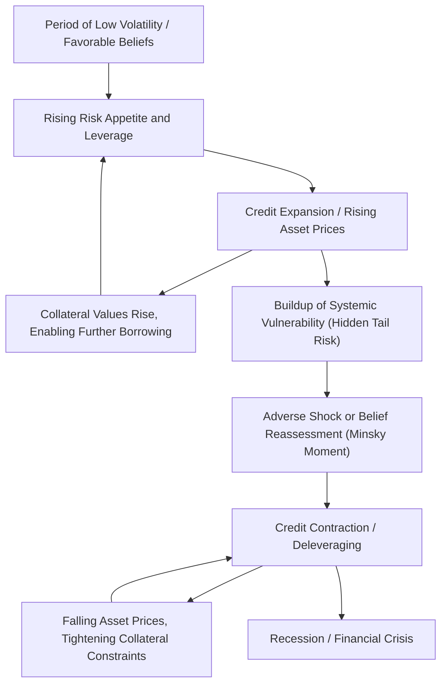

## Credit Cycles

### Definition and Core Concept

Credit cycles refer to the recurring, medium-to-long-frequency fluctuations in the availability, pricing, and volume of credit in an economy, characterized by alternating phases of credit expansion (boom) and contraction (bust), which are typically distinct from—and often longer than—standard business cycles. Credit cycles are a central object of study in macro-finance because they interact with, amplify, and sometimes independently drive real economic fluctuations, asset prices, and financial crises.

Key distinguishing features relative to standard business cycles:

- **Lower frequency**: credit cycles (often estimated at 15-20+ years, historically) tend to be longer than typical business cycles (roughly 5-8 years), though this varies across studies and time periods [Inference: precise cycle length estimates are sensitive to methodology and sample].
- **Amplitude asymmetry**: credit busts (deleveraging phases) are often more abrupt and economically costly than the buildup phase, particularly when accompanied by banking crises.
- **Self-reinforcing dynamics**: credit expansions can be self-fueling (collateral value increases enable more borrowing, which further raises collateral values) in ways that pure real-sector business cycle models do not generate on their own.

### Stylized Facts and Empirical Regularities

**Credit Booms Predict Crises**

A large empirical literature (notably Schularick and Taylor 2012, "Credit Booms Gone Bust") documents that **rapid growth in bank credit relative to GDP** is one of the most robust predictors of subsequent financial crises, often outperforming other macro-financial indicators. This finding holds across long historical samples spanning multiple countries and financial regimes.

**Credit-to-GDP Gap**

A widely used empirical measure, adopted by the Basel Committee for macroprudential policy (specifically for calibrating the **countercyclical capital buffer**), is the **credit-to-GDP gap**: the deviation of the credit-to-GDP ratio from its long-run (typically Hodrick-Prescott filtered) trend:

$$\text{Gap}_t = \left(\frac{\text{Credit}_t}{\text{GDP}_t}\right) - \text{Trend}\left(\frac{\text{Credit}}{\text{GDP}}\right)_t$$

Large positive gaps historically signal elevated crisis risk over subsequent years, motivating its use as an early-warning indicator by regulators (e.g., under Basel III macroprudential frameworks).

**Household vs. Firm Credit Cycles**

Research (e.g., Mian, Sufi, and Verner 2017, "Household Debt and Business Cycles Worldwide") distinguishes household credit expansions from firm/business credit expansions, finding that rapid growth in **household debt** relative to GDP is particularly predictive of subsequent slowdowns in GDP growth and rising unemployment, potentially operating through a different mechanism (aggregate demand effects from debt service burdens) than firm-credit-driven cycles (which operate more directly through investment and the financial accelerator).

### Theoretical Mechanisms Generating Credit Cycles

**Collateral Constraints and Asset Price Feedback (Kiyotaki-Moore)**

As discussed in financial accelerator models, when borrowing capacity is tied to collateral value (e.g., $B_t \leq \theta E_t[Q_{t+1}K_t]$), a positive shock raising asset prices $Q_t$ relaxes borrowing constraints, enabling more borrowing and investment, which can further bid up asset prices—generating a **self-reinforcing upswing**. The mechanism reverses symmetrically in a downturn: falling asset prices tighten constraints, forcing deleveraging and asset sales, further depressing prices.

**Bank Risk-Taking and the "Volatility Paradox"**

A distinct strand of literature (e.g., Adrian and Shin 2010; Brunnermeier and Sannikov 2014) emphasizes that during calm periods, measured risk (volatility, default probabilities) tends to be low, which—under standard risk-management practices (e.g., Value-at-Risk-based leverage targeting)—permits and encourages intermediaries to **increase leverage**. This "volatility paradox" means the conditions that appear safest (low measured volatility) are precisely those associated with rising systemic leverage and vulnerability, since low current volatility often masks the buildup of tail risk. When shocks eventually materialize, the excess leverage built up during the calm period amplifies the ensuing contraction.

**Diagnostic Expectations and Belief-Based Credit Cycles**

More recent behavioral macro-finance work (e.g., Gennaioli, Shleifer, and Vishny; Bordalo, Gennaioli, and Shleifer on diagnostic expectations) models credit cycles as driven partly by **extrapolative or over-optimistic beliefs** during booms: lenders and borrowers underestimate downside/tail risk after a run of good outcomes, extending credit on overly favorable terms, followed by a sharp correction in beliefs ("Minsky moment") when adverse news arrives, contributing to the severity of the subsequent bust. [Inference: the relative empirical importance of belief-based vs. purely constraint/collateral-based mechanisms remains an active area of research.]

**Minsky's Financial Instability Hypothesis**

Predating much of the formal literature, Hyman Minsky's **Financial Instability Hypothesis** offers a narrative framework in which economic stability itself breeds increasing risk-taking, as agents progressively shift from **hedge finance** (income sufficient to cover both principal and interest) to **speculative finance** (income covers interest only, requiring refinancing of principal) to **Ponzi finance** (income insufficient even to cover interest, requiring asset appreciation or new borrowing to service existing debt)—a progression that leaves the financial system increasingly fragile to a shock or a "Minsky moment" of reassessment.

### Global Financial Cycle

**The International Dimension**

Rey (2013, "Dilemma not Trilemma") and subsequent literature document a **Global Financial Cycle**: cross-border capital flows, asset prices, and credit growth across many countries co-move strongly with a common global factor, closely related to U.S. monetary policy and measures of global risk aversion (e.g., the VIX). This challenges the traditional Mundell-Fleming "trilemma" (that a flexible exchange rate provides full monetary policy independence), suggesting instead a "dilemma": independent monetary policy may only be possible with some form of capital account management, since a purely flexible exchange rate does not fully insulate an economy from the global financial cycle.

### Macroprudential Policy Responses

Given the empirical link between excessive credit growth and financial crises, macroprudential tools aim to **lean against the credit cycle** directly, rather than relying solely on monetary policy (interest rates) or ex-post crisis management. Key tools include:

- **Countercyclical capital buffer (CCyB)**: requires banks to hold additional capital during credit booms (calibrated partly using the credit-to-GDP gap), building buffers that can be released during downturns.
- **Loan-to-value (LTV) and debt-to-income (DTI) limits**: directly restrict household borrowing capacity relative to collateral/income, aiming to dampen the collateral-price feedback loop.
- **Dynamic loan-loss provisioning**: requires banks to build loss reserves during good times based on expected (through-the-cycle) losses, rather than only current (low) realized losses.

### Comparison Table: Business Cycles vs. Credit Cycles

| Feature | Standard Business Cycle | Credit Cycle |
| --- | --- | --- |
| Typical duration | ~5-8 years | Longer, more variable (historically estimated 15-20+ years) [Inference] |
| Primary driver | Productivity/demand shocks | Leverage, collateral values, credit supply/beliefs |
| Amplitude symmetry | Roughly symmetric expansions/contractions | Often asymmetric (gradual boom, sharp bust) |
| Policy tool emphasis | Monetary policy (interest rates) | Macroprudential tools (capital buffers, LTV/DTI limits) |
| Key indicator | Output gap, unemployment | Credit-to-GDP gap, household debt-to-GDP |

### Diagram: Credit Cycle Dynamics (svg_diagram)

### Worked Example: Credit-to-GDP Gap Calculation

Suppose a country's credit-to-GDP ratio has evolved as follows over recent years: Year 1: 85%, Year 2: 92%, Year 3: 101%, Year 4: 112%, Year 5: 118%.

Suppose a smoothed long-run trend (via HP filter or similar) for Year 5 is estimated at 100%. The credit-to-GDP gap is:

$$\text{Gap}_{\text{Year 5}} = 118\% - 100\% = 18 \text{ percentage points}$$

Under Basel III-style calibration guidance, a gap of this magnitude (well above commonly cited threshold ranges associated with elevated crisis risk in cross-country studies) would typically prompt regulators to consider activating or raising the countercyclical capital buffer, requiring banks to hold additional capital against this rapid credit growth as a precautionary buffer against a subsequent credit bust. [Inference: specific buffer calibration and threshold levels vary by jurisdiction and regulatory framework.]

### Related Topics

- Financial accelerator models (Bernanke-Gertler-Gilchrist)
- Kiyotaki-Moore collateral constraints
- Minsky's Financial Instability Hypothesis
- Global Financial Cycle (Rey 2013) and monetary policy trilemma
- Macroprudential policy tools (CCyB, LTV/DTI limits)
- Household debt and business cycles (Mian-Sufi-Verner)
- Diagnostic expectations and belief-based cycles
- Volatility paradox and procyclical bank leverage
- Schularick-Taylor credit boom early warning indicators