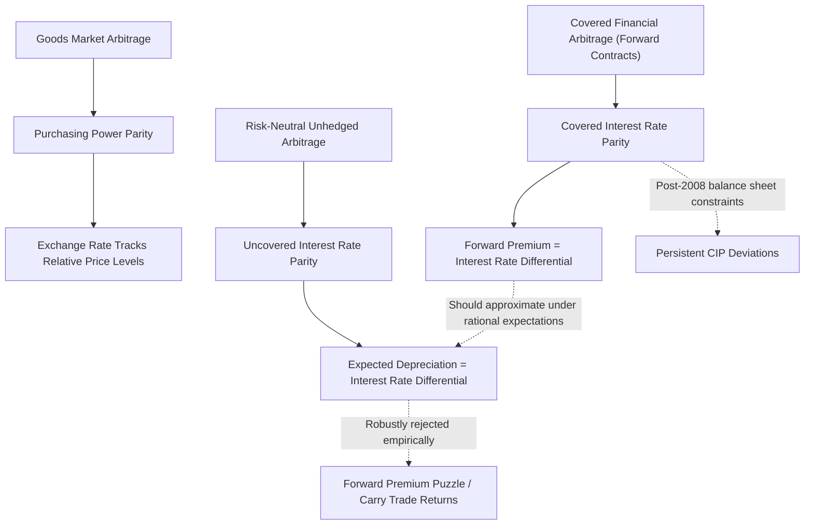

## Purchasing Power Parity and Interest Rate Parity

### Definition and Core Concept

Purchasing power parity (PPP) and interest rate parity (IRP) are two foundational **no-arbitrage conditions** in international finance that link exchange rates to price levels and interest rate differentials, respectively. Both represent equilibrium relationships that would hold exactly under frictionless, fully integrated goods and capital markets, but both are subject to well-documented and extensively studied empirical deviations that form a central focus of international macro-finance research.

- **PPP** links the exchange rate to relative price levels across countries, based on goods market arbitrage.
- **IRP** links the exchange rate (spot and forward) to interest rate differentials, based on capital market/financial arbitrage.

### Purchasing Power Parity (PPP)

**Absolute PPP**

The **Law of One Price (LOP)** applied at the aggregate price-level basis gives absolute PPP: the exchange rate should equalize the price of an identical basket of goods across countries when expressed in a common currency:

$$S_t = \frac{P_t}{P_t^*}$$

where $S_t$ is the nominal exchange rate (domestic currency per unit of foreign currency), $P_t$ is the domestic price level, and $P_t^*$ is the foreign price level.

**Relative PPP**

A weaker, more empirically tractable version—**relative PPP**—states that the *percentage change* in the exchange rate should equal the *inflation differential* between countries:

$$\frac{\Delta S_t}{S_t} \approx \pi_t - \pi_t^*$$

where $\pi_t$ and $\pi_t^*$ are domestic and foreign inflation rates. This version does not require the LOP to hold exactly in levels (e.g., due to persistent price-level differences from non-traded goods, taxes, or market structure) but only that *changes* track relative inflation.

**Real Exchange Rate**

PPP deviations are typically summarized via the **real exchange rate**:

$$Q_t = \frac{S_t P_t^*}{P_t}$$

Under absolute PPP, $Q_t = 1$ at all times. Empirically, real exchange rates exhibit large and persistent deviations from 1, and much of the empirical PPP literature is concerned with characterizing the dynamics of $Q_t$.

**The PPP Puzzle**

A well-documented empirical regularity (Rogoff 1996, "The Purchasing Power Parity Puzzle") is that real exchange rates show:

1. **Large short-run volatility**, comparable to or exceeding nominal exchange rate volatility, difficult to reconcile with relatively sticky/slow-moving price levels.
2. **Extremely slow mean reversion**, with estimated half-lives of deviations from PPP commonly cited in the literature as falling in a 3-5 year range—far slower than can be explained by standard sticky-price macroeconomic models, which typically imply price adjustment over a much shorter horizon (e.g., 1 year or less).

This combination—high short-run volatility together with slow reversion—is what Rogoff termed the "PPP puzzle," and it remains only partially resolved [Inference: proposed resolutions include trade costs/pricing-to-market frictions, sectoral heterogeneity, and small-sample statistical biases in half-life estimation, but no single explanation has achieved full consensus].

**Balassa-Samuelson Effect**

A prominent explanation for *systematic, level* deviations from absolute PPP (as opposed to short-run dynamics) is the **Balassa-Samuelson effect**: countries with higher productivity growth in the tradable goods sector experience rising wages economy-wide (as tradable-sector wage gains spill over to non-tradable sectors via labor mobility), which raises the relative price of non-tradable goods and services. Since price indices include non-tradables, this generates a systematically higher price level (and hence an appreciated real exchange rate) in faster-growing/richer economies, even absent any nominal exchange rate misalignment.

### Interest Rate Parity (IRP)

**Covered Interest Rate Parity (CIP)**

CIP is a pure no-arbitrage condition linking the spot exchange rate, the forward exchange rate, and interest rate differentials, exploiting the fact that forward contracts eliminate exchange rate risk:

$$F_t = S_t \left(\frac{1+i_t}{1+i_t^*}\right)$$

where $F_t$ is the forward rate, $S_t$ is the spot rate, and $i_t, i_t^*$ are domestic and foreign interest rates over the contract horizon. Equivalently, in approximate log form:

$$f_t - s_t \approx i_t - i_t^*$$

CIP historically held extremely tightly in practice (essentially as a hard arbitrage condition, since it involves no exchange rate risk—only counterparty/settlement risk), making it one of the most reliable relationships in international finance prior to the Global Financial Crisis.

**CIP Deviations Post-2008**

A major finding in post-crisis international finance research (Du, Tepper, and Verdelhan 2018, "Deviations from Covered Interest Rate Parity") is that **persistent, economically significant CIP deviations** emerged after 2008 and have continued since, across major currency pairs and creditworthy counterparties, despite the condition's near-riskless arbitrage nature. Leading explanations include:

- **Post-crisis balance sheet constraints and regulation**: tighter bank capital and leverage requirements (e.g., Basel III leverage ratio) raise the cost of intermediating the arbitrage trade for banks, even when the trade is nominally riskless, since balance sheet space itself has become costly.
- **Convenience yield differentials**: safe dollar-denominated assets carry a premium (convenience yield) reflecting global demand for dollar-safe assets, driving a wedge that shows up as a persistent CIP basis.

This is frequently cited as a leading example of **intermediary asset pricing** frictions manifesting directly in a previously "textbook" arbitrage relationship.

**Uncovered Interest Rate Parity (UIP)**

UIP extends the logic to *expected* (rather than forward-contracted) exchange rate changes, positing that expected depreciation of a currency should equal the interest rate differential, reflecting risk-neutral arbitrage across otherwise identical assets differing only in currency of denomination:

$$E_t\left[\frac{S_{t+1} - S_t}{S_t}\right] \approx i_t - i_t^*$$

Unlike CIP, UIP is **not** a pure no-arbitrage condition (since it involves unhedged currency risk and an expectation), and it relies on risk neutrality or the absence of a currency risk premium to hold.

### The Forward Premium Puzzle (UIP Failure)

**Empirical Evidence**

UIP is one of the most robustly *rejected* relationships in international macro-finance. Regressions of the form:

$$s_{t+1} - s_t = \alpha + \beta(i_t - i_t^*) + \varepsilon_{t+1}$$

should yield $\beta = 1$ under UIP. Instead, empirical estimates across many currency pairs and time periods commonly find $\beta$ close to zero or even **negative**—implying that currencies with higher interest rates tend to *appreciate* rather than depreciate as UIP would predict, the opposite of the theoretical prediction. This is known as the **forward premium puzzle** (Fama 1984) and underlies the well-documented profitability of **carry trade** strategies (borrowing in low-interest-rate currencies to invest in high-interest-rate currencies).

**Proposed Explanations**

- **Time-varying currency risk premia**: the UIP regression coefficient reflects not only expectational errors but also a risk premium correlated with interest differentials; if high-interest-rate currencies carry a *negative* risk premium correlation with the interest differential, this can generate the observed negative $\beta$.
- **Peso problems**: rare, large depreciation events that are anticipated by markets (rationally raising forward-implied expected depreciation) but do not occur within a given finite sample, biasing realized-return-based tests.
- **Limits to arbitrage / crash risk**: carry trades are exposed to occasional sharp, correlated unwinding ("crash risk"), such that the average positive carry trade profit represents compensation for a highly negatively skewed risk exposure rather than a pure anomaly, consistent with an intermediary-constraint-based interpretation.

### Comparison Table: PPP vs. IRP Conditions

| Condition | Links | Arbitrage Basis | Empirical Status |
| --- | --- | --- | --- |
| Absolute PPP | Exchange rate to price level ratio | Goods market (Law of One Price) | Strongly rejected in levels |
| Relative PPP | Exchange rate change to inflation differential | Goods market | Holds better over very long horizons; poor short-run fit |
| Covered IRP (CIP) | Forward rate to interest differential | Pure financial arbitrage (hedged) | Held tightly pre-2008; persistent deviations since |
| Uncovered IRP (UIP) | Expected exchange rate change to interest differential | Financial arbitrage (unhedged, risk-neutral) | Strongly and robustly rejected (forward premium puzzle) |

### Diagram: PPP and IRP Arbitrage Linkages (svg_diagram)

### Worked Example: CIP and UIP Calculations

**CIP Example**: Suppose the 1-year domestic interest rate is $i_t = 5\%$, the foreign interest rate is $i_t^* = 2\%$, and the spot rate is $S_t = 1.10$ (domestic currency per unit of foreign currency). Under CIP, the no-arbitrage forward rate is:

$$F_t = 1.10 \times \frac{1.05}{1.02} = 1.10 \times 1.0294 \approx 1.1324$$

The forward rate implies the domestic currency depreciates (forward rate is higher, meaning more domestic currency needed per foreign unit) by approximately 2.94%, exactly offsetting the 3-percentage-point interest rate advantage of the domestic currency—consistent with no-arbitrage.

**UIP Puzzle Illustration**: If UIP held, the *expected* spot rate in one year would equal the forward rate: $E_t[S_{t+1}] \approx 1.1324$, implying the higher-interest domestic currency is expected to depreciate. Empirically, the forward premium puzzle literature finds that, on average across many currency pairs and periods, the higher-interest-rate currency **fails to depreciate as much as predicted (or even appreciates)**—so an investor borrowing in the low-interest foreign currency and investing in the high-interest domestic currency (a carry trade) would, contrary to the UIP prediction of exactly offsetting expected depreciation, earn a positive average excess return historically in many documented samples. [Unverified: realized performance varies substantially by currency pair, sample period, and is subject to occasional sharp reversals/crash risk.]

### Related Topics

- Law of One Price and goods market arbitrage frictions
- Real exchange rate dynamics and half-life estimation
- Balassa-Samuelson effect and productivity-driven price levels
- Covered interest rate parity deviations (Du-Tepper-Verdelhan)
- Forward premium puzzle and carry trade strategies
- Peso problems and rare disaster risk in exchange rates
- Intermediary asset pricing and balance sheet constraints
- Exchange rate models: monetary approach, Dornbusch overshooting
- Global Financial Cycle and capital flow dynamics