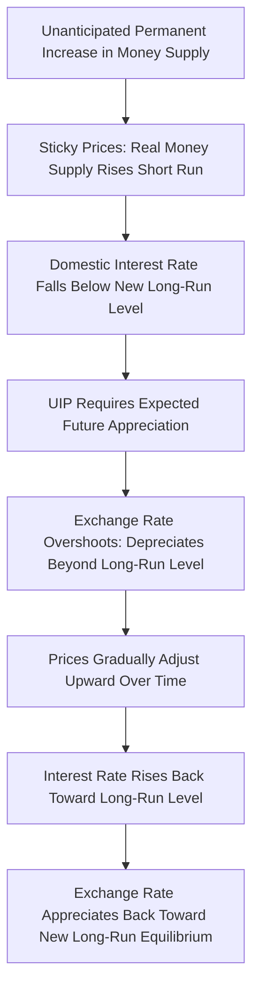

## Exchange Rate Determination Models

### Definition and Core Concept

Exchange rate determination models are macroeconomic frameworks that explain the level and dynamics of nominal exchange rates as outcomes of monetary policy, price adjustment, asset market equilibrium, and expectations. These models form the theoretical backbone of international macro-finance, evolving from simple monetary models to richer sticky-price and portfolio-balance frameworks in response to persistent empirical puzzles—most notably the finding that exchange rates are extremely difficult to forecast using observable macro fundamentals.

### The Flexible-Price Monetary Model

**Core Setup**

The flexible-price monetary model (Frenkel 1976; Bilson 1978) combines PPP with standard money demand functions in both countries. Assuming continuous PPP holds ($S_t = P_t/P_t^*$) and money demand takes a standard form:

$$m_t - p_t = \phi y_t - \lambda i_t$$

$$m_t^* - p_t^* = \phi y_t^* - \lambda i_t^*$$

where $m_t$ is (log) money supply, $p_t$ is (log) price level, $y_t$ is (log) real output, and $i_t$ is the nominal interest rate. Combining these with PPP yields the exchange rate as a function of relative money supplies, output, and interest rates:

$$s_t = (m_t - m_t^*) - \phi(y_t - y_t^*) + \lambda(i_t - i_t^*)$$

**Key Predictions**

- A relative increase in domestic money supply depreciates the domestic currency proportionally (one-for-one in logs), consistent with quantity-theory intuition.
- Higher domestic output (raising real money demand) *appreciates* the currency, since more money is demanded to support the same nominal money stock, requiring a lower price level (and hence, via PPP, a stronger currency) to clear the money market.
- Higher domestic interest rates *depreciate* the currency in this model—because higher $i_t$ reduces money demand, which (holding money supply fixed) requires a higher price level to clear the market, and by PPP, a higher (depreciated) exchange rate. This prediction—that higher interest rates *weaken* rather than strengthen a currency—is a distinguishing and often counterintuitive feature of the flexible-price framework relative to popular intuition.

**Limitations**

The model assumes continuous PPP, which (as established in the PPP/IRP topic) is strongly rejected empirically in the short-to-medium run, motivating the shift to sticky-price frameworks.

### The Dornbusch Overshooting Model

**Motivation**

Dornbusch (1976) addressed a key empirical puzzle: exchange rates are far more volatile than relative money supplies or price levels, and appear to "overshoot" their long-run equilibrium level following monetary shocks. Dornbusch's model reconciles this with rational, forward-looking asset markets by combining **sticky goods prices** in the short run with **flexible, forward-looking asset (exchange rate) markets**.

**Mechanism**

The core intuition: following an unanticipated permanent increase in domestic money supply,

1. In the **long run**, monetary neutrality implies prices rise proportionally, and by PPP, the exchange rate depreciates proportionally—this defines the new long-run equilibrium $\bar{s}$.
2. In the **short run**, goods prices are sticky (do not jump immediately), so the real money supply $m_t - p_t$ rises, lowering the domestic interest rate (via the money market/LM-type relationship) below the new long-run level.
3. By UIP, a lower domestic interest rate relative to foreign rates requires the currency to be *expected to appreciate* going forward to equalize expected returns, meaning the exchange rate must **overshoot** its long-run depreciated level (jump further than $\bar{s}$) immediately, so that its subsequent expected appreciation back toward $\bar{s}$ exactly offsets the interest differential.
4. Over time, as sticky prices gradually adjust upward toward their new long-run level, the interest rate rises back toward its long-run value, and the exchange rate appreciates back from its overshot level toward $\bar{s}$.

**Formal Overshooting Condition**

The model's central qualitative result is that the *impact* exchange rate response exceeds the long-run response:

$$|s_0 - s_{-1}| > |\bar{s} - s_{-1}|$$

with the exchange rate subsequently converging monotonically back toward $\bar{s}$—generating exchange rate volatility exceeding underlying fundamental volatility purely from the interaction of sticky prices and forward-looking asset markets, without requiring any risk premium or bubble component.

### Asset Market and Portfolio Balance Models

**Core Idea**

Portfolio balance models (Branson 1977; Kouri 1976) extend beyond pure monetary models by treating domestic and foreign bonds as **imperfect substitutes** in investor portfolios (in contrast to the perfect substitutability assumed under UIP), introducing a role for relative asset **supplies**, not just relative returns, in exchange rate determination.

**Key Mechanism**

Because domestic and foreign bonds are imperfect substitutes, investors require a **risk premium** to hold the currency composition of their portfolio at any given level, and this risk premium depends on the *relative outstanding stock* of domestic vs. foreign assets:

$$E_t[\Delta s_{t+1}] = (i_t - i_t^*) + \rho(B_t, B_t^*)$$

where $\rho(\cdot)$ is a risk premium increasing in the relative supply of domestic assets that the market must be induced to hold. This provides a channel through which **sterilized foreign exchange intervention** (changing the relative supply of domestic vs. foreign currency bonds without changing money supply/interest rates) can affect the exchange rate—a channel absent in the pure monetary model, where only unsterilized (money-supply-changing) intervention matters.

### The Exchange Rate Disconnect Puzzle

**Meese and Rogoff (1983)**

A landmark and highly influential empirical finding is that of **Meese and Rogoff (1983)**: standard structural exchange rate models (monetary, sticky-price, portfolio balance)—even when given the benefit of ex-post realized values of their own right-hand-side fundamentals—**fail to outperform a naive random walk** in out-of-sample exchange rate forecasting at short-to-medium horizons (up to 1 year). This result has proven remarkably robust across subsequent decades of research using extended datasets and alternative models, and constitutes the **exchange rate disconnect puzzle**: exchange rates appear largely disconnected from measurable macroeconomic fundamentals at the frequencies typically studied.

**Implications and Interpretations**

- Some later work finds modest forecasting improvements over longer horizons (3-5 years) or using panel/cross-country methods, but the short-horizon disconnect remains largely intact [Inference: results are sensitive to time period, currency pairs, and out-of-sample testing methodology, and the debate over whether any model robustly "beats" random walk forecasts continues].
- The disconnect has motivated a shift in the literature toward **microstructure-based** approaches (studying order flow and trading behavior in currency markets, e.g., Evans and Lyons 2002) and behavioral/expectations-based approaches, alongside continued refinement of macro-based models.

### Comparison Table: Exchange Rate Model Frameworks

| Model | Key Friction/Assumption | Interest Rate-Exchange Rate Link | Central Contribution |
| --- | --- | --- | --- |
| Flexible-price monetary | Continuous PPP, flexible prices | Higher $i_t$ depreciates currency | Baseline monetary approach |
| Dornbusch overshooting | Sticky goods prices, flexible asset markets | Consistent with short-run overshooting via UIP | Explains excess exchange rate volatility |
| Portfolio balance | Imperfect asset substitutability | Risk premium depends on relative asset supplies | Rationalizes sterilized intervention effects |
| Random walk (empirical benchmark) | No structural fundamentals used | N/A | Meese-Rogoff: hardest benchmark to beat |

### Diagram: Dornbusch Overshooting Dynamics (svg_diagram)

### Worked Example: Overshooting Magnitude

Suppose the long-run PPP-consistent depreciation following a monetary expansion is calculated as $\bar{s} - s_{-1} = 10\%$ (a 10% long-run currency depreciation, matching the money supply increase).

Suppose price stickiness implies the domestic interest rate falls by 200 basis points ($i_t - i_t^* = -2\%$) relative to its long-run value immediately after the shock, and this differential is expected to close linearly over 2 years. By UIP, the exchange rate must be expected to appreciate at a rate matching this interest differential during the adjustment period, meaning the initial overshoot must satisfy (approximately, for illustration):

$$s_0 - \bar{s} \approx -(i_t - i_t^*) \times \text{(adjustment horizon)} = -(-2\%) \times 2 = 4\%$$

This implies the exchange rate initially depreciates by approximately $10\% + 4\% = 14\%$ on impact—overshooting its 10% long-run depreciation by roughly 4 percentage points—before gradually appreciating back by that same 4% over the subsequent 2-year adjustment period as domestic prices catch up and the interest differential closes. [Inference: this is a simplified linear illustration; the actual Dornbusch model's overshooting magnitude depends on the specific calibration of price adjustment speed and the money/interest semi-elasticity parameter.]

### Related Topics

- Purchasing power parity and interest rate parity
- Meese-Rogoff exchange rate forecasting puzzle
- Sterilized vs. unsterilized foreign exchange intervention
- Microstructure approaches to exchange rates (order flow)
- Mundell-Fleming model and the policy trilemma
- Global Financial Cycle and capital flows
- Behavioral and expectations-based exchange rate models
- Target zone and managed exchange rate regimes
- Real exchange rate dynamics and Balassa-Samuelson effect