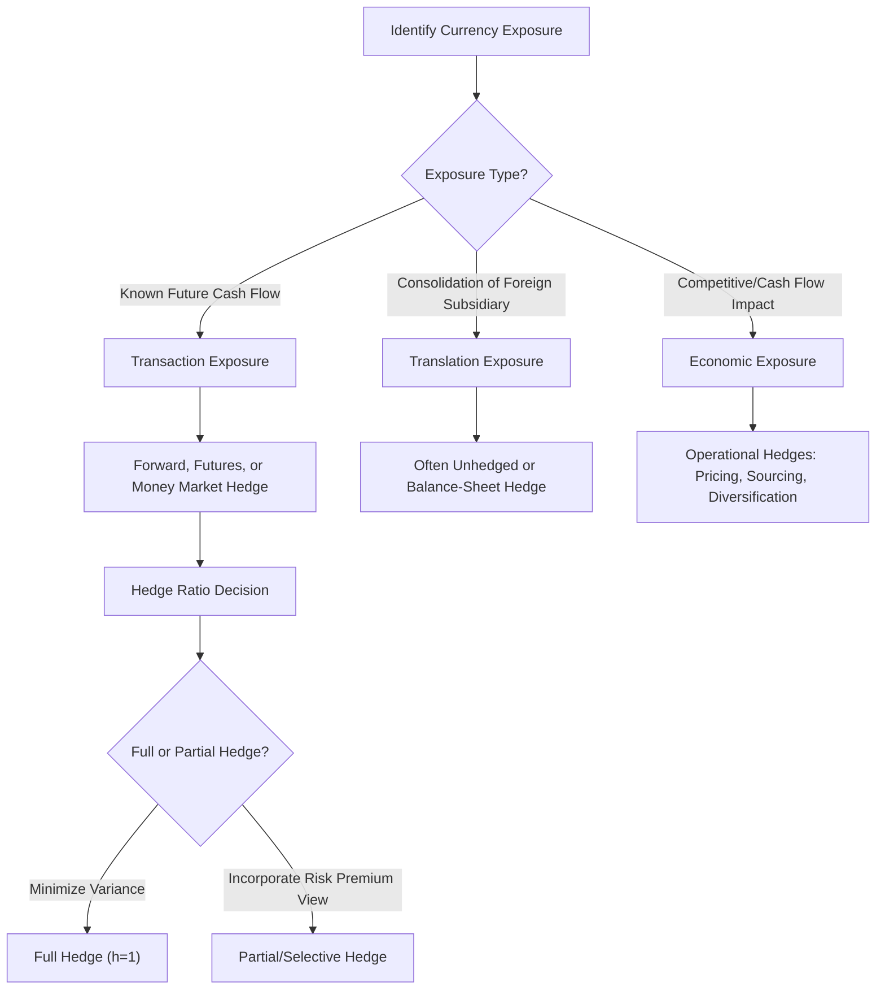

## Currency Risk and Hedging

### Definition and Core Concept

Currency risk (also called foreign exchange risk or FX risk) is the exposure of an entity's cash flows, asset values, or financial statements to unexpected fluctuations in exchange rates. Currency hedging refers to the set of financial strategies—using derivatives, natural offsets, or operational adjustments—employed to reduce or eliminate this exposure. This topic sits at the intersection of international finance, corporate risk management, and asset pricing, since the decision to hedge (and the pricing of hedging instruments) depends on both the underlying economic exposure and the risk premia embedded in currency markets.

### Types of Currency Exposure

**Transaction Exposure**

Arises from specific, contractually fixed foreign-currency-denominated cash flows (e.g., an export sale invoiced in a foreign currency, due for payment in 90 days). The risk is that exchange rate movements between contract signing and settlement will change the domestic-currency value of the payment.

**Translation Exposure**

Arises from consolidating foreign subsidiaries' financial statements (denominated in local currency) into a parent company's reporting currency. This exposure affects reported accounting figures (balance sheet, income statement) but does not necessarily correspond to actual cash flow risk—it is primarily an accounting/reporting phenomenon, though it can matter for covenant compliance, credit ratings, and market perception.

**Economic (Operating) Exposure**

The broadest and most difficult-to-quantify exposure: the impact of unanticipated exchange rate changes on the firm's future cash flows and competitive position, arising from effects on sales volumes, input costs, and pricing power relative to foreign competitors, even for a firm with no direct foreign-currency contracts. For example, a purely domestic firm competing against importers is still economically exposed to currency movements that alter its competitors' relative costs.

### Hedging Instruments

**Forward Contracts**

The most direct hedging tool: an agreement to exchange currencies at a pre-specified rate on a future date, locking in the exchange rate for a known future cash flow and eliminating transaction exposure for that specific flow. Pricing follows covered interest rate parity (CIP), as covered in the PPP/IRP topic.

**Currency Futures**

Standardized, exchange-traded equivalents of forward contracts, offering greater liquidity and counterparty risk mitigation via central clearing, but with less flexibility in contract size and maturity relative to bespoke forwards, and subject to daily mark-to-market margining.

**Currency Options**

Provide the *right but not obligation* to exchange currency at a specified strike rate, allowing hedgers to protect against adverse movements while retaining upside from favorable movements—at the cost of an upfront premium. Standard Garman-Kohlhagen option pricing (a Black-Scholes extension for currency options) incorporates both domestic and foreign risk-free rates:

$$C = S_t e^{-r_f^* T}N(d_1) - K e^{-r_f T}N(d_2)$$

$$d_1 = \frac{\ln(S_t/K) + (r_f - r_f^* + \sigma^2/2)T}{\sigma\sqrt{T}}, \quad d_2 = d_1 - \sigma\sqrt{T}$$

where $r_f$ and $r_f^*$ are the domestic and foreign risk-free rates, respectively, reflecting that holding foreign currency earns the foreign interest rate (analogous to a continuous dividend yield in equity option pricing).

**Currency Swaps**

Exchange principal and/or interest payments in different currencies over an extended period, commonly used to hedge long-term exposures arising from foreign-currency-denominated debt issuance, effectively converting the debt's currency and interest rate profile to match the issuer's desired exposure.

**Money Market Hedge**

A synthetic hedge constructed without derivatives, using borrowing/lending: e.g., to hedge a future foreign-currency receivable, a firm borrows in the foreign currency today (against the known future receivable), converts the proceeds to domestic currency immediately, and repays the foreign loan when the receivable arrives—synthetically replicating a forward contract using the CIP relationship.

### To Hedge or Not to Hedge: Theoretical Considerations

**Modigliani-Miller Logic and Its Limits**

In a frictionless world with perfect capital markets, corporate hedging would be irrelevant to firm value (analogous to the Modigliani-Miller capital structure irrelevance theorem), since shareholders could replicate any hedge themselves in their personal portfolios. Corporate hedging is therefore typically justified by appeal to **market frictions** that make hedging at the firm level more effective than at the shareholder level:

- **Costs of financial distress**: hedging reduces cash flow volatility, lowering the probability of costly financial distress or bankruptcy, particularly valuable for highly levered firms.
- **Underinvestment/debt overhang problems**: (Froot, Scharfstein, and Stein 1993) hedging can ensure internal cash flow is available to fund valuable investment projects, avoiding costly external financing (subject to asymmetric information premiums) precisely when internal funds are most needed.
- **Tax convexity**: if the corporate tax schedule is convex (e.g., due to tax loss carryforward limitations), reducing earnings volatility via hedging can lower the expected present value of taxes paid.
- **Comparative advantage in information**: shareholders may lack the firm-specific information needed to construct an equivalent personal hedge, giving the firm an informational advantage in executing the hedge internally.

**Selective Hedging and Speculation Concerns**

In practice, many firms engage in **selective hedging**—hedging a partial (not full) percentage of exposure, or adjusting hedge ratios based on the firm's own market views—which introduces an element of speculation into what is nominally a risk-management function. This practice is debated in corporate finance, since it can substitute managerial market-timing views for the stated objective of pure risk reduction, and empirical evidence on its value-added is mixed [Inference: outcomes vary substantially across studies, firms, and time periods].

### Currency Risk Premia and Hedging Costs

**The Currency Risk Premium**

As established in the UIP/forward premium puzzle discussion, currencies do not simply offer actuarially fair compensation for interest rate differentials—there is a documented, time-varying **currency risk premium**. This means that the "cost" of hedging (locking in a forward rate rather than remaining unhedged) is not merely an insurance cost but embeds this risk premium, which can be systematically positive or negative depending on the currency pair and prevailing carry-trade dynamics.

**Hedge Ratio Determination**

The optimal hedge ratio in a mean-variance framework, ignoring basis risk, is typically derived by minimizing the variance of hedged portfolio returns:

$$h^* = \frac{\text{Cov}(\Delta S, \Delta F)}{\text{Var}(\Delta F)}$$

For a currency forward hedge with no basis risk, this reduces to $h^* = 1$ (a full hedge minimizes variance), but firms frequently choose $h^* < 1$ when balancing hedging costs (including any risk premium embedded in forward rates) against variance-reduction benefits, or when incorporating expected currency-market risk premia into the hedging decision (i.e., not hedging currencies expected to earn a positive risk premium if unhedged).

### Home Bias and International Portfolio Hedging

Beyond corporate hedging, currency risk is central to international **portfolio management**: investors holding foreign equities or bonds face currency risk layered on top of the underlying asset's local-currency risk. A substantial literature examines optimal currency hedge ratios for international equity and bond portfolios, generally finding:

- For **bonds**, currency volatility is often large relative to underlying local-currency bond return volatility, so hedging currency risk substantially reduces overall portfolio volatility with limited expected return cost—commonly cited as a rationale for high (often near-full) hedge ratios in international bond portfolios [Inference: exact optimal ratios are model- and period-dependent].
- For **equities**, currency movements can be partially (though imperfectly and inconsistently) offset by underlying equity return correlations (since currency movements can affect the same firms' export competitiveness/earnings that drive equity returns), leading to more debated and typically lower optimal hedge ratios in practice.

### Comparison Table: Currency Hedging Instruments

| Instrument | Obligation | Upfront Cost | Customization | Typical Use Case |
| --- | --- | --- | --- | --- |
| Forward contract | Firm obligation | None (rate embedded) | High (OTC, bespoke) | Known future transaction exposure |
| Futures contract | Firm obligation | Margin (not premium) | Low (standardized) | Liquid, exchange-traded hedging |
| Currency option | Right, not obligation | Premium paid upfront | Moderate-high | Uncertain exposure, asymmetric protection desired |
| Currency swap | Firm obligation, multi-period | None (rate embedded) | High | Long-term debt currency conversion |
| Money market hedge | Synthetic, via borrowing/lending | Implicit via CIP | Moderate | Alternative when derivatives unavailable/illiquid |

### Diagram: Currency Exposure and Hedging Decision Flow (svg_diagram)

### Worked Example: Forward Hedge vs. Unhedged Exposure

A U.S. exporter expects to receive €10,000,000 in 6 months. The current spot rate is $S_t = 1.08$ USD/EUR, and the 6-month forward rate (per CIP, given a euro area interest rate below the U.S. rate) is $F_t = 1.095$ USD/EUR.

**Hedged outcome**: Selling the €10,000,000 forward locks in:

$$10{,}000{,}000 \times 1.095 = \$10{,}950{,}000 \text{ guaranteed}$$

**Unhedged outcome**: If in 6 months the spot rate has moved to $S_{t+6} = 1.05$ (euro depreciated), the exporter would receive only:

$$10{,}000{,}000 \times 1.05 = \$10{,}500{,}000$$

a shortfall of $450,000 relative to the hedged outcome. Conversely, if the euro had instead appreciated to $S_{t+6} = 1.15$, the unhedged position would yield $\$11{,}500{,}000$, exceeding the hedged outcome by $550,000. This illustrates the fundamental hedging trade-off: the forward hedge eliminates both the downside risk and the upside potential, converting an uncertain cash flow into a certain one at the pre-agreed forward rate—the central rationale for hedging under risk aversion or financial distress cost considerations, even though it forgoes the possibility of a favorable currency move.

### Related Topics

- Purchasing power parity and interest rate parity
- Covered interest rate parity and the forward rate
- Garman-Kohlhagen currency option pricing model
- Corporate risk management theory (Froot-Scharfstein-Stein)
- Modigliani-Miller theorem and hedging irrelevance
- Forward premium puzzle and currency risk premia
- International portfolio diversification and home bias
- Currency carry trade strategies
- Translation vs. economic exposure in multinational firms