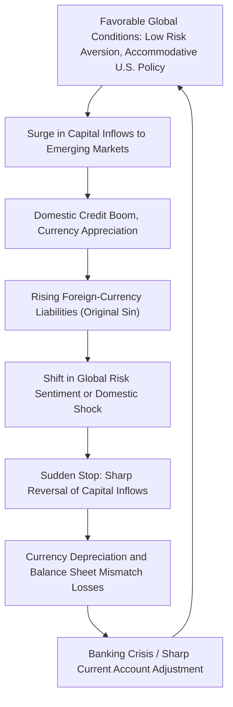

## International Capital Flows

### Definition and Core Concept

International capital flows refer to the cross-border movement of financial capital between countries, encompassing purchases and sales of financial assets (equities, bonds, bank loans, foreign direct investment) that appear as the financial account (previously "capital account") in a country's balance of payments. These flows finance current account imbalances, transfer savings across borders toward their most productive uses, and are a central determinant of exchange rates, domestic credit conditions, and financial stability—making them a core object of study in international macro-finance.

### Balance of Payments Framework

**Core Accounting Identity**

The balance of payments records all economic transactions between a country's residents and the rest of the world, structured around the identity:

$$\text{Current Account} + \text{Financial Account} + \text{Capital Account} + \text{Errors and Omissions} = 0$$

where the **current account** (trade in goods/services, income, transfers) must be offset by an equal and opposite **financial account** (net capital flows), since any current account deficit must be financed by net capital inflows (and vice versa for a surplus).

**Classification of Capital Flows**

Capital flows are typically categorized by type of instrument, each with distinct volatility and stability characteristics:

- **Foreign Direct Investment (FDI)**: acquisition of a lasting management interest (conventionally, 10%+ ownership) in a foreign enterprise. Generally considered the most stable flow type, reflecting long-term strategic commitments less sensitive to short-term financial conditions.
- **Portfolio equity investment**: purchases of foreign equities without a controlling interest, more liquid and volatile than FDI.
- **Portfolio debt investment**: purchases of foreign bonds, similarly liquid and subject to rapid reversal.
- **Other investment**: primarily cross-border bank loans and deposits, historically the most volatile and crisis-prone category, frequently implicated in sudden stop episodes.

### Gross vs. Net Capital Flows

**The Importance of Gross Flows**

A key development in the post-2008 literature (notably associated with Hélène Rey and coauthors, and Obstfeld 2012) emphasizes that focusing solely on **net** capital flows (net of inflows minus outflows) can obscure important risks, since gross flows—large simultaneous inflows and outflows—have grown dramatically relative to GDP even in countries with small or stable net current account positions. Large **gross** external liabilities and assets create balance-sheet and currency/maturity mismatch risks (e.g., domestic banks borrowing heavily in foreign currency while lending in domestic currency) that are invisible when examining only net flow or net international investment position data, and were a significant factor in several emerging market crises.

### Push vs. Pull Factors

**Pull Factors (Recipient-Country Fundamentals)**

Factors specific to the capital-receiving country that attract inflows, including strong growth prospects, sound institutions and property rights protection, favorable domestic interest rate differentials, and improving credit ratings/fiscal positions.

**Push Factors (Global/Source-Country Conditions)**

Factors originating in capital-source countries (often advanced economies, particularly the U.S.) that drive capital abroad regardless of specific destination-country characteristics, including global risk aversion (commonly proxied by the VIX), U.S. monetary policy stance, and global liquidity conditions.

**Empirical Relevance and the Global Financial Cycle**

A substantial empirical literature (extending the Global Financial Cycle discussion from credit cycles) finds that **push factors**, particularly U.S. monetary policy and global risk sentiment, explain a large share of the variation in capital flows to emerging markets, often dominating destination-specific pull factors during periods of global risk-off sentiment—implying that even well-managed emerging economies can experience sharp capital flow reversals driven by conditions entirely outside their control. [Inference: the relative quantitative importance of push vs. pull factors varies across studies, time periods, and flow types.]

### Sudden Stops and Capital Flow Reversals

**Definition and Mechanism**

A **sudden stop** (Calvo 1998) refers to an abrupt, large reduction in net capital inflows to a country, typically following a period of sustained inflows, often triggered by a shift in global risk sentiment, a domestic shock, or contagion from crises elsewhere. Sudden stops are strongly associated with:

- **Currency crises**: as capital inflows reverse, demand for the domestic currency falls, triggering sharp depreciation, particularly damaging for entities with foreign-currency-denominated liabilities and domestic-currency assets/revenue (a "currency mismatch").
- **Sharp current account reversals**: since the financial account must move with the current account, a sudden stop in financing forces an abrupt current account adjustment (typically via a sharp contraction in imports/domestic demand).
- **Banking crises**: domestic banks that relied on foreign wholesale funding face funding shortfalls, potentially triggering the intermediary balance-sheet/financial accelerator dynamics discussed elsewhere in this course.

**"Sudden Stops" and Original Sin**

Emerging markets have historically been particularly vulnerable to sudden stops due to what Eichengreen and Hausmann termed **"original sin"**: the inability of many emerging economies to borrow internationally in their own domestic currency, forcing foreign-currency-denominated borrowing that creates currency mismatches on national balance sheets, amplifying the real economic damage from a sudden stop-driven depreciation.

### Capital Controls and Policy Responses

**The Trilemma and Beyond**

As discussed in the term structure/exchange rate context, the traditional **Mundell-Fleming trilemma** holds that a country can choose at most two of: fixed exchange rate, free capital mobility, and independent monetary policy. The Global Financial Cycle literature (Rey 2013) has extended this into a **"dilemma"** framing: even with a floating exchange rate, full monetary policy independence may not be achievable given the global financial cycle's influence, unless capital flows are also managed to some degree.

**Capital Flow Management Measures (CFMs)**

The IMF's evolving institutional view (formalized post-2012) has moved from a historically skeptical stance toward capital controls to a more nuanced acceptance of **capital flow management measures** as legitimate tools under certain conditions, including:

- **Prudential CFMs**: measures aimed at limiting systemic risk from capital flow-driven credit booms (e.g., limits on foreign-currency bank borrowing), viewed similarly to macroprudential tools.
- **Countercyclical capital controls**: taxes or restrictions on inflows during boom periods (e.g., Brazil's historical use of a financial transactions tax on portfolio inflows), intended to reduce the buildup of destabilizing short-term liabilities without deterring more stable, long-term flows like FDI.

### Sovereign Debt and Capital Flows

International capital flows to sovereigns raise distinct considerations related to **sovereign default risk**, since sovereign debt typically lacks the collateral-based enforcement mechanisms available in domestic lending. Key related concepts (often covered in connected sovereign debt material) include debt sustainability analysis, the role of the IMF as a quasi-lender-of-last-resort for sovereigns, and the "original sin" currency mismatch problem noted above, which directly links capital flow analysis to sovereign risk premia.

### Comparison Table: Types of International Capital Flows

| Flow Type | Typical Volatility | Reversibility | Associated Risk |
| --- | --- | --- | --- |
| Foreign Direct Investment (FDI) | Low | Low (long-term commitment) | Limited crisis association |
| Portfolio equity | Moderate-High | Moderate-High | Equity market volatility transmission |
| Portfolio debt | High | High | Sudden stop, currency crisis risk |
| Bank loans/deposits ("other investment") | Very High | Very High | Historically most crisis-prone category |

### Diagram: Capital Flow Cycle and Sudden Stop Dynamics (svg_diagram)

### Worked Example: Balance of Payments Adjustment

Suppose a country runs a current account deficit of $50 billion in a given year, financed as follows: FDI inflows of $20 billion, portfolio equity inflows of $15 billion, and bank loan inflows of $15 billion (ignoring reserve changes and errors/omissions for simplicity):

$$\text{Current Account} = -\$50B, \quad \text{Financial Account} = +\$50B \;(\$20B + \$15B + \$15B)$$

satisfying the balance of payments identity. Now suppose a global risk-off shock causes a sudden stop: bank loan inflows reverse to an outflow of -$10 billion, and portfolio equity inflows fall to $5 billion, while FDI remains stable at $20 billion. Total financial account inflows fall to:

$$20 + 5 + (-10) = \$15B$$

a swing of $35 billion relative to the prior year. Since the current account must adjust to match (absent reserve depletion), the country would need to contract its current account deficit by a similar $35 billion—typically achieved through a combination of currency depreciation (boosting exports, curbing imports) and a sharp contraction in domestic demand, illustrating the painful adjustment dynamics characteristic of a sudden stop episode.

### Related Topics

- Global Financial Cycle and U.S. monetary policy spillovers
- Sudden stops (Calvo) and currency crises
- Original sin and currency mismatch in emerging markets
- Capital flow management measures and the IMF institutional view
- Mundell-Fleming trilemma and monetary policy independence
- Sovereign debt sustainability and default risk
- Credit cycles and macroprudential policy
- Gross vs. net capital flows and balance sheet risk
- Foreign direct investment determinants and stability