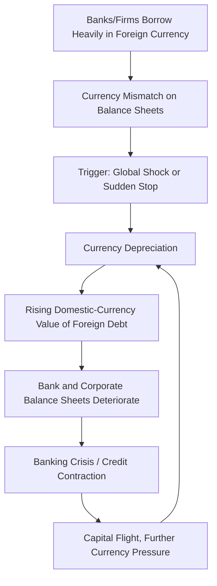

## Currency Crises

### Definition and Core Concept

A currency crisis is an episode of sharp, disorderly depreciation of a country's exchange rate, typically accompanied by a rapid loss of foreign exchange reserves, a collapse in confidence in the currency, and often spillovers into banking and sovereign debt distress. Currency crises have historically occurred in successive "generations" of theoretical models, each developed in response to crisis episodes that the prior generation of models could not adequately explain—making this an unusually clear illustration of theory evolving directly in response to real-world events.

### First-Generation Models: Fundamentals-Based Crises

**Krugman (1979) Framework**

The foundational model (Krugman 1979, building on Salant and Henderson 1978's analysis of speculative attacks on commodity price floors) explains currency crises as the **inevitable, predictable** consequence of unsustainable fiscal and monetary fundamentals under a fixed exchange rate regime.

**Mechanism**

1. A government maintains a fixed exchange rate while running persistent fiscal deficits financed by domestic money creation (or facing continuous fundamental pressure from another source of persistent excess domestic credit growth).
2. This steadily depletes the central bank's foreign exchange reserves, as the central bank must sell reserves to defend the peg against the resulting excess money supply.
3. Reserves are finite, and speculators—recognizing that reserves will eventually be exhausted—rationally attack the currency *before* reserves reach exactly zero, since holding the currency until the literal exhaustion of reserves would be dominated by attacking slightly earlier (once the **shadow floating exchange rate**, the rate that would prevail absent the peg, rises above the fixed rate).
4. This generates a well-defined, calculable **crisis timing**: a sudden, discrete speculative attack occurs at a specific point in time, exhausting the remaining reserves in a single rapid episode rather than a smooth gradual decline.

**Interpretation**

First-generation models portray currency crises as essentially **deterministic and fundamentals-driven**: given the underlying (unsustainable) fiscal/monetary policy path, a crisis is not a matter of "if" but "when," and the timing itself is pinned down by rational speculative behavior rather than being arbitrary.

### Second-Generation Models: Self-Fulfilling Crises

**Motivation**

First-generation models struggled to explain crises (e.g., the 1992-93 European Exchange Rate Mechanism (ERM) crisis) where countries with seemingly sound fundamentals nonetheless experienced sudden speculative attacks and were forced to abandon pegs. This motivated **Obstfeld (1994, 1996)** to develop models emphasizing **multiple equilibria and self-fulfilling expectations**.

**Mechanism**

In second-generation models, the government faces a genuine trade-off in defending the peg: doing so has real economic costs (e.g., high interest rates needed to defend the currency depress output and employment), so the government's willingness to defend the peg depends on *market expectations*:

- If markets believe the peg will hold, they do not attack, defense costs remain low (no speculative pressure), and the government indeed maintains the peg—a **"good" equilibrium**.
- If markets believe an attack is likely, the government must raise interest rates sharply to defend the currency, which imposes substantial economic costs (recession, rising unemployment/debt service costs), potentially making abandonment of the peg the government's rational choice—**validating** the market's expectation and generating a **self-fulfilling "bad" equilibrium**.

Crucially, this framework implies that a crisis can occur (and abandonment of the peg can become optimal) **even when underlying fundamentals would have been consistent with indefinitely sustaining the peg absent a shift in expectations**—multiple equilibria can coexist for a range of "intermediate" fundamentals, with the specific equilibrium realized depending on market sentiment/coordination rather than fundamentals alone.

### Third-Generation Models: Balance Sheet and Twin Crises

**Motivation**

The Asian Financial Crisis of 1997-98 exhibited features that neither first- nor second-generation models captured well: crises were closely intertwined with **banking sector fragility** and **corporate/bank balance sheet currency mismatches**, rather than purely fiscal/monetary fundamentals or pure self-fulfilling speculative dynamics in the currency market alone.

**Key Mechanisms**

- **Balance sheet effects and currency mismatches**: domestic banks and firms had borrowed heavily in foreign currency (dollars) while holding domestic-currency assets/revenue streams (the "original sin" problem discussed under international capital flows). A depreciation directly increases the domestic-currency value of foreign debt, potentially rendering previously solvent borrowers insolvent—creating a mechanism where **currency depreciation itself directly triggers/worsens a banking crisis**, in contrast to earlier models where the currency crisis was largely independent of banking sector health.
- **Moral hazard and implicit guarantees** (Krugman 1998, and related work): implicit government guarantees to banks/politically connected firms may have encouraged excessive foreign-currency borrowing and risk-taking, planting the seeds of vulnerability well before the crisis materialized.
- **Twin crises** (Kaminsky and Reinhart 1999): the empirical observation that currency crises and banking crises are strongly correlated and mutually reinforcing—a currency crisis can trigger a banking crisis via the balance sheet channel above, while a banking crisis can trigger a currency crisis as capital flees a weakening banking sector, generating a vicious two-way feedback loop.

### Sudden Stops as a Currency Crisis Trigger

As discussed under international capital flows, third-generation and related models frequently emphasize that currency crises in emerging markets are often precipitated by a **sudden stop** in capital inflows (Calvo 1998), where a global or domestic shock triggers an abrupt reversal of previously abundant foreign capital, forcing a rapid current account adjustment that a fixed or heavily managed exchange rate cannot readily absorb without a disorderly break.

### Early Warning Indicators

**The "Signals Approach"**

Empirical crisis-prediction literature (Kaminsky, Lizondo, and Reinhart 1998) developed a **signals approach**, monitoring a battery of leading indicators for values that historically preceded currency crises, commonly including:

- Real exchange rate overvaluation relative to trend
- Rapid growth in domestic credit/money supply (M2) relative to reserves
- Current account deficit as a share of GDP
- Short-term external debt relative to reserves (a key vulnerability indicator, since it measures the stock of liabilities that could be rapidly withdrawn)
- Equity price and export performance deterioration

**Reserve Adequacy Metrics**

Building on the third-generation crisis literature's emphasis on short-term liquidity mismatches, the **Greenspan-Guidotti rule** proposes that countries hold foreign exchange reserves at least equal to short-term external debt (debt maturing within one year), as a rough rule-of-thumb buffer against a sudden stop-driven inability to roll over short-term foreign liabilities.

### Comparison Table: Generations of Currency Crisis Models

| Generation | Core Driver | Key Papers | Crisis Predictability |
| --- | --- | --- | --- |
| First | Unsustainable fiscal/monetary fundamentals | Krugman (1979) | Deterministic, timing calculable from fundamentals |
| Second | Self-fulfilling expectations, multiple equilibria | Obstfeld (1994, 1996) | Can occur even with moderate fundamentals; sentiment-driven |
| Third | Balance sheet mismatches, banking-currency crisis feedback | Krugman (1998), Kaminsky-Reinhart (1999) | Driven by financial sector vulnerabilities, twin-crisis dynamics |

### Diagram: Third-Generation Twin Crisis Feedback Loop (svg_diagram)

### Worked Example: First-Generation Model Crisis Timing

Suppose a central bank holds $20 billion in reserves, and domestic credit expansion (driven by fiscal deficit monetization) causes reserves to decline at a constant rate of $2 billion per month absent a speculative attack. Under a naive view, one might expect the peg to survive until reserves are literally exhausted, at month 10.

However, first-generation model logic implies speculators will attack **before** this point: once the shadow exchange rate (the rate that would prevail if the currency floated, given cumulative money growth) exceeds the fixed rate, it becomes profitable to attack immediately, since remaining reserves would otherwise be depleted at an accelerating rate in a final speculative rush. Suppose model calculations imply the shadow rate exceeds the peg once reserves fall to $8 billion. A rational speculative attack would occur at exactly the month when steady depletion brings reserves to $8 billion—here, month 6 ($20B - 6 \times \$2B = \$8B$)—rather than month 10, with the attack itself then rapidly exhausting the remaining $8 billion in a single discrete episode rather than the assumed steady $2 billion/month pace continuing to zero.

### Related Topics

- Krugman (1979) first-generation speculative attack models
- Obstfeld self-fulfilling crisis models and multiple equilibria
- Twin crises and banking-currency crisis feedback (Kaminsky-Reinhart)
- Original sin and currency mismatch (international capital flows)
- Sudden stops and capital flow reversals
- Early warning indicators and the signals approach
- Greenspan-Guidotti reserve adequacy rule
- Asian Financial Crisis (1997-98) case study
- Sovereign debt crises and default risk