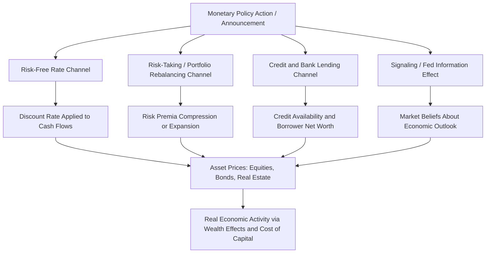

## Monetary Policy Transmission to Asset Prices

### Definition and Core Concept

Monetary policy transmission to asset prices refers to the set of channels through which central bank actions—changes in the policy rate, forward guidance, and balance sheet operations—affect the prices of financial assets (equities, bonds, real estate, credit) and, through those price changes, ultimately influence real economic activity. This topic sits at the core of macro-finance because asset prices are both a key transmission channel of monetary policy to the real economy and a growing focus of policy concern in their own right (financial stability implications of asset price movements).

### Traditional Transmission Channels

**Interest Rate Channel**

The most direct channel: a change in the policy rate affects the entire risk-free discount curve (via the expectations hypothesis and term premium effects discussed in the term structure topic), directly altering the discount rate applied to future cash flows across virtually all asset classes. A standard asset pricing valuation framework makes this explicit—for a simple perpetuity-like equity valuation:

$$P_t = \frac{D_{t+1}}{r_f + \text{ERP} - g}$$

where a fall in the risk-free rate $r_f$ mechanically raises the valuation $P_t$, holding the equity risk premium (ERP) and growth rate $g$ constant.

**Credit Channel**

Beyond the direct interest rate effect, monetary policy affects the **quantity and terms of credit availability**, operating through two sub-channels (Bernanke and Gertler 1995):

- **Bank lending channel**: tighter monetary policy reduces bank reserves/deposits, constraining banks' capacity to extend loans, particularly affecting borrowers dependent on bank credit (small firms, households) who lack access to alternative funding sources like public bond markets.
- **Balance sheet channel** (the financial accelerator mechanism, covered separately): monetary tightening raises borrowing costs and can depress asset prices, weakening borrower net worth and further constraining credit access—directly linking monetary policy transmission to the financial accelerator framework.

### Asset Pricing Channels

**Discount Rate (Expected Return) Channel**

Beyond the mechanical risk-free rate effect, monetary policy can influence the **equity/bond risk premium** itself, not just the risk-free component of the discount rate. Accommodative monetary policy is often associated with reduced risk premia, operating through:

- **Risk-taking channel** (Borio and Zhu 2012; Adrian and Shin 2010): low policy rates can encourage financial intermediaries to take on greater risk, either through reduced perceived/measured volatility, incentive effects on compensation structures tied to nominal returns, or search-for-yield behavior among institutional investors facing return targets. This channel operates specifically through the risk premium/pricing of risk, distinct from the mechanical discounting effect of a lower risk-free rate.
- **Portfolio rebalancing channel**: central bank asset purchases (QE) that remove duration/risk from the market can compress term and risk premia broadly, as displaced investors rebalance into other risk assets, a mechanism closely related to preferred-habitat and portfolio balance models discussed under term structure and exchange rate topics.

**Cash Flow (Cost of Capital) Channel**

Beyond discounting existing cash flows, monetary policy affects the **level of future cash flows** themselves by altering firms' cost of capital for new investment (via the Q-theory investment channel discussed under production-based asset pricing), and by stimulating aggregate demand, which flows through to expected corporate earnings growth $g$ in the valuation equation above.

### Empirical Evidence: High-Frequency Identification

**The Identification Challenge**

A central methodological challenge in this literature is that monetary policy actions are typically **endogenous responses to economic conditions**, making it difficult to isolate the causal effect of policy on asset prices from the reverse causality of asset prices/economic conditions influencing policy.

**High-Frequency Event Study Approach**

The dominant modern empirical approach (Kuttner 2001; Gürkaynak, Sack, and Swanson 2005; Nakamura and Steinsson 2018) examines asset price changes within a **narrow window** (e.g., 30 minutes) around scheduled monetary policy announcements, under the identifying assumption that within such a short window, monetary policy surprises dominate all other news, allowing estimation of a cleanly causal effect:

$$\Delta P_t = \beta \cdot MP\text{Surprise}_t + \varepsilon_t$$

where $MP\text{Surprise}_t$ is typically constructed from the change in a short-term interest rate futures contract (e.g., Fed funds futures) in the announcement window, isolating the unexpected component of the policy action.

**The "Fed Information Effect"**

A significant refinement (Nakamura and Steinsson 2018) argues that a substantial portion of what appears to be a pure "monetary policy shock" in these high-frequency windows may actually reflect an **information effect**: markets update their beliefs about the central bank's private information regarding the state of the economy, not just the policy action itself. For example, an unexpected rate hike might be interpreted by markets as signaling the central bank's optimism about underlying economic strength, potentially offsetting or even reversing the standard negative asset price response to tighter policy that a pure interest-rate-channel model would predict. This has motivated efforts to separately identify "pure" policy shocks from information/signaling components using additional data (e.g., the joint response of interest rates and equity prices, or central bank forecast revisions).

### Quantitative Easing (QE) and Balance Sheet Policy

**Transmission Channels of QE**

Since the effective lower bound constrained conventional interest rate policy following the Global Financial Crisis, central banks turned extensively to balance sheet policies (large-scale asset purchases). QE is understood to transmit to asset prices through several channels already discussed:

- **Portfolio balance/preferred habitat channel**: direct compression of term premia via reduced net supply of long-duration securities available to the private sector.
- **Signaling channel**: QE announcements can signal the central bank's commitment to maintaining accommodative policy for an extended period, directly affecting the expectations component of long-term yields (as discussed under the term structure topic).
- **Liquidity/market functioning channel**: particularly relevant during acute crisis episodes (2008, March 2020), central bank purchases can directly restore functioning in dislocated markets, distinct from the more standard portfolio-balance mechanism operating in calmer conditions.

### Asset Prices as an Independent Policy Concern

**The "Lean vs. Clean" Debate**

A long-standing policy debate concerns whether central banks should proactively **"lean against"** asset price booms/bubbles (raising rates preemptively to restrain rapid asset price appreciation, even absent current inflation pressure) versus the traditional **"clean up after"** approach (focusing monetary policy purely on inflation/output stabilization mandates, and addressing asset price busts only after they occur, primarily through the LOLR/crisis-management toolkit).

**Post-Crisis Reassessment**

The Global Financial Crisis substantially shifted this debate, with many economists and policymakers arguing that the pre-crisis "clean" consensus underweighted the real economic costs of asset price busts (particularly credit-fueled ones), contributing to the growing emphasis on **macroprudential policy** as a complementary (and arguably primary) tool for addressing financial stability risks from asset price/credit booms, allowing conventional monetary policy to remain focused on its traditional inflation/output objectives while macroprudential tools address financial stability concerns more directly. [Inference: the appropriate division of labor between monetary and macroprudential policy remains an active area of debate among both academics and policymakers.]

### Comparison Table: Monetary Transmission Channels to Asset Prices

| Channel | Mechanism | Primary Asset Classes Affected |
| --- | --- | --- |
| Interest rate (discounting) | Direct effect on risk-free discount rate | All discounted cash flow assets |
| Credit/bank lending | Constrains loan supply to bank-dependent borrowers | Bank loans, small-firm equity/credit |
| Balance sheet/financial accelerator | Net worth and collateral value effects | Corporate bonds, leveraged firm equity |
| Risk-taking/portfolio rebalancing | Compresses risk premia, encourages reach-for-yield | Credit spreads, equity risk premium |
| Cash flow/cost of capital | Affects investment and earnings growth expectations | Equities (via growth channel) |
| Signaling/information effect | Reveals central bank's economic outlook | All assets (can offset standard channel) |

### Diagram: Monetary Policy Transmission Channels to Asset Prices (svg_diagram)

### Worked Example: High-Frequency Event Study Estimate

Suppose an unexpected 25 basis point Fed funds rate hike causes the 2-year Treasury futures-implied rate to rise by 20 basis points in a 30-minute window around the announcement (the "monetary policy surprise" measure), and the S&P 500 falls by 1.5% in the same window.

The implied high-frequency sensitivity coefficient is:

$$\beta = \frac{\Delta(\text{S\&P 500})}{\Delta(\text{MP Surprise})} = \frac{-1.5\%}{0.20\%} = -7.5$$

meaning a 1 percentage point unexpected tightening surprise is associated with an approximate 7.5% decline in equity prices within the announcement window—broadly consistent in sign and rough order of magnitude with published high-frequency event-study estimates in this literature [Unverified: illustrative figures for exposition; actual published coefficients vary by sample period, surprise measure construction, and whether information effects are separately controlled for]. If subsequent analysis found that half of this surprise reflected a positive "information effect" (the market inferring the Fed sees stronger growth, which should support equities) offsetting part of the pure tightening effect, the "pure" policy channel effect would be understated in the raw coefficient—illustrating why the information effect decomposition matters for correctly interpreting the transmission mechanism.

### Related Topics

- Term structure and the macroeconomy (discount rate channel)
- Financial accelerator models (balance sheet channel)
- Intermediary asset pricing and risk-taking channel
- Quantitative easing and portfolio balance effects
- Fed information effect (Nakamura-Steinsson)
- Macroprudential policy and the lean-vs-clean debate
- High-frequency identification methods in monetary economics
- Production-based asset pricing (cost of capital channel)
- Credit cycles and monetary policy interaction