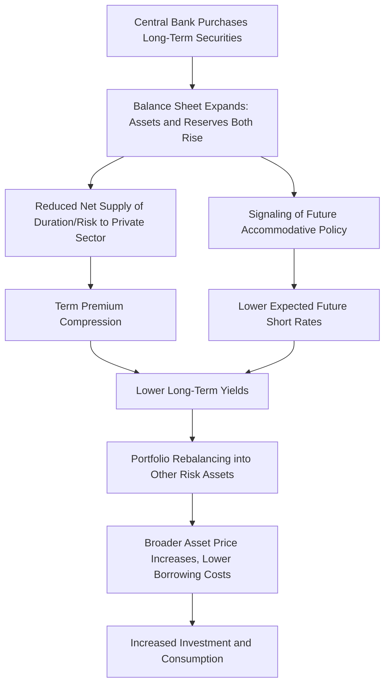

## Central Bank Balance Sheets and Quantitative Easing

### Definition and Core Concept

Central bank balance sheet policy—commonly known as **quantitative easing (QE)** when expansionary—refers to the use of large-scale asset purchases and other balance sheet operations as a monetary policy tool, distinct from conventional policy rate adjustments. This became a primary policy instrument once policy rates approached the **effective lower bound (ELB)** during and after the Global Financial Crisis, and again during the COVID-19 pandemic, when conventional rate cuts were no longer available or sufficient.

### Anatomy of a Central Bank Balance Sheet

**Assets**

A central bank's balance sheet assets typically consist of government securities (Treasuries), and during QE programs, may expand to include mortgage-backed securities (MBS), corporate bonds, and (in some jurisdictions and crisis episodes) equities or equity ETFs, alongside standard lending facility assets (repos, discount window loans).

**Liabilities**

The corresponding liabilities are primarily **bank reserves** (deposits that commercial banks hold at the central bank) and **currency in circulation**, together constituting the **monetary base**. When a central bank purchases assets, it typically does so by crediting the seller's bank with new reserves, expanding both sides of the balance sheet simultaneously—this is the mechanical sense in which QE "creates money," though the reserves created are (in modern systems, especially post-2008) largely held as excess reserves at the central bank rather than immediately translating into broad money supply growth via the traditional money multiplier.

### Why QE? Motivations at the Effective Lower Bound

**The Zero/Effective Lower Bound Problem**

Conventional monetary policy operates by adjusting a short-term policy rate. Once this rate approaches zero (or, in some jurisdictions, slightly negative territory), further conventional easing becomes constrained, since nominal interest rates cannot fall much below zero without triggering a shift toward physical cash holding (though several central banks, including the ECB and Bank of Japan, experimented with modestly negative policy rates). QE emerged as the primary tool for providing additional monetary accommodation once this constraint binds.

### Transmission Channels of QE

**Portfolio Balance / Preferred Habitat Channel**

As discussed under term structure and monetary transmission topics, this channel (grounded in Vayanos and Vila 2009-style preferred-habitat models) operates because different investor clienteles have preferences for specific segments of the maturity spectrum, and arbitrageurs face capital/risk constraints limiting full offsetting of supply changes. By purchasing long-duration securities, the central bank removes **duration risk** from the private sector's aggregate balance sheet, compressing the **term premium** and pushing displaced investors to rebalance into other risk assets (corporate bonds, equities), transmitting the effect broadly across asset classes even without any change in the expected path of future short-term rates.

**Signaling Channel**

QE announcements, particularly when explicitly tied to economic conditions or forward guidance (e.g., "purchases will continue until inflation reaches target"), can directly influence market expectations about the future path of short-term policy rates, operating through the standard expectations-hypothesis component of long-term yields rather than the term premium. Separating the signaling channel from the pure portfolio-balance channel empirically is challenging, since QE announcements typically combine both elements simultaneously.

**Liquidity and Market Functioning Channel**

Particularly salient during acute crisis episodes (September-October 2008, March 2020), central bank purchases can serve a distinct function: directly restoring liquidity and orderly functioning in markets experiencing severe dislocation (e.g., the Treasury market stress of March 2020), functioning as a **market-maker of last resort** rather than operating primarily through the more gradual portfolio-balance mechanism relevant in calmer conditions.

**Bank Lending / Reserve Channel**

A more traditional channel posits that increased bank reserves directly expand banks' capacity and incentive to lend. This channel's empirical importance is more contested in the post-2008 environment, since with abundant excess reserves already present in the banking system (a "floor" operating system, discussed below), the marginal effect of additional reserves on bank lending decisions is theoretically and empirically weaker than in a pre-crisis "scarce reserves" operating framework [Inference: the strength of this channel is a matter of ongoing empirical and theoretical debate].

### Operating Frameworks: Scarce vs. Ample/Floor Reserves

**Pre-Crisis "Corridor" System**

Prior to 2008, most major central banks operated with a relatively **scarce reserves** framework, where the central bank targeted a specific policy rate by finely managing the (small) quantity of reserves in the banking system via open market operations, with the policy rate determined by supply and demand for these scarce reserves within an interest rate "corridor" (bounded by standing lending and deposit facility rates).

**Post-QE "Floor" System**

Following large-scale asset purchases, banking systems in major economies have operated with **abundant (ample) reserves**, requiring a different operating framework: the central bank sets its policy rate largely via the **interest rate paid on reserves (IOR/IORB)**, which establishes an effective floor below which market rates will not fall (since banks have no incentive to lend reserves in the market at a rate below what they can earn risk-free at the central bank). This decouples the *quantity* of reserves (determined by the balance sheet size) from the *price* of overnight funding (set directly via the administered IOR rate), fundamentally changing how monetary policy implementation works relative to the pre-crisis framework.

### Balance Sheet Normalization and Quantitative Tightening (QT)

**Passive Runoff vs. Active Sales**

Unwinding an expanded balance sheet ("quantitative tightening" or QT) can occur via:

- **Passive runoff**: allowing maturing securities to roll off the balance sheet without reinvestment, shrinking the balance sheet gradually and predictably as bonds mature.
- **Active sales**: directly selling securities before maturity, which has generally been avoided by major central banks in practice, given concerns about generating unnecessary market disruption and directly realizing losses when bond prices have fallen (relevant if QT commences during a period of higher long-term rates than prevailed when the bonds were purchased).

**Balance Sheet-Induced Central Bank Losses**

A notable operational consequence of QE followed by subsequent rate hikes: since central bank liabilities (reserves, subject to the policy rate/IOR) reprice upward immediately with rate hikes, while assets (long-duration bonds purchased during QE at low yields) are fixed-rate and long-duration, a central bank can experience significant **net interest income losses** (paying more on reserve liabilities than it earns on its bond holdings) during aggressive tightening cycles following large QE programs—a phenomenon observed at several major central banks in the 2022-2023 tightening cycle, raising questions (largely operational/accounting rather than affecting policy capability, since central banks are not subject to conventional insolvency constraints) about central bank capital and remittances to government treasuries. [Unverified: specific magnitudes and policy implications vary by jurisdiction; readers should consult current central bank financial statements and commentary for up-to-date figures given this is an area that has evolved since standard textbook treatments were written.]

### Comparison Table: Conventional Policy vs. QE

| Feature | Conventional Rate Policy | Quantitative Easing |
| --- | --- | --- |
| Primary instrument | Short-term policy rate | Central bank balance sheet size/composition |
| Constraint | None (until effective lower bound) | Asset market depth, fiscal-monetary interaction concerns |
| Primary transmission | Expectations hypothesis (short-rate path) | Portfolio balance / term premium compression |
| Typical use case | Normal-times cyclical stabilization | Effective lower bound, acute market dysfunction |
| Reversal mechanism | Direct rate changes | Passive runoff or active sales (QT) |

### Diagram: QE Transmission Mechanism (svg_diagram)

### Worked Example: Balance Sheet Expansion Mechanics

Suppose a central bank purchases $100 billion in government bonds directly from commercial banks. The balance sheet impact is:

**Assets**: +$100 billion in government securities holdings

**Liabilities**: +$100 billion in bank reserves (credited to the selling banks' reserve accounts at the central bank)

The monetary base rises by $100 billion. If the interest rate on reserves is set at, say, 4.00%, and this equals the effective floor for short-term market rates, then banks holding this reserve addition have no incentive to lend it out at rates below 4.00% in the interbank market, meaning the primary near-term effect of this specific transaction operates through the **portfolio balance channel** (the $100 billion reduction in bonds available to the private, non-bank sector, since a commercial bank sold this to the central bank), rather than through a mechanical, multiplier-based expansion of bank lending—illustrating the distinction between the "floor system" operating framework's decoupling of reserve quantity from policy rate transmission, relative to older textbook money-multiplier intuitions.

### Related Topics

- Monetary policy transmission to asset prices
- Term structure and the macroeconomy (portfolio balance channel)
- Preferred habitat theory (Vayanos-Vila)
- Effective lower bound and forward guidance
- Floor vs. corridor operating systems for monetary policy
- Quantitative tightening and balance sheet normalization
- Central bank financial losses and fiscal-monetary interactions
- Lender-of-last-resort policy and market-maker of last resort function
- Negative interest rate policy (NIRP) experiences