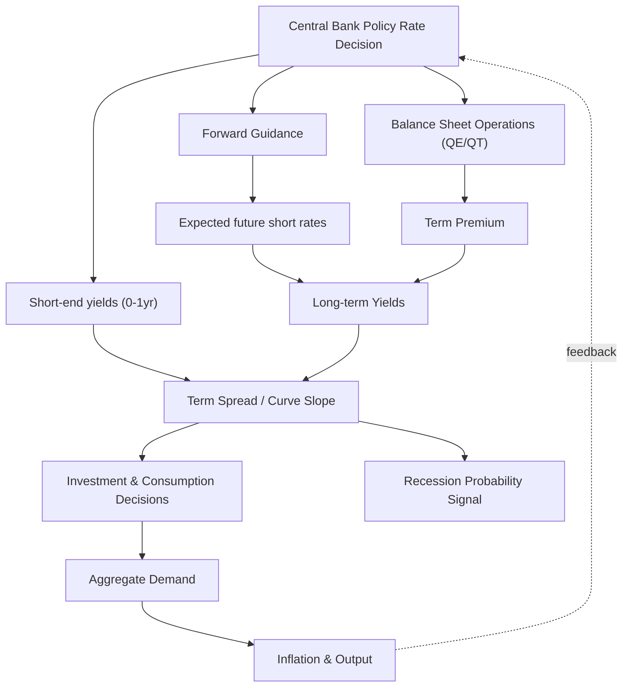

## The Term Structure and Monetary Policy

### Overview

The term structure of interest rates (the yield curve) describes the relationship between bond yields and their maturities. Monetary policy operates primarily through the short end of this curve, yet its ultimate macroeconomic effects—on investment, consumption, and inflation—depend on how the entire curve responds. Understanding this transmission mechanism is central to modern monetary economics and asset pricing.

### The Term Structure: Basic Framework

The term structure at time $t$ is the set of yields $\{y_t^{(1)}, y_t^{(2)}, \ldots, y_t^{(n)}\}$ on zero-coupon bonds of maturities $1, 2, \ldots, n$. The price of a zero-coupon bond paying $1 at maturity $n$ is:

$$P_t^{(n)} = \exp(-n \cdot y_t^{(n)})$$

or in discrete time:

$$P_t^{(n)} = \frac{1}{(1 + y_t^{(n)})^n}$$

**Key Points**

- The short rate $r_t$ (typically the policy rate or overnight rate) is the maturity-zero limit of the yield curve
- Forward rates $f_t^{(n,n+1)}$ represent the market's implied future short rate between period $n$ and $n+1$
- The yield curve's shape (upward-sloping, flat, inverted) reflects expectations, risk premia, and policy stance simultaneously

### Expectations Hypothesis

The pure expectations hypothesis (PEH) states that long-term yields are the average of expected future short rates:

$$y_t^{(n)} = \frac{1}{n} \sum_{i=0}^{n-1} E_t[r_{t+i}] + \phi^{(n)}$$

where $\phi^{(n)}$ is a term premium, assumed zero under the pure hypothesis. This is the direct channel by which monetary policy affects the entire curve: if the central bank raises the policy rate and is expected to keep it elevated, expected future short rates rise, mechanically pulling up longer yields.

**Key Points**

- Under PEH, the yield curve is a summary of market expectations about the future path of policy
- An inverted curve (short rates above long rates) signals expected future policy easing—historically a recession predictor
- A steep curve suggests markets expect tightening or a recovering economy
- PEH generally fails empirically: term premia are time-varying and often sizable, especially at longer maturities

### Term Premium and Risk-Based Models

Empirically, yields deviate from the pure expectations path due to a term premium $\phi^{(n)}$, compensating investors for duration risk, inflation risk, and liquidity risk:

$$y_t^{(n)} = \underbrace{\frac{1}{n}\sum_{i=0}^{n-1} E_t[r_{t+i}]}_{\text{expectations component}} + \underbrace{\phi_t^{(n)}}_{\text{term premium}}$$

Affine term structure models (ATSMs) decompose yields into these components using no-arbitrage restrictions. The canonical framework specifies the short rate as an affine function of latent or observable state variables $X_t$:

$$r_t = \delta_0 + \delta_1' X_t$$

with the pricing kernel (stochastic discount factor) driving both expected returns and risk compensation:

$$m_{t+1} = \exp\left(-r_t - \frac{1}{2}\lambda_t'\lambda_t - \lambda_t'\varepsilon_{t+1}\right)$$

where $\lambda_t$ is the market price of risk, often modeled as affine in $X_t$ (essentially affine models, Duffee 2002).

**Key Points**

- Term premia are not directly observable; must be estimated via models (Kim-Wright, ACM model from the NY Fed, Adrian-Crump-Moench 2013)
- Term premia tend to rise during periods of macro uncertainty and fall during "reach for yield" episodes
- Quantitative easing operates primarily by compressing term premia rather than by altering the expected path of short rates

### Monetary Policy Transmission Through the Curve

**Conventional policy (short rate)**

The central bank sets or targets an overnight rate (e.g., Fed Funds Rate, ECB deposit rate). This directly anchors $y_t^{(1)}$ and short maturities. Transmission to longer maturities occurs via:

1. **Expectations channel**: Forward guidance shapes $E_t[r_{t+i}]$ for future periods
2. **Term premium channel**: Policy actions (or balance sheet operations) affect risk compensation demanded by investors

**Unconventional policy (post-2008 and post-2020)**

When the short rate hits the zero (or effective) lower bound, central banks use:

- **Forward guidance**: Explicit or implicit commitments about the future path of $r_t$, shifting the expectations component of long yields
- **Quantitative easing (QE)**: Large-scale asset purchases that reduce the net supply of long-duration bonds available to the private sector, compressing $\phi_t^{(n)}$ via a "preferred habitat" or portfolio-balance channel
- **Yield curve control (YCC)**: Direct targeting of a longer-maturity yield (as practiced by the Bank of Japan on the 10-year JGB), effectively pinning a point on the curve and eliminating both expectations and premium volatility at that maturity

$$\text{Long yield} \approx \underbrace{\text{Expected path of } r_t}_{\text{forward guidance target}} + \underbrace{\text{Term premium}}_{\text{QE/portfolio balance target}}$$

**Example**

Suppose the policy rate is at the zero lower bound and the central bank announces it will not raise rates for 3 years (forward guidance), while simultaneously purchasing $500 billion in long-term bonds (QE). The 10-year yield decomposition might show:

| Component | Pre-announcement | Post-announcement |
| --- | --- | --- |
| Expected average short rate (10yr) | 1.80% | 1.10% |
| Term premium (10yr) | 0.40% | 0.05% |
| **10-year yield** | **2.20%** | **1.15%** |

The forward guidance lowers the expectations component; QE lowers the term premium component. Both push down the long yield, stimulating rate-sensitive spending (mortgages, corporate borrowing, capex) even though the policy rate itself cannot go lower.

### Preferred Habitat and Portfolio Balance Theory

Modigliani-Sutch (1966) preferred habitat theory posits that investors have maturity preferences (e.g., pension funds prefer long duration, money market funds prefer short duration) and demand a premium to move outside their preferred segment. This underlies the portfolio-balance channel of QE:

$$\phi_t^{(n)} = f(\text{relative supply of duration risk in private hands})$$

When the central bank removes duration risk from the market (by buying long bonds and issuing reserves), it reduces the aggregate duration risk investors must bear, lowering the premium required and thus long yields—even without any change in the expected policy path.

**Key Points**

- This channel does not rely on rational expectations about future short rates—it is a segmented-markets/limited-arbitrage story
- Empirical event studies around QE announcements (Gagnon et al. 2011; Krishnamurthy-Vissing-Jorgensen 2011) find significant yield declines concentrated at announcement dates, consistent with a "stock effect" rather than a pure "flow effect"
- The relative importance of stock vs. flow effects remains debated [Inference: precise magnitudes are model- and episode-dependent]

### The Yield Curve as a Monetary Policy Indicator

**Slope and recession signaling**

The term spread (e.g., 10-year minus 2-year, or 10-year minus 3-month) has substantial predictive power for U.S. recessions:

$$\text{Spread}_t = y_t^{(120)} - y_t^{(3)}$$

An inverted spread (negative value) has preceded every U.S. recession since the 1970s, though with variable and long lags (6–24 months), making it a poor timing tool despite good directional signal. [Inference: leading indicator with imprecise timing rather than a precise forecasting model]

**Interpretation channels for inversion:**

1. Markets expect the central bank to cut rates in response to a future slowdown (expectations channel)
2. Tight current policy relative to the neutral rate $r^*$ directly compresses bank net interest margins, reducing credit supply (bank lending channel)
3. Term premium compression during "flight to safety" episodes can also flatten/invert the curve independent of growth expectations

### The Natural Rate and the Curve

The neutral or natural real rate $r^*$ (the short-term real rate consistent with output at potential and stable inflation) anchors where the curve should center over the cycle. The stance of policy is often expressed via the real policy rate gap:

$$\text{Policy stance} = r_t - r_t^*$$

When $r_t > r_t^*$, policy is contractionary, and this restrictiveness propagates along the curve via the expectations channel—markets price in future cuts back toward $r^*$, contributing to curve flattening/inversion during tightening cycles. Since $r^*$ is unobservable and estimated (e.g., via Laubach-Williams models), there is inherent [Unverified] uncertainty in gauging true policy stance from the curve alone.

### Term Structure Models Used in Practice

| Model Type | Key Feature | Example |
| --- | --- | --- |
| Nelson-Siegel | Parsimonious 3-factor (level, slope, curvature) curve-fitting | Central bank curve-smoothing |
| Affine Term Structure (ATSM) | No-arbitrage, latent factors, decomposes expectations vs. premium | ACM model (NY Fed) |
| Shadow rate models | Handles zero/effective lower bound by modeling a "shadow" rate that can go negative | Black (1995), Wu-Xia (2016) |
| Macro-finance models | Combines observable macro variables (inflation, output gap) with yield factors | Ang-Piazzesi (2003) |

**Shadow rate at the ZLB**

When the policy rate is constrained at or near zero, a shadow short rate $s_t$ (which can be negative) is defined, with the observed rate:

$$r_t = \max(s_t, \text{lower bound})$$

This allows term structure models to remain tractable even when the actual policy rate cannot fall below the effective lower bound, capturing how unconventional easing (via forward guidance/QE) still shows up as a more negative shadow rate.

### Term Structure Diagram

### Empirical Decomposition Illustration (SVG)

<svg xmlns="http://www.w3.org/2000/svg" viewBox="0 0 720 420">
<text x="360" y="30" text-anchor="middle" font-size="18" font-weight="bold" fill="#1a1a2e">10-Year Yield Decomposition Over a Tightening Cycle (svg_diagram)</text>
<line x1="70" y1="360" x2="680" y2="360" stroke="#333" stroke-width="2" />
<line x1="70" y1="360" x2="70" y2="60" stroke="#333" stroke-width="2" />
<text x="40" y="365" font-size="12" fill="#333">0%</text>
<text x="30" y="215" font-size="12" fill="#333">2.5%</text>
<text x="30" y="70" font-size="12" fill="#333">5%</text>
<text x="380" y="395" font-size="13" fill="#333">Time (quarters)</text>

<polyline points="70,320 170,260 270,190 370,150 470,140 570,145 670,150" fill="none" stroke="#2563eb" stroke-width="3" />

<polyline points="70,340 170,330 270,320 370,300 470,290 570,310 670,320" fill="none" stroke="#dc2626" stroke-width="3" />

<polyline points="70,300 170,230 270,155 370,100 470,90 570,100 670,105" fill="none" stroke="#16a34a" stroke-width="4" stroke-dasharray="0" />
<rect x="500" y="60" width="14" height="14" fill="#2563eb" />
<text x="520" y="72" font-size="13" fill="#333">Expectations Component</text>
<rect x="500" y="82" width="14" height="14" fill="#dc2626" />
<text x="520" y="94" font-size="13" fill="#333">Term Premium</text>
<rect x="500" y="104" width="14" height="14" fill="#16a34a" />
<text x="520" y="116" font-size="13" fill="#333">Total 10Y Yield</text>
</svg>

### International Dimensions

- **Uncovered interest parity (UIP)** links term structures across countries: differences in national yield curves should predict exchange rate movements, though empirically UIP fails at short horizons (the "forward premium puzzle")
- **Global term premium spillovers**: Major central bank QE (Fed, ECB) can compress term premia in other countries via portfolio rebalancing across borders, complicating independent monetary policy (the "global financial cycle," Rey 2013)
- **Yield curve control** (BoJ) demonstrates a case where the central bank directly overrides market-determined term premia at a target maturity, at the cost of balance sheet size and potential market functioning distortions

### Conclusion

The term structure is both a transmission channel and a diagnostic tool for monetary policy. Central banks influence the short end directly and the long end indirectly through expectations management (forward guidance) and, at the effective lower bound, through direct term premium compression (QE, YCC). Because yields embed both expected policy paths and time-varying risk compensation, extracting the "pure" stance of policy from the curve requires structural term structure models rather than raw yield readings alone.

**Related Topics**

- Quantitative easing and portfolio-balance effects
- Forward guidance credibility and time-inconsistency
- Affine term structure models and no-arbitrage pricing
- The natural rate of interest ($r^*$) estimation methods
- Yield curve inversion as a recession predictor: empirical evidence
- Shadow rate models at the zero lower bound
- Central bank balance sheet policy and quantitative tightening (QT)
- Uncovered interest parity and the forward premium puzzle
- Liquidity premium and convenience yield on safe assets