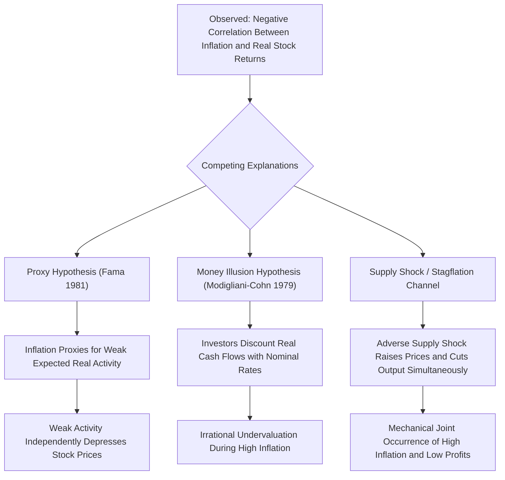

## Inflation and Asset Returns

### Definition and Core Concept

This topic examines the theoretical and empirical relationship between inflation—both expected and unexpected—and the returns on major asset classes (equities, nominal bonds, real assets, commodities). Understanding this relationship is central to strategic asset allocation, monetary policy design, and the broader macro-finance literature on how nominal variables interact with real asset values, particularly given the resurgence of inflation as a first-order macroeconomic concern following the 2021-2022 inflation surge in many advanced economies.

### The Fisher Hypothesis and Its Extensions

**Classical Fisher Equation**

The starting point is the **Fisher equation**, decomposing the nominal interest rate into a real rate and expected inflation:

$$i_t \approx r_t + E_t[\pi_{t+1}]$$

The **Fisher Hypothesis** in its asset-pricing application extends this logic to claim that nominal asset returns should move one-for-one with expected inflation, leaving real returns unaffected—implying assets should, in principle, fully hedge inflation risk.

**Generalized Fisher Hypothesis for Equities**

Applied to equities, the generalized Fisher hypothesis posits that since equities represent claims on real assets/cash flows (physical capital, brand value, pricing power), nominal stock returns should also move one-for-one with expected inflation, making equities a "hedge" against inflation, analogous to the logic applied to interest rates.

### The Stock-Inflation Puzzle

**Fama and Schwert (1977) and the Negative Relationship**

A long-standing and robust empirical finding directly **contradicts** the generalized Fisher hypothesis for equities: numerous studies since Fama and Schwert (1977) find a **negative** relationship between inflation (both expected and unexpected) and real stock returns, particularly evident in the high-inflation 1970s U.S. data, and replicated across many subsequent samples and countries. This is a genuine puzzle, since equities represent claims on real productive assets and should, in a simple Fisherian world, be largely inflation-neutral or even provide a positive hedge.

**Proxy Hypothesis (Fama 1981)**

The leading explanation, Fama's (1981) **proxy hypothesis**, argues that the observed negative stock-inflation relationship is **spurious**, arising because inflation is negatively correlated with expected future real economic activity (e.g., via the quantity theory of money combined with a money-demand relationship linking real activity, inflation, and money growth), and stock prices are positively related to expected future real activity. Under this view, inflation itself does not directly cause lower real stock returns; rather, inflation is a *proxy* for information about weakening real economic conditions that separately depresses both future money demand (raising measured inflation, given money supply) and expected corporate earnings (depressing stock prices).

**Money Illusion Hypothesis (Modigliani and Cohn 1979)**

An alternative behavioral explanation argues that equity market participants suffer from **money illusion**: investors incorrectly discount real corporate cash flows using *nominal* interest rates (rather than correctly using real rates), causing equity valuations to be irrationally depressed during high-inflation periods when nominal rates are elevated, even though correctly-discounted real cash flows may be largely unaffected. This hypothesis implies a market **inefficiency/mispricing** interpretation, in contrast to Fama's proxy hypothesis, which preserves market efficiency by attributing the relationship to a real information channel. [Inference: the profession has not reached full consensus between these competing (efficiency-preserving vs. behavioral) explanations, and empirical work distinguishing them remains active.]

**Supply Shocks and Stagflation**

A complementary, non-mutually-exclusive explanation emphasizes that many major inflationary episodes (e.g., 1970s oil shocks) were driven by adverse **supply shocks**, which simultaneously raise prices and reduce real output/corporate profitability—generating a mechanical negative correlation between inflation and real stock returns specifically during supply-shock-driven inflation episodes, as distinct from demand-driven inflation (which might exhibit a different, potentially positive, correlation with stock returns) [Inference: this distinction—demand-driven vs. supply-driven inflation having different asset return implications—is intuitively compelling but the magnitude of the difference is sensitive to sample and shock identification methodology].

### Nominal Bonds and Inflation

**Direct Mechanical Exposure**

Unlike equities, the inflation exposure of conventional **nominal bonds** is comparatively unambiguous: since coupon and principal payments are fixed in nominal terms, unexpected inflation directly erodes the real value of these fixed payments, generating a straightforward negative relationship between unexpected inflation and real (and often nominal, if inflation surprises are large enough) bond returns. This makes nominal government bonds a poor hedge against inflation risk, in sharp contrast to their traditional role as a "safe asset" against real economic/growth risk.

**Bond-Stock Correlation Regime Dependence**

A prominent empirical finding in recent macro-finance research is that the **correlation between stock and bond returns** is not stable but depends on the prevailing macroeconomic regime, particularly the inflation environment:

- In **low and stable inflation regimes** (broadly, the period from the mid-1990s through the late 2010s in the U.S.), stocks and bonds have exhibited predominantly **negative** correlation, since growth/demand shocks dominate: bad news for growth typically hurts stocks but helps bonds (flight to safety, and monetary policy easing expectations), giving bonds a valuable diversification/hedging role in a traditional 60/40 portfolio.
- In **high or volatile inflation regimes** (e.g., the 1970s-80s, and again during 2021-2022), stock-bond correlation has tended to turn **positive**, since inflation/supply shocks hurt both asset classes simultaneously (bonds directly via the nominal fixed-payment channel, and stocks via the negative inflation-equity relationship discussed above)—undermining the traditional diversification benefit of bonds precisely when inflation is the dominant macro concern. [Unverified: this regime-dependence finding is well-documented empirically across recent research and financial commentary, but precise regime thresholds and their persistence going forward remain uncertain, particularly given only limited historical experience with the most recent 2021-2022 inflation surge.]

### Real Assets and Inflation Hedging

**Treasury Inflation-Protected Securities (TIPS)**

TIPS (and equivalent inflation-linked bonds internationally, e.g., UK Gilts' index-linked bonds) directly index principal payments to a price index (e.g., CPI), providing a close-to-mechanical inflation hedge for the components covered by the index, though TIPS still carry **real interest rate risk** (their real yield can rise or fall, affecting returns independent of realized inflation) and may not perfectly track an individual investor's personal consumption basket.

**Commodities and Real Estate**

Commodities (particularly energy and precious metals) and real estate have historically been cited as inflation hedges, given their direct link to physical/real assets whose prices tend to rise with general price levels, particularly during supply-shock-driven inflation episodes where commodity price increases are often the proximate driver of the broader inflation measure itself. Empirical hedging effectiveness varies substantially by commodity type, time horizon, and the specific inflationary episode studied [Inference: commodities' inflation-hedging properties are less uniform and more time-varying than the TIPS mechanical linkage, given commodities' own independent supply/demand-driven volatility].

### Comparison Table: Asset Class Inflation Sensitivity

| Asset Class | Theoretical Prediction | Empirical Finding | Primary Mechanism |
| --- | --- | --- | --- |
| Nominal bonds | Negative real return sensitivity to unexpected inflation | Confirmed; direct fixed-payment erosion | Mechanical, unambiguous |
| Equities | Should be inflation-neutral/hedge (generalized Fisher) | Negative relationship (contradicts Fisher) | Proxy hypothesis or money illusion |
| TIPS/inflation-linked bonds | Should hedge inflation by construction | Largely confirmed for indexed component | Direct indexation |
| Commodities | Positive inflation hedge, especially supply-driven episodes | Mixed, time-varying | Direct link to price level drivers |
| Real estate | Positive inflation hedge (real asset) | Mixed, depends on financing/rate sensitivity | Real asset value, offset by rate sensitivity |

### Diagram: Competing Explanations for the Stock-Inflation Puzzle (svg_diagram)

### Worked Example: Real Return Erosion from Unexpected Inflation

Suppose an investor holds a nominal 10-year bond with a fixed coupon, priced to yield 4% nominally, based on an expected inflation rate of 2% (implying an expected real yield of approximately 2%, per the Fisher equation).

Suppose inflation unexpectedly rises to 5% (a 3 percentage point upside surprise) and persists for the bond's remaining life, with the bond's nominal cash flows unchanged (fixed coupon and principal). The approximate realized real yield becomes:

$$r_{\text{realized}} \approx i - \pi_{\text{realized}} = 4\% - 5\% = -1\%$$

compared to the originally expected real yield of approximately +2%—a roughly 3 percentage point real return shortfall directly attributable to the unexpected inflation, illustrating the mechanical erosion of nominal bonds' real value. If, over the same period, real corporate earnings growth were unaffected by this inflation surprise (a pure monetary/demand-driven inflation shock, per a stylized Fisherian equity view), the generalized Fisher hypothesis would predict equity nominal returns should rise to compensate—yet the empirical proxy/money-illusion literature discussed above suggests this compensating equity effect frequently fails to materialize in practice, particularly for inflation surprises associated with weakening real activity.

### Related Topics

- Fisher equation and the term structure (nominal vs. real yields)
- TIPS, breakeven inflation, and inflation risk premia
- Stock-bond correlation regimes and portfolio diversification
- Modigliani-Cohn money illusion hypothesis
- Fama's proxy hypothesis for the stock-inflation puzzle
- Supply shocks, stagflation, and monetary policy responses
- Commodities as an inflation hedge asset class
- Monetary policy transmission to asset prices
- 1970s stagflation and 2021-2022 inflation surge case studies