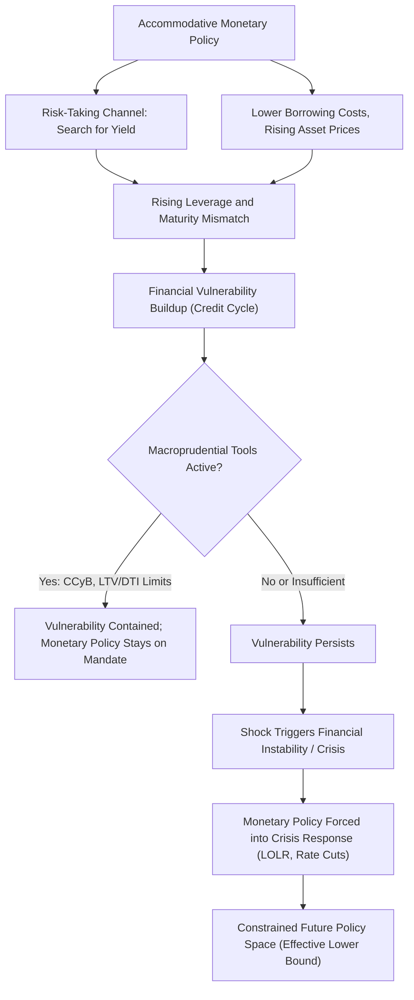

## Monetary Policy and Financial Stability

### Definition and Core Concept

This topic examines the interaction between monetary policy—traditionally focused on price stability and output stabilization—and financial stability, the resilience of the financial system to shocks without disruptive crises, credit crunches, or systemic runs. The relationship raises a central policy design question: should monetary policy directly incorporate financial stability objectives, or should this be left to a separate, dedicated set of (macroprudential) tools, with monetary policy remaining focused on its traditional mandate?

### Why Monetary Policy and Financial Stability Interact

**Monetary Policy as a Driver of Financial Vulnerability**

Several mechanisms, many already covered under related topics, link monetary policy stance directly to the buildup of financial vulnerabilities:

- **Risk-taking channel** (Borio and Zhu 2012; Adrian and Shin 2010): prolonged accommodative monetary policy can encourage financial intermediaries to take on greater risk, through search-for-yield behavior, compressed measured volatility feeding into leverage decisions (the "volatility paradox"), and incentive effects on institutional risk management practices tied to nominal return targets.
- **Credit and asset price channel**: low policy rates directly stimulate credit growth and asset price appreciation (via the discount rate and portfolio balance channels discussed under monetary transmission), which, if excessive or fueled predominantly by leverage rather than fundamentals, can generate the credit cycle dynamics and financial accelerator vulnerabilities covered elsewhere in this course.
- **Maturity transformation incentives**: a persistently low and/or steep short-end policy rate environment can incentivize financial institutions to increase maturity transformation (borrowing short, lending/investing long) to earn a positive carry, increasing systemic exposure to interest rate risk—a dynamic directly relevant to the 2023 U.S. regional banking stress episode, where rapid policy tightening exposed unhedged duration risk accumulated during the preceding low-rate period.

**Financial Instability as a Constraint on Monetary Policy**

The relationship runs in both directions: financial instability directly constrains the central bank's ability to pursue its traditional objectives, since a financial crisis typically requires an immediate, large monetary and lender-of-last-resort policy response (as covered under LOLR policy), and the resulting economic damage from a financial crisis (via the financial accelerator mechanism) can persist for years, complicating standard output/inflation stabilization.

### The "Lean vs. Clean" Debate

**The Traditional "Clean" View**

The pre-crisis consensus (often associated with the "Jackson Hole consensus" and figures like Alan Greenspan and Ben Bernanke in the pre-2008 period) held that central banks should generally **not** attempt to identify and preemptively "lean against" asset price bubbles using interest rate policy, for several reasons:

- Bubbles are difficult to identify with confidence in real time, distinct from fundamentals-justified price appreciation.
- Interest rates are a blunt instrument, affecting the entire economy, when the relevant excess may be concentrated in a specific asset class or sector.
- It is preferable and more efficient to **"clean up"** after a bust using aggressive monetary easing and lender-of-last-resort tools, rather than risk unnecessarily choking off healthy economic activity by tightening preemptively against an uncertain, possibly-nonexistent bubble.

**The Post-Crisis "Lean" Reassessment**

The Global Financial Crisis substantially challenged this consensus, given the severity and persistence of the resulting economic damage, motivating arguments (e.g., associated with the Bank for International Settlements and economists like Claudio Borio) that:

- The costs of financial crises are asymmetric and potentially much larger than the "clean" view assumed, given financial accelerator amplification, hysteresis effects on potential output, and the constraints imposed by the effective lower bound on the subsequent monetary policy response.
- Even if bubbles cannot be identified with certainty, **credit growth and leverage** are more reliably measurable and have been shown empirically (per the credit cycles literature, e.g., Schularick and Taylor) to be robust leading indicators of subsequent financial distress, providing a more defensible basis for preemptive policy action than attempting to identify asset price misalignment per se.

**Current Consensus: Separation of Instruments**

The predominant current view among most central banks and international policy institutions favors a **separation of instruments** approach: assign monetary policy to its traditional price/output stability mandate, and assign a distinct set of **macroprudential tools** (countercyclical capital buffers, LTV/DTI limits, stress testing, liquidity requirements) to address financial stability risks directly and more surgically, reserving interest rate adjustments for financial stability purposes only as a last resort or in cases where macroprudential tools are unavailable, ineffective, or insufficiently targeted (the so-called "**leaning against the wind**" residual role for monetary policy). [Inference: the appropriate weight to place on this residual monetary policy role, versus relying entirely on macroprudential tools, remains genuinely contested among central bankers and academics.]

### Macroprudential Policy as the Primary Financial Stability Tool

**Institutional Developments**

Following the Global Financial Crisis, most major economies established or strengthened dedicated macroprudential policy frameworks and institutions (e.g., the Financial Stability Oversight Council (FSOC) and Federal Reserve's macroprudential functions in the U.S., the European Systemic Risk Board (ESRB) in the EU, and the Financial Policy Committee (FPC) at the Bank of England), reflecting the view that financial stability requires distinct governance and tools from conventional monetary policy, even where the same institution (as with many central banks) holds authority over both.

**Key Tool Categories** (building on the credit cycles discussion)

- **Countercyclical capital buffer (CCyB)**: time-varying bank capital requirements calibrated to the credit cycle, building resilience during booms.
- **Borrower-based measures**: LTV and DTI/debt-service-to-income limits, directly restraining the collateral-price feedback loop central to credit cycle amplification.
- **Liquidity and structural requirements**: measures like the Liquidity Coverage Ratio (LCR) and Net Stable Funding Ratio (NSFR) under Basel III, addressing maturity transformation and funding fragility directly, relevant to the maturity mismatch vulnerabilities discussed above.

### Interaction and Potential Conflicts Between Monetary and Macroprudential Policy

**Complementarity**

In many circumstances, monetary and macroprudential policy can be complementary: for instance, tightening macroprudential tools during a credit boom can reduce financial stability risk while allowing monetary policy to remain accommodative for output/inflation objectives, avoiding the blunt-instrument problem of using interest rates alone to address a sector-specific credit boom.

**Potential Conflicts**

Conflicts can arise when the two objectives point in different directions—for example, during a period requiring monetary easing for output/inflation reasons (e.g., a demand shortfall) that coincides with elevated financial stability risk from an existing credit boom in a specific sector, where further easing could exacerbate financial vulnerabilities even as it appropriately supports the broader macroeconomic objective. Central bank communication and governance frameworks in this area continue to evolve, and the practical resolution of such conflicts remains an area of ongoing institutional learning. [Inference: theoretical frameworks characterizing the optimal joint conduct of monetary and macroprudential policy—sometimes discussed under the header of "monetary-macroprudential policy interaction"—remain an active research area without full consensus on general rules.]

### Comparison Table: Monetary Policy vs. Macroprudential Policy for Financial Stability

| Feature | Monetary Policy (Interest Rates) | Macroprudential Policy |
| --- | --- | --- |
| Primary objective | Price stability, output/employment | Financial system resilience |
| Instrument breadth | Broad, economy-wide | Targeted (sector, institution type, or exposure-specific) |
| Typical stance | Reactive to inflation/output gap | Proactive, countercyclical to credit/asset price cycles |
| Governance | Central bank (often independent mandate) | Central bank and/or separate regulatory bodies (varies by jurisdiction) |
| Post-2008 role in financial stability | Residual "leaning against the wind" role | Primary, first-line tool |

### Diagram: Monetary Policy-Financial Stability Interaction (svg_diagram)

### Worked Example: Leaning Against the Wind Cost-Benefit Illustration

Suppose a central bank considers raising its policy rate by 50 basis points above what its standard inflation/output mandate alone would suggest, specifically to restrain a rapidly growing credit boom (leaning against the wind), based on the following stylized assumptions:

- Estimated probability of a financial crisis over the next 3 years **without** the additional tightening: 15%
- Estimated probability **with** the additional tightening: 10% (a 5 percentage point reduction)
- Estimated output cost of a financial crisis, if it occurs (cumulative, discounted): 10% of GDP
- Estimated output cost of the additional tightening itself (foregone output from tighter-than-mandate-implied policy, whether or not a crisis occurs): 0.5% of GDP

Expected benefit of leaning against the wind (crisis-probability-weighted):

$$\Delta P \times \text{Crisis Cost} = 5\% \times 10\% \text{ of GDP} = 0.5\% \text{ of GDP}$$

Comparing this to the certain cost of tightening (0.5% of GDP), the expected benefit and cost are approximately equal in this stylized example—illustrating why the lean-vs-clean debate is genuinely close on plausible parameter assumptions, and why small changes in the assumed crisis-probability reduction or crisis severity can tip the calculation in either direction, a key reason this remains a live and calibration-sensitive policy debate rather than a settled question. [Inference: this is a simplified illustrative framework; the actual academic and policy literature on this cost-benefit calculation (e.g., work by Svensson, and BIS-affiliated economists) involves considerably more sophisticated modeling of probability distributions, policy transmission lags, and the interaction with available macroprudential alternatives.]

### Related Topics

- Monetary policy transmission to asset prices
- Credit cycles and the credit-to-GDP gap
- Financial accelerator models
- Macroprudential policy tools (CCyB, LTV/DTI, LCR/NSFR)
- Risk-taking channel of monetary policy (Borio-Zhu, Adrian-Shin)
- Lender-of-last-resort policy
- Central bank balance sheets and quantitative easing
- 2023 regional banking stress and duration risk
- Effective lower bound and monetary policy space constraints