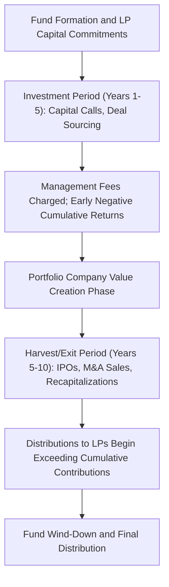

## Private Equity and Venture Capital

### Definition and Core Concept

Private equity (PE) and venture capital (VC) are forms of alternative investment involving the acquisition of equity stakes in privately held companies, financed by pooled capital from institutional and accredited investors, structured through closed-end limited partnership vehicles. While often grouped together, PE and VC target different stages of company development, employ different value-creation strategies, and exhibit distinct risk-return profiles, making the distinction between them analytically important within alternative investments.

### Structural Distinctions: PE vs. VC

**Venture Capital**

VC funds invest in early-stage, high-growth-potential companies (seed, Series A/B/C rounds) with unproven or nascent business models, typically taking **minority equity stakes** without using significant leverage, betting on a small number of investments generating outsized returns to compensate for a high base rate of failure across the portfolio (a "power law" return distribution, in contrast to a more normally distributed outcome set).

**Buyout / Growth Private Equity**

PE (in the narrower "buyout" sense) typically invests in **mature, established companies** with stable cash flows, frequently acquiring **controlling stakes** and employing substantial **leverage** (leveraged buyouts, LBOs) to enhance equity returns, with value creation strategies centered on operational improvement, financial engineering, and strategic repositioning rather than pure growth-stage risk-taking.

### Fund Structure and Economics

**Limited Partnership Structure**

Both PE and VC are typically organized as **closed-end limited partnerships**, with the fund sponsor acting as the **General Partner (GP)** (managing investments and receiving fees/carry) and outside investors (pension funds, endowments, sovereign wealth funds, family offices) as **Limited Partners (LPs)**, who commit capital that is drawn down over time as investment opportunities arise, rather than being invested as a single upfront lump sum.

**Fee Structure: "2 and 20"**

The traditional fee structure, though subject to increasing LP-driven pressure and variation, follows a **"2 and 20"** convention:

- **Management fee**: typically 2% annually of committed (or, later in the fund's life, invested) capital, compensating the GP for operational costs regardless of fund performance.
- **Carried interest ("carry")**: typically 20% of profits above a specified **hurdle rate** (commonly 8% per annum), representing the GP's performance-based compensation and aligning (in principle) GP and LP interests toward generating strong absolute returns.

**The J-Curve**

PE and VC fund performance typically follows a characteristic **J-curve** pattern over the fund's life: cumulative net returns to LPs are **negative** in early years (reflecting management fees charged on committed capital before meaningful realized gains materialize, plus the write-down of early-stage investment costs before value creation is reflected), before turning positive as portfolio companies mature and are successfully exited, typically over a fund life of 10 years (often with 1-2 year extension options).

### Performance Measurement Challenges

**Illiquidity and Valuation Issues**

Unlike public equities, PE/VC investments lack continuous market pricing, creating distinct measurement challenges:

- **Interim NAV estimates**: reported fund valuations prior to exit rely on GP-provided fair value estimates, which are inherently subject to greater discretion and potential smoothing/lagging relative to true economic value, compared to mark-to-market public securities.
- **Selection and survivorship bias**: publicly available PE/VC performance databases often suffer from self-reporting biases, as underperforming or defunct funds may be underrepresented, potentially inflating reported historical industry-average returns. [Inference: the magnitude of this bias is difficult to quantify precisely and is a persistent methodological concern in academic PE performance studies.]

**Standard Performance Metrics**

- **Internal Rate of Return (IRR)**: the discount rate that sets the net present value of all cash flows (capital calls as outflows, distributions as inflows) to zero. IRR is sensitive to the *timing* of cash flows, which can be manipulated or distorted (e.g., via subscription line credit facilities that delay LP capital calls, artificially inflating headline IRR without necessarily improving the underlying investment return—a well-documented industry practice attracting increasing LP scrutiny).
- **Multiple on Invested Capital (MOIC)** / **Total Value to Paid-In (TVPI)**: the ratio of total value generated (realized distributions plus remaining unrealized NAV) to total capital contributed, providing a timing-insensitive measure of absolute value creation, often used alongside IRR to provide a more complete performance picture.
- **Public Market Equivalent (PME)**: benchmarks PE/VC fund cash flows against a hypothetical equivalent investment in a public market index (e.g., the Kaplan-Schoar PME methodology), addressing the challenge of comparing an illiquid, irregularly-timed PE cash flow stream against liquid public market benchmarks.

### Value Creation Levers in Buyout PE

**Financial Engineering (Leverage)**

Classic LBO value creation relies partly on leverage to amplify equity returns: by financing a significant portion of the acquisition price with debt, a given percentage increase in enterprise value translates into a substantially larger percentage increase in the (smaller) equity investment, though this leverage also magnifies downside risk and increases financial distress sensitivity, particularly in higher interest rate environments.

**Operational Improvement**

Increasingly emphasized as the primary value-creation lever (particularly as high leverage and multiple expansion have become less reliable sources of return in more competitive, higher-rate environments), operational improvement involves active portfolio company management by the PE sponsor: cost reduction, revenue growth initiatives, management team upgrades, and strategic repositioning (including "buy-and-build" strategies of add-on acquisitions to a platform company).

**Multiple Expansion**

Value can also be created (or destroyed) via changes in the valuation multiple (e.g., EV/EBITDA) applied at exit relative to entry, driven by broader market conditions, improved company scale/quality, or strategic positioning—though reliance on multiple expansion as a primary value driver is generally viewed as a less durable and less controllable strategy than operational improvement, since it depends heavily on market conditions at the time of exit rather than sponsor-driven value creation.

### Venture Capital-Specific Dynamics

**Power Law Return Distribution**

VC investing is characterized by a highly **skewed, power-law-like return distribution**: the large majority of individual portfolio company investments fail to return capital or generate modest returns, while a small number of outsized successes ("home runs") generate the substantial majority of a fund's overall returns—fundamentally shaping VC investment strategy toward maximizing exposure to potential outlier outcomes rather than minimizing the frequency of failures.

**Staged Financing and Down Rounds**

VC investments are typically structured through **sequential financing rounds** (seed, Series A, B, C, etc.), with each round priced based on the company's then-current valuation and progress, allowing investors to stage capital commitment in line with resolution of key business uncertainties. A **"down round"** (a financing round at a lower valuation than the prior round) signals deteriorating company prospects or challenging fundraising conditions, and typically triggers **anti-dilution provisions** in earlier investors' preferred stock terms, adjusting their effective ownership/conversion terms to partially compensate for the valuation decline.

**Exit Pathways**

VC-backed company exits occur primarily via **Initial Public Offerings (IPOs)** or **strategic acquisitions (M&A)** by larger companies, with the relative frequency and valuation of each pathway highly sensitive to broader public market conditions and sector-specific strategic acquirer appetite, making VC fund performance meaningfully dependent on the broader IPO and M&A market cycle at the time individual portfolio companies reach exit readiness.

### Comparison Table: Venture Capital vs. Buyout Private Equity

| Feature | Venture Capital | Buyout Private Equity |
| --- | --- | --- |
| Target company stage | Early-stage, high growth potential | Mature, established, stable cash flows |
| Typical ownership stake | Minority | Controlling/majority |
| Leverage use | Minimal to none | Substantial (LBO structure) |
| Primary value creation | Growth, product-market fit | Operational improvement, financial engineering |
| Return distribution | Highly skewed (power law) | More moderate, less extreme skew |
| Key risk | Business model/execution failure | Leverage/financial distress risk |

### Diagram: Private Equity Fund Lifecycle and the J-Curve (svg_diagram)

### Worked Example: Simplified LBO Return Calculation

Suppose a PE firm acquires a company for an Enterprise Value (EV) of $500 million, financed with $300 million in debt and $200 million in equity (a 60% debt / 40% equity capital structure, i.e., 1.5x debt-to-equity).

Suppose over a 5-year holding period, the company pays down $100 million of debt from free cash flow (leaving $200 million in debt at exit), and EBITDA grows such that the company is sold at the same 8.0x EV/EBITDA entry multiple applied to now-higher EBITDA, resulting in an exit EV of $700 million (no multiple expansion assumed, isolating the operational/deleveraging effect).

**Exit equity value**:

$$\text{Exit EV} - \text{Remaining Debt} = \$700M - \$200M = \$500M$$

**Equity return multiple (MOIC)**:

$$\frac{\$500M}{\$200M} = 2.5\text{x}$$

**Approximate IRR** over 5 years:

$$(2.5)^{1/5} - 1 \approx 20.1\%$$

This illustrates how a combination of EBITDA growth ($500M to $700M in enterprise value, a 40% increase) and debt paydown (leverage effect) combine to generate a 2.5x equity multiple—substantially amplified relative to the underlying 40% enterprise value growth, demonstrating the leverage amplification mechanism central to LBO returns even without any assumed multiple expansion.

### Related Topics

- Leveraged buyout (LBO) modeling and capital structure
- Carried interest, hurdle rates, and GP-LP alignment
- J-curve dynamics and PE cash flow patterns
- Public Market Equivalent (PME) performance benchmarking
- Power law returns and portfolio construction in venture capital
- Staged financing, preferred stock terms, and anti-dilution provisions
- Illiquidity premium and alternative asset allocation
- Subscription line facilities and IRR manipulation concerns
- Secondary market transactions in private equity