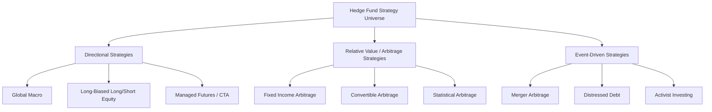

## Hedge Fund Strategies

### Definition and Core Concept

Hedge funds are pooled investment vehicles that employ a broad and flexible range of strategies—often involving leverage, short selling, derivatives, and concentrated or illiquid positions—typically structured to pursue **absolute returns** relatively uncorrelated with traditional long-only benchmarks, rather than tracking a specific market index. Unlike mutual funds, hedge funds face fewer regulatory constraints on strategy and portfolio composition (in exchange for restricting access to accredited/qualified investors), enabling the diverse strategy universe covered below.

### Fee Structure and Fund Terms

**"2 and 20" and Its Evolution**

Historically, hedge funds charged a **2% annual management fee** plus **20% performance fee (carry)** on profits, though industry-wide fee compression since the 2008 financial crisis has pushed average fees notably lower, particularly for larger, more established funds facing competitive pressure from lower-cost alternatives.

**High-Water Marks**

Most hedge fund performance fee structures incorporate a **high-water mark** provision: performance fees are only charged on **new** profits above the fund's previous peak (high-water mark) net asset value, preventing managers from collecting performance fees on merely recovering prior losses—an important alignment mechanism protecting investors from paying twice for the same gains.

**Liquidity Terms: Lock-ups, Gates, and Redemption Notice**

Hedge funds commonly impose **lock-up periods** (an initial period, often 1-2 years, during which investor redemptions are prohibited), **redemption notice periods** (requiring advance notice, e.g., 30-90 days, before redemption), and **gates** (limits on the aggregate percentage of fund assets that can be redeemed at any single redemption date, protecting remaining investors from forced asset liquidation at unfavorable prices during periods of heavy redemption requests).

### Major Strategy Categories

**Long/Short Equity**

The most common hedge fund strategy category: managers take **long positions** in stocks expected to outperform and **short positions** in stocks expected to underperform, with the strategy's **net exposure** (long minus short, as a percentage of capital) determining overall market directionality. A market-neutral variant targets near-zero net exposure, aiming to isolate manager stock-selection skill (**alpha**) from broad market movements (**beta**), while a more directional long-biased variant retains meaningful net long market exposure alongside the short book.

**Global Macro**

Managers take positions across currencies, interest rates, commodities, and equity indices based on top-down macroeconomic views (e.g., anticipated central bank policy shifts, currency crisis dynamics, or sovereign debt sustainability concerns), often employing significant leverage and directional conviction, exemplified historically by episodes like George Soros's 1992 short position against the British pound during the ERM crisis (discussed under currency crises).

**Event-Driven**

Strategies seeking to profit from specific corporate events, with common sub-strategies including:

- **Merger arbitrage**: taking positions in companies involved in announced M&A transactions, typically going long the target and short the acquirer (in stock-for-stock deals), profiting from the spread between the current target share price and the announced deal price, with the primary risk being **deal break risk** (the transaction failing to close due to regulatory rejection, financing failure, or shareholder rejection).
- **Distressed debt / special situations**: investing in the debt or equity of financially distressed companies, often anticipating value recovery through restructuring, bankruptcy reorganization, or operational turnaround.
- **Activist investing**: acquiring significant equity stakes in target companies to actively influence corporate strategy, capital allocation, or governance, typically through public campaigns, board representation, or negotiated engagement with management.

**Relative Value / Arbitrage**

Strategies seeking to exploit pricing discrepancies between related securities while minimizing net directional market exposure, including:

- **Fixed income arbitrage**: exploiting small pricing anomalies between related fixed income securities (e.g., on-the-run vs. off-the-run Treasuries, swap spreads, or yield curve relative value), typically requiring substantial leverage to generate meaningful returns from inherently small individual spreads—a strategy famously associated with the 1998 collapse of Long-Term Capital Management (LTCM), which illustrated the acute liquidity/leverage risks in this strategy category when correlated positions move simultaneously against a highly leveraged book.
- **Convertible arbitrage**: typically involves buying convertible bonds while shorting the underlying common stock, seeking to isolate and profit from the convertible bond's embedded option value (or other pricing inefficiencies) while hedging out equity price risk.
- **Statistical arbitrage**: quantitative strategies exploiting short-term, model-identified pricing relationships among large numbers of securities, typically holding very short holding periods and relying on rapid, systematic execution across a diversified basket of positions.

**Managed Futures / CTAs**

**Commodity Trading Advisors (CTAs)** primarily employ **systematic, trend-following strategies** across futures markets (commodities, currencies, interest rates, equity indices), taking long or short positions based on identified price momentum/trends. This strategy category has historically exhibited valuable **crisis alpha** characteristics—tending to perform well during sustained market downtrends (e.g., 2008), since trend-following can capture sustained directional moves in either direction, providing a distinctive diversification benefit relative to strategies with predominantly long-biased market exposure.

### Performance Evaluation Considerations

**Return Smoothing and Illiquidity Bias**

Hedge fund returns, particularly for strategies holding illiquid or infrequently-priced positions, can exhibit **serial correlation/return smoothing** in reported performance (Getmansky, Lo, and Makarov 2004), which can artificially depress measured volatility and inflate risk-adjusted performance metrics (e.g., Sharpe ratios) if not properly corrected for, since true economic volatility may be understated by stale or model-based interim valuations.

**Database Biases**

Hedge fund performance databases are commonly subject to:

- **Survivorship bias**: funds that close (often due to poor performance) are removed from ongoing databases, potentially inflating the average historical performance of the surviving fund universe.
- **Backfill bias**: funds typically only begin reporting to commercial databases after establishing a track record, and may selectively backfill historical performance only when that history is favorable, again inflating reported industry-average historical returns.

**Non-Normal Return Distributions**

Many hedge fund strategies (particularly merger arbitrage, fixed income arbitrage, and other strategies involving selling insurance-like payoffs against tail risk) exhibit **negatively skewed** return distributions: consistent small positive returns punctuated by occasional large losses—a payoff profile sometimes characterized as "picking up nickels in front of a steamroller." This non-normality means standard mean-variance risk metrics (like the Sharpe ratio) can understate true tail risk, motivating the use of alternative risk measures (e.g., Value-at-Risk, Conditional VaR/Expected Shortfall, and downside deviation measures) for hedge fund risk assessment.

### Comparison Table: Major Hedge Fund Strategy Categories

| Strategy | Directionality | Primary Risk Factor | Key Historical Example |
| --- | --- | --- | --- |
| Long/short equity | Variable (net exposure dependent) | Stock selection, market beta | Market-neutral vs. long-biased variants |
| Global macro | Highly directional | Macro forecasting error, leverage | Soros vs. British pound (1992) |
| Merger arbitrage | Low net exposure | Deal break risk | Regulatory-blocked mega-mergers |
| Fixed income arbitrage | Low net exposure, high leverage | Liquidity/correlation risk | LTCM collapse (1998) |
| Managed futures/CTA | Systematic trend-following | Trend reversal/whipsaw risk | Strong 2008 "crisis alpha" performance |

### Diagram: Hedge Fund Strategy Risk-Return Positioning (svg_diagram)

### Worked Example: Merger Arbitrage Spread Calculation

Suppose Company A announces an all-stock acquisition of Company B at a fixed exchange ratio of 0.5 shares of Company A per share of Company B. Company A currently trades at $80/share, implying an offer value of:

$$0.5 \times \$80 = \$40 \text{ per share of Company B}$$

Suppose Company B currently trades at $37/share (reflecting market-assessed deal completion risk and the time value of money until expected closing). The merger arbitrage **spread** is:

$$\$40 - \$37 = \$3 \text{ per share, or } \frac{\$3}{\$37} \approx 8.1\%$$

A merger arbitrageur would go long Company B (at $37) and short 0.5 shares of Company A per share of Company B held (to hedge against Company A's stock price moving before deal close, since the payoff is fixed in terms of Company A shares). If the deal closes as announced in, say, 6 months, the arbitrageur captures the 8.1% spread over that half-year period—an attractive annualized return, but only if the deal successfully closes; a deal break (e.g., due to antitrust rejection) would typically cause Company B's share price to fall sharply back toward its pre-announcement standalone value, generating a substantial loss that illustrates the strategy's characteristic negatively-skewed risk profile.

### Related Topics

- Long/short equity and market-neutral portfolio construction
- Merger arbitrage and deal break risk assessment
- LTCM collapse (1998) and leveraged fixed income arbitrage risk
- Managed futures, trend-following, and crisis alpha
- Hedge fund return smoothing and database biases (Getmansky-Lo-Makarov)
- Activist investing and shareholder engagement strategies
- Private equity and venture capital (alternative investment comparison)
- Prime brokerage, leverage, and margin financing
- Tail risk and non-normal return distribution measurement