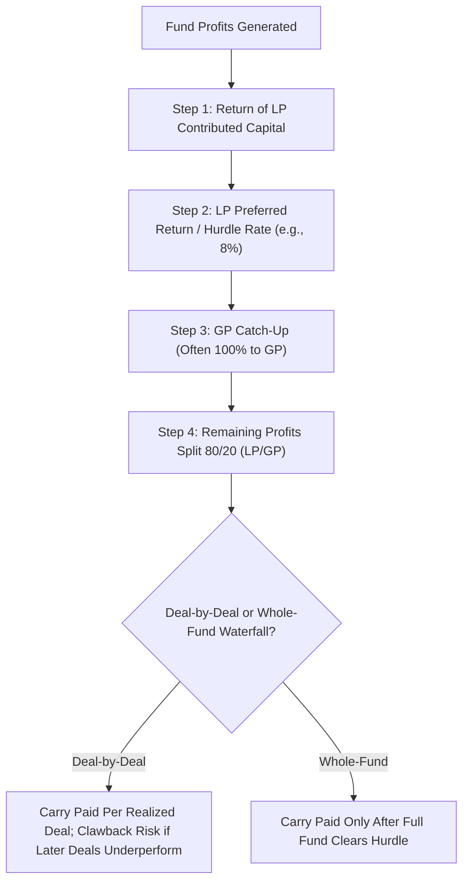

## Fund Structures, Fees, and Performance Measurement

### Definition and Core Concept

This topic provides a unified, cross-strategy treatment of the legal and economic architecture underlying alternative investment vehicles (private equity, venture capital, hedge funds, real assets funds), covering how funds are structured, how managers are compensated, and how investors should properly evaluate performance given the unique measurement challenges alternative investments present relative to traditional long-only public market strategies. This synthesizes and extends fund-mechanics themes introduced separately under private equity/venture capital and hedge fund strategies.

### Legal Fund Structures

**Closed-End Limited Partnerships**

The dominant structure for private equity, venture capital, and many real asset funds: investors (Limited Partners, LPs) commit capital upfront, which is **drawn down** ("called") by the General Partner (GP) over an investment period as opportunities arise, rather than being fully invested immediately. Capital is returned to LPs via **distributions** as portfolio investments are realized (sold or taken public), with the fund having a **finite life** (typically 10 years, often with limited extension options), after which the fund must be fully wound down and all capital returned.

**Open-End Structures**

Most hedge funds instead use an **open-end** structure: investors can subscribe or redeem capital at periodic intervals (e.g., monthly or quarterly), subject to the liquidity terms (lock-ups, notice periods, gates) already discussed under hedge fund strategies. This structural difference reflects the generally greater underlying liquidity of hedge fund strategies (which typically trade liquid or semi-liquid public securities) relative to PE/VC (which hold illiquid private company stakes with long value-realization horizons).

**Master-Feeder Structures**

Many funds, particularly hedge funds with both domestic (taxable) and offshore (tax-exempt or non-U.S.) investors, employ a **master-feeder structure**: separate "feeder" funds (often one domestic, one offshore) pool investor capital and then invest that capital into a single common "master" fund, which executes the actual trading strategy. This structure allows the manager to run one unified portfolio and trading operation while accommodating the differing tax and regulatory needs of different investor types across separate feeder vehicles.

**Fund-of-Funds**

A **fund-of-funds** invests LP capital not directly into portfolio companies or securities, but into a diversified portfolio of underlying PE, VC, or hedge funds, providing investors (particularly smaller institutions lacking the scale or due diligence resources for direct fund selection) with diversification across managers and vintage years, at the cost of an **additional layer of fees** (typically an additional smaller management fee and sometimes a reduced carry) charged on top of the underlying funds' own fee structures.

### Fee Structures

**Management Fees**

Typically **1-2% annually**, calculated on committed capital during a fund's investment period and often stepping down to a lower percentage (or shifting to a basis of invested/remaining cost, rather than total committed capital) in later years, reflecting the declining active portfolio management burden as a fund matures toward its harvest period.

**Performance Fees (Carried Interest)**

Typically **15-20%** of profits, though the specific mechanics vary meaningfully by structure:

- **Deal-by-deal (American) waterfall**: carry is calculated and potentially distributed to the GP on a per-investment basis as each individual portfolio investment is realized, which can result in the GP receiving carry payments earlier in the fund's life, even if the overall fund ultimately underperforms once later, weaker-performing investments are realized (creating potential **"clawback"** obligations, discussed below).
- **Whole-fund (European) waterfall**: carry is only paid to the GP after the **entire fund** has returned all LP contributed capital plus the hurdle rate, providing generally stronger LP protection by ensuring GP carry payments only occur once the fund as a whole has cleared the LP's preferred return threshold.

**Hurdle Rate and Catch-Up**

The **hurdle rate** (commonly 8% per annum) represents the minimum return LPs must receive before the GP earns any carried interest. Many fee structures also include a **GP catch-up** provision: once the hurdle is cleared, a disproportionate share (often 100%, until the GP has "caught up" to its full 20% share of all profits above the LP's initial capital, including the hurdle-rate portion) of subsequent profits flows to the GP until the overall 80/20 split is achieved across all profits above capital return, at which point the standard 80/20 split resumes for remaining profits.

**Clawback Provisions**

Given the deal-by-deal waterfall's risk of the GP receiving carry on early successful deals before later underperformance is realized, **clawback provisions** require the GP to return previously received carry payments if the fund's overall (whole-fund) performance ultimately falls short of what the agreed carry split would have implied, ensuring the GP does not retain carry in excess of its contractually agreed share of total fund profits over the fund's complete life.

### Performance Measurement for Illiquid Alternatives

**Time-Weighted vs. Money-Weighted Returns**

A foundational distinction: **time-weighted return (TWR)** measures the compound growth rate of a dollar invested throughout a period, unaffected by the timing/size of external cash flows (appropriate for evaluating a manager's pure investment skill, independent of client-driven contribution/withdrawal timing), while **money-weighted return (equivalent to IRR)** incorporates the actual timing and magnitude of cash flows, reflecting the actual dollar-weighted experience of the investor. For PE/VC funds—where the manager (not the investor) controls the timing of capital calls and distributions—IRR (money-weighted) is the standard and more economically meaningful metric, since cash flow timing itself reflects manager decisions being evaluated.

**IRR Limitations and Manipulation Concerns**

As introduced under private equity/venture capital, IRR's sensitivity to cash flow timing creates manipulation potential, most notably via **subscription line credit facilities**: short-term fund-level borrowing used to delay LP capital calls (and fund investments using debt instead), which can substantially inflate reported early-fund IRR by compressing the time between capital deployment and eventual realization, without necessarily changing the underlying MOIC/absolute value creation—a practice that has drawn increasing scrutiny and disclosure requirements from institutional LPs and industry bodies (e.g., ILPA, the Institutional Limited Partners Association).

**Multiple-Based Metrics**

- **TVPI (Total Value to Paid-In)**: (Distributions + Remaining NAV) / Total Paid-In Capital — measures total value creation, insensitive to timing.
- **DPI (Distributions to Paid-In)**: Distributions / Total Paid-In Capital — measures *realized* value returned to LPs specifically, an important complement to TVPI since it excludes potentially optimistic unrealized NAV marks, providing a more conservative, "cash-in-hand" performance indicator.
- **RVPI (Residual Value to Paid-In)**: Remaining NAV / Total Paid-In Capital — the unrealized component, such that TVPI = DPI + RVPI by construction.

**Public Market Equivalent (PME) Benchmarking**

As introduced previously, PME methodologies (e.g., Kaplan-Schoar PME, Long-Nickels PME) address the challenge of benchmarking illiquid, irregular-cash-flow PE/VC performance against liquid public market indices by simulating what would have happened had the same LP cash flows instead been invested in (and withdrawn from) a public market index at the corresponding dates, providing an apples-to-apples comparison against a relevant public market alternative.

### Risk-Adjusted Performance Measures and Their Alternative-Investment Caveats

**Sharpe Ratio Limitations**

The standard Sharpe ratio (excess return divided by return standard deviation) can be materially misleading for many alternative investment strategies due to:

- **Return smoothing**: illiquid or infrequently-marked positions (common across PE, VC, and certain hedge fund strategies) can understate true volatility, artificially inflating the Sharpe ratio.
- **Non-normal, skewed distributions**: strategies with negatively skewed payoffs (e.g., merger arbitrage, as discussed under hedge fund strategies) can exhibit attractive historical Sharpe ratios that fail to capture meaningful tail risk exposure.

**Alternative Risk-Adjusted Metrics**

Given these limitations, alternative investment evaluation frequently supplements (or replaces) the Sharpe ratio with:

- **Sortino ratio**: uses downside deviation (volatility of only negative/below-target returns) rather than total standard deviation, better capturing asymmetric risk profiles.
- **Calmar ratio**: return divided by maximum drawdown, directly incorporating the worst historical peak-to-trough loss rather than a volatility-based risk measure.
- **Modified Sharpe/VaR-based measures**: incorporating skewness and kurtosis adjustments (e.g., Cornish-Fisher VaR) to better capture tail risk in non-normal return distributions.

### Comparison Table: Key Fund Performance Metrics

| Metric | Formula/Definition | Best Used For |
| --- | --- | --- |
| IRR | Discount rate equating cash flow NPV to zero | Money-weighted, timing-sensitive PE/VC evaluation |
| TVPI | (Distributions + NAV) / Paid-In Capital | Timing-insensitive absolute value creation |
| DPI | Distributions / Paid-In Capital | Conservative, realized-only performance |
| PME | Simulated public market equivalent cash flows | Benchmarking illiquid funds vs. public markets |
| Sortino Ratio | Excess return / downside deviation | Asymmetric/skewed strategy risk adjustment |

### Diagram: Carried Interest Waterfall Structure (svg_diagram)

### Worked Example: TVPI, DPI, and RVPI Calculation

Suppose an LP has contributed $10 million in total paid-in capital to a PE fund over its investment period. By year 7, the fund has:

- Distributed $9 million in realized proceeds back to the LP
- Remaining unrealized NAV (GP-estimated fair value of remaining portfolio companies) of $6 million

**DPI** (realized-only performance):

$$\text{DPI} = \frac{\$9M}{\$10M} = 0.9\text{x}$$

**RVPI** (unrealized component):

$$\text{RVPI} = \frac{\$6M}{\$10M} = 0.6\text{x}$$

**TVPI** (total value creation):

$$\text{TVPI} = \text{DPI} + \text{RVPI} = 0.9 + 0.6 = 1.5\text{x}$$

This indicates the fund has generated a total value of 1.5 times paid-in capital, but critically, DPI of only 0.9x shows the LP has not yet even recovered its full contributed capital in realized cash terms—the fund's apparent overall success (1.5x TVPI) still depends significantly on the GP's unrealized NAV marks (0.6x RVPI) being accurate and ultimately realized at or near their currently stated values, illustrating why sophisticated LPs examine DPI and RVPI separately rather than relying on TVPI alone, particularly for funds still in their earlier-to-mid life where a large RVPI component carries more valuation uncertainty.

### Related Topics

- Private equity and venture capital fund mechanics
- Hedge fund strategies and liquidity terms
- Carried interest waterfalls: American vs. European structures
- Subscription line facilities and IRR manipulation
- Public Market Equivalent (PME) benchmarking methodologies
- Institutional Limited Partners Association (ILPA) reporting standards
- Return smoothing and volatility understatement (Getmansky-Lo-Makarov)
- Fund-of-funds structures and layered fee analysis
- Risk-adjusted performance measures for non-normal return distributions