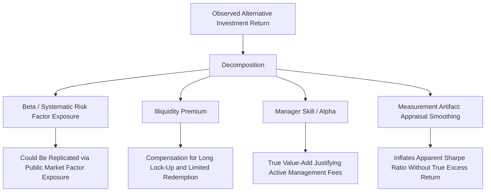

## Illiquidity Premia

### Definition and Core Concept

The illiquidity premium refers to the additional expected return investors require for holding assets that cannot be readily bought or sold at fair market value without incurring significant cost, delay, or price impact—compensation for bearing **liquidity risk** distinct from, though sometimes correlated with, conventional market/systematic risk. This concept is central to alternative investments (private equity, venture capital, real estate, private credit) since illiquidity is a defining structural feature distinguishing these asset classes from publicly traded securities, and understanding whether—and how much—investors are actually compensated for accepting this illiquidity is a first-order question in alternative asset allocation.

### Theoretical Foundations

**Amihud and Mendelson (1986): The Clientele Model**

The foundational theoretical treatment models liquidity as a transaction cost (bid-ask spread) borne by investors, with a key insight: since investors with **longer expected holding periods** amortize a fixed transaction cost over more time, they require a *smaller* annualized compensation for a given level of illiquidity than short-horizon investors. This generates an equilibrium **clientele effect**: less liquid assets are naturally held by longer-horizon investors, and in equilibrium, the illiquidity premium is a concave, increasing function of the bid-ask spread, but the marginal illiquid asset is priced by the marginal (longest-horizon) investor clientele holding it—an important theoretical basis for why long-horizon institutional investors (pension funds, endowments, sovereign wealth funds) are natural holders of illiquid alternative assets, and can rationally expect a premium unavailable to shorter-horizon investors constrained to more liquid holdings.

**Liquidity as a Priced Risk Factor**

Beyond the transaction-cost framing, a distinct and complementary literature (e.g., Pastor and Stambaugh 2003) treats **liquidity risk** as a systematic priced factor: assets whose returns are more sensitive to *aggregate market liquidity shocks* (assets that perform poorly precisely when overall market liquidity dries up, such as during 2008) require a risk premium for this exposure, separate from the level of the asset's own average illiquidity. This distinguishes two related but conceptually distinct sources of the illiquidity premium: (1) compensation for the direct transaction/holding cost of illiquidity itself, and (2) compensation for *systematic exposure* to liquidity risk (assets that are liquid on average but whose liquidity specifically evaporates during market stress).

### Empirical Evidence Across Asset Classes

**Public Market Cross-Sectional Evidence**

Within public equity markets, extensive empirical work documents that less liquid stocks (measured via bid-ask spreads, Amihud illiquidity ratios, or trading volume) have historically earned higher average returns than more liquid stocks, controlling for standard risk factors (size, value, momentum)—providing direct cross-sectional evidence consistent with the Amihud-Mendelson framework, even entirely within the universe of publicly traded, nominally liquid securities.

**Private vs. Public Market Comparisons**

Comparing private equity/venture capital returns against public market equivalents (via PME methodologies, discussed under fund performance measurement) provides the primary evidence on whether PE/VC investors are compensated for illiquidity at the asset-class level. Empirical findings in this literature are notably mixed and sensitive to sample period and methodology:

- Some studies find PE has historically outperformed public equities by a modest premium (often cited in the range of a few hundred basis points annually, though estimates vary considerably by study, vintage year cohort, and whether gross or net-of-fee returns are examined) [Inference: given the wide range of published estimates and known database/survivorship bias concerns discussed under fund performance measurement, treating any single point estimate as precise is not warranted].
- Other work finds the premium has compressed or become statistically indistinguishable from zero in more recent vintage years, potentially reflecting increased competition for deals, a maturing and more efficiently-priced private market, and improved LP sophistication in fee negotiation. [Unverified: this compression finding, while cited in some recent industry and academic commentary, remains subject to ongoing debate and depends heavily on the specific sample period studied, given this is an actively evolving area of research.]

**Real Estate and Private Credit**

Similar illiquidity premium logic applies to direct real estate and private credit/direct lending, where investors accept longer lock-ups and less frequent, appraisal-based (rather than market-transaction-based) valuation in exchange for a theoretically higher expected return relative to comparable liquid public market proxies (public REITs, broadly syndicated leveraged loans), though isolating the pure illiquidity premium from other risk differences (credit quality, leverage, sector concentration) between private and public market proxies is methodologically challenging.

### Measurement Challenges

**Appraisal Smoothing and Understated Volatility**

As discussed under fund performance measurement, illiquid assets are typically valued via periodic appraisals or GP-provided fair value marks rather than continuous market transactions, which tends to **smooth** reported returns and understate true economic volatility—this creates a measurement artifact that can make illiquid assets *appear* to offer a superior risk-adjusted return (inflated Sharpe ratio) purely as a statistical consequence of infrequent, smoothed marking, rather than reflecting a genuine risk-adjusted illiquidity premium. Various de-smoothing techniques (e.g., Geltner unsmoothing methods, originally developed for real estate) attempt to recover a more accurate estimate of true underlying volatility from reported appraisal-based return series.

**Denominator Effect and Rebalancing Constraints**

A related practical consideration for institutional allocators: since illiquid asset valuations lag public market movements (due to appraisal smoothing), a sharp public market decline can cause an institution's illiquid allocations to appear to represent a *larger* percentage of total portfolio value than their true (contemporaneously marked) economic value would suggest—the so-called **denominator effect**—potentially forcing unwanted rebalancing decisions or breaching allocation policy limits based on stale, lagged illiquid-asset valuations rather than current market conditions.

### Illiquidity Premium vs. Manager Skill

**Disentangling Sources of Alternative Investment Returns**

A central analytical challenge in evaluating alternative investment performance is distinguishing returns attributable to:

1. **Beta/market exposure**: returns simply reflecting exposure to the same underlying risk factors available in public markets (e.g., a PE buyout fund's returns reflecting leveraged small-cap value equity exposure achievable more cheaply via public market proxies).
2. **Illiquidity premium**: compensation specifically for accepting illiquidity, as discussed above.
3. **Manager skill/alpha**: true value added by the manager beyond what passive exposure to the same risk factors (adjusted for illiquidity) would deliver.

Sophisticated performance attribution (e.g., factor-based PME extensions) attempts to decompose observed alternative investment returns along these lines, since an investor should only be willing to pay active-management-level fees (2 and 20) for the manager-skill component, while the illiquidity premium and beta exposure components could, in principle, be captured more cheaply through other means (e.g., liquid factor-based strategies, or simply accepting illiquidity via a lower-cost vehicle) if such alternatives were available at comparable scale and access. [Inference: in practice, direct access to comparable illiquid-asset risk-return profiles outside of traditional fund structures remains limited for most institutional investors, which is part of why this decomposition remains more of an analytical framework than a fully actionable arbitrage in current market structure.]

### Comparison Table: Sources and Manifestations of Illiquidity Premia

| Concept | Core Mechanism | Key Reference |
| --- | --- | --- |
| Clientele-based transaction cost premium | Long-horizon investors amortize bid-ask spread over time | Amihud and Mendelson (1986) |
| Systematic liquidity risk premium | Compensation for exposure to aggregate liquidity shocks | Pastor and Stambaugh (2003) |
| Appraisal smoothing artifact | Understated volatility inflates apparent risk-adjusted return | Geltner unsmoothing literature |
| Denominator effect | Lagged illiquid valuations distort portfolio allocation percentages | Institutional asset allocation practice |

### Diagram: Sources of Observed Alternative Investment Outperformance (svg_diagram)

### Worked Example: Illustrative Illiquidity Premium Decomposition

Suppose a private equity fund reports a net IRR of 14% annually over a 10-year period. A PME analysis against a relevant public small-cap value equity index (chosen to match the fund's approximate sector/size/leverage risk profile) implies that an equivalent public market strategy would have generated an annualized return of 10% over the same period, using the same LP cash flow timing.

The raw outperformance is:

$$14\% - 10\% = 4 \text{ percentage points annually}$$

Suppose further analysis (e.g., de-smoothing the reported NAV series and comparing risk-adjusted metrics) attributes approximately half of this 4-point gap to genuine manager operational value-add (skill/alpha) and half to compensation for illiquidity and the fund's use of leverage beyond what the PME benchmark's risk profile fully captures:

$$\text{Illiquidity/leverage premium} \approx 2\text{pp}, \quad \text{Manager alpha} \approx 2\text{pp}$$

This illustrative decomposition demonstrates why a single aggregate outperformance figure (the 4pp raw PME spread) is insufficient for evaluating whether a fund's fees are justified: if the "true" manager skill component is only 2 percentage points, while the fund charges "2 and 20" fees calculated on the full gross return, LPs are effectively paying substantial performance fees on the illiquidity premium component as well as genuine skill—a distinction increasingly emphasized in sophisticated institutional due diligence and fee negotiation. [Unverified: this specific 50/50 decomposition is illustrative only; actual skill-versus-premium attribution in practice requires fund-specific analysis and remains subject to considerable estimation uncertainty.]

### Related Topics

- Amihud and Mendelson clientele model of liquidity
- Pastor-Stambaugh systematic liquidity risk factor
- Public Market Equivalent (PME) benchmarking
- Appraisal smoothing and Geltner unsmoothing techniques
- Denominator effect in institutional portfolio rebalancing
- Fund structures, fees, and performance measurement
- Private equity and venture capital return decomposition
- Intermediary asset pricing and limits to arbitrage
- Real estate and private credit illiquidity considerations