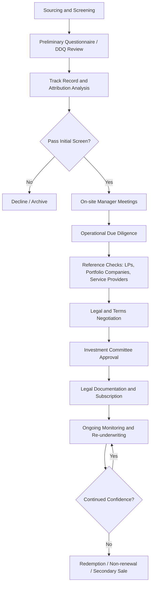

## Manager Selection and Due Diligence

### Overview

Manager selection and due diligence is the systematic process by which institutional and sophisticated individual investors evaluate, select, and monitor investment managers—particularly in alternative investment contexts such as hedge funds, private equity, private credit, real assets, and venture capital. Unlike traditional long-only public market strategies where manager dispersion is relatively narrow, alternative investment manager selection carries outsized importance because the dispersion between top-quartile and bottom-quartile managers is substantially wider, illiquidity locks up capital for years, and fee structures amplify the cost of poor selection.

The due diligence process typically spans two broad domains: **investment due diligence** (assessing the manager's ability to generate returns) and **operational due diligence** (assessing the manager's ability to safely administer, value, and safeguard assets). Both domains are necessary; history shows that operational failures (fraud, valuation manipulation, inadequate controls) have caused as many investor losses as poor investment decisions.

---

### Why Manager Selection Matters More in Alternatives

**Key Points**

- Return dispersion between top and bottom quartile managers is significantly wider in alternatives than in traditional asset classes, particularly in private equity and venture capital.
- Illiquidity risk compounds selection risk: investors in closed-end vehicles (private equity, private credit, some real assets) cannot easily exit an underperforming manager relationship once committed.
- Fee structures (commonly "2 and 20" — a 2% management fee and 20% performance fee/carried interest) mean a manager's true skill (alpha) must overcome a higher hurdle before delivering value net of fees.
- Manager skill persistence is empirically stronger in private equity than in hedge funds; top-performing private equity managers are more likely to remain top performers in subsequent funds than top-performing hedge fund managers are to repeat outperformance. [Inference — based on academic persistence literature; magnitude varies by study period and vintage]
- Access constraints exist: top-tier managers (especially in venture capital and buyout) are frequently oversubscribed, meaning selection also involves relationship-building and capital allocation strategy, not just analytical screening.

---

### The Due Diligence Framework

Due diligence is generally organized into four interlocking pillars:

#### 1. Investment Due Diligence

This pillar assesses whether the manager can generate risk-adjusted returns consistent with their stated strategy.

**Strategy and Philosophy**

- Understanding the manager's investment thesis: what market inefficiency or structural edge are they exploiting?
- Assessing whether the strategy is repeatable and scalable, or dependent on a narrow set of idiosyncratic opportunities.
- Evaluating capacity constraints — does the strategy degrade in performance as assets under management (AUM) grow?

**Track Record Analysis**

- Return attribution: decomposing historical returns into sources (e.g., market beta, sector/factor tilts, security selection, leverage, timing).
- Risk-adjusted performance metrics, including the Sharpe ratio, Sortino ratio, and information ratio:

$$\text{Sharpe Ratio} = \frac{R_p - R_f}{\sigma_p}$$

where $R_p$ is the portfolio return, $R_f$ is the risk-free rate, and $\sigma_p$ is the standard deviation of portfolio returns.

- For private equity/private credit, cash-flow-based metrics dominate over time-weighted returns because capital is drawn and returned irregularly:

$$\text{IRR}: \sum_{t=0}^{T} \frac{CF_t}{(1+\text{IRR})^t} = 0$$

- Total Value to Paid-In (TVPI), Distributed to Paid-In (DPI), and Residual Value to Paid-In (RVPI) are standard private equity performance multiples:

$$\text{TVPI} = \text{DPI} + \text{RVPI} = \frac{\text{Total Value}}{\text{Paid-In Capital}}$$

- Public Market Equivalent (PME) methodologies (e.g., Kaplan-Schoar PME) benchmark private fund cash flows against what would have been earned investing the same cash flows in a public index.
- Vintage year effects must be controlled for: comparing a manager's fund launched in a trough year against one launched at a market peak without adjustment produces misleading conclusions.

**Team and Organization**

- Depth and stability of the investment team; key-person risk (dependence on one or two individuals).
- Turnover history, particularly departures of senior investment professionals.
- Alignment of interests: co-investment by principals (general partner/GP commitment), vesting schedules, and carried interest allocation across the team.
- Succession planning, especially for founder-led firms nearing generational transition.

**Portfolio Construction and Risk Management**

- Position sizing methodology, concentration limits, leverage policy, and use of derivatives.
- Stress-testing and scenario analysis practices.
- Historical drawdown behavior and recovery periods.
- Correlation of the strategy to other portfolio holdings (diversification benefit).

#### 2. Operational Due Diligence (ODD)

**Key Points**

- ODD exists to detect fraud, weak controls, and operational fragility that investment due diligence alone would not surface.
- A strong investment track record does not substitute for weak operational infrastructure; several well-known fraud cases (e.g., Madoff-style Ponzi schemes) passed investment-level scrutiny for years because operational controls were never independently verified.

**Core ODD Areas**

- **Valuation policy and independence**: Is the manager valuing illiquid or hard-to-price positions internally, or is there an independent, reputable third-party administrator? Are valuation policies documented and consistently applied?
- **Fund administration**: Use of a recognized, independent fund administrator to strike net asset value (NAV), rather than the manager self-administering.
- **Custody arrangements**: Are assets held at a reputable, independent prime broker or custodian, separate from the investment manager?
- **Audit quality**: Is the fund audited annually by a recognized accounting firm, and are audited financials consistent with reported performance?
- **Compliance infrastructure**: Existence of a Chief Compliance Officer, written compliance manuals, trade surveillance, and regulatory registration status (e.g., with the SEC as a Registered Investment Adviser, or equivalent regulator).
- **Business continuity and cybersecurity**: Disaster recovery plans, IT security protocols, and data protection practices.
- **Legal and regulatory history**: Litigation history, regulatory sanctions, and background checks (criminal, civil, regulatory) on key principals.
- **Service provider quality**: Reviewing the reputation and independence of legal counsel, auditors, administrators, and prime brokers used by the manager.

#### 3. Legal and Terms Due Diligence

- Review of fund governing documents: Limited Partnership Agreement (LPA) or offering memorandum, side letters, and subscription agreements.
- Fee structure analysis: management fee, performance fee/carried interest, hurdle rates, catch-up provisions, high-water marks (in hedge funds), and fee offsets (in private equity, offsetting portfolio company monitoring fees against the management fee).
- Liquidity terms: lock-up periods, redemption notice periods, gates (limits on redemption amounts in a given period), and side pockets for illiquid holdings.
- Key-person clauses and "for cause"/"no cause" removal provisions for general partners.
- Most Favored Nation (MFN) clauses ensuring an investor receives terms no worse than other similarly situated investors.
- Co-investment rights and allocation policy transparency.

#### 4. Operational/ESG and Reputational Due Diligence

- Increasingly, institutional investors incorporate Environmental, Social, and Governance (ESG) due diligence, assessing the manager's ESG policy, integration process, and reporting standards.
- Reputational screening: reference checks with existing and former limited partners (LPs), portfolio company executives, and industry counterparties.
- Diversity, equity, and inclusion practices at the firm and portfolio company level, where relevant to the institutional investor's mandate.

---

### The Due Diligence Process (Sequential Workflow)

**Sourcing and Screening**

- Manager sourcing occurs through databases (e.g., Preqin, PitchBook, HFR), consultant networks, industry conferences, and existing LP relationships.
- Initial screens typically apply minimum thresholds for AUM, track record length (often 3+ years or 2+ funds for private equity), and strategy fit with the investor's mandate.

**Due Diligence Questionnaire (DDQ)**

- A standardized DDQ (often based on templates from organizations such as AIMA — the Alternative Investment Management Association, or ILPA — the Institutional Limited Partners Association) is the starting point for structured information gathering across investment, operational, legal, and risk dimensions.

**On-Site Visits and Manager Meetings**

- Direct observation of the manager's office, technology infrastructure, and team dynamics.
- Interviews across multiple levels of the organization, not just senior principals, to cross-validate messaging.

**Reference Checks**

- Both "on-list" references (provided by the manager) and "off-list" references (independently sourced) are valuable; off-list references often surface more candid feedback.

**Investment Committee Decision**

- Findings are synthesized into an investment memo presented to an investment committee, which weighs risk/return characteristics against portfolio construction objectives (diversification, liquidity budget, target allocation to the asset class).

---

### Ongoing Monitoring and Re-Underwriting

Due diligence does not end at initial fund commitment or investment. Ongoing monitoring includes:

- **Quarterly and annual reporting review**: performance, portfolio composition, and material organizational changes (e.g., key personnel departures, ownership changes, regulatory actions).
- **Style drift detection**: monitoring whether the manager's actual portfolio positioning remains consistent with the strategy described at initial due diligence.
- **Re-underwriting cadence**: many institutional allocators formally re-underwrite manager relationships annually or biennially, effectively repeating a condensed due diligence process.
- **Watch-list protocols**: formal criteria triggering enhanced monitoring or redemption consideration (e.g., performance below benchmark for a defined period, team departures, operational red flags).

---

### Common Red Flags in Due Diligence

| Category | Red Flag |
| --- | --- |
| Investment | Returns too smooth/consistent relative to stated strategy volatility |
| Investment | Significant, unexplained style drift from stated strategy |
| Operational | Manager self-administers NAV with no independent administrator |
| Operational | Auditor is a small, unknown, or non-independent firm |
| Operational | Reluctance to provide audited financials or delays in audit completion |
| Legal | Excessive side letters granting preferential terms undisclosed to other LPs |
| Team | High key-person concentration with no succession plan |
| Team | Elevated, unexplained staff turnover, especially in risk/compliance functions |
| Reputational | Negative or evasive off-list reference checks |

---

### Example: Applying the Framework to a Hedge Fund Allocation

**Example**

An allocator evaluating a long/short equity hedge fund with a five-year track record showing a 12% annualized net return and an 8% annualized standard deviation would:

1. Compute the Sharpe ratio (using, e.g., a 3% risk-free rate): $(12\% - 3\%) / 8\% = 1.125$, then compare this to peer strategies and relevant equity benchmarks.
2. Decompose returns via regression against long equity and market-neutral factor indices to determine how much return is attributable to net market exposure (beta) versus genuine security selection (alpha).
3. Confirm that NAV is struck by an independent, recognized administrator rather than calculated in-house.
4. Verify that prime brokerage assets are held at a reputable, well-capitalized institution and check for any undisclosed leverage through total return swaps or other synthetic exposures.
5. Conduct off-list reference calls with two former investors who redeemed from the fund to understand their reasons for exit.
6. Review the LPA/offering memorandum for gate provisions, side-pocket mechanics, and the high-water mark structure to confirm performance fees are only charged on genuine new profits.

---

### Distinguishing Facts from Inferences

- Statements describing standard metric definitions (Sharpe ratio, TVPI, IRR formulas) are well-established quantitative finance conventions.
- Statements about the *relative persistence* of manager skill across strategies (e.g., private equity versus hedge funds) are drawn from academic performance-persistence literature and are labeled [Inference], since results vary by study, time period, and data source.
- Statements about historical fraud cases illustrating the need for ODD are factual/historical but general in framing; specific case outcomes should be independently verified before being cited as precedent in any particular due diligence report. [Unverified — specific case details not sourced here]
- Actual manager behavior, disclosure completeness, and operational quality vary by firm; due diligence conclusions in practice depend on documentation obtained and are inherently manager-specific.

---

### Related Topics / Next Steps

- Private equity fund structures and the J-curve effect
- Hedge fund strategy taxonomy (long/short equity, global macro, event-driven, relative value)
- Fee structures and alignment of interest mechanisms (hurdle rates, catch-up, high-water marks)
- Portfolio construction and liquidity budgeting in alternative investment allocations
- Secondary market transactions and continuation vehicles in private equity
- Benchmarking alternative investments: Public Market Equivalent (PME) methodologies
- ESG integration frameworks for alternative asset managers
- Regulatory frameworks governing alternative investment managers (e.g., SEC registration, AIFMD in the EU)