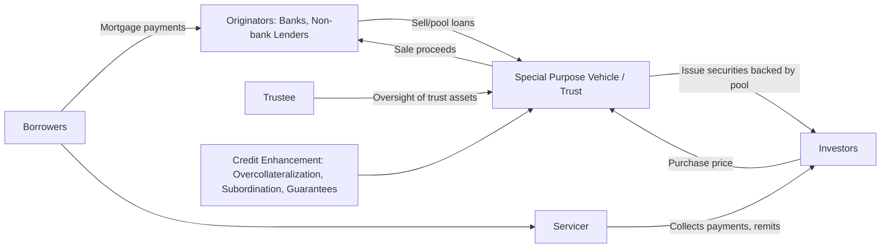

## Mortgage Markets and Mortgage-Backed Securities

### Overview

Mortgage markets connect borrowers seeking to finance real property with capital providers, and mortgage-backed securities (MBS) are the mechanism by which pools of individual mortgage loans are transformed into tradable fixed-income instruments. This topic spans two interlinked layers: the **primary mortgage market**, where loans are originated between lenders and borrowers, and the **secondary mortgage market**, where those loans (or claims on their cash flows) are packaged, sold, and traded among investors. Understanding this structure is central to real estate finance because it determines the cost and availability of mortgage credit, and it created one of the largest fixed-income asset classes globally.

---

### The Primary Mortgage Market

**Key Points**

- The primary market is where mortgage loans are originated: a borrower and a lender (bank, thrift, credit union, or non-bank mortgage originator) enter into a loan agreement secured by real property.
- Mortgage loans are characterized by their interest rate structure, amortization schedule, term, and lien priority.

**Common Mortgage Structures**

- **Fixed-rate mortgage (FRM)**: interest rate is constant over the loan term; payments are level (fully amortizing).
- **Adjustable-rate mortgage (ARM)**: interest rate resets periodically based on a reference index (e.g., SOFR-based indices, having largely replaced LIBOR-based indices following the LIBOR transition) plus a margin.
- **Interest-only (IO) mortgages**: borrower pays only interest for an initial period, after which the loan converts to a fully amortizing schedule or balloon payment.
- **Balloon mortgages**: relatively small periodic payments with a large lump-sum payment due at maturity.

**Amortization**

For a standard fixed-rate, fully amortizing mortgage, the level periodic payment $PMT$ is:

$$PMT = P \times \frac{r(1+r)^n}{(1+r)^n - 1}$$

where $P$ is the original principal, $r$ is the periodic interest rate, and $n$ is the total number of payment periods.

**Underwriting Criteria**

- Loan-to-value ratio (LTV): loan amount divided by appraised property value; lower LTV generally corresponds to lower default risk.
- Debt-service coverage ratio (DSCR), used primarily in commercial mortgage underwriting:

$$DSCR = \frac{NOI}{\text{Annual Debt Service}}$$

- Debt-to-income (DTI) ratio, used primarily in residential underwriting, comparing a borrower's total monthly debt obligations to gross monthly income.
- Credit scoring (e.g., FICO scores in the U.S. residential market) as a proxy for borrower credit risk.

---

### The Secondary Mortgage Market and Securitization

**Key Points**

- Securitization allows originators to sell loans off their balance sheets, freeing up capital to originate new loans, while transferring credit and prepayment risk (in varying degrees) to capital market investors.
- The U.S. residential MBS market is dominated by government-sponsored enterprises (GSEs — Fannie Mae and Freddie Mac) and the government agency Ginnie Mae, alongside a smaller private-label (non-agency) securitization market.

**The Securitization Process**

**Key Participants**

- **Originator**: the entity that underwrites and funds the initial mortgage loan.
- **Issuer/Sponsor**: aggregates loans into a pool and transfers them to a special purpose vehicle (SPV) or trust to achieve bankruptcy-remoteness from the originator.
- **Servicer**: collects borrower payments, manages escrow, handles delinquency and foreclosure processes, and remits cash flows to the trust.
- **Trustee**: oversees the trust on behalf of security holders, ensuring compliance with the pooling and servicing agreement (PSA).
- **Rating agencies**: assess and assign credit ratings to the resulting securities (for private-label deals).

---

### Types of Mortgage-Backed Securities

#### 1. Agency Pass-Through Securities

- Represent a direct, pro-rata claim on the cash flows (principal and interest) of an underlying pool of mortgages.
- Issued or guaranteed by Ginnie Mae (explicit U.S. government guarantee), Fannie Mae, or Freddie Mac (guarantee of timely payment of principal and interest, historically an implicit government backing, now operating under U.S. government conservatorship).
- Cash flow to investors "passes through" the servicer with a servicing fee deducted, hence the name.

#### 2. Collateralized Mortgage Obligations (CMOs)

- CMOs restructure the cash flows of an underlying mortgage pool (which may itself consist of pass-through securities) into multiple classes, or **tranches**, each with distinct principal repayment priority, coupon characteristics, and risk profiles.
- Designed to redistribute prepayment risk unevenly across tranches to appeal to investors with different risk/return preferences and liability-matching needs.

**Common Tranche Structures:**

- **Sequential-pay tranches**: principal is paid to the first tranche until fully retired, then to the next, and so on — earlier tranches have shorter effective duration and more predictable cash flows.
- **Planned Amortization Class (PAC) bonds**: designed to receive a predictable principal repayment schedule within a specified band of prepayment speeds, shifting prepayment risk to companion/support tranches.
- **Support (companion) tranches**: absorb the prepayment variability that PAC tranches are structured to avoid, making them higher-risk, higher-yield instruments.
- **Interest-Only (IO) and Principal-Only (PO) strips**: IOs receive only interest cash flows (value declines as prepayments accelerate, since the outstanding principal balance shrinks faster); POs receive only principal (value increases with faster prepayments, since the deeply discounted principal is returned sooner).
- **Z-tranches (accrual bonds)**: accrue interest without cash payment until prior tranches are retired, at which point they begin receiving both accrued and current interest plus principal.

#### 3. Private-Label (Non-Agency) MBS

- Backed by mortgages that do not conform to GSE purchase requirements (jumbo loans, non-prime/subprime loans, or loans with other non-conforming characteristics).
- Lack government/agency guarantees; credit risk is managed through structural credit enhancement rather than an external guarantee.

**Credit Enhancement Techniques:**

- **Subordination (senior/subordinate structure)**: losses are absorbed first by junior/subordinate tranches, protecting senior tranche holders.
- **Overcollateralization**: the collateral pool's principal balance exceeds the face value of the issued securities.
- **Excess spread**: the difference between the interest rate earned on the collateral and the interest rate paid to securities, available to absorb losses.
- **Third-party guarantees or letters of credit** (less common in modern structures post-2008).

---

### Commercial Mortgage-Backed Securities (CMBS)

**Key Points**

- CMBS are backed by pools of commercial real estate loans (office, retail, multifamily, industrial, hospitality) rather than residential mortgages.
- Commercial mortgages typically feature prepayment protection (yield maintenance, defeasance, or lockout periods) far stronger than residential mortgages, since commercial borrowers are more likely to refinance opportunistically and lenders/investors demand more certainty of cash flows.
- CMBS structures commonly use a senior/subordinate (credit tranching) waterfall similar to private-label RMBS, evaluated through **loan-level underwriting metrics** such as DSCR and LTV at issuance, aggregated to pool-level weighted averages.
- A distinguishing structural feature is the **special servicer**, who takes over management of a loan once it becomes delinquent or transfers to special servicing, with authority to negotiate modifications, extensions, or foreclosure.

---

### Prepayment Risk and Modeling

**Key Points**

- Prepayment risk is the central risk differentiating MBS from most other fixed-income instruments: borrowers can prepay principal (through refinancing, sale of property, or curtailment) ahead of the scheduled maturity, and the timing of prepayments is uncertain and interest-rate-sensitive.
- Prepayments accelerate when market mortgage rates fall meaningfully below a borrower's contract rate (refinancing incentive) and decelerate when rates rise (borrowers have an incentive to keep existing low-rate loans — sometimes called "rate lock-in").

**Standard Prepayment Benchmarks**

- The **PSA (Public Securities Association) prepayment model**, now more commonly referenced through **CPR (Conditional Prepayment Rate)**, expresses the annualized percentage of the outstanding mortgage pool balance expected to prepay in a given period:

$$SMM = 1 - (1 - CPR)^{1/12}$$

where $SMM$ is the Single Monthly Mortality rate, converting the annualized CPR into a monthly prepayment rate.

**Negative Convexity**

MBS exhibit **negative convexity**: as interest rates fall, prepayments accelerate, which shortens the effective duration of the security and caps price appreciation relative to a comparable option-free bond; as interest rates rise, prepayments slow, extending duration precisely when investors would prefer shorter duration (extension risk). This asymmetric price behavior is a defining risk characteristic of pass-through MBS and is a key driver of tranching structures designed to redistribute this risk.

---

### Valuation Considerations

- **Option-Adjusted Spread (OAS)** is the standard framework for valuing MBS given their embedded prepayment option; OAS represents the spread over a benchmark yield curve after accounting for the value of the borrower's prepayment optionality, typically derived via Monte Carlo simulation across multiple interest rate paths.
- **Weighted Average Life (WAL)** measures the average time until principal is repaid, weighted by the amount of principal received at each payment date — more relevant for MBS than stated maturity given uncertain prepayment timing.
- Z-spread (zero-volatility spread) and nominal spread are simpler, static alternatives to OAS, but do not explicitly account for prepayment option value.

---

### Example: Sequential-Pay CMO Structure

**Example**

Consider a $300 million mortgage pool restructured into a sequential-pay CMO with three tranches:

- Tranche A: $150 million, shortest average life, receives all principal payments first
- Tranche B: $100 million, receives principal only after Tranche A is fully retired
- Tranche Z (accrual): $50 million, accrues interest with no cash payment until Tranches A and B are retired, then receives principal plus current and accrued interest

If prepayments accelerate due to falling mortgage rates, Tranche A is retired more quickly than its scheduled average life would suggest, while Tranche Z benefits from a longer accrual period before receiving its own cash flows begin. This structure allows investors with different duration and cash flow timing preferences (e.g., short-duration insurers versus long-duration pension investors) to select the tranche matching their liability profile from a single underlying collateral pool.

---

### Distinguishing Facts from Inferences

- Definitions of pass-through securities, CMO tranche types (PAC, support, IO/PO, Z-tranche), and credit enhancement techniques (subordination, overcollateralization, excess spread) reflect standard, well-documented structured finance conventions.
- The CPR/SMM conversion formula and DSCR/LTV definitions are standard industry formulas.
- Statements characterizing the historical government backing of Fannie Mae and Freddie Mac as "implicit" prior to conservatorship, and the ongoing conservatorship status, reflect a widely accepted historical/regulatory characterization; the precise legal and political status of the GSEs has evolved and remains subject to policy discussion, so any forward-looking statement about their structure should be treated as time-sensitive. [Unverified for any date beyond general knowledge — verify current GSE status if using this for a present-day regulatory analysis]
- The relationship between falling rates and accelerating prepayments (and vice versa) is a well-established empirical pattern in MBS markets, though the exact magnitude of prepayment response (prepayment "burnout," borrower behavior variation) is asset-specific and modeling-dependent. [Inference — general direction is standard; precise sensitivity is model- and pool-dependent]

---

### Related Topics / Next Steps

- Option-Adjusted Spread (OAS) modeling and Monte Carlo simulation for MBS valuation
- Duration and convexity in fixed-income securities, with emphasis on negative convexity
- The 2008 financial crisis: subprime private-label securitization and the role of credit rating agencies
- Ginnie Mae, Fannie Mae, and Freddie Mac: institutional structure and government-sponsored enterprise reform debates
- CMBS special servicing and loan workout mechanics
- Covered bonds as an alternative mortgage funding structure
- Interest rate risk management for mortgage servicers and originators (mortgage servicing rights, MSR hedging)