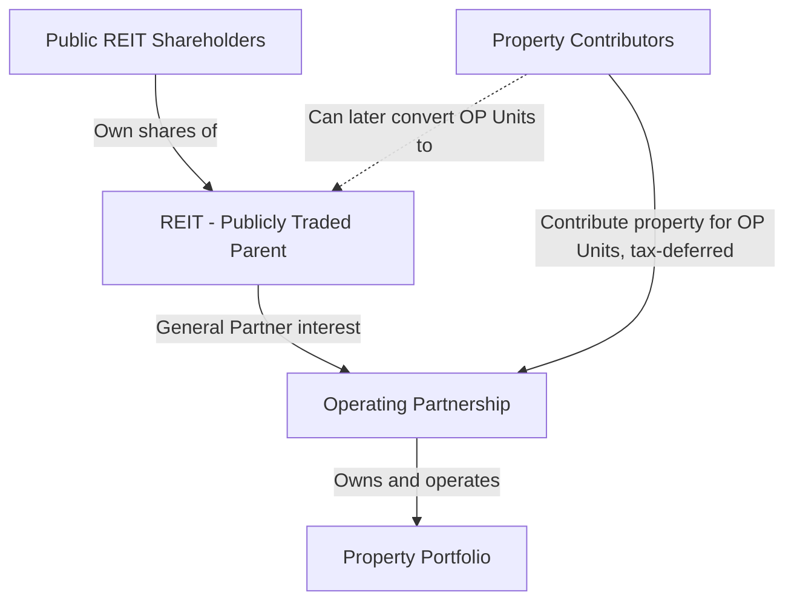

## REITs and Public Real Estate Markets

### Overview

Real Estate Investment Trusts (REITs) are the primary vehicle through which real estate is securitized and traded on public equity markets, allowing investors to gain exposure to income-producing real estate without directly owning, financing, or managing physical property. REITs combine features of both equity securities (public listing, daily liquidity, standardized reporting) and real estate assets (income-driven valuation, sensitivity to interest rates and property market cycles). Public real estate markets extend beyond REITs to include real estate operating companies (REOCs) and homebuilders, but REITs represent the dominant and most standardized structure globally.

---

### REIT Structure and Legal Requirements

**Key Points**

- REITs were created by statute (in the U.S., the Real Estate Investment Trust Act of 1960) to allow smaller investors to access diversified, professionally managed real estate portfolios with the tax efficiency historically available only to direct real estate owners.
- Most jurisdictions with REIT regimes (U.S., UK, Australia, Japan, Singapore, and others) impose similar core requirements, though specific thresholds vary by jurisdiction.

**Typical U.S. REIT Qualification Requirements**

- **Income test**: at least 75% of gross income must derive from real estate-related sources (rents, mortgage interest, gains from real property sales); at least 95% must derive from real estate sources plus other passive income (dividends, interest).
- **Asset test**: at least 75% of total assets must be invested in real estate, cash, or government securities.
- **Distribution requirement**: at least 90% of taxable income must be distributed annually to shareholders as dividends.
- **Ownership requirements**: at least 100 shareholders, with no more than 50% of shares held by five or fewer individuals (the "5/50 rule"), ensuring broad ownership.
- **Organizational form**: must be organized as a corporation, trust, or association taxable as a corporation for federal tax purposes, but electing REIT status to avoid entity-level taxation.

**Tax Treatment**

The defining economic feature of REIT status is the avoidance of double taxation: a qualifying REIT does not pay corporate-level income tax on distributed earnings, provided it meets the distribution requirement. Shareholders are taxed on dividends received, which are often classified across three categories:

- **Ordinary income** (most common; taxed at the shareholder's ordinary income tax rate, subject to any qualified business income deduction where applicable)
- **Capital gains distributions** (taxed at capital gains rates)
- **Return of capital** (reduces the shareholder's cost basis, generally not immediately taxable)

---

### REIT Sectors

REITs are typically categorized by the underlying property type, each with distinct cash flow drivers and cyclicality:

| Sector | Key Cash Flow Drivers | Typical Lease Structure |
| --- | --- | --- |
| Office | Employment growth, corporate space demand, remote-work trends | Multi-year leases with escalations |
| Retail (malls, shopping centers) | Consumer spending, e-commerce substitution effects | Base rent plus percentage rent on tenant sales |
| Industrial/Logistics | E-commerce growth, supply chain reconfiguration | Longer-term net leases |
| Multifamily/Residential | Household formation, wage growth, housing supply | Short-term leases (typically 12 months), frequent repricing |
| Healthcare | Demographics (aging population), healthcare spending | Long-term leases, often with operator-specific credit risk |
| Data Centers | Cloud computing and digital infrastructure demand | Long-term leases with power/cooling infrastructure components |
| Self-Storage | Household mobility, urbanization | Short-term, month-to-month leases with frequent rate adjustments |
| Hotels (lodging) | Travel demand, business/leisure mix | No leases — direct operating exposure to room revenue (RevPAR) |
| Timber/Farmland | Commodity prices, land appreciation | Variable — harvest cycles or agricultural leases |
| Net Lease (single-tenant) | Tenant creditworthiness, lease duration | Long-term triple-net leases (tenant pays taxes, insurance, maintenance) |

Hotel REITs occupy a distinct risk category: because hotel operations are treated as an active trade or business, U.S. REIT rules generally require hotel REITs to lease properties to a taxable REIT subsidiary (TRS), which in turn engages an independent hotel operator — a structural workaround to the passive-income requirement.

---

### Valuation of REITs

**Key Points**

- Standard equity valuation metrics such as GAAP net income and earnings per share (EPS) are considered less useful for REIT analysis because GAAP depreciation systematically understates real estate's actual economic value retention (real property often appreciates or holds value rather than depreciating to zero, unlike typical depreciable corporate assets).
- REIT-specific metrics were developed by industry bodies (notably Nareit — the National Association of Real Estate Investment Trusts) to better reflect underlying cash-generating performance.

#### Funds From Operations (FFO)

$$FFO = \text{Net Income} + \text{Depreciation \& Amortization} - \text{Gains on Property Sales} + \text{Losses on Property Sales}$$

FFO adds back real estate depreciation and amortization (non-cash charges that do not reflect actual value decline for well-maintained real estate) and removes gains/losses from property sales (non-recurring, capital-transaction-related items) to isolate recurring operating performance.

#### Adjusted Funds From Operations (AFFO)

$$AFFO = FFO - \text{Recurring Capital Expenditures} - \text{Straight-Line Rent Adjustments} \pm \text{Other Non-Cash Adjustments}$$

AFFO (sometimes called Cash Available for Distribution, CAD, or Funds Available for Distribution, FAD, with minor definitional variations across firms) is generally considered a closer proxy for sustainable, distributable cash flow than FFO, since it deducts capital expenditures required to maintain the existing portfolio's income-generating capacity.

#### Net Asset Value (NAV)

$$NAV = \frac{\text{Forward NOI}}{\text{Applied Cap Rate}} - \text{Net Debt} + \text{Other Assets} - \text{Other Liabilities}$$

NAV per share is derived by applying market-based capitalization rates to the REIT's forward NOI (estimated portfolio-wide, often on a property-type and market-weighted basis), then subtracting net debt and adjusting for non-real-estate balance sheet items, dividing the result by shares outstanding. NAV serves as an estimate of private market/liquidation value against which the public trading price can be compared (trading at a "premium to NAV" or "discount to NAV").

#### Key Valuation Multiples

- **Price/FFO** and **Price/AFFO** multiples, analogous to price/earnings ratios for traditional equities, used for cross-sectional and historical comparison.
- **Dividend yield**, particularly relevant given the mandatory high distribution requirement.
- **Implied cap rate**: derived by working backward from enterprise value and forward NOI, then compared to private market transaction cap rates to assess relative value.

---

### Capital Structure and Growth Strategy

**Key Points**

- REITs typically grow externally (through acquisitions funded by debt or equity issuance) and internally (through same-store NOI growth, redevelopment, and development pipeline delivery).
- Because REITs must distribute the substantial majority of taxable income, they generally cannot retain significant earnings to fund growth internally, making regular access to debt and equity capital markets structurally important — a dynamic sometimes summarized as REITs being "capital markets dependent" vehicles.

**Common Financing Sources**

- Unsecured corporate bonds and revolving credit facilities (common among larger, investment-grade REITs)
- Secured mortgage debt on individual properties (more common among smaller or lower-rated REITs)
- At-the-market (ATM) equity issuance programs, allowing incremental share issuance over time
- Operating partnership (OP) units, commonly used in UPREIT structures, allowing property sellers to contribute property in exchange for OP units on a tax-deferred basis, later convertible into REIT shares or cash

**UPREIT Structure**

The Umbrella Partnership REIT (UPREIT) structure allows property owners to contribute appreciated real estate to the operating partnership in exchange for OP units without triggering immediate capital gains recognition (deferred under relevant tax code provisions), a significant tax-planning incentive that has driven substantial REIT acquisition volume, particularly for family-owned or legacy real estate holdings.

---

### Public vs. Private Real Estate

| Dimension | Public REITs | Private Real Estate |
| --- | --- | --- |
| Liquidity | Daily, exchange-traded | Illiquid, infrequent transactions |
| Pricing | Continuous, market-driven | Periodic appraisal-based |
| Volatility | Higher observed volatility (reflects equity market co-movement) | Lower observed (smoothed) volatility |
| Leverage | Generally moderate, disclosed, investment-grade-oriented | Varies widely, often higher in value-add/opportunistic strategies |
| Diversification | Instant diversification across large portfolios | Concentrated, asset-by-asset exposure |
| Governance | Public company governance, disclosure requirements | Negotiated, LPA-governed |
| Correlation to equities | Higher in short run [Inference — empirically documented but magnitude varies by period and sector] | Lower reported correlation, partly a function of appraisal-based (lagged) valuation |

**Key Points**

- Public REITs exhibit higher observed short-term volatility and higher correlation with broader equity markets than private real estate appraisal-based indices — a substantial portion of this apparent difference reflects valuation methodology (continuous market pricing versus periodic, smoothed appraisals) rather than necessarily reflecting a true difference in the underlying real estate's economic risk. [Inference — the "smoothing" effect of appraisal-based valuation is a well-documented phenomenon in academic literature, though the precise extent of true risk difference versus measurement artifact remains debated]
- Over long holding periods, public and private real estate returns have historically shown a degree of convergence, though public REITs tend to lead private market valuations due to faster price discovery. [Inference — general pattern noted in academic and industry research; not a guaranteed relationship for any specific period]

---

### Example: Calculating FFO and AFFO

**Example**

A REIT reports the following for the fiscal year:

- Net income: $150 million
- Real estate depreciation and amortization: $220 million
- Gain on sale of a property: $40 million
- Recurring capital expenditures: $35 million
- Straight-line rent adjustment (non-cash rent increase recognized ahead of cash receipt): $8 million

Step 1 — FFO:

$$FFO = \$150M + \$220M - \$40M = \$330M$$

Step 2 — AFFO:

$$AFFO = \$330M - \$35M - \$8M = \$287M$$

If the REIT has 100 million shares outstanding, FFO per share is $3.30 and AFFO per share is $2.87 — the AFFO figure is generally considered the more conservative, sustainable basis for assessing dividend coverage, since dividing the REIT's actual annual dividend by AFFO per share (rather than FFO per share) gives a more conservative payout ratio.

---

### Distinguishing Facts from Inferences

- REIT qualification requirements (income test, asset test, 90% distribution requirement, 100-shareholder/5-50 ownership rules) reflect standard, codified U.S. REIT regime requirements as commonly summarized in real estate finance literature; exact statutory thresholds and their interpretation are subject to the applicable tax code and should be verified against current regulations for any binding application. [Unverified for jurisdiction- and date-specific precision — verify against current tax code text for compliance purposes]
- FFO and AFFO formulas reflect the standard Nareit-published definitional framework, though firms sometimes apply company-specific adjustments within "AFFO," "CAD," or "FAD," so cross-company comparability of these non-GAAP metrics requires reviewing each company's specific reconciliation.
- Claims regarding the relationship between public REIT volatility, private real estate appraisal smoothing, and long-run return convergence are grounded in established academic literature but are appropriately labeled as inferences given ongoing debate over precise magnitudes and the sensitivity of findings to sample period and methodology.
- The hotel REIT/TRS structural requirement reflects standard treatment under U.S. REIT rules; specific jurisdictional equivalents vary internationally.

---

### Related Topics / Next Steps

- Non-traded and private REITs: structure, liquidity mechanisms, and valuation challenges
- International REIT regimes: comparative structures (UK REITs, Australian LPTs/A-REITs, Japanese J-REITs, Singapore S-REITs)
- REIT capital structure optimization: debt maturity laddering and credit rating considerations
- Same-store NOI growth analysis and REIT internal growth drivers
- REIT M&A and privatization transactions (public-to-private real estate deals)
- Sector-specific REIT analysis: data center and industrial REIT growth drivers
- Real estate operating companies (REOCs) versus REITs: structural and tax distinctions
- Real estate valuation methods (cap rate derivation, DCF) as inputs to REIT NAV modeling