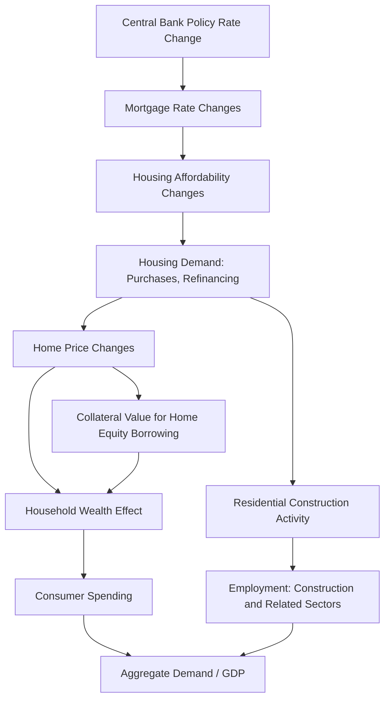

## Housing Markets and Macroeconomic Linkages

### Overview

Housing markets occupy a uniquely central position in macroeconomic dynamics: residential real estate is simultaneously a consumption good (shelter), an investment asset (the largest single asset for most households), and a major channel of monetary policy transmission. Movements in housing markets influence, and are influenced by, GDP growth, employment, consumer spending, credit conditions, and financial stability. This bidirectional relationship means housing is both a leading indicator of macroeconomic conditions and, at times, a primary driver of macroeconomic and financial crises — the 2008 Global Financial Crisis being the most consequential modern example.

---

### Housing as a Component of the Macroeconomy

**Key Points**

- Residential investment (new construction, major renovations) is a standard component of Gross Domestic Product (GDP) under the expenditure approach, though it typically represents a relatively small share of total GDP (commonly cited in the range of 3–5% in developed economies), it is disproportionately volatile and cyclical relative to its size, making it an outsized contributor to GDP growth swings around business cycle turning points. [Inference — general magnitude is a commonly cited stylized fact in macroeconomic literature; precise share varies by country and period]
- Housing wealth affects household consumption through the **wealth effect**: as home values rise, homeowners tend to increase consumption spending (either through a perceived increase in overall wealth or through actual borrowing against increased home equity), and the reverse tends to occur when home values decline.
- The housing sector is a significant source of employment, spanning construction, real estate services, mortgage lending, and related industries, making housing activity a closely monitored leading indicator of broader economic momentum.

---

### Monetary Policy Transmission Through Housing

**Key Points**

- Housing markets are one of the most interest-rate-sensitive sectors of the economy, making residential real estate a primary channel through which central bank monetary policy affects the broader economy.

**Transmission Mechanisms**

- **Direct interest rate channel**: changes in central bank policy rates flow through to mortgage rates (with varying lags depending on whether mortgages are predominantly fixed-rate or adjustable-rate in a given market), directly affecting monthly payment affordability for new and refinancing borrowers.
- **Housing wealth/collateral channel**: rising home values increase the collateral available for home equity borrowing and increase perceived household net worth, both of which can stimulate consumption; falling home values operate in reverse, and can additionally constrain borrowing capacity for existing homeowners with reduced equity.
- **Construction/investment channel**: interest rate changes affect the cost and feasibility of new residential development, with construction activity responding relatively quickly to changes in financing costs and demand expectations.
- **Refinancing channel**: falling mortgage rates enable existing homeowners to refinance into lower payments, freeing up disposable income for other consumption — though this channel's strength depends on the prevalence of prepayable, refinanceable mortgage products in a given market (historically stronger in the U.S. fixed-rate mortgage market than in markets dominated by variable-rate or less prepayment-friendly mortgage structures). [Inference — cross-country strength of the refinancing channel is a recognized comparative finding in housing finance literature, though relative magnitudes shift as mortgage market structures evolve]

---

### Housing Affordability

**Key Points**

- Housing affordability is commonly measured relative to household income, capturing the tension between home price levels, mortgage rates, and income growth.

**Common Affordability Metrics**

- **Price-to-income ratio**: median home price divided by median household income; a rising ratio over time generally signals deteriorating affordability, all else equal.
- **Mortgage payment-to-income ratio**: estimated monthly mortgage payment (incorporating prevailing mortgage rates) as a percentage of gross monthly household income; commonly used in underwriting (as DTI) and in macro-level affordability indices.
- **Housing Affordability Index (HAI)**, published by various national and regional bodies (e.g., the National Association of Realtors in the U.S.), typically constructed to indicate whether a family earning the median income can qualify for a mortgage on a median-priced home under prevailing rate and underwriting assumptions.

Affordability deteriorates through any combination of rising home prices, rising mortgage rates, or stagnant/declining household income growth — and because these three drivers interact (e.g., rising rates can, over time, dampen home price growth by reducing buyer purchasing power), affordability dynamics tend to unfold as a multi-year adjustment process rather than an instantaneous repricing. [Inference — the pace and degree of home price adjustment to affordability pressure varies substantially by market, supply elasticity, and the presence of other demand factors such as investor activity]

---

### Housing Supply Dynamics

**Key Points**

- Housing supply is characterized by significant **inelasticity** in the short run, since new construction requires substantial time for land acquisition, entitlement/permitting, financing, and physical building — meaning demand shocks (e.g., a sudden shift in mortgage rates or migration patterns) are absorbed primarily through price changes rather than quantity changes in the near term.
- Long-run supply elasticity varies substantially across geographic markets based on land availability, zoning and land-use regulation stringency, and local political constraints on development — markets with restrictive zoning (e.g., many coastal, land-constrained U.S. metro areas) tend to exhibit more volatile home price cycles than markets with more permissive zoning and greater land availability. [Inference — well-supported directional finding in urban economics literature; specific elasticity estimates vary by study and geography]
- Housing starts, building permits, and existing home inventory levels (months of supply) are standard leading indicators tracked to assess the balance between housing supply and demand.

---

### The Housing Cycle and Systemic Risk

**Key Points**

- Housing cycles tend to be longer in duration than typical business cycles, partly due to the long lead times in construction and the durability of the housing stock (existing homes remain in the supply pool for decades, unlike most consumer goods).
- Because mortgage debt is a major component of household balance sheets and is frequently securitized and held throughout the financial system (per mortgage-backed securities structures), housing downturns have historically posed elevated systemic risk relative to downturns in most other asset classes.

**Case Study Context: The 2008 Global Financial Crisis**

The 2008 crisis illustrates the potential severity of housing-driven macroeconomic and financial contagion: a sustained period of rising home prices supported by loosening underwriting standards (including significant subprime and non-traditional mortgage origination) was followed by a sharp reversal in home prices, triggering widespread mortgage defaults. Because mortgage credit risk had been distributed broadly through private-label securitization structures (including complex re-securitizations such as CDOs of mortgage-backed tranches) held by banks, investment funds, and other financial institutions globally, the resulting losses propagated well beyond the housing sector itself into a broader financial system and banking crisis, ultimately contributing to a severe global recession. [Note: this is a widely-documented historical episode; specific causal weightings among underwriting standards, securitization structures, regulatory gaps, and monetary policy remain subjects of ongoing academic and policy debate, and any specific causal claim beyond this general characterization should be treated as [Inference] or [Unverified] pending the specific source being cited]

---

### Housing and Inflation Measurement

**Key Points**

- Housing costs represent a substantial component of consumer price indices in most developed economies (e.g., "shelter" costs are a major category weight in the U.S. Consumer Price Index), meaning housing cost trends directly and materially influence headline and core inflation readings.
- Owner-occupied housing costs are typically measured using an **owners' equivalent rent (OER)** methodology rather than actual home purchase prices, since home purchases are treated as capital investments rather than current consumption in most national income and price statistics frameworks; this methodological choice means reported housing inflation in CPI can lag actual observed home price and market rent movements by a meaningful period, given how OER surveys and updates its estimates. [Inference — the general lagging relationship between OER-based CPI shelter inflation and real-time market rent movements is a widely-discussed phenomenon among economists and central bank commentary, though the precise lag length varies by measurement period and methodology]

---

### Cross-Country Comparative Context

**Key Points**

- Mortgage market structure varies substantially across countries — for example, differences in the prevalence of fixed-rate versus adjustable-rate mortgages, typical loan terms, and prepayment conventions — which in turn affects how quickly and strongly monetary policy changes transmit into household mortgage costs and housing demand in a given country. [Inference — general comparative point supported by housing finance literature; specific country structures should be verified against current data given they evolve over time]
- Homeownership rates, rental market depth, and the extent of government involvement in mortgage markets (e.g., government-sponsored enterprises, government mortgage insurance programs, social/public housing provision) also vary considerably across countries, shaping how housing-macroeconomy linkages manifest locally.

---

### Example: Tracing a Rate Change Through the Housing-Macroeconomy Channel

**Example**

Suppose a central bank raises its policy rate by 100 basis points to combat inflation. A plausible transmission sequence:

1. Mortgage lenders reprice new fixed-rate mortgage offerings upward, and existing adjustable-rate borrowers see higher payments at their next reset date.
2. Higher borrowing costs reduce the maximum home price a given household income can support under standard underwriting (DTI) constraints, reducing effective buyer purchasing power.
3. Home sales transaction volume typically declines first (buyers withdraw or delay purchases), often preceding any decline in list/transaction prices, since sellers are frequently slow to adjust price expectations downward (a phenomenon sometimes termed price "stickiness" in housing markets). [Inference — well-documented behavioral pattern in housing market literature, though the degree and duration of stickiness varies by market and cycle]
4. If elevated rates persist, home price growth decelerates or reverses, reducing the housing wealth effect and dampening consumer spending.
5. Homebuilders respond to reduced demand by slowing new construction starts, reducing construction employment and related economic activity.
6. The cumulative effect flows through to broader GDP growth, with a lag reflecting the multi-stage nature of the transmission mechanism outlined above.

---

### Distinguishing Facts from Inferences

- The classification of residential investment within GDP accounting and the general definitions of affordability metrics (price-to-income, DTI, HAI) reflect standard, well-established macroeconomic and housing finance conventions.
- The general direction of monetary policy transmission through housing (rate changes affecting mortgage costs, affordability, demand, and construction activity) is a well-established macroeconomic relationship; however, the magnitude, speed, and relative strength of each specific channel (wealth effect vs. refinancing channel vs. construction channel) is explicitly labeled as inferential throughout, since these depend on country-specific mortgage market structure, prevailing loan products, and the broader macroeconomic and credit environment at the time.
- The 2008 Global Financial Crisis summary is presented as a widely accepted general historical characterization; more granular causal claims about the crisis's specific triggers and relative contributing factor weights remain subjects of legitimate academic and policy debate and should be treated with appropriate epistemic caution beyond the general narrative presented here.
- Statements about housing supply inelasticity and its relationship to zoning/land-use restrictiveness reflect well-supported directional findings in urban economics research, labeled as inferences given that specific elasticity magnitudes are market- and study-dependent.

---

### Related Topics / Next Steps

- Monetary policy transmission mechanisms: interest rate, credit, and asset price channels
- Mortgage markets and mortgage-backed securities: structural linkages to systemic risk
- Housing affordability crises and policy responses (zoning reform, housing supply policy)
- The 2008 Global Financial Crisis: causes, propagation mechanisms, and regulatory responses
- Real estate cycle analysis and the four-quadrant framework
- Consumer Price Index construction and the treatment of owner-occupied housing costs
- Cross-country comparative housing finance systems
- Household balance sheets and the wealth effect in macroeconomic models