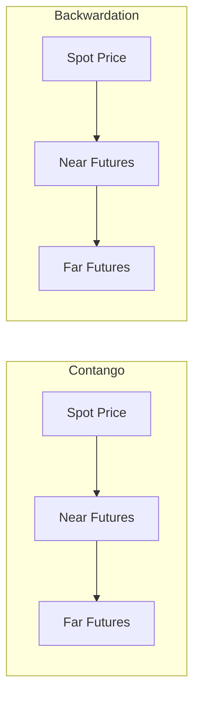

## Commodity Futures Pricing and the Theory of Storage

### Overview

The theory of storage is the foundational framework for understanding the relationship between spot and futures prices for storable commodities. Unlike financial futures (equity indices, currencies, interest rate instruments), where pricing follows straightforward cost-of-carry arbitrage, commodity futures pricing must additionally account for the physical characteristics of the underlying asset: storage costs, the practical constraints and value of holding physical inventory, and the possibility that spot prices can deviate from a pure arbitrage relationship due to the non-financial nature of the asset. The theory of storage, developed primarily through the work of Holbrook Working, Nicholas Kaldor, and later formalized by others, explains these dynamics through the concept of the **convenience yield**.

---

### The Basic Cost-of-Carry Model

**Key Points**

- The starting point for commodity futures pricing is the cost-of-carry relationship, which states that the futures price should equal the spot price plus the cost of carrying (storing and financing) the physical commodity until the futures delivery date.

$$F_{0,T} = S_0 \times e^{(r + u)T}$$

where $F_{0,T}$ is the futures price for delivery at time $T$, $S_0$ is the current spot price, $r$ is the risk-free financing rate, $u$ is the storage cost (expressed as a continuously compounded rate, as a percentage of the spot price), and $T$ is time to maturity.

- This relationship holds as a strict no-arbitrage condition for financial assets and for storable commodities under a **cash-and-carry arbitrage** argument: an arbitrageur can borrow funds, buy the physical commodity, store it, and simultaneously sell a futures contract, locking in a riskless profit if the futures price exceeds spot plus carrying costs.
- **Reverse cash-and-carry arbitrage** (selling the physical commodity short, investing the proceeds, and buying a futures contract) would, in principle, correct the opposite mispricing — but for many physical commodities, short-selling the physical asset is difficult or impossible for most market participants, meaning this side of the arbitrage is often constrained or unavailable. This asymmetry is central to why commodity futures prices can persist below the simple cost-of-carry level, unlike financial futures.

---

### The Convenience Yield

**Key Points**

- The **convenience yield** is the benefit (implicit, non-monetary) that accrues to a holder of the physical commodity but not to a holder of a futures contract on that commodity — reflecting the value of having physical inventory on hand to manage production schedules, meet unexpected demand, or avoid stockouts and disruption costs.
- The theory of storage incorporates the convenience yield into the cost-of-carry formula as an offsetting term:

$$F_{0,T} = S_0 \times e^{(r + u - y)T}$$

where $y$ is the convenience yield (also expressed as a continuously compounded rate).

- The convenience yield is **not directly observable** and is typically inferred residually from observed spot and futures prices, given estimates or assumptions about financing and storage costs:

$$y = r + u - \frac{1}{T}\ln\left(\frac{F_{0,T}}{S_0}\right)$$

- Convenience yield is generally **inversely related to inventory levels**: when physical inventories are abundant, the marginal benefit of holding additional physical stock is low, so the convenience yield tends to be low (or near zero); when inventories are scarce or tight relative to near-term demand, the convenience yield tends to rise sharply, since the risk and cost of a potential stockout increases materially. This inverse, and typically convex, relationship between convenience yield and inventory levels is one of the most robust empirical findings in commodity market research. [Inference — the directional and convexity relationship is a well-established empirical regularity across multiple commodity markets and studies, though the precise functional form and magnitude vary by commodity and time period]

---

### Contango and Backwardation

**Key Points**

- **Contango**: futures prices are higher than the spot price (or, for a futures curve with multiple maturities, longer-dated contracts trade at successively higher prices than nearer-dated contracts). This occurs when storage and financing costs exceed the convenience yield ($u + r > y$), consistent with ample or comfortable inventory conditions.
- **Backwardation**: futures prices are lower than the spot price (or longer-dated contracts trade below nearer-dated contracts). This occurs when the convenience yield exceeds storage and financing costs ($y > u + r$), typically associated with tight or scarce physical inventory conditions.

In a contango curve, prices step upward moving from spot to near futures to far futures (each successive maturity priced higher). In a backwardation curve, prices step downward across the same progression (each successive maturity priced lower), with spot trading at the highest level.

- Backwardation is sometimes referred to in classical commodity theory (Keynes, Kaldor) through the related concept of **"normal backwardation,"** which specifically refers to the theory that futures prices are set below the *expected future spot price* because commodity producers (natural hedgers) are willing to pay a risk premium to speculators for bearing price risk. This is a related but analytically distinct concept from the storage-based contango/backwardation framework described above: normal backwardation concerns the relationship between the futures price and the *expected* future spot price (a risk premium argument), while the storage-based framework concerns the relationship between the *current* futures price and the *current* spot price (a convenience yield/inventory argument). [Clarification of a commonly conflated distinction — both are standard, well-documented concepts in commodity futures literature, but they answer different questions]

---

### Determinants of the Convenience Yield and Curve Shape

| Factor | Effect on Convenience Yield | Resulting Curve Tendency |
| --- | --- | --- |
| High/abundant inventories | Low convenience yield | Contango |
| Low/scarce inventories | High convenience yield | Backwardation |
| High storage costs (e.g., costly-to-store commodities like natural gas requiring specialized storage) | Increases the carry cost component | Favors contango, all else equal |
| Seasonal demand spikes (e.g., heating oil, natural gas in winter) | Convenience yield rises ahead of peak demand periods | Backwardation into the seasonal peak, often followed by contango after |
| Supply disruptions (weather events, geopolitical disruptions, production outages) | Sharp increase in convenience yield | Sharp shift toward backwardation |
| High interest rates | Increases the financing cost component of carry | Favors contango, all else equal |

---

### Commodity-Specific Considerations

**Key Points**

- **Storability** varies dramatically across commodity types and materially affects the applicability of the theory of storage:
  - Metals (gold, silver, copper, aluminum) are highly storable with relatively low storage costs (as a percentage of value), making cost-of-carry and convenience yield dynamics relatively clean to observe and model.
  - Energy commodities (crude oil, refined products, natural gas) are storable but with meaningfully higher storage costs and capacity constraints (e.g., pipeline and storage tank capacity limits), which can produce more pronounced convenience yield swings, particularly during periods of storage capacity stress.
  - Agricultural commodities exhibit strong **seasonality** tied to harvest cycles, meaning convenience yields and curve shape follow a predictable seasonal pattern in addition to responding to unexpected supply/demand shocks — futures curves for grains, for example, typically show a saw-tooth pattern reflecting the annual harvest cycle. [Inference — the general seasonal pattern is a well-documented empirical regularity in agricultural futures markets, though specific patterns vary by crop, growing region, and year-to-year weather and planting conditions]
  - Livestock commodities involve biological production lags (breeding and growth cycles) that create their own distinct cyclical price dynamics, generally analyzed with less emphasis on physical storage theory and more emphasis on production cycle economics, since live animals are not "stored" in the same sense as grain or metal.
- **Gold** is a notable special case: because gold is held predominantly for investment/monetary purposes rather than industrial consumption, and its stock-to-flow ratio (existing above-ground stock relative to annual production) is extremely high, gold futures markets are typically well-described by the pure cost-of-carry model with a convenience yield close to zero, and gold futures curves are almost always in contango. [Inference — well-supported empirical characterization of gold markets specifically, given gold's unique stock-to-flow characteristics relative to other commodities]

---

### Basis and Its Relationship to Storage Theory

**Key Points**

- The **basis** is defined as:

$$\text{Basis} = S_0 - F_{0,T}$$

- A positive basis (spot above futures) corresponds to backwardation; a negative basis (spot below futures) corresponds to contango.
- Basis risk — the risk that the basis changes unpredictably between the initiation and unwind of a hedge — is a central practical risk in commodity hedging, and is directly connected to storage theory because unexpected shifts in inventory conditions (and therefore convenience yield) are a primary driver of unexpected basis movements.
- As a futures contract approaches expiration, the basis must converge toward zero (assuming cash-settlement or the absence of delivery-related distortions), since the futures price and spot price must converge at maturity — a phenomenon known as **convergence**.

---

### Implications for Roll Yield in Commodity Index Investing

**Key Points**

- Investors who gain commodity exposure through futures (rather than physical holdings) must periodically "roll" expiring contracts into new, longer-dated contracts, generating a **roll yield** (sometimes called roll return) that is directly determined by curve shape.
- In a market in **backwardation**, rolling from an expiring (higher-priced) near contract into a (lower-priced) further-dated contract, and subsequently allowing that contract to appreciate toward the (higher) spot price as it approaches its own expiration, generates a *positive* roll yield, all else equal.
- In a market in **contango**, the reverse dynamic generates a *negative* roll yield: the investor rolls from a lower-priced near contract into a higher-priced further-dated contract, creating a persistent drag on returns for a long-only, continuously rolled futures position, independent of the spot price's own performance. [Inference — this is a well-established mechanical relationship in commodity index investing literature, though realized roll yield in practice also depends on the specific roll methodology, timing, and curve shape evolution during the roll period]

$$\text{Total Futures Return} \approx \text{Spot Return} + \text{Roll Yield} + \text{Collateral/T-Bill Return}$$

---

### Example: Inferring Convenience Yield from Market Prices

**Example**

Suppose crude oil spot price is $75.00/barrel, the 6-month futures price is $73.50/barrel, the annualized risk-free rate is 4%, and annualized storage costs are estimated at 3% of spot value.

Using the formula:

$$y = r + u - \frac{1}{T}\ln\left(\frac{F_{0,T}}{S_0}\right)$$

$$y = 0.04 + 0.03 - \frac{1}{0.5}\ln\left(\frac{73.50}{75.00}\right)$$

$$y = 0.07 - 2 \times \ln(0.98) = 0.07 - 2 \times (-0.0202) = 0.07 + 0.0404 = 0.1104$$

The implied annualized convenience yield is approximately 11.04%. Since $y$ ($\approx$11%) exceeds $r + u$ (7%), the market is in backwardation — consistent with the futures price trading below spot — and the magnitude suggests tight near-term physical inventory conditions in the crude oil market at that point in time.

---

### Distinguishing Facts from Inferences

- The cost-of-carry formula, the convenience-yield-adjusted futures pricing formula, and the definitions of contango, backwardation, and basis are standard, well-documented conventions in commodity futures pricing theory.
- The inverse relationship between inventory levels and convenience yield is a robust, extensively documented empirical finding, though labeled as inferential regarding precise functional form and magnitude, which vary across commodities and studies.
- The distinction between "normal backwardation" (a risk-premium/expected-price concept from Keynes and Kaldor) and storage-based backwardation (a current-price/convenience-yield concept) reflects standard academic treatment in commodity futures literature, though these terms are frequently used loosely or interchangeably in less rigorous market commentary — the distinction presented here follows the more precise academic usage.
- The numerical example is an illustrative construction for pedagogical purposes and does not reflect actual historical crude oil market prices or convenience yield estimates for any specific date.
- Statements about specific commodity characteristics (gold's near-zero convenience yield, agricultural seasonality patterns, energy storage capacity constraints) reflect well-established stylized facts in commodity market literature, labeled as inferential given that magnitudes and specific patterns vary by commodity, region, and period.

---

### Related Topics / Next Steps

- Commodity index construction and roll yield mechanics (GSCI, Bloomberg Commodity Index methodologies)
- Hedging strategies for commodity producers and consumers using futures and options
- Seasonality analysis in agricultural commodity futures markets
- Energy market storage infrastructure and its effect on price dynamics (e.g., the 2020 negative crude oil futures price episode)
- Speculators, hedgers, and the Commitment of Traders (COT) report in futures market analysis
- Commodity options pricing and volatility skew in commodity markets
- Natural resource valuation: real options approaches to extraction timing decisions
- Financialization of commodity markets and its effect on futures curve behavior