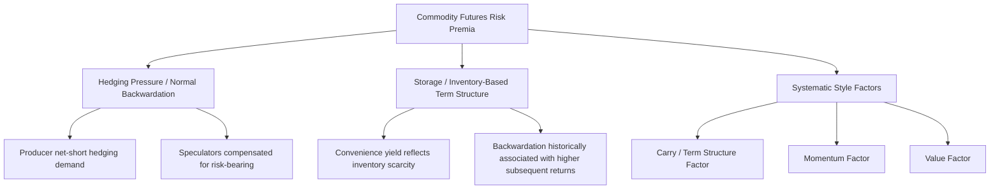

## Commodity Risk Premia

### Overview

Commodity risk premia refer to the expected excess returns that investors can earn by holding commodity futures positions, arising from the compensation demanded for bearing specific risks embedded in commodity markets. Unlike equity risk premia, which are typically explained through exposure to a single dominant systematic risk factor (aggregate market risk), commodity risk premia have historically been attributed to several distinct, sometimes overlapping theoretical explanations: insurance-based hedging pressure theories, inventory/storage-based theories, and more recent multi-factor and behavioral explanations. This topic surveys the major theoretical frameworks and the empirically documented risk premia within commodity futures markets.

---

### Theory 1: The Theory of Normal Backwardation (Keynes-Hicks Hedging Pressure Theory)

**Key Points**

- Originally articulated by John Maynard Keynes and later extended by John Hicks, the theory of normal backwardation posits that commodity producers are natural hedgers who wish to sell forward their future production to lock in prices and reduce their own price risk exposure.
- Because producers as a group tend to be net short (wanting to sell forward), they must offer speculators (who take the corresponding long position) a **risk premium** as compensation for bearing that price risk — meaning the futures price is set systematically *below* the expected future spot price:

$$F_{0,T} < E[S_T]$$

$$\text{Risk Premium} = E[S_T] - F_{0,T} > 0$$

- Under this theory, a long futures position earns a positive expected return over time as the futures price converges upward toward the (higher) expected spot price, purely as compensation for absorbing hedgers' price risk — independent of any view on the direction of the spot price itself.
- This is a **distinct concept from storage-based backwardation** (covered in convenience yield analysis): normal backwardation concerns the relationship between the current futures price and the *expected future* spot price (a risk-premium argument about compensation for risk-bearing), whereas storage-based backwardation concerns the relationship between the current futures price and the *current* spot price (an inventory/convenience-yield argument). The two concepts can coincide but are analytically separate, and conflating them is a common source of confusion in commodity market commentary. [Clarification of an important, sometimes conflated distinction, drawn from standard academic treatment]

**Extension: Hedging Pressure Can Run Either Direction**

- Later refinements (notably by Hirshleifer and others) noted that hedging pressure need not always run from producers to speculators; in commodities where downstream consumers (e.g., refiners, manufacturers) have a stronger hedging need than upstream producers, the net hedging pressure can run the opposite direction, implying futures prices set *above* expected spot price (a risk premium earned by short speculators rather than long speculators). [Inference — this extension is a recognized academic refinement to the original Keynesian theory; the direction and magnitude of net hedging pressure is commodity- and period-specific and not a fixed characteristic of any commodity]

---

### Theory 2: Insurance and the Role of Speculators

**Key Points**

- Related to hedging pressure theory, the "insurance premium" framing views speculators as providing an insurance-like service to commercial hedgers, who are willing to accept a lower expected sale price (or pay a higher expected purchase price) in exchange for the certainty and risk-reduction that hedging provides.
- Empirical work using data such as the Commitments of Traders (COT) report has examined whether the net positioning of commercial hedgers versus non-commercial speculators helps explain realized commodity futures returns, with mixed and evolving findings across different studies, periods, and commodities. [Inference — this remains an active area of empirical research with results that vary by dataset, period, and methodology; no single definitive consensus magnitude should be treated as established fact]

---

### Theory 3: The Insurance/Storage Synthesis and the Term Structure Signal

**Key Points**

- A substantial body of empirical research (e.g., work associated with Gary Gorton, K. Geert Rouwenhorst, and others) finds that a commodity's **current term structure position** (i.e., whether it is in backwardation or contango) has historically been a statistically significant predictor of its subsequent futures return, largely independent of macroeconomic risk factor exposure.
- This finding connects directly to the theory of storage: commodities in backwardation (signaling tight physical inventories) have, on average and across many historical studies, generated higher subsequent long futures returns than commodities in contango (signaling ample inventories) — a pattern often used as the basis for systematic "term structure" or "carry" commodity investment strategies. [Inference — this is a well-documented empirical finding across multiple academic studies covering various historical sample periods, though the strength, consistency, and persistence of the effect vary across studies, periods, and whether transaction costs and implementation constraints are accounted for]

---

### Documented Commodity Risk Premia / Style Factors

Modern commodity investment research typically organizes commodity risk premia into several recognized systematic factors, paralleling multi-factor approaches used in equity and fixed income research:

| Factor | Description | Theoretical Basis |
| --- | --- | --- |
| **Carry / Term Structure** | Long commodities in backwardation, short (or underweight) commodities in contango | Convenience yield / inventory signal; normal backwardation theory |
| **Momentum** | Long commodities with recent positive price trends, short those with negative trends | Behavioral underreaction/overreaction; information diffusion lags |
| **Value** | Long commodities cheap relative to a long-run price/valuation anchor, short those expensive | Mean reversion in commodity prices around long-run production cost/equilibrium levels |
| **Basis-Momentum** | Combines carry and momentum signals in term structure changes rather than levels | Refinement combining term structure dynamics with trend information |
| **Skewness / Volatility premia** | Compensation for bearing left-tail or right-tail risk in specific commodity return distributions | Risk-based; commodities exhibit different, often asymmetric, return distributions relative to equities |

**Key Points**

- These factors are conceptually similar to equity factor investing (value, momentum, quality, low-volatility) but are constructed using commodity-specific signals (term structure/basis, price trends, and valuation anchors specific to commodity markets).
- Academic and practitioner research generally finds that carry and momentum factors have historically shown the most consistent statistical significance and the lowest correlation to each other and to traditional broad commodity index returns, motivating their use as diversifying return sources within systematic commodity strategies. [Inference — reflects a general summary of a substantial body of academic factor research, though specific factor performance, significance, and persistence vary meaningfully by study, sample period, and factor construction methodology, and past factor premia are not a guarantee of future performance]

---

### Sources of Commodity Risk Premia Diagram

---

### Commodity Risk Premia vs. Equity Risk Premium: Key Distinctions

**Key Points**

- Commodity futures returns have historically shown low, and at times negative, correlation to equity market returns over various sample periods, motivating the inclusion of commodities in diversified portfolios as a source of returns less dependent on broad equity market direction. [Inference — historically documented but time-varying relationship; correlation between commodities and equities has shifted across different macroeconomic regimes, including periods of markedly higher observed correlation, and should not be treated as a stable constant]
- Unlike equities, which represent a claim on a growing stream of corporate earnings over time, commodity spot prices do not have an inherent long-run growth trend analogous to corporate earnings growth; commodity futures returns are therefore conceptually distinct from equity returns in their fundamental return-generating mechanism, relying instead on the roll yield/term structure and spot price mean-reversion dynamics described above, rather than on a fundamental long-term growth process. [Inference — a widely-noted conceptual distinction in commodity investment literature]
- Commodity risk premia, particularly the carry/term structure premium, have sometimes been characterized as providing a partial hedge against unexpected inflation, since commodity spot prices are direct inputs into inflation measurement, though the strength and consistency of this inflation-hedging relationship has varied considerably across different historical periods and inflationary regimes. [Inference — widely discussed but empirically mixed relationship; effectiveness depends heavily on the specific inflationary episode, whether inflation is demand-driven or supply-driven, and the specific commodities and time horizon examined]

---

### Example: A Simple Term-Structure ("Carry") Strategy Illustration

**Example**

Consider a systematic strategy that ranks a universe of 20 commodities each month by their term structure signal (e.g., the annualized percentage difference between the nearest and next-nearest futures contract), going long the five commodities in the steepest backwardation and short (or excluding) the five commodities in the steepest contango.

If, hypothetically, at a given rebalancing date crude oil and copper are in backwardation (near contract trading above the next contract by an annualized 8% and 5% respectively) while corn and natural gas are in steep contango (near contract trading below the next contract by an annualized 6% and 9% respectively), the strategy would take long positions in crude oil and copper and short positions (or avoid long exposure) in corn and natural gas — expressing a bet that the term structure signal (as an inventory-scarcity proxy) will continue to be associated with relatively higher subsequent returns in the backwardated commodities relative to the contangoed ones, consistent with the empirical term-structure premium literature discussed above. This is a simplified illustrative construction; actual systematic carry strategies typically incorporate additional considerations such as transaction costs, position sizing/risk-weighting, and portfolio-level risk constraints.

---

### Distinguishing Facts from Inferences

- The formal definitions and mathematical relationships of normal backwardation and the risk premium formula reflect standard, well-established academic theory (Keynes, Hicks).
- The empirical finding linking term structure position (backwardation/contango) to subsequent futures returns is grounded in a substantial academic literature but is explicitly labeled inferential regarding the consistency, magnitude, and persistence of the effect, since results vary by sample period, commodity universe, and methodology, and historical premia are not a guarantee of future performance.
- Claims regarding commodity-equity correlation, commodity inflation-hedging properties, and the relative significance of carry versus momentum versus value factors are labeled as inferences throughout, reflecting genuinely time-varying and empirically debated relationships rather than fixed, universally agreed-upon constants.
- The extension of hedging pressure theory to allow bidirectional net hedging pressure (Hirshleifer and related work) is a recognized academic refinement, labeled as inferential regarding which direction applies to any specific commodity at any specific time.
- The example strategy illustration is a simplified pedagogical construction and does not represent an actual historical trading strategy, real market data, or investment recommendation.

---

### Related Topics / Next Steps

- Commodity futures pricing and the theory of storage
- Convenience yield, backwardation, and contango
- Multi-factor investing frameworks: extending equity factor concepts to commodities
- Commitments of Traders (COT) report analysis and hedging pressure measurement
- Commodities as an inflation hedge: empirical evidence across historical regimes
- Systematic trend-following and momentum strategies in futures markets
- Portfolio construction: strategic allocation to commodities in a multi-asset context
- Behavioral explanations for commodity futures return anomalies