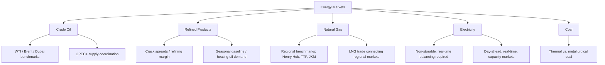

## Energy Markets

### Overview

Energy markets encompass the production, trading, and pricing of crude oil, refined petroleum products, natural gas, coal, electricity, and increasingly, renewable energy and carbon-related instruments. Energy is distinguished from other commodity categories by its central role in global economic activity, its complex physical delivery infrastructure (pipelines, storage, refining, and transmission grids), its geopolitical sensitivity, and the wide variation in market structure across its major sub-sectors. This topic surveys the major energy commodity markets, their pricing benchmarks, physical and financial market structures, and the key analytical frameworks used to understand energy price behavior.

---

### Crude Oil Markets

**Key Points**

- Crude oil is the most heavily traded and closely watched energy commodity, serving as a primary input for transportation fuels, petrochemicals, and a wide range of downstream products.
- Crude oil is not a homogeneous commodity: quality varies by **API gravity** (a measure of density, with "light" crude having higher API gravity than "heavy" crude) and **sulfur content** ("sweet" crude has low sulfur content; "sour" crude has higher sulfur content), both of which affect refining complexity, yield of valuable refined products, and pricing.

**Major Benchmarks**

- **West Texas Intermediate (WTI)**: a light, sweet crude benchmark, priced and delivered at Cushing, Oklahoma, and widely referenced for North American crude pricing.
- **Brent Crude**: a light, sweet crude benchmark sourced from North Sea production, widely used as the international pricing reference for roughly two-thirds of globally traded crude oil. [Inference — the specific proportion of global crude referenced to Brent is commonly cited in energy market commentary but fluctuates over time as pricing conventions and production patterns evolve]
- **Dubai/Oman**: a key benchmark for sour crude grades, particularly relevant for pricing Middle Eastern crude exports to Asian markets.
- Regional benchmark spreads (e.g., WTI-Brent spread) reflect differences in regional supply/demand balances, transportation infrastructure and logistics costs, and quality differentials, and are closely monitored by traders and analysts as indicators of regional market conditions.

**Market Structure**

- **OPEC (Organization of the Petroleum Exporting Countries)** and the broader **OPEC+** coalition (OPEC members plus other major producers including Russia) coordinate production quotas among member countries, exercising meaningful influence over global supply and, consequently, price levels — though the degree of actual influence varies with member compliance, spare capacity utilization, and the responsiveness of non-OPEC+ supply (notably U.S. shale production). [Inference — OPEC+'s market influence is a well-documented feature of oil market analysis, but its precise effectiveness varies across different periods and market conditions and is a subject of ongoing analytical debate]
- **Non-OPEC supply**, particularly U.S. shale oil production enabled by hydraulic fracturing and horizontal drilling technology, has become a major swing factor in global supply since the mid-2010s, with production more responsive to price signals over shorter timeframes than traditional conventional production due to shorter well development cycles.

---

### Refined Petroleum Products

**Key Points**

- Crude oil is refined into a range of products including gasoline, diesel/gasoil, jet fuel, heating oil, and heavier fuel oils, with the specific product mix (the "yield") determined by refinery configuration and the quality of crude oil processed.
- The **crack spread** is a standard measure of refining margin, representing the difference between the value of refined products and the cost of the crude oil input:

$$\text{Crack Spread} \approx (\text{Value of Refined Products}) - (\text{Cost of Crude Input})$$

- A common simplified proxy is the "3-2-1 crack spread" (3 barrels of crude yielding 2 barrels of gasoline and 1 barrel of distillate, approximating typical refinery output ratios), used by refiners and traders to gauge refining profitability and to hedge margin risk through combined futures positions.
- Refined product markets exhibit strong **seasonality**: gasoline demand and pricing typically peak during summer driving season (in markets with strong seasonal travel patterns), while heating oil and distillate demand typically peaks during winter heating season. [Inference — general seasonal pattern well-documented in energy market analysis; specific timing and magnitude vary by region, year, and prevailing weather/economic conditions]

---

### Natural Gas Markets

**Key Points**

- Natural gas markets are considerably more regionally fragmented than crude oil markets, historically due to the high cost and infrastructure requirements of transporting gas relative to crude oil (pipeline networks for domestic/regional transport, and specialized liquefaction/regasification infrastructure for international seaborne trade).
- **Regional benchmarks** include Henry Hub (U.S.), National Balancing Point/NBP (UK), TTF (Netherlands/continental Europe), and JKM (Japan-Korea Marker, for LNG cargoes into Northeast Asia) — historically these benchmarks have shown much larger and more persistent price divergence from one another than crude oil regional benchmarks typically exhibit, reflecting natural gas's historically more constrained cross-regional transportability. [Inference — well-documented historical pattern in energy market analysis, though the degree of regional price convergence has been evolving with the continued global expansion of liquefied natural gas (LNG) trade infrastructure, and current spread levels should be independently verified for any time-sensitive analysis]
- The growth of **LNG (Liquefied Natural Gas)** trade — supercooling natural gas into liquid form for seaborne transport, then regasifying at the destination — has progressively increased the interconnectedness of global natural gas markets over time, though full price convergence across regions has not been achieved and regional benchmarks continue to reflect local supply/demand and infrastructure constraints. [Inference — general directional trend is well-supported, though the pace and degree of ongoing convergence is a continually evolving empirical question]
- Natural gas exhibits pronounced seasonality tied to heating (winter) and, in some markets, cooling (summer, via electricity generation demand) demand cycles, with underground storage inventories serving as the key buffer and closely-watched indicator of seasonal supply adequacy.

---

### Electricity Markets

**Key Points**

- Electricity is fundamentally distinct from other energy commodities because it **cannot be economically stored at scale** in most markets (notwithstanding growing but still relatively limited battery storage capacity), meaning supply and demand must be balanced continuously and in real time.
- This non-storability produces extreme price volatility relative to other commodities, since supply/demand imbalances cannot be smoothed through inventory drawdowns or builds and must instead be resolved through immediate price adjustments or, in extreme cases, physical curtailment (rolling blackouts).
- Electricity markets are typically organized around **wholesale market structures** operated by Independent System Operators (ISOs) or Regional Transmission Organizations (RTOs) in many deregulated markets, featuring:
  - **Day-ahead markets**: participants submit bids/offers for the following day's expected generation and consumption, establishing forward-looking prices.
  - **Real-time (spot) markets**: prices are set continuously (often at very short intervals) to balance actual real-time supply and demand.
  - **Capacity markets**: separate mechanisms in some jurisdictions designed to ensure adequate generation capacity is available to meet peak demand, compensating generators for capacity availability rather than only for energy actually delivered.
- The **merit order** framework describes how electricity markets typically dispatch generation sources in order of increasing marginal cost (lowest marginal cost sources dispatched first), with the marginal (price-setting) generator typically determining the wholesale clearing price for a given time period — meaning the price-setting technology can shift meaningfully depending on the level of demand and the availability of lower-cost generation sources (renewables, nuclear) at any given time. [Inference — the merit order framework is a well-established standard model in electricity market economics, though actual market-specific dispatch and pricing mechanisms vary by jurisdiction and can incorporate additional complexities such as locational pricing and transmission constraints]

---

### Coal Markets

**Key Points**

- Coal remains a globally significant energy source, particularly for electricity generation and steel production (metallurgical/coking coal), though its role in electricity generation has been declining in many developed markets due to environmental regulation, cost competition from natural gas and renewables, and climate policy pressures, while remaining more significant in certain developing and rapidly industrializing economies. [Inference — general directional trend widely documented in energy market analysis; the specific pace and magnitude of decline or continued reliance varies substantially by country and region, and current data should be independently verified for any time-sensitive analysis]
- Thermal coal (used for power generation) and metallurgical/coking coal (used in steelmaking) are priced and traded as distinct product categories with different demand drivers.

---

### Energy Market Structure Overview

---

### Geopolitical and Structural Risk Factors

**Key Points**

- Energy markets are particularly sensitive to geopolitical events given the concentration of production in specific regions and the strategic importance of energy security to national economies — supply disruptions from conflict, sanctions, or political instability in major producing regions have historically produced some of the largest and most rapid commodity price movements observed across any asset class. [Inference — well-documented historical pattern; the magnitude and duration of any specific future disruption's price impact cannot be predicted with certainty and depends on numerous evolving factors]
- Strategic petroleum reserves maintained by governments in some countries (e.g., the U.S. Strategic Petroleum Reserve) serve as a policy tool to moderate extreme short-term price volatility during acute supply disruptions, though reserve releases are generally understood to have a more limited and temporary effect on prices relative to underlying structural supply/demand shifts. [Inference — general characterization consistent with energy policy literature; the precise price effect of any specific historical or hypothetical reserve release is empirically debated and situation-specific]

---

### Energy Transition and Emerging Market Structures

**Key Points**

- The ongoing global energy transition toward renewable energy sources (wind, solar) and associated infrastructure (battery storage, grid modernization) is progressively reshaping electricity market dynamics, including increasing price volatility associated with weather-dependent generation availability and evolving merit order compositions in many markets. [Inference — general directional trend widely discussed in current energy market and policy analysis; specific market structure evolution is ongoing and varies substantially by jurisdiction and regulatory framework]
- **Carbon markets** (cap-and-trade systems and carbon pricing mechanisms, such as the EU Emissions Trading System) have emerged as an increasingly significant adjacent market, directly affecting the relative economics of different generation and production technologies and, by extension, energy commodity demand patterns. [Inference — general characterization of an evolving and jurisdiction-specific policy area; current carbon pricing levels, coverage, and mechanisms should be independently verified for any time-sensitive analysis]

---

### Example: Crack Spread Hedging Illustration

**Example**

A refiner processes crude oil purchased at $75/barrel and expects to sell resulting gasoline at $2.40/gallon (approximately $100.80/barrel-equivalent, using the standard 42-gallon barrel conversion) and diesel at $2.60/gallon (approximately $109.20/barrel-equivalent). Using a simplified 3-2-1 crack spread approximation:

$$\text{Crack Spread} = \frac{2 \times \$100.80 + 1 \times \$109.20}{3} - \$75.00 = \frac{\$201.60 + \$109.20}{3} - \$75.00 = \$103.60 - \$75.00 = \$28.60/\text{barrel}$$

A refiner concerned about this margin narrowing (due to crude price increases outpacing product price increases, or vice versa) could use combined futures positions (long crude futures, short gasoline and heating oil/diesel futures, in the appropriate ratio) to lock in the current crack spread, hedging against adverse relative price movements between crude input costs and refined product output prices.

---

### Distinguishing Facts from Inferences

- Definitions of major crude oil benchmarks (WTI, Brent, Dubai/Oman), crack spread mechanics, and the fundamental physical characteristics of electricity markets (non-storability, real-time balancing) reflect standard, well-established energy market conventions.
- Claims regarding the degree of OPEC+ market influence, the pace of regional natural gas market convergence via LNG trade, coal's declining role in developed-market power generation, and the effects of the ongoing energy transition are explicitly labeled as inferences throughout, since these involve evolving, empirically debated, and time-sensitive market dynamics rather than fixed, permanently settled facts.
- The numerical crack spread example is an illustrative pedagogical construction using simplified assumptions and does not represent actual historical market prices or refining economics for any specific date, refinery, or crude grade.
- Given the fast-evolving and geopolitically sensitive nature of energy markets, any statement regarding current benchmark price levels, current OPEC+ quota policy, current regional price spreads, or current regulatory/carbon policy specifics should be independently verified against current sources before being relied upon for time-sensitive analysis, as this content reflects general structural and conceptual frameworks rather than real-time market data.

---

### Related Topics / Next Steps

- Commodity futures pricing and the theory of storage, applied to crude oil and natural gas
- OPEC+ production policy and its historical effect on global oil prices
- LNG market development and global natural gas price convergence trends
- Electricity market design: day-ahead, real-time, and capacity market mechanisms
- Carbon markets and emissions trading systems (EU ETS and comparable frameworks)
- The U.S. shale revolution and its structural effect on global oil supply dynamics
- Renewable energy integration and its effect on electricity price volatility and merit order
- Refining economics: crack spreads and refinery configuration/complexity