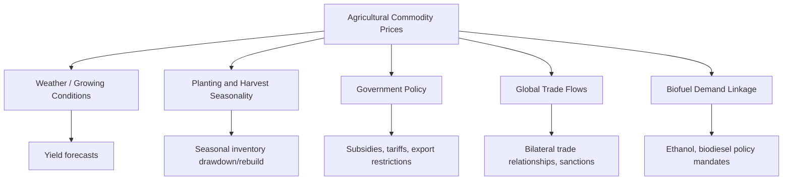

## Agricultural and Metals Markets

### Overview

Agricultural and metals markets represent two of the largest and most structurally distinct categories within the broader commodities complex. Agricultural commodities are characterized by biological production cycles, strong seasonality, and significant weather sensitivity, while metals markets divide into base/industrial metals (driven primarily by manufacturing and construction demand) and precious metals (driven substantially by investment, monetary, and safe-haven demand). Both categories interact with the theory of storage, convenience yield, and commodity risk premia frameworks covered elsewhere, but each carries distinct fundamental drivers, market structures, and analytical considerations.

---

### Agricultural Commodities

#### Major Categories

**Grains and Oilseeds**

- Corn, wheat, and soybeans represent the most heavily traded agricultural futures markets globally, serving as inputs to food, animal feed, and industrial uses (including biofuels).
- Soybeans are further processed into soybean meal (animal feed) and soybean oil (food and biofuel use), with the relationship between soybean prices and the combined value of its processed products known as the **crush spread**, analogous in concept to the crack spread in energy markets:

$$\text{Crush Spread} \approx (\text{Value of Soybean Meal} + \text{Value of Soybean Oil}) - \text{Value of Soybeans}$$

**Softs**

- A traditional market category encompassing coffee, cocoa, sugar, and cotton — commodities that share tropical/subtropical growing regions, multi-year perennial crop cycles (for coffee and cocoa in particular), and historically significant exposure to specific regional weather and disease risks.

**Livestock**

- Live cattle, feeder cattle, and lean hogs represent the major livestock futures markets, with pricing dynamics shaped by biological production lags (breeding, gestation, and growth cycles) rather than the storage-based dynamics that dominate grain and metal markets, since livestock cannot be "stored" in the same sense as a durable commodity.

---

### Drivers of Agricultural Commodity Prices

**Key Points**

- **Weather** is the single most closely monitored short-term driver of agricultural prices, given the direct effect of temperature, precipitation, and extreme weather events (droughts, floods, frosts) on crop yields during critical growing-season windows.
- **Planting and harvest cycles** create a structurally seasonal supply pattern: for major Northern Hemisphere grain crops, supply is heavily weighted toward the post-harvest period (typically fall), with inventories drawing down through the following growing season until the next harvest — producing a recurring seasonal pattern in both price levels and term structure (as discussed under convenience yield and contango/backwardation). [Inference — the general seasonal supply pattern is a well-documented agronomic and market structure fact, though specific timing varies by crop, hemisphere, and growing region]
- **Government agricultural policy** (subsidies, price supports, biofuel mandates, trade tariffs and export restrictions, and strategic reserve policies in some countries) can materially affect both supply incentives and realized market prices, and can at times decouple agricultural prices from what a purely weather/yield-driven supply-demand model would predict. [Inference — general characterization of a well-documented but highly country- and policy-specific set of influences; specific policy effects require independent verification against current regulations]
- **Global trade flows and geopolitical factors**, including export bans, sanctions, and major bilateral trade relationships (e.g., between major grain exporters and importing regions), can produce significant price volatility independent of underlying global production levels.
- **Biofuel demand** (ethanol from corn, biodiesel from soybean oil and other vegetable oils) has become a structurally significant demand driver in several major agricultural markets, linking agricultural commodity prices to energy market dynamics and government renewable fuel policy. [Inference — well-documented structural linkage; the specific magnitude of this demand driver varies by country, policy regime, and time period]
- **USDA (U.S. Department of Agriculture) reports** and equivalent agencies in other major producing countries publish regular supply and demand estimates (planting intentions, crop progress, yield forecasts, and stocks reports) that serve as closely watched, market-moving reference data for agricultural traders.

---

### Agricultural Market Structure Diagram

---

### Base/Industrial Metals

#### Major Markets

- **Copper**: widely regarded as a bellwether for global industrial and construction activity (sometimes informally referred to as "Dr. Copper" for its perceived diagnostic value regarding global economic health), given its broad use across electrical wiring, construction, and industrial equipment.
- **Aluminum, zinc, nickel, lead, and tin**: traded primarily through exchanges such as the London Metal Exchange (LME), each with distinct end-use demand profiles (aluminum in transportation and packaging; nickel and other metals increasingly linked to battery/electric vehicle supply chains; zinc primarily in steel galvanization).
- **Iron ore and steel**: while iron ore is technically a bulk raw material rather than an exchange-traded metal in the traditional sense in all markets, it is a critical input to global steel production and is closely tied to Chinese construction and manufacturing demand given China's large share of global steel production and iron ore import demand. [Inference — China's outsized role in global steel/iron ore demand is a well-documented structural feature of these markets, though the specific magnitude shifts over time with China's economic composition and policy]

#### Drivers of Base Metals Prices

**Key Points**

- Base metals demand is closely linked to **global industrial production, manufacturing activity, and construction cycles**, making these markets more sensitive to global business cycle conditions than agricultural commodities, which are driven more heavily by weather and biological supply factors.
- **China's role as the largest global consumer** of most base metals means Chinese economic data, infrastructure investment policy, and manufacturing indicators are closely monitored by base metals market participants as key demand signals. [Inference — well-documented structural feature of contemporary base metals markets; the specific magnitude of China's demand share evolves over time and should be verified against current data for precise analysis]
- The ongoing global energy transition has introduced new structural demand drivers for certain metals — notably copper, nickel, lithium, and cobalt — given their use in electric vehicle batteries, renewable energy infrastructure, and grid modernization, a dynamic sometimes referred to as the demand growth story for "energy transition metals" or "green metals." [Inference — widely discussed emerging demand theme in current market commentary; the precise magnitude and timing of this demand growth remains a forward-looking, evolving, and debated question rather than a settled historical fact]
- Exchange **inventory levels** (e.g., LME warehouse stocks) serve as a key indicator of near-term supply/demand balance and directly relate to the convenience yield and contango/backwardation dynamics discussed in the theory of storage.

---

### Precious Metals

#### Major Markets

- **Gold**: the most prominent precious metal, held for investment, monetary/reserve, and jewelry purposes; distinguished from most other commodities by its extremely high stock-to-flow ratio (existing above-ground gold stock is very large relative to annual mine production), which contributes to relatively stable supply dynamics and pricing behavior driven predominantly by investment demand and macroeconomic factors rather than by physical consumption/scarcity dynamics.
- **Silver**: shares some investment demand characteristics with gold but has a materially larger industrial use component (electronics, solar panel manufacturing, and other applications), giving silver a hybrid character between a monetary/investment asset and an industrial commodity, and contributing to silver's historically higher price volatility relative to gold. [Inference — well-documented characterization in precious metals market analysis; specific volatility comparisons vary by measurement period]
- **Platinum and palladium**: used predominantly in automotive catalytic converters (platinum historically more associated with diesel vehicles, palladium with gasoline vehicles, though usage patterns can shift with automotive technology and emissions regulation trends), giving these metals demand drivers closely tied to global automotive production and evolving vehicle emissions standards, including the ongoing shift toward electric vehicles. [Inference — general historical characterization; specific platinum/palladium substitution dynamics and automotive-related demand patterns continue to evolve with automotive technology and regulatory changes, and should be verified against current data for time-sensitive analysis]

#### Drivers of Precious Metals Prices

**Key Points**

- Gold prices have historically shown sensitivity to **real interest rates** (nominal rates adjusted for inflation expectations): because gold generates no yield or cash flow, rising real rates increase the opportunity cost of holding gold relative to yield-bearing assets, and falling (or negative) real rates reduce that opportunity cost, a relationship frequently cited in gold market analysis. [Inference — widely-cited empirical relationship in gold market analysis, though the strength and consistency of this relationship has varied across different historical periods and market regimes]
- Gold is frequently characterized as a **safe-haven asset**, with demand often increasing during periods of geopolitical uncertainty, financial market stress, or currency instability, though the consistency and magnitude of this "flight to safety" behavior varies across specific crisis episodes and should not be treated as a guaranteed or mechanical relationship. [Inference — widely observed pattern in gold market behavior during various historical stress episodes, though not a universally consistent relationship across every crisis period]
- **Central bank gold reserves and purchasing activity** represent a structurally significant source of gold demand, with central bank buying or selling patterns closely monitored by market participants as an indicator of official-sector sentiment toward gold as a reserve asset. [Inference — well-documented structural demand source; specific central bank purchasing patterns and their price effects vary by period and should be verified against current data]
- **Currency effects**, particularly the strength or weakness of the U.S. dollar (given gold's typical dollar-denominated pricing convention), commonly show an inverse relationship with gold prices, though this relationship, like others discussed here, is not perfectly stable across all periods. [Inference — widely-documented general tendency, though the strength of the relationship varies over time and can be temporarily overridden by other dominant market factors]

---

### Comparative Overview: Agricultural vs. Metals Markets

| Dimension | Agricultural | Base/Industrial Metals | Precious Metals |
| --- | --- | --- | --- |
| Primary demand driver | Food, feed, biofuel consumption | Industrial production, construction, manufacturing | Investment, monetary/reserve, jewelry |
| Supply dynamics | Biological/seasonal production cycles | Mining production, generally less seasonal | Mining production plus very large existing above-ground stock |
| Key volatility source | Weather, growing-season conditions | Global business cycle, China demand | Interest rates, currency, safe-haven flows |
| Storage role | Significant seasonal storage; strong convenience yield seasonality | Exchange warehouse inventories relevant but less seasonally driven | Minimal consumption-driven convenience yield given high stock-to-flow ratio |
| Typical curve behavior | Seasonal saw-tooth backwardation/contango pattern | Contango typical, though tighten-driven backwardation occurs | Persistent contango (reflecting near-zero convenience yield) |

---

### Example: Analyzing a Metals Market Signal

**Example**

Suppose LME copper warehouse inventories decline sharply over several months while global manufacturing purchasing managers' indices (PMIs) simultaneously show expansion in several major economies. A commodities analyst would likely interpret this combination — falling exchange inventories alongside improving industrial demand signals — as consistent with a tightening physical copper market, plausibly reflected in the futures curve shifting toward backwardation (per the theory of storage) and potentially supporting near-term spot price strength, though the analyst would appropriately caveat this interpretation given that inventory and PMI data can diverge from realized price outcomes due to other simultaneous factors (currency movements, mine supply disruptions, or shifts in Chinese demand specifically) not captured by these two indicators alone.

---

### Distinguishing Facts from Inferences

- The definitions of crush spread mechanics, major agricultural and metals market categories, and basic exchange structures (e.g., LME) reflect standard, well-established commodity market conventions.
- Claims regarding China's role in base metals demand, gold's sensitivity to real interest rates and safe-haven behavior, the platinum/palladium automotive demand linkage, and the "energy transition metals" demand theme are labeled as inferences throughout, since these are empirically observed general tendencies subject to evolution over time, rather than fixed, permanently settled relationships.
- Government agricultural policy effects and biofuel demand linkages are described at a general, conceptual level; specific current policy details (subsidy levels, mandate percentages, tariff structures) are time-sensitive and country-specific and should be independently verified for any application requiring current accuracy.
- The illustrative copper market example is a pedagogical construction demonstrating an analytical reasoning process and does not represent actual historical inventory, PMI, or price data for any specific date.

---

### Related Topics / Next Steps

- Commodity futures pricing and the theory of storage, applied to seasonal agricultural markets
- Convenience yield, backwardation, and contango in metals versus agricultural curve behavior
- Commodity risk premia and systematic carry/momentum strategies across asset sub-classes
- China's role in global commodity demand: structural and cyclical considerations
- The energy transition and "green metals" demand thesis (copper, lithium, nickel, cobalt)
- Gold as a monetary asset: central bank reserve policy and real interest rate sensitivity
- USDA and equivalent agricultural agency reporting: interpreting supply/demand estimates
- Weather derivatives and agricultural risk management tools