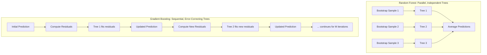

## Tree-Based Methods and Ensemble Learning

### Overview

Tree-based methods and ensemble learning techniques have become among the most widely used and empirically successful machine learning approaches in financial asset pricing applications. Decision trees partition the feature space into regions using a sequence of simple binary splits, naturally capturing nonlinearities and interaction effects among predictors without requiring the researcher to manually specify functional forms. Because a single decision tree tends to have high variance and is prone to overfitting, ensemble methods — which combine predictions from many trees — are used almost universally in practice, with **random forests** and **gradient boosted trees** representing the two dominant ensemble approaches in modern financial machine learning research.

---

### Decision Trees: The Building Block

**Key Points**

- A decision tree recursively partitions the feature space by selecting, at each node, the single feature and split point that most reduces prediction error (for regression, typically measured by reduction in sum of squared residuals; for classification, by measures such as Gini impurity or entropy reduction).
- The tree-building process continues (each region is further split) until a stopping criterion is met — commonly a minimum number of observations per terminal node (leaf), a maximum tree depth, or a minimum improvement threshold for further splits.
- Predictions for regression trees are made by averaging the target variable (e.g., subsequent return) among training observations falling into the same terminal leaf as the observation being predicted.
- A single, fully-grown decision tree is notorious for **high variance**: small changes in the training data can produce substantially different tree structures and predictions, and an unconstrained tree can overfit training data almost perfectly while generalizing poorly out-of-sample — this fundamental limitation motivates virtually all practical applications of tree-based methods to rely on ensemble approaches rather than single trees.

---

### Random Forests

**Key Points**

- Random forests address the high-variance problem of individual decision trees through two complementary randomization mechanisms combined with ensemble averaging:
  1. **Bagging (Bootstrap Aggregating)**: each tree in the forest is trained on an independent bootstrap resample (random sampling with replacement) of the original training data, introducing diversity across trees.
  2. **Random feature subsetting**: at each split within each tree, only a random subset of the available features is considered as candidates for the splitting variable (rather than all features), further decorrelating the trees in the ensemble beyond what bagging alone would achieve.
- Final predictions are formed by averaging the predictions of all individual trees in the forest (for regression) or by majority vote (for classification):

$$\hat{f}_{RF}(x) = \frac{1}{B}\sum_{b=1}^{B} \hat{f}_b(x)$$

where $B$ is the number of trees in the forest and $\hat{f}_b(x)$ is the prediction of the $b$-th tree.

- **Variance reduction intuition**: averaging over many decorrelated (low-correlation) trees reduces overall prediction variance substantially more than averaging over highly correlated trees would; the random feature subsetting mechanism specifically exists to reduce inter-tree correlation, since without it, trees trained on bootstrap resamples of the same data would tend to make similar splitting decisions (particularly if one or a few features are dominant predictors), limiting the variance-reduction benefit of averaging.
- Random forests are relatively robust to hyperparameter choices (e.g., the number of trees, though performance generally stabilizes and does not typically deteriorate substantially as the number of trees increases beyond a sufficient threshold) compared to gradient boosting, making them a common and relatively low-effort baseline flexible prediction method. [Inference — general characterization widely noted in statistical learning literature regarding random forests' relative robustness to hyperparameter tuning compared to boosting methods]

---

### Gradient Boosted Trees

**Key Points**

- Unlike random forests, which build trees independently and in parallel, gradient boosting builds trees **sequentially**, with each new tree trained specifically to correct the residual errors (or, more generally, the negative gradient of a specified loss function) of the current ensemble.
- The general gradient boosting algorithm proceeds iteratively:

$$F_m(x) = F_{m-1}(x) + \nu \cdot h_m(x)$$

where $F_m(x)$ is the ensemble prediction after $m$ boosting iterations, $h_m(x)$ is the new tree fit to the current residuals/pseudo-residuals (the negative gradient of the loss function with respect to the current predictions), and $\nu$ is the **learning rate** (or shrinkage parameter), which scales down each tree's contribution to prevent the ensemble from overfitting too aggressively to any single iteration's residuals.

- **Key hyperparameters** requiring careful tuning (typically via cross-validation) include: the number of boosting iterations (trees), the learning rate, the maximum depth of individual trees (gradient boosted trees typically use much shallower trees than random forests — often just a few splits deep — since boosting builds complexity through the sequential combination of many weak learners rather than through individual tree depth), and regularization parameters controlling tree complexity (e.g., minimum samples per leaf, subsampling fraction of both observations and features per iteration).
- Popular, widely-used implementations include **XGBoost**, **LightGBM**, and **CatBoost**, each incorporating specific engineering optimizations (e.g., histogram-based split finding, native handling of categorical features, regularization enhancements) that have contributed to their widespread adoption in both academic financial machine learning research and industry practice. [Note: implementation-specific technical details evolve with software versions; consult current official documentation for any implementation requiring precise, current technical specifications]
- Because gradient boosting sequentially fits residuals, it is generally **more prone to overfitting than random forests** if hyperparameters (particularly the number of iterations and learning rate) are not carefully tuned via cross-validation, since the sequential error-correction process can, if allowed to continue too long, begin fitting noise in the training residuals rather than genuine signal. [Inference — well-established characterization in statistical learning literature regarding boosting's greater sensitivity to hyperparameter tuning relative to bagging-based ensembles like random forests]

---

### Random Forest vs. Gradient Boosting: Structural Comparison

---

### Comparison Table

| Property | Random Forest | Gradient Boosted Trees |
| --- | --- | --- |
| Tree construction | Parallel, independent | Sequential, each tree corrects prior errors |
| Primary variance-reduction mechanism | Bagging + random feature subsetting | Shrinkage (learning rate) + shallow trees |
| Typical individual tree depth | Often deeper (fully or near-fully grown) | Typically shallow (a few splits) |
| Sensitivity to hyperparameter tuning | Relatively lower | Relatively higher |
| Overfitting risk profile | Lower, generally more forgiving | Higher without careful tuning/early stopping |
| Typical training speed | Can parallelize across trees easily | Sequential nature limits some parallelization (though modern implementations optimize heavily) |
| Common financial ML use case | Robust baseline flexible model | Performance-focused applications with adequate validation infrastructure |

---

### Feature Importance in Tree-Based Ensembles

**Key Points**

- **Impurity-based (Gini/variance-reduction) importance**: measures the total reduction in the splitting criterion (e.g., variance reduction for regression trees) attributable to each feature, summed across all splits and trees in the ensemble — this is computationally convenient but can be biased toward features with more possible split points (e.g., continuous or high-cardinality features) relative to features with fewer distinct values. [Inference — this bias in impurity-based importance measures is a well-documented statistical property discussed extensively in the machine learning methodology literature]
- **Permutation importance**: measures the degradation in model performance when a given feature's values are randomly shuffled (permuted) in the validation data, breaking that feature's relationship with the target while preserving its marginal distribution — generally considered a more reliable importance measure than impurity-based importance, though more computationally expensive.
- **SHAP (SHapley Additive exPlanations) values**: a more recent and increasingly widely used framework grounded in cooperative game theory, providing a theoretically-grounded decomposition of each individual prediction into additive contributions from each feature, allowing both global feature importance assessment and instance-level explanation of individual predictions. [Note: SHAP methodology and its specific implementations continue to be an active area of development; consult current documentation and literature for implementation-specific details]

---

### Application to Return Prediction and Empirical Asset Pricing

**Key Points**

- Large-scale empirical asset pricing studies comparing machine learning methods across extensive characteristic sets have generally found tree-based ensemble methods (particularly gradient boosted trees) to perform competitively or favorably relative to both simpler linear/regularized regression methods and, in some studies, relative to neural network architectures, in out-of-sample return prediction exercises. [Inference — this reflects findings reported in several prominent empirical asset pricing machine learning studies; results vary across studies, datasets, characteristic sets, and evaluation periods, and should not be treated as a universally settled ranking of method performance]
- A commonly cited advantage of tree-based methods in this application domain is their **natural handling of nonlinear relationships and interaction effects** among firm characteristics without requiring the researcher to pre-specify which interactions might be relevant — a meaningful practical advantage over linear regression approaches (including regularized linear methods) when true nonlinear relationships exist in the underlying return-generating process.
- As with other supervised learning applications in finance, proper **time-series-aware validation** (walk-forward or expanding-window schemes, rather than random cross-validation) remains essential when applying tree-based ensemble methods to return prediction, to avoid look-ahead bias and overstated out-of-sample performance claims.

---

### Example: Illustrating the Ensemble Averaging Effect

**Example**

Suppose an analyst trains 500 individual decision trees as part of a random forest to predict next-month stock returns based on characteristics including book-to-market, momentum, and size. Any single tree, evaluated on a held-out validation set, might show substantial prediction error variance from sample to sample due to its sensitivity to the specific bootstrap resample and random feature subset used in its construction. When predictions from all 500 trees are averaged, the resulting ensemble prediction typically shows meaningfully lower variance than any individual tree's prediction, precisely because errors that are largely uncorrelated across trees (due to the bagging and random feature subsetting mechanisms) tend to partially cancel out in the averaging process — this is the practical manifestation of the variance-reduction principle underlying the "random forest" method's construction, and illustrates why ensemble averaging, rather than any single well-tuned individual tree, is the standard practical approach.

---

### Distinguishing Facts from Inferences

- The mechanics of decision tree construction, the bagging and random feature subsetting procedures underlying random forests, and the sequential residual-fitting structure of gradient boosting reflect standard, well-established statistical learning methodology.
- The comparative characterizations regarding random forests' relative robustness to hyperparameter tuning versus gradient boosting's greater sensitivity, and the general empirical competitiveness of tree-based ensembles in financial return prediction studies, are labeled as inferences throughout, reflecting well-supported general tendencies in the statistical learning and financial machine learning literature rather than universal guarantees applicable to every dataset or application.
- The bias of impurity-based feature importance measures toward high-cardinality features is a well-documented statistical property in the broader machine learning methodology literature.
- Specific named implementations (XGBoost, LightGBM, CatBoost) and SHAP methodology are noted as widely-used current tools; specific technical/version details evolve over time and should be verified against current official documentation for any application requiring precise implementation guidance.
- The illustrative random forest averaging example is a simplified pedagogical construction and does not represent actual empirical results from any specific published study or dataset.

---

### Related Topics / Next Steps

- Supervised learning methods in return prediction (broader methodological framework)
- LASSO, ridge, and elastic net regularization methods (linear alternative/baseline approaches)
- Neural networks in asset pricing and comparative method performance studies
- Cross-validation and walk-forward validation in time-series financial data
- SHAP values and explainable AI methods for financial model interpretation
- Boosting algorithm variants: XGBoost, LightGBM, and CatBoost architectural differences
- Feature engineering and the "characteristics zoo" in empirical asset pricing
- Hyperparameter tuning strategies for tree-based ensembles in financial applications