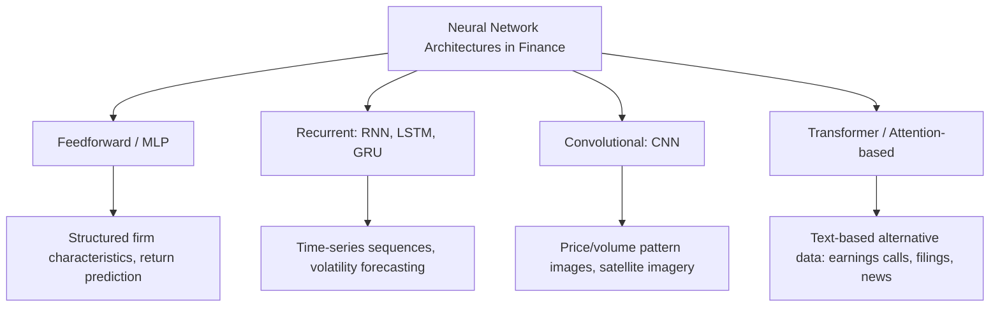

## Neural Networks and Deep Learning in Finance

### Overview

Neural networks and deep learning represent the most flexible class of function approximators applied to financial prediction problems, capable of learning highly nonlinear relationships and complex feature interactions directly from data with minimal manual feature engineering. In finance, neural network applications span return prediction, risk modeling, derivatives pricing, credit scoring, fraud detection, and the processing of unstructured alternative data (text, images, audio). This topic covers core neural network architectures, their specific adaptations for financial applications, and the practical and methodological considerations that distinguish deep learning in finance from its application in domains like computer vision or natural language processing more broadly.

---

### The Feedforward Neural Network: Core Building Block

**Key Points**

- A feedforward neural network (also called a multilayer perceptron, MLP) consists of an input layer, one or more hidden layers, and an output layer, with each layer's nodes ("neurons") connected to the next layer through weighted connections followed by a nonlinear activation function.
- For a single hidden layer network, the general form is:

$$h = \sigma(W_1 x + b_1)$$

$$\hat{y} = W_2 h + b_2$$

where $x$ is the input feature vector, $W_1, W_2$ are weight matrices, $b_1, b_2$ are bias vectors, $\sigma$ is a nonlinear activation function (commonly ReLU — Rectified Linear Unit — in modern architectures, though sigmoid and tanh remain relevant in specific contexts), and $\hat{y}$ is the predicted output.

- **Deep** networks stack multiple hidden layers, allowing the network to learn increasingly abstract and composite feature representations at successive layers — a property that has driven substantial success in domains like image and speech recognition, though its translation to financial tabular prediction problems has been more mixed, as discussed further below.
- Networks are trained via **backpropagation**, which computes the gradient of a specified loss function with respect to all network weights using the chain rule, and **gradient descent** (or a variant such as Adam, a widely-used adaptive learning rate optimization algorithm), which iteratively updates weights in the direction that reduces the loss function.

---

### Regularization Techniques Specific to Neural Networks

**Key Points**

- Given neural networks' high capacity to overfit — particularly problematic in financial applications given the low signal-to-noise ratio of return data — several regularization techniques are standard practice:
  - **Dropout**: randomly deactivates a fraction of neurons during each training iteration, preventing the network from becoming overly reliant on any specific subset of neurons and acting as an implicit form of ensemble averaging over many "thinned" sub-networks.
  - **Weight decay (L2 regularization)**: penalizes large weight magnitudes in the loss function, analogous in principle to ridge regression's penalty term applied to a neural network's weights.
  - **Early stopping**: monitors performance on a held-out validation set during training and halts training once validation performance stops improving (or begins deteriorating), preventing the network from continuing to fit training-set noise beyond the point of genuine generalizable learning.
  - **Batch normalization**: normalizes layer inputs during training, which can improve training stability and, as a secondary effect, provides some regularization benefit.

---

### Neural Network Architectures Relevant to Finance

#### 1. Feedforward Networks (MLPs)

- Applied directly to structured/tabular financial data (firm characteristics, macroeconomic variables) for return prediction, analogous in application purpose to the tree-based and linear regularized methods discussed elsewhere, but with greater flexibility to model complex nonlinear interactions.

#### 2. Recurrent Neural Networks (RNNs) and LSTMs

**Key Points**

- Recurrent Neural Networks (RNNs) are designed to process sequential data by maintaining a "hidden state" that carries information across time steps, making them a natural architectural choice for financial time-series applications where the temporal ordering and dependency structure of observations matters.
- **Long Short-Term Memory (LSTM)** networks, and the related **Gated Recurrent Unit (GRU)** architecture, were developed specifically to address the "vanishing gradient" problem that limits standard RNNs' ability to learn long-range temporal dependencies, using gating mechanisms that allow the network to selectively retain or discard information over longer sequences.
- These architectures have been applied to tasks including volatility forecasting, multi-period return prediction, and modeling of sequential order-book or high-frequency trading data, though as with other deep learning applications in finance, empirical performance relative to simpler time-series models (e.g., standard econometric approaches such as GARCH-family models for volatility) is an area of active research with mixed and evolving findings rather than a settled conclusion favoring one approach universally. [Inference — the mixed and evolving nature of comparative findings is a fair characterization of current, ongoing academic research rather than a definitively settled result]

#### 3. Convolutional Neural Networks (CNNs)

- Originally developed for image processing, CNNs use convolutional filters to detect local patterns, and have been applied in finance to tasks such as detecting patterns in visual representations of price/volume data (e.g., converting time-series data into image-like representations) and processing satellite imagery for alternative data applications (e.g., estimating retail foot traffic or agricultural yields from overhead imagery).

#### 4. Transformer Architectures and Attention Mechanisms

**Key Points**

- Transformer architectures, built around the **attention mechanism** (which allows a model to weigh the relevance of different elements in an input sequence dynamically, rather than processing the sequence strictly sequentially as RNNs do), have become the dominant architecture in natural language processing and are increasingly being explored for financial time-series and text-based applications. [Inference — reflects an actively developing area of financial machine learning research; specific applications and their comparative effectiveness continue to evolve rapidly and should be verified against current literature]
- In finance, transformer-based models are particularly relevant for processing **text-based alternative data** — earnings call transcripts, regulatory filings, news articles, and social media sentiment — where large pre-trained language models (or finance-domain-adapted variants) can be used to extract sentiment, topic, or other quantitative signals from unstructured text for incorporation into downstream prediction models.

---

### Neural Network Architecture Landscape in Finance

---

### Why Deep Learning's Financial Applications Differ from Other Domains

**Key Points**

- **Dataset size**: deep learning's most celebrated successes (image recognition, large language models) have generally relied on very large training datasets; financial return datasets, by contrast, are comparatively limited in the number of genuinely independent observations (particularly accounting for cross-sectional and temporal dependence, which reduces effective sample size well below the raw observation count), constraining the ability of very large, deep architectures to realize their full potential advantage over simpler methods in this domain. [Inference — this data-scarcity characterization and its implications for relative deep learning performance in finance is a widely discussed point in financial machine learning literature, representing a reasoned interpretation of the field's findings rather than a definitively proven causal mechanism]
- **Low signal-to-noise ratio**: as discussed under supervised learning return prediction methods, financial returns are dominated by largely unpredictable noise, meaning even a well-specified, appropriately flexible model will show limited absolute predictive power — a constraint that limits the benefit of increased model flexibility once a certain complexity threshold is reached, and can make very flexible models more prone to overfitting noise rather than capturing genuine additional signal.
- **Non-stationarity**: financial return-generating processes evolve over time (changing market structure, regulatory environment, and macroeconomic regimes), unlike many other domains where the underlying data-generating process is comparatively more stable, posing an ongoing challenge for any model — but particularly for high-capacity models like deep neural networks that can effectively "memorize" patterns specific to their training period that may not persist into future periods.
- **Interpretability requirements**: financial applications, particularly in institutional and regulated contexts, often require greater model interpretability and explainability than is typical in domains like image classification, motivating continued interest in interpretability tools (e.g., SHAP values, attention weight visualization) specifically adapted for financial neural network applications.

---

### Empirical Findings on Neural Network Performance in Asset Pricing

**Key Points**

- Prominent academic studies applying neural networks to large-scale empirical asset pricing return prediction tasks have generally found that **moderately sized, moderately deep networks** (rather than very shallow or very deep architectures) tend to perform best, with performance sometimes deteriorating as network depth increases substantially beyond a certain point — a finding that stands in some contrast to trends observed in other deep learning domains where increasing depth has more consistently improved performance (subject to the availability of correspondingly larger training datasets). [Inference — this reflects findings and interpretations reported in specific prominent empirical asset pricing machine learning studies; results and their generalizability across different datasets, feature sets, and time periods remain an active area of ongoing research]
- Several such studies have found neural networks performing competitively with, though not always definitively superior to, tree-based ensemble methods in return prediction exercises, with relative rankings sometimes sensitive to the specific evaluation period, feature set, and asset universe examined. [Inference — reflects a fair general characterization of a mixed and evolving empirical literature rather than a single definitive comparative finding]

---

### Practical Considerations for Implementation

**Key Points**

- **Hyperparameter tuning** (network architecture — number of layers and neurons per layer, learning rate, regularization strength, batch size, and number of training epochs) requires careful, computationally intensive search, typically via cross-validation adapted to respect the time-series structure of financial data (walk-forward validation), as discussed under supervised learning methods generally.
- **Ensemble approaches** combining multiple neural networks (e.g., trained with different random weight initializations, different architectures, or different random subsets of training data) are commonly used in practice to reduce the variance associated with any single trained network, given neural network training's inherent sensitivity to random initialization and stochastic optimization.
- **Computational infrastructure**: training deep neural networks, particularly on large alternative datasets (text, images), typically requires specialized hardware (GPUs or TPUs) and software frameworks (e.g., PyTorch, TensorFlow), representing a meaningfully higher computational and infrastructure investment relative to regularized linear models or even tree-based ensembles.

---

### Example: A Simplified Architecture for Return Prediction

**Example**

A researcher constructs a feedforward neural network with an input layer accepting 50 firm characteristics, two hidden layers (32 and 16 neurons respectively, each using ReLU activation), dropout regularization (dropping 20% of neurons at each hidden layer during training), and a single output neuron predicting next-month excess return. The model is trained using the Adam optimizer with an expanding-window walk-forward validation scheme: the training window is expanded month by month, with early stopping applied based on validation-set performance to prevent the network from overfitting to training-period-specific noise. After training, predictions are used to sort stocks into decile portfolios, with the resulting long-short portfolio's performance evaluated using standard risk-adjusted metrics and compared against a regularized linear regression baseline (e.g., elastic net) and a gradient boosted tree baseline trained on the identical characteristic set and validation scheme, allowing a controlled, apples-to-apples comparison of the neural network's incremental predictive value.

---

### Distinguishing Facts from Inferences

- The mathematical structure of feedforward neural networks, the backpropagation training algorithm, and the general mechanisms of dropout, weight decay, and early stopping reflect standard, well-established deep learning methodology.
- The architectural descriptions of RNNs/LSTMs, CNNs, and transformer/attention mechanisms reflect standard, well-documented deep learning architecture design.
- Claims regarding the relative empirical performance of neural networks compared to tree-based ensembles or simpler models in financial return prediction, the specific finding that moderate (rather than very deep) architectures tend to perform best in this domain, and the general characterization of why deep learning's financial applications differ from other domains (data scarcity, non-stationarity, signal-to-noise) are explicitly labeled as inferences throughout, reflecting an active, evolving area of academic research rather than settled, universally applicable conclusions.
- The illustrative architecture example is a simplified pedagogical construction and does not represent an actual published study, real market data, or an investment recommendation.
- Given the rapid pace of development in deep learning methodology and financial applications specifically, statements regarding current best practices, specific architectural trends, or state-of-the-art comparative performance should be independently verified against current literature for any application requiring up-to-date accuracy.

---

### Related Topics / Next Steps

- Supervised learning methods in return prediction (broader methodological context)
- Tree-based methods and ensemble learning (comparative nonlinear alternative approach)
- Natural language processing applications in finance: earnings call and filing text analysis
- Attention mechanisms and transformer architectures for financial time series
- Volatility forecasting: comparing LSTM-based approaches to GARCH-family econometric models
- Alternative data in asset management: satellite imagery, text, and transaction data
- Explainable AI (XAI) and interpretability methods for financial neural networks
- Computational infrastructure for machine learning research: GPUs, distributed training, and reproducibility