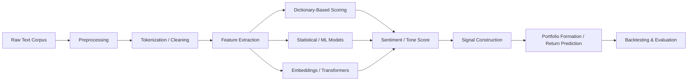

## Natural Language Processing and Text-Based Signals

### Overview

Text-based signals extract quantitative information from unstructured textual sources—earnings calls, news articles, regulatory filings, social media, and analyst reports—to predict asset returns, volatility, and firm fundamentals. This intersects computational linguistics with empirical asset pricing, forming a core component of modern quantitative and fundamental investment research.

### Motivation in Asset Pricing

Traditional asset pricing relies on structured, numerical data (prices, accounting ratios, macro series). Text captures information that is:

- **Qualitative and forward-looking**: management tone, risk disclosures, forward guidance language
- **High-frequency and unstructured**: news flow, social media sentiment arrives continuously and asynchronously relative to reporting cycles
- **Difficult to arbitrage away quickly**: processing costs and interpretation lags create a slower-moving information diffusion process that can generate short-term predictability

**Key Points**

- Text signals are typically framed as proxies for information not yet reflected in prices (information diffusion) or as proxies for behavioral biases (sentiment, overreaction/underreaction)
- The literature spans corporate disclosures (10-Ks, 10-Qs, earnings call transcripts), news media, analyst reports, and social media/alternative data

### Core NLP Pipeline for Financial Text

### Preprocessing Steps

1. **Tokenization**: splitting text into words/subwords/sentences
2. **Normalization**: lowercasing, removing punctuation, stemming/lemmatization
3. **Stop-word removal**: eliminating uninformative high-frequency words (though finance-specific stop-word lists differ from generic NLP, since words like "loss," "against," or "not" carry sentiment-relevant meaning and are often retained)
4. **Negation handling**: critical in finance text, since "not profitable" and "profitable" differ entirely—naive bag-of-words approaches without negation scoping can misclassify sentiment
5. **N-gram construction**: capturing multi-word phrases ("going concern," "material weakness") that carry meaning lost in single-word tokenization

### Dictionary-Based Approaches

The dominant early approach in finance NLP uses domain-specific word lists rather than generic sentiment dictionaries.

**Loughran-McDonald (LM) Dictionary (2011)**

Loughran and McDonald showed that general-purpose sentiment dictionaries (e.g., Harvard IV-4) misclassify a large share of words in 10-K filings as negative when they are neutral in a financial context (e.g., "tax," "cost," "liability," "cancer" in a pharmaceutical risk disclosure). They constructed a finance-specific dictionary with categories:

- Negative
- Positive
- Uncertainty
- Litigious
- Strong Modal / Weak Modal
- Constraining

The tone score is typically computed as:

$$\text{Tone}_t = \frac{\#\text{Positive words}_t - \#\text{Negative words}_t}{\text{Total words}_t}$$

**Example**

For a 10-K filing with 15,000 total words, 45 LM-positive words, and 120 LM-negative words:

$$\text{Tone} = \frac{45 - 120}{15{,}000} = \frac{-75}{15{,}000} = -0.005$$

A more negative tone score has been associated with lower subsequent returns and higher return volatility in the disclosure literature.

**Key Points**

- Dictionary methods are transparent, computationally cheap, and easily interpretable, making them attractive for regulatory and academic replication
- They ignore context, negation scope, and word order beyond simple heuristics—weaknesses addressed by later ML approaches
- The Loughran-McDonald dictionary remains a standard benchmark despite the rise of deep learning methods [Inference: partly due to interpretability and reproducibility advantages in academic peer review]

### Statistical and Machine Learning Approaches

**Bag-of-Words and TF-IDF**

Term Frequency-Inverse Document Frequency weights words by their frequency in a document relative to their rarity across a corpus:

$$\text{TF-IDF}(w, d) = \text{TF}(w,d) \times \log\left(\frac{N}{\text{DF}(w)}\right)$$

where $N$ is the total number of documents and $\text{DF}(w)$ is the number of documents containing word $w$. This produces sparse, high-dimensional feature vectors usable in regression, penalized regression (LASSO/Ridge), or tree-based models to predict returns or volatility.

**Predictive Regression Framework**

A canonical text-based predictability regression (following Tetlock 2007, Jegadeesh-Wu 2013):

$$r_{i,t+1} = \alpha + \beta \cdot \text{TextSignal}_{i,t} + \gamma' X_{i,t} + \varepsilon_{i,t+1}$$

where $X_{i,t}$ are standard controls (size, book-to-market, momentum, past volatility).

**Naive Bayes and Supervised Classification**

Antweiler and Frank (2004) applied Naive Bayes classifiers to internet stock message boards, using labeled training data (bullish/bearish/neutral) to classify text and construct aggregate disagreement and sentiment measures, linking these to trading volume and volatility.

**Supervised term-weighting (Jegadeesh-Wu 2013)**

Rather than using a fixed dictionary, this approach estimates word weights directly from the data by regressing returns on word frequencies:

$$\text{Score}_d = \sum_{w \in d} \hat{\beta}_w \cdot \text{freq}(w,d)$$

where $\hat{\beta}_w$ is learned from a training sample linking historical word frequency to subsequent returns, allowing the model to adapt weights to the specific corpus and outcome variable rather than relying on a static dictionary.

### Modern Deep Learning and Embeddings

**Word Embeddings**

Word2Vec, GloVe, and similar models represent words as dense vectors in continuous space, capturing semantic similarity:

$$\text{similarity}(w_1, w_2) = \cos(\vec{v}_{w_1}, \vec{v}_{w_2})$$

This allows models to generalize beyond exact word matches (e.g., recognizing "profit decline" and "earnings drop" as semantically related) — a key limitation of bag-of-words methods.

**Transformer-Based Models**

BERT and its financial variants (FinBERT) use contextual embeddings, where a word's vector representation depends on surrounding context, addressing the negation and polysemy problems that plague dictionary methods.

- **FinBERT** (Araci 2019; Huang, Wang, Yang 2023) fine-tunes BERT on financial text corpora (earnings calls, analyst reports) for sentiment classification, typically outperforming dictionary-based tone measures in out-of-sample return prediction tasks [Inference: performance gains are corpus- and period-dependent, and results vary across replication studies]
- **Large language models (LLMs)**: Recent research (post-2023) explores using GPT-class models to directly summarize, classify, or extract structured signals from earnings calls and filings, including zero-shot sentiment classification without task-specific fine-tuning

**Key Points**

- Transformer models capture context and word order, addressing dictionary methods' key weaknesses
- They require substantially more computational resources and are less interpretable ("black box" concern relevant for institutional risk management and compliance)
- Overfitting risk is higher with high-capacity models on relatively short, noisy financial text samples relative to the volume of return data available for training

### Major Applications and Text Sources

| Source | Signal Type | Key References |
| --- | --- | --- |
| 10-K/10-Q filings | Tone, uncertainty, litigious language, readability (Fog Index) | Loughran-McDonald (2011), Li (2008) |
| Earnings call transcripts | Management tone, tone of Q&A vs. prepared remarks, vocal features | Larcker-Zakolyukina (2012) |
| News articles | Media pessimism, firm-specific news sentiment | Tetlock (2007), Tetlock-Saar-Tsechansky-Macskassy (2008) |
| Analyst reports | Textual sentiment complementing numerical revisions | Huang-Zang-Zheng (2014) |
| Social media/StockTwits, Twitter | Retail sentiment, disagreement measures | Antweiler-Frank (2004), Cookson-Niessner (2020) |
| Central bank communications | Policy stance, hawkish/dovish tone | Hansen-McMahon (2016) |

### Readability and Complexity Measures

Beyond sentiment, textual complexity itself is a predictive signal. The **Fog Index**, adapted for finance (Li 2008), measures filing readability:

$$\text{Fog Index} = 0.4 \times \left(\text{avg sentence length} + \text{\% complex words}\right)$$

Firms with less readable (higher Fog Index) annual reports have been associated with less persistent earnings and greater information processing costs for investors, consistent with an obfuscation hypothesis: managers may write more complex disclosures to obscure poor performance.

### Text-Based Signal Construction Workflow

**Example**

A typical academic/quant workflow for constructing a news-sentiment factor:

1. Collect firm-day news articles from a vendor (RavenPack, Thomson Reuters News Analytics, or scraped sources)
2. Match articles to firm identifiers (ticker/CUSIP) and timestamp to trading day (accounting for after-hours news)
3. Compute sentiment score per article (dictionary or ML-based)
4. Aggregate to firm-day level, weighting by article prominence/relevance
5. Construct a rolling signal (e.g., 5-day sentiment momentum)
6. Form decile portfolios sorted on the signal; compute long-short returns
7. Risk-adjust using factor models (CAPM, Fama-French 3/5-factor, or Fama-French + momentum)

$$\text{Long-Short Return}_t = \bar{r}_{\text{Decile 10},t} - \bar{r}_{\text{Decile 1},t}$$

### Empirical Findings Summary

- **Media pessimism** predicts downward pressure on prices with reversal, consistent with a temporary price pressure/investor sentiment effect rather than pure information (Tetlock 2007)
- **10-K negative tone** predicts negative earnings surprises and abnormal returns around filing dates (Loughran-McDonald 2011)
- **Earnings call linguistic features** (e.g., deceptive language markers, vocal pitch/stress in audio-based extensions) have been linked to subsequent restatements and fraud risk (Larcker-Zakolyukina 2012; Hobson et al. audio studies)
- **Textual similarity across filings** (year-over-year cosine similarity of 10-Ks) proxies for corporate change/innovation and predicts returns and risk (Cohen-Malloy-Nguyen 2020, "Lazy Prices")

### Methodological Challenges

**Key Points**

- **Look-ahead bias**: ensuring text is timestamped to when it was actually available to market participants, not restated or backfilled versions
- **Survivorship bias**: text databases (especially social media/news archives) may not preserve delisted or defunct firm coverage
- **Multiple testing/overfitting**: the enormous dimensionality of possible text features (words, n-grams, embeddings) creates substantial risk of in-sample overfitting; out-of-sample and out-of-time validation is essential
- **Reproducibility**: proprietary NLP vendor scores and closed-source LLM outputs may not be exactly replicable across time as underlying models are updated by vendors [Inference: an evolving concern as more finance research relies on commercial LLM APIs]

### Conclusion

Text-based signals have moved from a niche academic exercise using simple dictionaries to a mainstream component of quantitative and fundamental research incorporating deep learning and large language models. The central empirical questions remain whether text captures genuinely new information (justifying a risk-based or informational explanation for return predictability) or reflects investor sentiment and slow information diffusion (a behavioral explanation), and whether increasingly sophisticated NLP techniques generate incremental, out-of-sample tradable signal beyond what simpler dictionary-based tone measures already capture.

**Related Topics**

- Loughran-McDonald dictionary construction and validation
- FinBERT and transformer fine-tuning for financial sentiment
- Media sentiment and stock return predictability (Tetlock framework)
- Textual similarity measures and corporate innovation signals
- Alternative data in asset pricing (satellite imagery, web scraping, transaction data)
- LLM-based structured extraction from earnings call transcripts
- Readability, obfuscation, and disclosure complexity
- Look-ahead bias and backtesting methodology for text signals