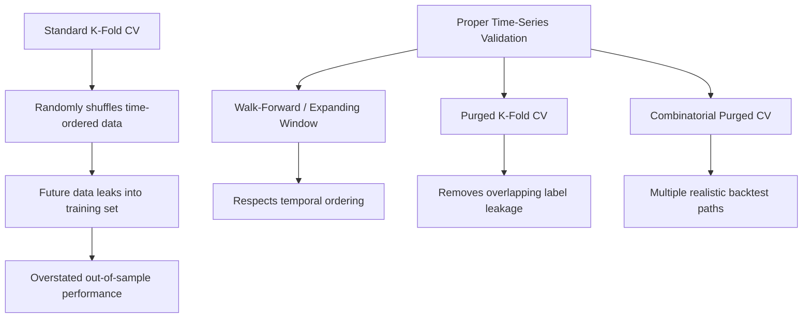

## Overfitting, Validation, and Model Risk in Financial Machine Learning

### Overview

Financial machine learning operates on data with distinctive properties—low signal-to-noise ratios, serial correlation, non-stationarity, and limited independent observations—that make standard machine learning validation practices systematically misleading if applied naively. Overfitting in this setting is not merely a technical nuisance but a first-order determinant of whether a discovered "alpha" is real or illusory. This topic covers the statistical sources of overfitting, proper validation design, and the broader model risk management framework required for deploying ML in asset pricing and trading contexts.

### Why Financial Data Breaks Standard ML Assumptions

**Key Points**

- **Low signal-to-noise ratio**: Financial returns are dominated by unpredictable noise; the exploitable signal component is small relative to variance, making spurious in-sample fits easy to generate
- **Non-i.i.d. observations**: Returns exhibit serial correlation (autocorrelation, volatility clustering) and cross-sectional correlation (common factor exposure), violating the independence assumption underlying standard cross-validation
- **Non-stationarity**: Return-generating processes evolve with regime shifts, structural breaks, and changing market microstructure, so a model fit on one period may not generalize to another even absent overfitting
- **Limited effective sample size**: Despite high-frequency data producing millions of observations, the number of *independent* macro-financial cycles is small (a few decades of data may contain only a handful of recessions, crises, or regime changes)
- **Multiple testing at scale**: The finance research industry as a whole tests an enormous number of candidate signals ("factor zoo"), inflating the probability that some appear significant purely by chance

### Sources of Overfitting

**1. In-Sample Overfitting**

A model that memorizes noise in the training sample rather than learning genuine structure. Formally, if $\hat{f}$ is fit to minimize in-sample loss $L_{\text{in}}(\hat{f})$, overfitting occurs when:

$$L_{\text{in}}(\hat{f}) \ll L_{\text{out}}(\hat{f})$$

where $L_{\text{out}}$ is the loss on genuinely unseen data. High-capacity models (deep trees, high-degree polynomial features, unregularized neural networks) are especially prone to this given finance's low signal-to-noise environment.

**2. Backtest Overfitting (Selection Bias)**

Distinct from standard in-sample overfitting, this arises from researcher degrees of freedom: trying many strategy configurations (parameters, universes, sample periods, signal definitions) and reporting only the best-performing one. Bailey, Borwein, Lopez de Prado, and Zhu (2014) formalize this via the **Probability of Backtest Overfitting (PBO)**, and derive the **Deflated Sharpe Ratio (DSR)** to correct for the number of trials:

$$\text{DSR} = \Phi\left(\frac{(\hat{SR} - SR_0)\sqrt{n-1}}{\sqrt{1 - \hat{\gamma}_3 \hat{SR} + \frac{\hat{\gamma}_4 - 1}{4}\hat{SR}^2}}\right)$$

where $SR_0$ is the expected maximum Sharpe ratio under the null of no skill given $N$ independent trials, $\hat{\gamma}_3$ and $\hat{\gamma}_4$ are the skewness and kurtosis of returns, and $n$ is the number of return observations. As the number of trials $N$ grows, $SR_0$ rises mechanically, so a higher observed Sharpe ratio is needed to be considered genuinely skill-based rather than the best of many random draws.

**Example**

If a research team tests 200 variations of a trading strategy and the best one achieves an in-sample Sharpe ratio of 1.8, the deflated Sharpe ratio calculation might show that a Sharpe ratio of at least 1.5 would be expected purely by chance from the maximum of 200 random trials under the null of no true skill—meaning the "discovery" provides only modest genuine evidence of skill despite appearing impressive on its face. [Inference: illustrative figures; actual deflation depends on the trial correlation structure and return distribution]

**3. Data Snooping and the Factor Zoo**

Harvey, Liu, and Zhu (2016) argue that most claimed return factors in the academic literature fail to meet an appropriately adjusted significance threshold once the cumulative number of tested factors (300+) is accounted for, proposing a minimum t-statistic threshold of approximately 3.0 (rather than the traditional 1.96) for new factor claims.

### Cross-Validation Pitfalls in Finance

**Standard k-fold cross-validation fails** in time series settings because it randomly shuffles observations across folds, allowing future information to leak into training sets used to predict the past (look-ahead bias) and violating temporal ordering.

**Walk-Forward (Expanding/Rolling Window) Validation**

The model is trained on data up to time $t$, tested on $[t+1, t+h]$, then the window is rolled or expanded forward:

$$\text{Train}_1 = [1, t], \quad \text{Test}_1 = [t+1, t+h]$$

$$\text{Train}_2 = [1, t+h] \text{ or } [h+1, t+h], \quad \text{Test}_2 = [t+h+1, t+2h]$$

This respects temporal ordering but produces only a single, highly serially-correlated backtest path, limiting statistical power to distinguish skill from luck.

**Purged K-Fold Cross-Validation (López de Prado, 2018)**

Standard k-fold CV in finance also suffers from **label leakage** when labels are constructed using information spanning multiple future periods (e.g., a label based on the return over the next 20 days). If an observation's label window overlaps with a test set's training window, information leaks. The purging solution:

1. **Purging**: remove training observations whose label evaluation window overlaps with the test set's time window
2. **Embargo**: additionally remove a buffer of observations immediately following the test set from the training set, to account for serial correlation in features that could still leak information after purging alone

**Combinatorial Purged Cross-Validation (CPCV)**

Extends purged K-fold by generating multiple, non-overlapping train/test path combinations, producing a *distribution* of backtest paths rather than a single realization—directly enabling estimation of the probability of backtest overfitting (PBO) rather than a single point estimate of performance.

### Regularization as an Overfitting Defense

**Key Points**

- **L1 (LASSO)**: $\min \sum(y_i - \hat{y}_i)^2 + \lambda \sum|\beta_j|$ — induces sparsity, useful given the "factor zoo" problem by automatically selecting a small subset of predictive features
- **L2 (Ridge)**: $\min \sum(y_i - \hat{y}_i)^2 + \lambda \sum\beta_j^2$ — shrinks coefficients without inducing exact sparsity, useful when predictors are highly correlated (common in finance factor sets)
- **Elastic Net**: combines L1 and L2 penalties, often preferred in empirical asset pricing (e.g., Kozak-Nagel-Santosh 2020) given highly correlated characteristic-based factors
- **Early stopping** (for gradient boosting, neural networks): halting training once validation loss stops improving, directly limiting model capacity to fit noise
- **Dropout and weight decay** (for neural networks): standard architectural regularization techniques adapted from general ML in models like Gu-Kelly-Xiu (2020)

$$\hat{\beta}_{\text{Elastic Net}} = \arg\min_\beta \left\{ \sum_{i=1}^n (y_i - x_i'\beta)^2 + \lambda\left[(1-\alpha)\|\beta\|_2^2 + \alpha\|\beta\|_1\right] \right\}$$

### Model Risk Management Framework

Model risk—the risk of financial loss arising from decisions based on incorrect or misused model outputs—is formally regulated in banking (Federal Reserve SR 11-7 guidance) and increasingly relevant to asset management given rising ML adoption.

**Key Points**

- **Conceptual soundness**: does the model's design have theoretical or economic justification, or is it a purely data-mined black box with no ex-ante rationale?
- **Ongoing monitoring**: tracking realized vs. predicted performance in live production to detect model decay
- **Outcomes analysis**: back-testing against actual realized outcomes on a rolling basis post-deployment, distinct from the original research backtest
- **Independent validation**: a function separate from model development that reviews and challenges model assumptions, data, and performance claims

### Sources of Model Risk Specific to ML in Finance

| Risk Source | Description | Mitigation |
| --- | --- | --- |
| Regime change / non-stationarity | Model trained on one macro regime fails in another | Regime-aware features, frequent retraining, ensemble across regimes |
| Feature leakage | Future information inadvertently included in features (e.g., restated financials, survivorship-biased universes) | Point-in-time databases, careful feature engineering audits |
| Crowding | Many market participants exploit the same ML-discovered signal, eroding and reversing its efficacy | Capacity analysis, monitoring signal decay, diversification across signal types |
| Black-box opacity | Deep learning/ensemble models resist interpretation, complicating risk oversight and regulatory explanation | SHAP/LIME feature attribution, simpler benchmark model comparison |
| Data quality/survivorship bias | Historical databases excluding delisted/bankrupt firms bias backtests upward | Point-in-time, survivorship-bias-free datasets (e.g., CRSP with delisting returns) |
| Adversarial/self-defeating dynamics | Publishing or trading on a signal can cause its own decay (Sadka-McLean-Pontiff effect) | Post-publication decay monitoring |

### Post-Publication Factor Decay

McLean and Pontiff (2016) find that documented return anomalies experience an average decline of roughly 50% in out-of-sample performance after academic publication, attributed to a combination of statistical overfitting in the original discovery and genuine arbitrage activity by informed traders exploiting the published anomaly once known.

$$\text{Post-Pub. Return} \approx (1 - \delta_{\text{overfit}}) \times (1 - \delta_{\text{arbitrage}}) \times \text{In-Sample Return}$$

where $\delta_{\text{overfit}}$ and $\delta_{\text{arbitrage}}$ represent the respective attenuation from data-mining artifacts and real-world crowding, though separately identifying the two channels empirically remains a methodological challenge [Inference: exact decomposition varies by study design and anomaly].

### Practical Validation Checklist

**Key Points**

- Use **purged, embargoed cross-validation** rather than standard k-fold for any model using overlapping-window labels
- Report **deflated Sharpe ratios** or explicitly disclose the number of strategy variations tested
- Maintain an **out-of-sample holdout** truly untouched until final model selection (not iteratively peeked at during development)
- Test for **feature leakage** by checking whether any input variable could not have been known at the time of prediction (point-in-time data discipline)
- Evaluate performance across **multiple non-overlapping regimes** (e.g., pre/post-2008, low-vol/high-vol periods) rather than a single aggregate backtest window
- Benchmark ML models against **simple linear baselines**; meaningful outperformance should be economically as well as statistically significant
- Monitor **live performance decay** post-deployment as an ongoing validation exercise, not a one-time research exercise

### Example: A Flawed vs. Corrected Backtest Workflow

**Example**

*Flawed approach*: A researcher constructs 50 candidate features from firm characteristics, uses standard 5-fold cross-validation (randomly shuffled) to tune a gradient boosting model predicting next-month returns, and reports the best Sharpe ratio achieved. This process suffers from (1) random shuffling causing look-ahead leakage since labels use forward 1-month returns that overlap across folds, and (2) no adjustment for the implicit multiple testing across 50 features and various hyperparameter combinations.

*Corrected approach*: The researcher instead (1) applies purging to remove training samples whose label windows overlap with test period boundaries, (2) applies a one-month embargo after each test fold, (3) uses combinatorial purged CV to generate a distribution of Sharpe ratios across resampled paths, (4) computes the deflated Sharpe ratio accounting for the total number of hyperparameter configurations tried, and (5) validates the final selected model on a strictly held-out final period never used during any tuning step.

### Conclusion

Overfitting and model risk are not incidental technical concerns in financial machine learning—they are central to whether any discovered signal represents genuine, exploitable structure or a statistical artifact of extensive search over noisy data. Rigorous validation requires methods specifically adapted to finance's temporal dependence and multiple-testing environment (purged CV, deflated Sharpe ratios), combined with an institutional model risk framework (conceptual soundness review, independent validation, ongoing monitoring) that treats backtested performance as a hypothesis to be continually re-tested against live outcomes rather than a final verdict.

**Related Topics**

- Deflated Sharpe ratio and the Probability of Backtest Overfitting (PBO)
- Purged and embargoed cross-validation techniques
- The factor zoo and multiple hypothesis testing corrections in asset pricing
- Point-in-time databases and survivorship bias correction
- Post-publication return decay and crowding effects
- Model risk management regulatory frameworks (SR 11-7)
- Feature importance and explainability methods (SHAP, LIME) for financial ML
- Regime detection and non-stationarity in return prediction models